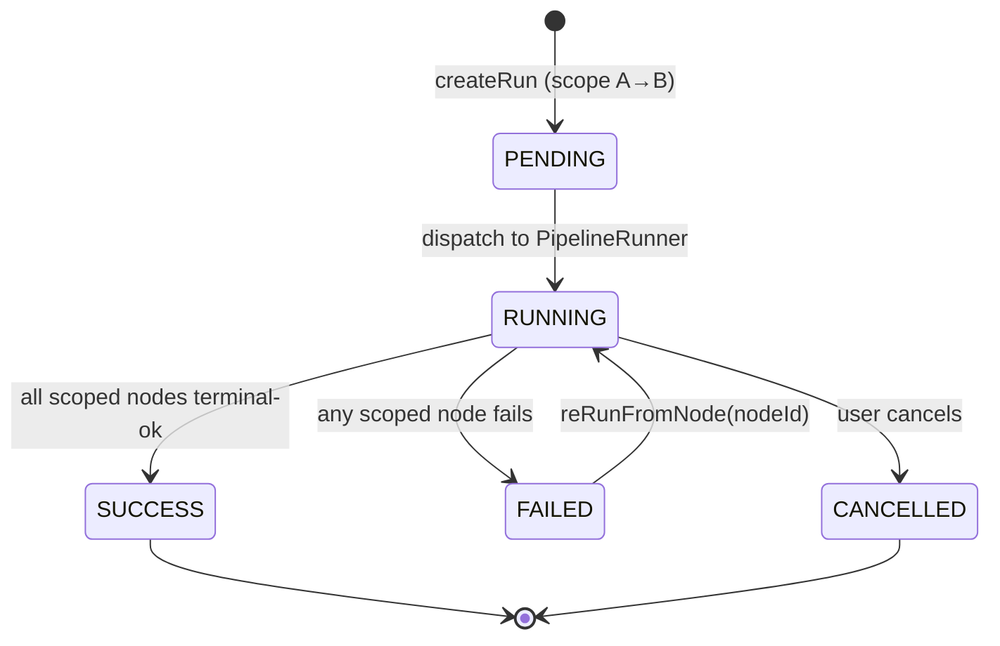

# Scheduled, Versioned, Lineage-Aware Pipeline Runs

> Full contract: `~/.claude/rules/spec-driven.md`. This spec specs ONLY the genuine gaps
> for BH-1255 and cross-references the substrate that already ships. What already exists is
> named in §1 "How It Works Today" with `file:line` evidence so no ticket reinvents it.

## 1. Context

BrightAgent today **observes** pipelines (proactive monitoring, alerts, self-healing PRs) and can
run a whole `WorkflowSpec` on a cron. It cannot yet **operate a pipeline as an operator**: run a
segment of the lineage graph from point A to point B, capture that run as an immutable versioned
record that names the lineage nodes it touched, re-run from a chosen point, and let a user author
all of that conversationally in chat — not only accept a detector's suggestion. Loop Capital's
enterprise demo (1000s of transformation pipelines under one connected config) needs the operator
story. This is the difference between "a monitor" and "an operator."

### Use Case / Goal

Frank (Loop Capital ops) types in chat: *"Re-run the holdings pipeline from `stg_holdings` down to
the compliance mart, and schedule it nightly at 2am — alert me on Slack if it fails or runs long."*
BrightAgent scopes the run to that lineage segment, executes it, records a versioned run naming
every node touched, wires the nightly schedule as a BrightRoutine, and fans failure/duration alerts
through the existing signal rails. He can later open the run history, pick a failed node, and re-run
from there.



### How It Works Today (already built — do NOT reinvent)

- **Run engine + versioned run nodes** — `runWorkflowExecution` executes a `WorkflowSpec` level-by-level
  with retry/backoff (`brighthive-platform-core/src/graphql/models/workflow-spec-execution.ts:92`);
  every run is a `WorkflowRunNode` stamped with `specVersion`, `startedAt`/`finishedAt`,
  `totalDurationMs`, and per-step `WorkflowStepRunNode` with `rowsProcessed`/`artifacts`/`errorMessage`/
  `aiExplanation` (`src/graphql/ogm/workflow-spec-typedefs.ts:122-164`). Runs are already versioned.
- **dbt trigger** — `DbtAdapter.execute` triggers a dbt Cloud job (`runtime-adapters.ts:274`, real POST
  at `dbt-api.ts:474`); brightbot's dbt-agent path additionally polls + captures logs
  (`brightbot/agents/dbt_agent/tools/dbt_cloud_tools.py:83,742,1134`).
- **Cron scheduling** — EventBridge + DynamoDB CRUD, `execute_workflow` is a schedulable action
  (`brightbot/routes/scheduled_agents_routes.py:88`; dispatcher `lambdas/scheduled_agent_dispatcher/`);
  cadence→cron at `routine-scheduler-client.ts:165`. A schedule can already trigger a real run.
- **Notifications** — `writeNotificationSignal` (`notification-signal.ts:77`), scheduled-run bridge
  `notifyScheduleOfRunCompletion` (`scheduler-bridge.ts:98`) already dual-writes Slack + inbox on
  scheduled-run success/failure. Spec'd in `brightroutines-execute-workflow-schedule.md` +
  `proactive-pipeline-ingestion-monitoring.md`. **BH-1255 reuses these rails — no new alert plumbing.**
- **Lineage graph** — directional `upstream_of`/`downstream_of` traversal from one node
  (`brightbot/agents/governance_agent/tools/lineage_graph.py:121,134`), fed by real dbt/filesystem
  adapters (`:268,356`).
- **Conversational routine authoring** — suggestion→accept creates an `execute_workflow` schedule
  (`brightroutines-intent-loop.md`, `routine-suggestion.ts:656`); spec authored from intent
  (`brightroutines-ai-authored-workflowspec.md`).

### Hard Limitations

> Platform-core has closed the storage/mutation half of limitations 1–3 (see the Ticket Breakdown
> grounding note). These are reworded to the **brightbot-side residual** that still limits.

1. **No A→B lineage path resolver in brightbot.** Platform-core's `runPipelineSegment` accepts a scoped
   lineage path, but `lineage_graph.py` still has only whole-DAG directional traversal from a single
   anchor — no `path_between(A, B)` to compute the segment the mutation needs (BH-1257).
2. **Re-run mutation ships, but no chat/agent path invokes it.** `reRunFromNode` exists on platform-core;
   there is no brightbot tool or CEMAF path that calls it from a conversation. (CEMAF's `DAGExecutor`
   interrupt/resume primitive is separately unstarted — BH-172, `langgraph-cloud-detach.md`.)
3. **Run record shape ships; brightbot does not yet populate `lineageNodesTouched` from a real segment.**
   The fields exist and immutability is enforced platform-side; the gap is emitting the touched-node set
   from a brightbot-resolved segment run (depends on limitation 1).
4. **No chat-native "schedule this dbt job" command.** Scheduling is detector-suggestion-driven; there
   is no first-class agent tool a user invokes directly from chat to create/modify a schedule (BH-1261).
5. **No conversational run-scope / alert-rule authoring.** The intent loop authors the schedule cadence,
   not the run scope (which lineage segment) or the alert thresholds.

### Gaps (what BH-1255 delivers)

| # | Gap | Capability |
|---|---|---|
| G1 | A→B lineage path traversal + scoped run | Run A→B of lineage |
| G2 | Run record names lineage nodes touched + is immutable | Versioned runs (completeness) |
| G3 | Re-run from a chosen node | Monitor + re-run |
| G4 | Chat-native tool to create/modify a pipeline-run schedule | Schedule via chat |
| G5 | Conversationally authored run scope + alert rules on a routine | Configure via chat/routines |
| — | Notification alerts | **Cross-reference only — already specced** |

## 2. Interface Contract (MDE)

**Engine-agnostic first (per `docs/CLAUDE.md` ports rule).** The FIRST thing on this page is the
port + registry. dbt is the FIRST adapter, not the design — Databricks/Airflow follow as registry
entries, never call-site rewrites.

```python
# THE PORT (app core depends only on this — never on a vendor SDK)
class PipelineRunner(Protocol):
    def capabilities(self) -> frozenset[RunnerCapability]: ...   # {LINEAGE_SCOPED_RUN, RESUME_FROM_NODE, LIVE_LOGS}
    async def run_segment(self, *, segment: LineageSegment, ctx: RequestContext) -> RunHandle: ...
    async def resume_from(self, *, run_id: str, node_id: str, ctx: RequestContext) -> RunHandle: ...
    async def check_status(self, *, run_handle: RunHandle, ctx: RequestContext) -> RunStatus: ...

# THE REGISTRY (the only site that names concrete adapters)
RunnerFactory = Callable[[RunnerConfig], PipelineRunner]
PIPELINE_RUNNERS: Final[dict[RunnerKind, RunnerFactory]] = {
    DBT_CLOUD:  DbtCloudRunner,      # adapter #1 — the first adapter, not the design
    DATABRICKS: DatabricksRunner,    # roadmap
    AIRFLOW:    AirflowRunner,       # roadmap
}
def build_runner(*, kind: RunnerKind, config: RunnerConfig) -> PipelineRunner:
    return PIPELINE_RUNNERS[kind](config)
```

```
# Lineage-segment resolution (brightbot governance_agent — extends lineage_graph.py)
def path_between(*, graph: LineageGraph, from_node: str, to_node: str) -> LineageSegment
  # LineageSegment = ordered node ids on the A→B path + their tier; raises NoPathError if A does not reach B

# GraphQL (platform-core) — lineage-scoped run + re-run
mutation runPipelineSegment(input: RunPipelineSegmentInput!): RunResult!
  RunPipelineSegmentInput: { workspaceId: ID!, projectId: ID!, fromNodeId: ID!, toNodeId: ID!, triggeredBy: String! }
  RunResult: { runId: ID!, status: RunStatus!, nodesTouched: [ID!]! }
  errors: "no_path_a_to_b" | "runner_unavailable" | "scope_exceeds_project" | "forbidden"

mutation reRunFromNode(input: ReRunFromNodeInput!): RunResult!
  ReRunFromNodeInput: { workspaceId: ID!, runId: ID!, nodeId: ID!, triggeredBy: String! }
  errors: "run_not_found" | "node_not_in_run" | "resume_unsupported" | "forbidden"

# WorkflowRunNode — additive fields (extends existing node, no breaking change)
  lineageNodesTouched: [String!]   # G2 — the resolved LineageSegment node ids
  runScope: String                 # "full" | "segment:<from>..<to>"
  immutable: Boolean               # G2 — set true at terminal state; blocks further field writes

# brightbot chat @tool — G4/G5 (user-initiated, not detector-offered)
schedule_pipeline_run(from_node, to_node, cadence, alert_rules) -> RoutineSummary
  # cadence: "nightly" | "hourly" | "weekly" | cron; alert_rules: {on_failure, on_duration_over_s, channels}
  # persists via existing POST /manage/scheduled-agents (action_type="execute_workflow")
```

## 3. Invariants (DbC)

```
WHEN a run is created with fromNodeId + toNodeId, THE System SHALL resolve exactly the nodes on the
  A→B path and set WorkflowRun.lineageNodesTouched to that set (no node outside the segment runs).
IF fromNodeId does not reach toNodeId in the lineage graph, THEN THE System SHALL reject with "no_path_a_to_b".
WHEN a run reaches a terminal state (SUCCESS|FAILED|CANCELLED), THE System SHALL set immutable=true and
  SHALL NOT thereafter modify any field of that WorkflowRunNode except a new re-run linkage edge.
WHEN reRunFromNode is called, THE System SHALL create a NEW WorkflowRunNode (new runId, new specVersion
  read) linked to the origin run — never mutate the original.
IF the selected PipelineRunner's capabilities() lacks RESUME_FROM_NODE, THEN reRunFromNode SHALL reject
  with "resume_unsupported" (never silently re-run whole).
WHERE a run scope exceeds the project's asset set, THE System SHALL reject with "scope_exceeds_project"
  (a run may not touch assets outside the project it belongs to — multi-tenant isolation).
THE app core SHALL depend only on the PipelineRunner Protocol, never on a vendor SDK at any call site.
WHEN schedule_pipeline_run is invoked from chat, THE System SHALL persist through the existing
  /manage/scheduled-agents route (no parallel schedule store).
```

## 4. Acceptance Criteria (BDD — Gherkin)

```gherkin
Feature: Lineage-scoped, versioned, re-runnable pipeline runs via BrightAgent

  Scenario: Run a segment A→B of the lineage
    Given a project whose lineage runs raw_positions → stg_positions → mart_portfolio_risk_summary
    When I run the segment from stg_positions to mart_portfolio_risk_summary
    Then only stg_positions and mart_portfolio_risk_summary execute
    And the WorkflowRun records lineageNodesTouched = [stg_positions, mart_portfolio_risk_summary]
    And raw_positions is not run

  Scenario: No path between A and B
    Given nodes mart_compliance_breaches and raw_counterparties with no A→B path
    When I run the segment from mart_compliance_breaches to raw_counterparties
    Then the run is rejected with error "no_path_a_to_b"

  Scenario: Terminal run is immutable
    Given a run that has reached SUCCESS
    When any field write is attempted on that run node
    Then the write is rejected and immutable is true

  Scenario: Re-run from a chosen failed node
    Given a run that FAILED at mart_portfolio_risk_summary
    And the runner reports RESUME_FROM_NODE capability
    When I re-run from mart_portfolio_risk_summary
    Then a new run is created linked to the origin run
    And it executes from mart_portfolio_risk_summary onward

  Scenario: Re-run unsupported by the runner
    Given a runner whose capabilities lack RESUME_FROM_NODE
    When I re-run from a node
    Then the request is rejected with "resume_unsupported"

  Scenario: Schedule a pipeline run from chat
    Given I am in a BrightAgent chat on a project with a bound transformation config
    When I say "run the holdings pipeline from stg_holdings to the compliance mart nightly at 2am, alert me on Slack if it fails"
    Then a BrightRoutine is created with a nightly schedule scoped to that segment
    And a Slack failure alert rule is attached
    And the routine appears on the Workflows surface

  Scenario: Scheduled segment run fires an alert on failure (reuses existing rails)
    Given a scheduled segment run that FAILS
    Then a scheduled_workflow_error signal is written to Slack + the notification inbox
```

## 5. Out of Scope

- New notification/alert plumbing — reuse `writeNotificationSignal` + `scheduler-bridge`. This spec only
  attaches alert *rules* to a routine; delivery is the existing rails.
- Email delivery channel (covered by `brightroutines-email-delivery.md`).
- Detector-driven routine suggestion (covered by `brightroutines-intent-loop.md`) — this spec adds the
  *user-initiated* chat command only.
- Whole-project run-now and the RunTimeline UI (already ship — `brightroutines-execute-workflow-schedule.md`,
  `lineage-aware-data-quality.md`).
- Self-healing PR generation on failure (covered by `self-healing-pipelines.md`).
- Persisting full dbt raw-log bodies into Neo4j run nodes (known gap; artifact references + aiExplanation
  are stored today — file as a follow-up if the demo needs full log bodies).

## 6. Dependencies

| Dependency | Type | Status |
|------------|------|--------|
| `WorkflowRunNode` / execution engine (platform-core) | Blocking | Ready — extend additively |
| `lineage_graph.py` traversal (brightbot) | Blocking | Ready — add `path_between` |
| CEMAF resume/interrupt primitive (BH-172) | Blocking for G3 only | Not started — G3 gated on it or a runner-native resume |
| `/manage/scheduled-agents` route + dispatcher | Blocking | Ready |
| Notification signal rails (`scheduler-bridge`) | Non-blocking | Ready — reuse |
| dbt Cloud runner (`DbtAdapter`); its `checkStatus` is a stub | Blocking for G1 poll | Partial — poll must be finished for segment runs |

## 7. Correctness Properties

### Property 1: Segment runs touch exactly the A→B node set
*For any* run created with `fromNodeId`/`toNodeId`, the set of nodes executed equals `path_between(from, to)`
and equals `WorkflowRun.lineageNodesTouched`; no node outside that set is executed.
**Validates: §3 Invariant 1, §4 Scenario "Run a segment A→B of the lineage"**

### Property 2: Terminal runs are immutable
*For any* run in a terminal state, no field write succeeds except adding a re-run linkage edge.
**Validates: §3 Invariant 3, §4 Scenario "Terminal run is immutable"**

### Property 3: Re-run never mutates the origin
*For any* `reRunFromNode`, a new run node is created linked to the origin; the origin's fields are unchanged.
**Validates: §3 Invariant 4, §4 Scenario "Re-run from a chosen failed node"**

### Property 4: Capability-gated resume
*For any* runner lacking `RESUME_FROM_NODE`, `reRunFromNode` rejects rather than falling back to a whole re-run.
**Validates: §3 Invariant 5, §4 Scenario "Re-run unsupported by the runner"**

### Property 5: Multi-tenant scope isolation
*For any* run, every node in `lineageNodesTouched` belongs to the run's project/workspace; a scope that
exceeds it is rejected.
**Validates: §3 Invariant (scope_exceeds_project), multi-tenant isolation (PS-13)**

## 8. Eval Criteria

| Evaluator | Node | Mode | Threshold | Method |
|---|---|---|---|---|
| SegmentIntentEvaluator | `schedule_pipeline_run` (chat tool) | GATE | score >= 0.8 | LLM judge — did the tool resolve the right from/to nodes + cadence + alert rule from the utterance? |
| RunScopeAccuracyEvaluator | `runPipelineSegment` | GATE | exact-match on node set | deterministic — resolved segment == expected A→B path |
| ReRunSafetyEvaluator | `reRunFromNode` | GATE | 1.0 (no origin mutation) | deterministic — origin run bytes unchanged after re-run |

## 9. Observability Contract

- **Span**: `gen_ai.tool.execute` with `gen_ai.tool.name=schedule_pipeline_run`; `pipeline.run.segment` for the run.
- **Attributes**: `workspace.id`, `project.id`, `run.id`, `run.scope`, `pipeline.runner.kind`,
  `lineage.from_node`, `lineage.to_node`, `lineage.nodes_touched_count`, `run.resumed_from_node` (nullable).
- **Log events**: `pipeline_run.segment_resolved`, `pipeline_run.started`, `pipeline_run.node_completed`,
  `pipeline_run.success`, `pipeline_run.failed`, `pipeline_run.no_path`, `pipeline_run.rerun_from_node`,
  `pipeline_run.resume_unsupported`.
- **Metrics**: `pipeline_run.duration_ms` (tagged `runner.kind`, `workspace.id`), `pipeline_run.nodes_touched`.

## 10. Test Coverage Update

| Repo | Suite | What to add |
|---|---|---|
| `brightbot` | `brightbot/tests/` + `brightbot/brightbot/evals/` (L0/L1/L2 per `brightbot/CLAUDE.md`) | L0: `path_between` returns ordered A→B segment + raises `NoPathError`. L1: chat utterance routes to `schedule_pipeline_run` with correct from/to/cadence. L2 (real-behavior): `schedule_pipeline_run` persists a real schedule via `/manage/scheduled-agents` against a live/replayed route; §8 SegmentIntentEvaluator gated at 0.8. |
| `brighthive-platform-core` | `brighthive-platform-core/tests/` | One test per §2 mutation: `runPipelineSegment` touches exactly the segment (Property 1); terminal run rejects writes (Property 2); `reRunFromNode` creates linked run without mutating origin (Property 3); `resume_unsupported` gate (Property 4); `scope_exceeds_project` (Property 5). |
| `brighthive-webapp` | `brighthive-webapp/tests/e2e` (Playwright) | One Playwright spec: from a run's history, pick a failed node, re-run from it, assert a new linked run appears. |
| `brighthive-e2e` | `brighthive-e2e/e2e/` (cross-repo) | Happy-path feature test: chat command → routine created → scheduled segment run fires → Slack + inbox alert on failure, end-to-end against the real staging backend. One error-path test: `no_path_a_to_b` against the real backend. |

**Real-behavior requirement** (`~/.claude/rules/test-behavior-real.md`): at least one L2/integration case per
row must hit the real client/backend (or captured replay) — the platform-core segment-run test runs against
a real Neo4j + a real (or replayed) dbt Cloud trigger; the e2e case hits real staging. Construct-only
shape/path assertions do not satisfy these rows.

Before opening the implementation PR: run every suite above, confirm each §2/§3/§4/§8 entry has a new test
case, and confirm all suites are green.

## Areas Involved

| Area | Repo | Impact |
|------|------|--------|
| BrightBot | `brightbot` | **(build)** `path_between` on `lineage_graph.py`; new `schedule_pipeline_run` chat @tool; `PipelineRunner` port + `DbtCloudRunner` adapter + registry |
| Platform Core | `brighthive-platform-core` | **(verify-only — all ship on staging, commit `a4c00f80`)** `runPipelineSegment` (`workflow-pipeline-runs.ts:120`) + `reRunFromNode` (`:331`) mutations; additive `WorkflowRunNode` fields `lineageNodesTouched`/`runScope`/`immutable` (`workflow-spec-typedefs.ts:138-140`); `DbtAdapter.checkStatus` real poll (`runtime-adapters.ts:348`) |
| Web App | `brighthive-webapp` | **(build)** Run-history "re-run from this node" affordance on the RunTimeline |

## Ticket Breakdown

Generated via `/create-jira-ticket` from this spec. Every row is `issueType: "Task"` under `BH-1255` —
never `"Story"`.

> **Grounding (2026-07-29, verified against committed source on `develop` + `origin/staging`):** the
> **entire platform-core side already ships** — BH-1258 `runPipelineSegment` (`workflow-pipeline-runs.ts:120`),
> BH-1260 `reRunFromNode` (`:331`), BH-1259 additive `WorkflowRunNode.lineageNodesTouched`/`runScope`/`immutable`
> (`workflow-spec-typedefs.ts:138-140`), and BH-1263 `DbtAdapter.checkStatus` real dbt Cloud poll
> (`runtime-adapters.ts:348,354`) all merged (commit `a4c00f80`, live on staging). Those four are
> **verify-only**: pin the trial acceptance bar + integration coverage against existing code, not build-from-zero.
> The genuine net-new is in **brightbot** (BH-1256 runner port, BH-1257 `path_between`, BH-1261 chat @tool —
> none present in `brightbot/`) + **webapp** (BH-1262) + **e2e** (BH-1264).

| Ticket | Summary | Nature | Points | Epic |
|--------|---------|--------|--------|------|
| BH-1256 | `PipelineRunner` port + `DbtCloudRunner` adapter + registry (engine-agnostic seam) | Build (brightbot) | 3 | BH-1255 |
| BH-1257 | `path_between(from,to)` A→B lineage segment resolution on `lineage_graph.py` | Build (brightbot) | 3 | BH-1255 |
| BH-1258 | `runPipelineSegment` mutation — scoped run + `lineageNodesTouched`/`runScope` on WorkflowRun | **Verify-only** (ships `workflow-pipeline-runs.ts:120`) | 2 | BH-1255 |
| BH-1259 | Run-record immutability at terminal state (`immutable` flag + write guard) | **Verify-only** (ships `workflow-spec-typedefs.ts:140`) | 1 | BH-1255 |
| BH-1260 | `reRunFromNode` mutation + capability gate (resume-from-point) | **Verify-only** (ships `workflow-pipeline-runs.ts:331`) | 2 | BH-1255 |
| BH-1261 | `schedule_pipeline_run` chat @tool — user-initiated schedule + alert-rule authoring | Build (brightbot) | 5 | BH-1255 |
| BH-1262 | Webapp: "re-run from this node" affordance on RunTimeline | Build (webapp) | 3 | BH-1255 |
| BH-1263 | `DbtAdapter.checkStatus` poll (async segment-run completion) | **Verify-only** (ships `runtime-adapters.ts:348`) | 1 | BH-1255 |
| BH-1264 | Cross-repo e2e: chat → routine → scheduled segment run → Slack/inbox alert | Build (e2e) | 3 | BH-1255 |

## Related

- **Reuses**: `brightroutines-execute-workflow-schedule.md` (run engine + notifications),
  `brightroutines-intent-loop.md` (detector-driven routines), `brightroutines-ai-authored-workflowspec.md`
  (spec versioning), `lineage-aware-data-quality.md` (lineage graph + RunTimeline UI),
  `proactive-pipeline-ingestion-monitoring.md` (threshold alerts).
- **Blocked-partial by**: BH-172 (CEMAF resume/interrupt primitive) for G3, or a runner-native resume.
- **Demo vehicle**: `clients/trials/loopcapital/` — the 4 GC ProjectNodes bound to the Loop Capital dbt config.
