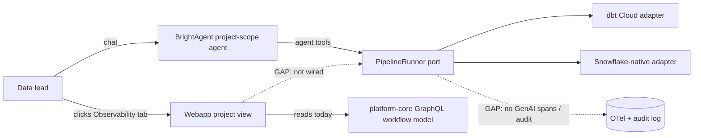

# Pipeline Run Logs & Observability Surfacing

> The 8 engine-agnostic pipeline lifecycle verbs already exist in brightbot and
> are reachable via BrightAgent chat + MCP. This spec closes two gaps that stop
> a user from *managing and watching* pipeline runs: (1) the verbs emit almost
> no telemetry, and (2) the webapp project-view Observability tab reads a
> parallel GraphQL backend, so `get_run_logs` / `get_run_detail` / `cancel_run`
> / step timelines are chat-only today.

## 1. Context

The `PipelineRunner` port (brightbot) exposes 8 verbs — `list_pipelines`,
`get_pipeline_steps`, `get_run_logs`, `get_run_detail`, `cancel_run`,
`set_schedule`, `provision_isolated`, `teardown` — behind adapters (dbt Cloud,
Snowflake-native, Fake). They surface today as project-scope agent tools and MCP
tools. Two things are missing before a data lead can *manage all this* through
BrightAgent and the platform:

1. **Observability is a gap.** MCP lifecycle tools emit error-path stdlib logs
   only — no spans, no success/preview events, no `run_id` / `pipeline_id` /
   `workspace_id` / `correlation_id` fields. Agent tools inherit generic
   `langgraph.tool.*` middleware spans that do not follow the OTel GenAI
   convention and carry no domain attributes. The mutating verbs
   (`cancel_run` / `set_schedule` / `provision_isolated` / `teardown`) have no
   audit record despite being default-deny WRITE tools.

2. **The platform project view does not consume these verbs.** The webapp
   Observability tab (`ProjectObservabilityPage`) renders runs, run detail, and
   OpenLineage-facet "run logs" — but from platform-core's GraphQL
   `workflow`/transformation model, a parallel path. None of the 8 brightbot
   verbs are wired into the frontend. So run-log retrieval, run cancellation,
   and step timelines via brightbot are reachable only by asking the agent in
   chat and reading the text reply.

This spec is engine-agnostic: everything below is expressed against the
`PipelineRunner` port and its domain types, never a vendor SDK. dbt Cloud and
Snowflake-native are the current adapters; a new engine inherits the telemetry
and the surfacing for free.



## 2. Interface Contract (MDE)

### 2.1 Port (unchanged — the surface all telemetry attaches to)

```python
# brightbot/brightbot/pipelines/runner_port.py  (existing)
class PipelineRunner(Protocol):
    async def get_run_logs(self, *, run_id: str, ctx: RequestContext) -> RunLogs: ...
    async def get_run_detail(self, *, run_id: str, ctx: RequestContext) -> RunDetail: ...
    # + list_pipelines, get_pipeline_steps, cancel_run, set_schedule,
    #   provision_isolated, teardown

@dataclass(frozen=True, slots=True)
class RunStep:
    name: str
    status: str
    logs: str          # untruncated log text for the step

@dataclass(frozen=True, slots=True)
class RunLogs:
    run_id: str
    steps: tuple[RunStep, ...]
```

### 2.2 Platform read surface — GraphQL (webapp project view consumes this)

The project view must render brightbot-sourced runs/logs without a chat round
trip. Rather than a second GraphQL model, platform-core proxies the port verbs
behind the existing `workflow` project scope:

```graphql
# platform-core — new resolver, project-scoped
type PipelineRun {
  runId: ID!
  pipelineId: ID!
  status: RunStatus!          # QUEUED | RUNNING | SUCCESS | FAILED | CANCELLED
  startedAt: DateTime
  finishedAt: DateTime
  durationS: Float
  origin: String             # scheduled | manual | agent
}

type RunStepView { name: String!  status: String!  logs: String! }

extend type Query {
  pipelineRuns(projectId: ID!, workspaceId: ID!, limit: Int = 25): [PipelineRun!]!
  pipelineRunLogs(projectId: ID!, workspaceId: ID!, runId: ID!): [RunStepView!]!
  pipelineRunDetail(projectId: ID!, workspaceId: ID!, runId: ID!): PipelineRun!
}

extend type Mutation {
  cancelPipelineRun(projectId: ID!, workspaceId: ID!, runId: ID!): PipelineRun!
}
```

### 2.3 Confirm-gated mutations keep their two-call protocol

`cancelPipelineRun` (and any schedule/provision/teardown surfaced later in the
UI) preserves brightbot's confirm=False preview → confirm=True execute contract;
the UI renders the preview before firing the mutation.

## 3. Invariants (DbC)

- **INV-1** Every lifecycle verb call emits exactly one OTel span whether it
  succeeds or fails. `WHEN a lifecycle verb returns or raises, THE System SHALL
  close its span with the outcome recorded.`
- **INV-2** Every lifecycle span carries `workspace.id`, `pipeline.run_id` (when
  known), `pipeline.id` (when known), `brightagent.pipeline.verb`, and the
  `correlation_id` from `RequestContext`. `IF a span lacks workspace.id, THEN
  the emission is non-conformant.`
- **INV-3** The four mutating verbs (`cancel_run`, `set_schedule`,
  `provision_isolated`, `teardown`) each write one audit record attributing the
  JWT principal, verb, target, and outcome. `WHEN a mutating verb executes with
  confirm=True, THE System SHALL append an audit record.`
- **INV-4** Run logs surfaced to any surface are redacted of secrets before they
  leave the server — parity with the webapp's existing `redact.ts` behavior for
  OpenLineage facets.
- **INV-5** The platform read surface is engine-agnostic: `pipelineRuns` /
  `pipelineRunLogs` resolve through the `PipelineRunner` port, never a
  vendor-specific query. `IF a resolver imports a vendor SDK, THEN it is a
  violation of PS-4.`
- **INV-6** No telemetry change alters a verb's return payload — spans/logs are
  side-channel only. `WHILE emitting telemetry, THE System SHALL NOT mutate the
  RunLogs / RunDetail returned to the caller.`

## 4. Acceptance Criteria (BDD)

```gherkin
Feature: Pipeline run logs & observability surfacing

  Scenario: Run logs retrievable in the project view without chat
    Given a project bound to a transformation repo with completed runs
    When the user opens the Observability tab and expands a run
    Then the run's steps and logs render from the PipelineRunner port
    And no secret values appear in the rendered logs

  Scenario: Lifecycle verb emits a conformant span
    Given the get_run_logs verb is invoked for run "run-123"
    When the call completes
    Then one span "gen_ai.tool.execute" is emitted
    And it carries workspace.id, pipeline.run_id, brightagent.pipeline.verb, correlation_id

  Scenario: Mutating verb writes an audit record
    Given the user confirms cancel_run for run "run-123"
    When the cancellation executes
    Then an audit record attributes the JWT principal, verb "cancel_run", and outcome

  Scenario: Cancel a run from the project view
    Given a RUNNING pipeline run in the project view
    When the user clicks Cancel and confirms the preview
    Then cancelPipelineRun resolves through the port and the status becomes CANCELLED

  Scenario: MCP verb telemetry parity (future management surface)
    Given a lifecycle verb invoked over MCP
    When it completes
    Then it emits the same span shape and attributes as the agent-tool path

  Scenario: Engine-agnostic — Snowflake-native adapter surfaces identically
    Given a project on the Snowflake-native adapter
    When the user retrieves run logs in the project view
    Then the same RunStepView shape renders with no vendor-specific code path
```

## 5. Out of Scope

- Building a brand-new run-logs backend — reuse the `PipelineRunner` port.
- Migrating the existing OpenLineage-facet Observability panel off GraphQL; this
  spec *adds* a port-backed data path, it does not rip out the current one.
- slack-server surfacing of the verbs (tracked separately, task #48).
- MCP-driven *management UI* — MCP telemetry parity is in scope (INV/AC), but a
  dedicated MCP management surface is deferred to BH-1181.
- New warehouse adapters.

## 6. Dependencies

- `PipelineRunner` port + dbt Cloud / Snowflake-native / Fake adapters (BH-1255, shipped).
- Agent-tool + MCP surfaces for the 8 verbs (shipped: brightbot#980).
- Audit-log spec `docs/specs/SPEC-AUDIT-LOG.md` / `@audit_action` (brightbot) — INV-3 reuses it.
- Webapp `ProjectObservabilityPage` + `RunDetailPanel` + `redact.ts` (brighthive-webapp, exists).
- platform-core `workflow` project scope + GraphQL schema (exists).

## 7. Correctness Properties

### Property 1: Every verb call is observable

*For any* lifecycle verb invocation on any surface (agent tool, MCP, GraphQL
proxy), exactly one span is emitted carrying the INV-2 attribute set.

**Validates: §3 INV-1, INV-2; §4 Scenario "Lifecycle verb emits a conformant span", "MCP verb telemetry parity"**

### Property 2: Mutations are attributable

*For any* execution of a mutating verb with confirm=True, an audit record exists
naming the principal, verb, target, and outcome.

**Validates: §3 INV-3; §4 Scenario "Mutating verb writes an audit record"**

### Property 3: Logs never leak secrets

*For any* run-log payload leaving the server on any surface, no secret value is
present.

**Validates: §3 INV-4; §4 Scenario "Run logs retrievable in the project view without chat"**

## 8. Eval Criteria

Not applicable — this spec adds telemetry + a read/mutation surface over
deterministic port verbs; no new LLM-generated output. Verb correctness is
covered by the existing BH-1255 port/adapter tests.

## 9. Observability Contract

This is the crux of the spec — today it is a gap.

- **Span**: `gen_ai.tool.execute`, one per lifecycle verb call, on **both** the
  agent-tool and MCP paths (MCP server currently emits no per-tool span).
- **Attributes** (every span):
  - `workspace.id`
  - `brightagent.pipeline.verb` — one of the 8 verb names
  - `gen_ai.tool.name` — the tool name
  - `pipeline.id` (when known), `pipeline.run_id` (when known)
  - `brightagent.pipeline.engine` — adapter discriminator (`dbt_cloud` | `snowflake_native` | …)
  - `correlation_id` — propagated from `RequestContext`
  - `tool.result.status` — `ok` | `error`, `tool.duration_ms`
- **Log events** (structured, replacing the current error-only stdlib lines):
  - `pipeline.<verb>.started`
  - `pipeline.<verb>.success`
  - `pipeline.<verb>.error` (with sanitized reason)
  - `pipeline.<verb>.preview` for confirm=False on mutating verbs
  - each carries `workspace.id`, `run_id`/`pipeline_id`, `correlation_id`
- **Metrics**:
  - `brightagent.pipeline.verb.executions` counter, tagged `verb`, `engine`, `status`, `workspace.id`
  - `brightagent.pipeline.verb.duration_ms` histogram, same tags
- **Audit** (INV-3, mutating verbs): reuse `@audit_action` / SPEC-AUDIT-LOG —
  principal, `verb`, `target` (run_id / pipeline_id / schedule), `outcome`.

## 10. Test Coverage Update

Extends the real suites — no greenfield sibling files.

### a. In-repo layered evals

- **L0 (surface)** — brightbot: one case per §2.2 GraphQL proxy op asserting
  request/response shape; assert MCP + agent tool return payloads unchanged
  after telemetry lands (INV-6). platform-core: schema-shape test for the new
  `PipelineRun` / `RunStepView` types.
- **L1 (routing)** — assert a GraphQL `pipelineRuns` query dispatches through the
  `PipelineRunner` port (INV-5), not a vendor query; assert agent-tool + MCP
  paths reach the same span emitter.
- **L2 (behavior)** — one case per INV:
  - INV-1/INV-2: invoke each verb against `FakePipelineRunner`, assert exactly
    one `gen_ai.tool.execute` span with the full §9 attribute set (real span
    exporter in-memory, not a mock).
  - INV-3: confirm=True on each mutating verb writes one audit record.
  - INV-4: a run-log fixture carrying a secret is redacted before emission.
  - INV-6: return payload byte-identical with telemetry on vs off.

### b. Cross-repo / e2e (`brighthive-e2e`)

- **Feature test** (happy path §4): project bound to a repo → open Observability
  → run logs render from the port path → span + audit assertions on the emitted
  telemetry (real backend, per test-behavior-real).
- **Surface test**: the `pipelineRuns` / `pipelineRunLogs` GraphQL ops hit the
  real platform-core→brightbot path, asserting §2.2 shape.
- **Error path** (§4): `cancel_run` on a non-existent run → typed error + one
  `pipeline.cancel_run.error` event, no bare 500.
- **Engine parity**: run-log surfacing exercised against ≥2 adapters (dbt Cloud
  + Snowflake-native) proving INV-5 identical rendering.

### Self-verification

Before the implementation PR: run brightbot unit + eval suites, platform-core
tests, and the `brighthive-e2e` feature/surface cases; confirm each §2/§3/§4
entry has a new test and all suites are green with telemetry enabled.
