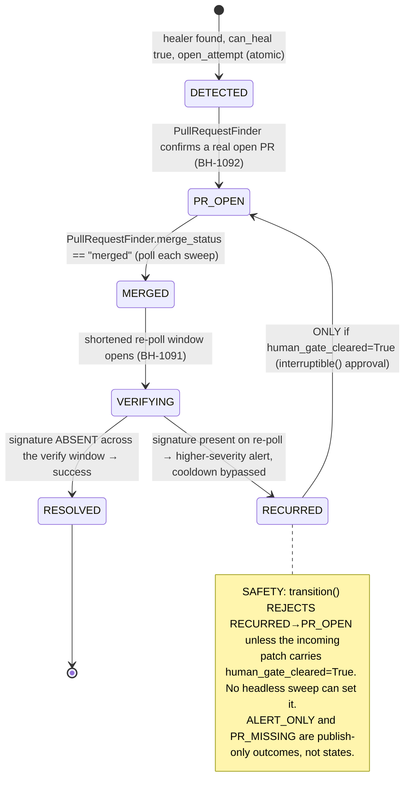

# Proactive Self-Healing Pipeline Monitoring — Fleet Architecture

> Trial success criterion 7 (self-heal). Loop Capital's legacy stack is SQL Server 2019 + SSIS-fed / SSRS-reported; SQL Server and SSIS are the first two healer-routed adapters. Engine-agnostic by construction — every source is a `PipelineSource` adapter behind a registry; no vendor string in the routing logic.

> Status: Draft · Owner: drchinca · Last-Reviewed: 2026-07-29
> Repos touched: `brightbot` (primary), `brighthive-platform-core` (cron boundary), `brightbot-slack-server` (renderers, out of scope here)

## 1. Context

> **One capacity, every stack.** The detect → diagnose → heal → verify loop this spec defines is *identical* whether the pipeline engine is dbt, SSIS, Databricks, or Airflow; whether the warehouse is Snowflake, SQL Server, Redshift, or BigQuery; and whichever client's niche stack it runs against. The engine/warehouse/tool is never a branch in the loop — it is a `PipelineSource` adapter + a `Healer` registered against a `SignalShape`. Adding a stack is a registry entry (config), not a code change to anything that polls, routes, heals, or alerts (see **INV-16**). Loop Capital's SQL Server + SSIS are simply the first two adapters this trial exercises.

The BrightAgent Pipeline Watchdog today monitors **one workspace, one connection per source, and self-heals exactly one failure kind (dbt), with no proof the fix worked.** Five concrete gaps block a trustworthy, multi-workspace, self-healing product:

1. **No monitored-unit model.** The watchdog is scoped only by `workspace_id` and discovers connections first-wins: it sweeps the registry building every adapter with an empty config (`pipeline_watchdog_task.py:129-136`), so `DbtPipelineSource` polls whatever `_find_connected_dbt_service()` returns first (`dbt_pipeline_source.py:12-23`, live `# TODO(multi-connection)`). A workspace's second dbt project is never polled. Nothing ties a source connection + adapter + schedule + healer together as one named unit a data leader can see.
2. **No source fan-out.** The factory `build_pipeline_source(source_type, config)` (`pipeline_health.py:142`) builds one adapter per source type; there is no seam to enumerate N connections or inject the runtime callables the drift detector needs — so `LongitudinalDriftPipelineSource` returns `[]` and **proactive drift never fires** (`longitudinal_drift_pipeline_source.py:107-128`).
3. **No healing routing.** `_publish_signals` pre-filters to dbt only (`published_dbt_failures.append`, `pipeline_watchdog_task.py:309`); `_attempt_remediation` (`:485`) iterates that pre-filtered list and hardcodes `remediation_agent_graph.ainvoke(...)`. The fully-built SSIS remediation agent (`ssis_remediation_agent.py:191`) is orphaned — not in `langgraph.json`, no caller. Every new healer means editing the giant-if.
4. **No closed loop.** The watchdog trusts "the run returned a `github_pr_url`" as proof a PR exists (no deterministic check, BH-1092), and nothing re-runs the pipeline after a human merges (BH-1091). A wrong merge is **silently suppressed** for the full 60-min cooldown window because the cooldown key is the failure *signature*, not "was it resolved".
5. **No fleet scale.** One cron row per workspace, no fairness ceiling, no shared resilience envelope, no run-level runaway guard.

This spec unifies the fix into one layered architecture. The **MonitoredPipeline** entity (product label "Pipeline") is the foundation — the atomic monitored unit every other layer keys on. On top of it: source fan-out over connections + live drift; a signal-shape → healer routing registry; a closed-loop remediation lifecycle with a durable ledger; a fleet sweep layer for fairness, resilience, and observability; and a single **danger-threshold circuit-breaker** that halts a runaway run. The **PipelineSource Protocol stays byte-for-byte intact** (`pipeline_health.py:86-95`); the **GC-17 no-self-merge guarantee** is preserved and generalized to *every* healer.

Named "Pipeline" (`MonitoredPipeline`), not "Project": the subsystem already speaks this vocabulary ("pipeline watchdog", `PipelineHealthSignal`, `PipelineSource`), and "Project" collides with BrightStudio Projects. The fleet layer references a `pipeline_id`, never a separate "project" model.

The remediation lifecycle — the safety heart of the epic — is a six-state ledger machine. `ALERT_ONLY` and `PR_MISSING` are **publish-only outcomes** (BrightSignals stages, never persisted ledger rows); the RECURRED human gate is an **out-of-ledger** `interruptible()` phase whose only ledger effect is the guarded `RECURRED→PR_OPEN` edge.



Two supporting flows aid review — watchdog enumeration (`WatchRoster.list_targets → per target build_sources_for_workspace(source_type, seams) → poll_health → reconcile_open_attempts`) and fleet fan-out (`platform-core EventBridge → scheduled_agent_dispatcher Lambda → brightbot sweep planner → FleetQueue (one message per target, group=workspace_id) → N poll consumers → existing watchdog graph unchanged`).

## 2. Interface Contract (MDE)

All new types live in `brightbot`. Existing types are reused verbatim and cited. No vendor SDK or type crosses any port (PS-4).

### 2.1 Foundation — the MonitoredPipeline entity

```python
# brightbot/monitored_pipelines/dtos.py (new). Product label "Pipeline".
SourceType = Literal[
    "dbt", "custom_sql", "etl", "ssis",
    "snowflake", "databricks", "longitudinal_drift",
]  # the SEVEN real register_adapters() dict KEYS (pipeline_health.py:136-137):
#   SSIS_CATALOG = "ssis" (ssis_pipeline_source.py:49), SNOWFLAKE_TASKS = "snowflake"
#   (snowflake_pipeline_source.py:43) — constant NAMES differ from their string VALUES.

class PipelineHealer(str, Enum):
    DBT_REMEDIATION = "dbt_remediation"   # -> remediation_agent_graph (remediation_agent.py:169)
    SSIS_REMEDIATION = "ssis_remediation" # -> ssis_remediation_agent_graph (once registered)
    NONE = "none"                          # alert-only

class PipelineLifecycle(str, Enum):
    DRAFT = "draft"; ENABLED = "enabled"; DISABLED = "disabled"; ARCHIVED = "archived"

class MonitoredPipeline(BaseModel):
    """One named, monitored data pipeline: source connection + adapter + optional schedule + declared healer."""
    pipeline_id: str                      # uuid4, immutable
    workspace_id: str
    name: str                             # human label ("Loop Capital dbt models")
    source_type: SourceType
    source_config: dict[str, Any] = Field(default_factory=dict)  # connection REFERENCES only, never secrets
    healer: PipelineHealer = PipelineHealer.NONE
    lifecycle: PipelineLifecycle = PipelineLifecycle.DRAFT
    schedule_id: str | None = None        # FK to a SCHEDULE# row; None == covered by fleet sweep
    created_by: str; created_at: str; updated_at: str

    @property
    def is_active(self) -> bool: return self.lifecycle is PipelineLifecycle.ENABLED

class PipelineStore(Protocol):
    async def list_pipelines(self, *, workspace_id: str) -> list[MonitoredPipeline]: ...
    async def list_active_pipelines(self, *, workspace_id: str) -> list[MonitoredPipeline]: ...
    async def get_pipeline(self, *, workspace_id: str, pipeline_id: str) -> MonitoredPipeline | None: ...
    async def save_pipeline(self, *, pipeline: MonitoredPipeline) -> None: ...
# DynamoDB row in the EXISTING SCHEDULED_AGENTS_TABLE:
#   PK = "WORKSPACE#<workspace_id>" (_WORKSPACE_KEY_PREFIX, store.py:45)  SK = "PIPELINE#<pipeline_id>" (new)
#   disjoint from "SCHEDULE#" (_SCHEDULE_SK_PREFIX, store.py:46) and "ASSET#" (schedule_asset_junctions.py:13)
# InMemoryPipelineStore fake ships alongside (PS-10).
```

### 2.2 Source fan-out — the PipelineSource Port (UNCHANGED) + fan-out factory

```python
# UNCHANGED (pipeline_health.py:86-95) — domain types only:
class PipelineSource(Protocol):
    def capabilities(self) -> frozenset[Capability]: ...
    async def poll_health(self, *, ctx: RequestContext) -> list[PipelineHealthSignal]: ...

# §2 CONTRACT CHANGE: widen PipelineHealthSignal.source_type from Literal["dbt","databricks","etl"]
# (pipeline_health.py:72) to the full SourceType set, so the routing key domain matches what
# adapters actually emit (snowflake/ssis/custom_sql/longitudinal_drift signals were previously
# unrepresentable in the DTO's own type). L0 asserts every value round-trips through the DTO.
Capability = Literal["JOB_STATUS", "DISK_METRICS", "VALUE_DRIFT", "NULL_SPIKE"]

@dataclass(frozen=True)
class MonitoredConnection:
    source_type: str; connection_key: str  # stable id: transformation_service_id / warehouseServiceId — NEVER a secret
    display_name: str; config: dict[str, Any]

class ConnectionDirectory(Protocol):     # listing connections is an external capability → a Port (PS-1)
    async def list_connections(self, *, source_type: str, ctx: RequestContext) -> list[MonitoredConnection]: ...

@dataclass(frozen=True)
class SourceSeams:                        # injectable seam bundle threaded by the factory
    connections: ConnectionDirectory
    history_provider: MetricHistoryProvider | None = None   # drift only
    watched_assets: WatchedAssetsProvider | None = None     # drift only

AdapterBuilder = Callable[[MonitoredConnection, SourceSeams], PipelineSource]
PIPELINE_SOURCE_BUILDERS: dict[str, AdapterBuilder] = {}    # populated by register_adapters()

async def build_sources_for_workspace(*, source_type: str, seams: SourceSeams,
                                       ctx: RequestContext) -> list[PipelineSource]:
    """One connection-scoped PipelineSource per connection. Raises ValueError on unknown source_type."""

# DbtPipelineSource gains a connection-scoped ctor; job_id = f"{connection_key}:{native_id}"
# (was str(job["id"]) at dbt_pipeline_source.py:139) so two dbt projects never share a cooldown key.
```

### 2.3 Healing routing — signal-shape → healer registry

```python
# brightbot/agents/governance_agent/tools/pipeline_healing.py (new)
MERGE_TOOL_NAME: Final[str] = "github_merge_pull_request"   # promoted from bare literals

@dataclass(frozen=True)
class SignalShape:  source_type: str; failure_type: str     # the ONLY routing key — root_cause_class is NEVER an input

@dataclass(frozen=True)
class HealingOutcome:
    job_id: str; action: Literal["pr_opened", "alert_only", "healer_error"]
    github_pr_url: str | None = None; diagnosis: str | None = None

class Healer(Protocol):                    # product name (NOT RemediationHandlerManager)
    def bound_tool_names(self) -> frozenset[str]: ...  # DERIVED from the compiled graph's real bindings, not a literal
    def can_heal(self, *, signal: PipelineHealthSignal) -> bool: ...   # never guesses; never gates on root_cause_class
    async def heal(self, *, signal: PipelineHealthSignal, ctx: RequestContext) -> HealingOutcome: ...

class Gc17SafetyViolation(RuntimeError): ...

class HealerRegistry:
    """Encapsulated registry: register() is the ONLY mutator; the backing dict is private (no __setitem__)."""
    def register(self, *, shape: SignalShape, healer: Healer) -> None:
        if MERGE_TOOL_NAME in healer.bound_tool_names():
            raise Gc17SafetyViolation(f"healer for {shape} binds {MERGE_TOOL_NAME!r} (GC-17)")
        # ... store in private dict
    def find(self, *, signal: PipelineHealthSignal) -> Healer | None: ...   # keyed by SignalShape
    def bound_shapes(self) -> frozenset[SignalShape]: ...

PIPELINE_HEALERS: Final = HealerRegistry()  # single module instance; PIPELINE_HEALERS[x]=y is impossible
# Concrete healers:
#   DbtModelHealer  — shape ("dbt","dbt_run_failure"); can_heal=True for every dbt signal (root_cause_class is
#     ALWAYS JOB_RUNTIME, dbt_pipeline_source.py:146). The WRAPPED remediation_agent_graph keeps its own
#     classify_data_shape_mode gate (remediation_agent.py:86) — today's behavior preserved exactly.
#   SsisPackageHealer — registered ONLY on the two REAL emitted failure_types the SSIS agent can structurally
#     fix (ssis_pipeline_source.py:51-54):
#         SignalShape("ssis","ssis_missing_staging_step")   and   SignalShape("ssis","ssis_missing_error_redirect")
#     — both are missing-package-structure defects with a deterministic PR fix; can_heal = has_actionable_finding (:67).
#     The other two emitted failure_types are NOT registered, so find() returns None and they stay alert-only:
#         ssis_package_unreachable  — catalog/connectivity failure, no code fix exists (fix is infra, not a PR)
#         ssis_package_parse_error  — the .dtsx cannot be parsed, so there is no safe patch to draft
#     This is why the healer keys on the emitted types, not the previously-fictional "ssis_package_failure"
#     (which no adapter ever emits) — that fiction routed find() to None for EVERY real SSIS signal.
```

### 2.4 Closed-loop — remediation ledger, PR/merge finder, reconciler

```python
# brightbot/agents/governance_agent/tools/remediation_ledger.py (new)
class RemediationState(Enum):
    DETECTED="detected"; PR_OPEN="pr_open"; MERGED="merged"
    VERIFYING="verifying"; RESOLVED="resolved"; RECURRED="recurred"
# EXACTLY these six persist. ALERT_ONLY / PR_MISSING are publish-only outcomes (no ledger row).
# The RECURRED human gate is an out-of-ledger interruptible() phase (§2 interruptible reuse).

def signature_key(*, workspace_id, source_type, job_id, failure_type) -> str: ...  # the cooldown 4-tuple, verbatim

@dataclass(frozen=True)
class RemediationAttempt:
    workspace_id: str; source_type: str; job_id: str; failure_type: str
    state: RemediationState; attempt_seq: int             # monotonic per signature; ledger sort key
    github_pr_url: str | None; github_pr_number: int | None
    opened_at: datetime | None; merged_at: datetime | None; verify_deadline: datetime | None
    human_gate_cleared: bool; correlation_id: str

class IllegalTransition(RuntimeError): ...

class RemediationLedger(Protocol):        # sibling to AlertCooldownStore, NOT a subclass
    async def latest(self, *, workspace_id, source_type, job_id, failure_type) -> RemediationAttempt | None: ...
    async def open_attempt(self, *, attempt: RemediationAttempt) -> None: ...
        # ATOMIC conditional write (DynamoDB condition on attempt_seq / current-state): only one
        # dispatcher across overlapping sweeps can advance a signature out of DETECTED.
    async def transition(self, *, workspace_id, source_type, job_id, failure_type, attempt_seq,
                         to_state: RemediationState, at: datetime, patch: dict) -> RemediationAttempt: ...
        # Rejects any edge outside INV-13 with IllegalTransition. For RECURRED→PR_OPEN, ALSO rejects
        # unless patch["human_gate_cleared"] is True (structural human gate, not prose).

class PullRequestFinder(Protocol):        # deterministic — NO LLM judge (BH-1092)
    async def find_open_pr_for_signature(self, *, workspace_id, transformation_service_id,
                                         branch_prefix, failure_type) -> RemediationPr | None: ...
    async def merge_status(self, *, workspace_id, github_pr_number) -> Literal["open","merged","closed"]: ...

class ClosedLoopReconciler(Protocol):     # runs each sweep — the driver for every post-DETECTED edge
    async def reconcile(self, *, workspace_id: str, poll_signatures: frozenset[str],
                        now: datetime, ctx: RequestContext) -> list[RemediationAttempt]: ...
        # PR_OPEN→MERGED (merge_status=="merged"); MERGED→VERIFYING (opens window);
        # VERIFYING→RECURRED if signature in poll_signatures; VERIFYING→RESOLVED if absent AND now>=verify_deadline.
# New table PIPELINE_REMEDIATION_LEDGER_TABLE: PK=signature_key, SK=attempt_seq, native TTL.
```

### 2.5 Fleet — sweep planner, roster, fair queue, danger circuit-breaker

```python
@dataclass(frozen=True)
class WatchTarget:
    workspace_id: str; pipeline_id: str; connection_id: str
    source_type: str; source_config: dict          # passed verbatim to build_sources_for_workspace

class WatchRoster(Protocol):
    async def list_targets(self, *, sweep_id: str) -> Sequence[WatchTarget]: ...   # all workspaces × pipelines × connections

class FleetQueue(Protocol):               # one message per target; per-workspace fairness; DLQ-backed (PS-8)
    def capabilities(self) -> frozenset[str]: ...   # WEIGHTED_FAIR, PER_TENANT_GROUP
    async def enqueue(self, *, sweep_id: str, target: WatchTarget, ctx: RequestContext) -> None: ...
    async def receive(self, *, ctx: RequestContext) -> AsyncIterator[WatchMessage]: ...   # message_group_id == workspace_id

@dataclass(frozen=True)
class PollResilience:  timeout_s: float; retries: int; circuit_breaker_key: str; bulkhead_max_inflight: int

# ── Circuit-breaker: ONE danger threshold. Cross it and the run HALTS. No metering, no $/token math. ──
@dataclass(frozen=True)
class DangerThreshold:
    max_agent_steps: int          # runaway agent step budget for a single heal graph
    max_wall_clock_s: float       # wall-clock ceiling for one sweep run
    max_repeated_signatures: int  # same signature re-dispatched N× in a run == runaway_loop

class DangerHalt(RuntimeError):
    """A run crossed its danger threshold — halt immediately, surface, never silent."""
    reason: Literal["max_agent_steps", "max_wall_clock_s", "runaway_loop"]

class SweepState(StrEnum): PLANNING="planning"; DISPATCHING="dispatching"; DRAINING="draining"; COMPLETE="complete"
FLEET_QUEUE_ADAPTERS: Final[dict[str, FleetQueueFactory]] = {"sqs": ...}   # + FakeFleetQueue (PS-10), single switch site (PS-3)
# Per-target consumer invokes the EXISTING graph unchanged:
#   pipeline_watchdog_task_graph.ainvoke({"workspace_id": target.workspace_id, ...})  (pipeline_watchdog_task.py:635)
```

## 3. Invariants (DbC)

- **INV-1 Workspace isolation.** Every persisted row and runtime key (Pipeline PK, ledger key, cooldown key, queue `message_group_id`, circuit-breaker key) leads with `workspace_id`; no cross-workspace read is ever returned (reuses cooldown tuple `pipeline_alert_cooldown.py:53`).
- **INV-2 Full fan-out, never first-wins.** WHEN the watchdog polls, THE System SHALL build and poll one `PipelineSource` per *active* MonitoredPipeline via `build_sources_for_workspace(...)` — and one `FleetQueue` message per `WatchTarget` — never one adapter per registry key with empty config (replaces `pipeline_watchdog_task.py:129-136`; fixes `dbt_pipeline_source.py:12-23`).
- **INV-3 Port intact.** `PipelineSource` SHALL remain a two-method `Protocol` (`capabilities`, `poll_health`) with no vendor SDK/type crossing it; fan-out and seams live in the factory/registry, never in the Port.
- **INV-4 Connection-stable job_id.** For every emitted signal, `job_id` SHALL be namespaced by `connection_key` so it is unique within `(workspace_id, source_type)`; two connections with identical native ids produce distinct 4-tuple keys and never suppress each other.
- **INV-5 Secret non-leakage — including streamed surfaces.** `source_config`, `connection_key`, and `job_id` SHALL carry connection references only, never secret material; secrets resolve at poll time, and `scrub_text` (`pipeline_watchdog_task.py:172-175`) stays the single sink choke point. Every streamed progress chunk (§9.1 Slack/Webapp/OTel) SHALL pass `scrub_text` before emission — a step/tool-detail stream cannot leak a secret or a raw value a log may not carry.
- **INV-6 Registered source_type only.** `save_pipeline` SHALL reject a Pipeline whose `source_type` is not a live `register_adapters()` key (`pipeline_health.py:136-137`), mirroring the `build_sources_for_workspace` unknown-type `ValueError`.
- **INV-7 Poll only ENABLED, else legacy fallback.** IF a Pipeline is not ENABLED, THE System SHALL NOT poll it; WHEN a workspace has zero Pipelines, THE System SHALL fall back to the legacy empty-config sweep so no monitored workspace regresses during rollout.
- **INV-8 Drift liveness/safety.** WHEN `SourceSeams` supplies `history_provider` and a non-empty watched-asset set, THE System SHALL run detection per asset and emit `DATA_SHAPE` signals; WHILE either seam is absent it SHALL return `[]` and log, never raise (`longitudinal_drift_pipeline_source.py:122-128`).
- **INV-9 Alert-only default (never guess), routed by shape only.** Routing keys on `SignalShape(source_type, failure_type)` ONLY — never on `root_cause_class`. WHEN `PIPELINE_HEALERS.find` returns `None` (e.g. an `ssis_package_unreachable` / `ssis_package_parse_error` signal, for which no healer is registered) OR `can_heal` is false, THE System SHALL take no fix action; the signal has already reached Slack/Inbox, so alert-only is a terminal `ALERT_ONLY` publish outcome (no ledger row), not a dropped alert.
- **INV-10 GC-17, every healer, by construction + defence in depth.** `bound_tool_names()` SHALL be derived from the healer's actual compiled-graph tool bindings (not a hand-maintained literal). IF it contains `MERGE_TOOL_NAME`, THEN `HealerRegistry.register` SHALL raise `Gc17SafetyViolation`; AND at dispatch THE System SHALL re-verify the merge tool is absent from the graph about to run and skip + log if present (`pipeline_watchdog_task.py:505-512` generalized). No Pipeline can opt into a merge-capable healer.
- **INV-11 Verify-don't-assume PR + no duplicate PR (BH-1092).** WHEN a run returns a `github_pr_url`, THE System SHALL confirm the PR via `PullRequestFinder` before recording `PR_OPEN`; a missing PR SHALL publish `remediation_pr_missing` (publish-only) and leave the attempt in DETECTED. WHEN about to dispatch, IF the ledger's latest attempt (read under the same atomic guard as `open_attempt`) is in `{PR_OPEN, MERGED, VERIFYING}` OR an open PR exists, THE System SHALL NOT dispatch and SHALL NOT open a second PR.
- **INV-12 Closed-loop reconciliation drives every post-DETECTED edge; no silent suppression.** Each sweep, `ClosedLoopReconciler.reconcile` SHALL evaluate every PR_OPEN/MERGED/VERIFYING attempt and drive `PR_OPEN→MERGED` (merge poll), `MERGED→VERIFYING`, `VERIFYING→{RESOLVED|RECURRED}`. The verify window SHALL be `k × sweep_interval_s (k>=1)` so at least one re-poll lands inside it; on `verify_deadline` expiry with the signature absent throughout → RESOLVED. WHILE a signature is in VERIFYING, THE System SHALL NOT apply cooldown suppression — a recurrence surfaces immediately at higher severity.
- **INV-13 Legal transitions only + structural human gate.** The ledger SHALL permit ONLY: DETECTED→PR_OPEN, PR_OPEN→MERGED, MERGED→VERIFYING, VERIFYING→RESOLVED, VERIFYING→RECURRED, RECURRED→PR_OPEN. IF the edge is RECURRED→PR_OPEN AND `patch["human_gate_cleared"]` is not True, THEN `transition` SHALL raise `IllegalTransition` and leave state unchanged; any edge outside this set SHALL likewise raise `IllegalTransition`. Only the interactive `interruptible()` session may set `human_gate_cleared=True`; a headless sweep never can.
- **INV-14 Fleet fairness, resilience, idempotency.** WHILE dispatching, THE System SHALL NOT exceed `bulkhead_max_inflight` concurrent polls for any one workspace; every poll SHALL run under a `PollResilience` envelope (timeout, retries, per-connection breaker); consumers SHALL be idempotent keyed by `(sweep_id, workspace_id, pipeline_id, connection_id)` and DLQ-backed.
- **INV-15 Danger circuit-breaker.** WHEN a run crosses its danger threshold, THE System SHALL halt and emit `DangerHalt` — no further LLM calls, no further dispatch. The halt is always surfaced (observable), never silent; the alert path already delivered before any heal is unaffected.
- **INV-16 Engine / warehouse / tool agnosticism — the detect→diagnose→heal capacity is identical across stacks.** The watchdog, reconciler, ledger, routing registry, fleet sweep, and circuit-breaker SHALL contain ZERO branch on a concrete engine, warehouse, or tooling identity (no `if source_type == "dbt"`, no `if warehouse == "snowflake"`, no vendor string in business logic). Support for a new pipeline engine (dbt / SSIS / Databricks / Airflow / …), a new warehouse (Snowflake / SQL Server / Redshift / BigQuery / …), or a new client's niche stack SHALL be a `PIPELINE_SOURCE_ADAPTERS` + `PIPELINE_HEALERS` registration (config, per PS-1/PS-3), never a change to any code that walks, polls, routes, heals, verifies, or alerts. Routing keys on `SignalShape(source_type, failure_type)` ONLY (INV-9). Grep test: the only sites naming a concrete engine/warehouse string are the registry entries, the adapter modules, and config — never the fleet/ledger/reconciler.

## 4. Acceptance Criteria (BDD)

```gherkin
Feature: Foundation — enumerate every active Pipeline, no first-wins

  Scenario: Two dbt connections both polled
    Given a workspace with two ENABLED dbt Pipelines with distinct source_config.transformation_service_id
    When the watchdog runs for that workspace
    Then a dbt PipelineSource is built and polled for each Pipeline's own config
    And neither dbt connection is skipped by first-wins discovery

  Scenario: Disabled Pipeline is not polled
    Given a workspace with one ENABLED and one DISABLED Snowflake ("snowflake") Pipeline
    When the watchdog runs
    Then only the ENABLED Pipeline's adapter is built and polled

  Scenario: Legacy fallback when a workspace has no Pipelines
    Given a workspace with zero MonitoredPipeline rows
    When the watchdog runs
    Then it falls back to the empty-config registry sweep and behavior is unchanged

  Scenario: Save rejects an unregistered source_type
    Given a save request for a Pipeline with source_type "kafka"
    When save_pipeline is called
    Then it is rejected and no PIPELINE# row is written

  Scenario: Cross-workspace isolation on read
    Given Pipelines exist for workspace A and workspace B
    When list_active_pipelines is called for workspace A
    Then only workspace A's PIPELINE# rows are returned

Feature: Source fan-out and live drift

  Scenario: Same native job id across two connections stays distinct
    Given two connected dbt services S1 and S2 each with a failed job native id "42"
    When the watchdog fans out over connections
    Then two signals are emitted with job_ids "S1:42" and "S2:42" that survive cooldown as distinct keys

  Scenario: Drift detector fires when seams are wired
    Given SourceSeams carrying a history_provider and one golden watched asset with a null-rate spike
    When the longitudinal_drift source is polled
    Then one null_spike signal is emitted with root_cause_class DATA_SHAPE

  Scenario: Drift degrades quietly when unwired
    Given SourceSeams with history_provider = None
    When the longitudinal_drift source is polled
    Then poll_health returns [] and logs a warning and the cycle continues without raising

  Scenario: One broken connection does not stop the cycle
    Given three warehouse connections, one whose credential fetch raises
    When the watchdog fans out
    Then the failing connection is logged and skipped and the other two are still polled

Feature: Healing routing

  Scenario: dbt run failure routes to the dbt healer by shape and opens a PR
    Given a published dbt signal (root_cause_class JOB_RUNTIME, as the adapter always emits) and DbtModelHealer registered
    When routing evaluates SignalShape("dbt","dbt_run_failure")
    Then DbtModelHealer.can_heal returns true, heal runs remediation_agent_graph in-process
    And the wrapped graph applies its own classify_data_shape_mode gate and the outcome is "pr_opened"

  Scenario Outline: SSIS routing depends on the REAL emitted failure_type
    Given a published SSIS signal whose failure_type is "<failure_type>" (one of the four ssis_pipeline_source.py:51-54 emits)
    And SsisPackageHealer is registered only on the two structurally-fixable shapes
    When routing evaluates SignalShape("ssis","<failure_type>")
    Then PIPELINE_HEALERS.find returns "<healer>" and the outcome is "<outcome>"

    Examples:
      | failure_type                | healer            | outcome    |
      | ssis_missing_staging_step   | SsisPackageHealer | pr_opened  |
      | ssis_missing_error_redirect | SsisPackageHealer | pr_opened  |
      | ssis_package_unreachable    | None              | alert_only |
      | ssis_package_parse_error    | None              | alert_only |

  Scenario: A healer binding the merge tool is refused at registration (GC-17)
    Given a candidate healer whose bound_tool_names contains "github_merge_pull_request"
    When HealerRegistry.register is called
    Then it raises Gc17SafetyViolation and the healer is absent from PIPELINE_HEALERS

  Scenario: Runtime GC-17 re-check skips a healer whose graph binds the merge tool
    Given a registered healer whose compiled graph binds the merge tool at dispatch
    When routing selects it
    Then the heal is skipped, a GC-17 safety violation is logged, and the run continues

  Scenario: A healer that raises does not crash the run
    Given a routed healer whose heal coroutine raises
    When _attempt_remediation processes it
    Then the outcome is "healer_error" and remaining signals still route

Feature: Closed-loop verification (BH-1091 + BH-1092)

  Scenario: No duplicate PR within a cooldown window
    Given a signature already recorded PR_OPEN with an open PR
    When the watchdog re-detects the same signature 30 minutes later
    Then no remediation is dispatched and no second PR is opened

  Scenario: Run returned a url but no PR exists
    Given a remediation run that returned a github_pr_url
    When find_open_pr_for_signature returns None
    Then a remediation_pr_missing alert is published and the ledger stays DETECTED

  Scenario: A merged fix that worked is confirmed
    Given a signature in VERIFYING after the merge poll observed the PR merged
    When the reconciler finds the signature ABSENT through verify_deadline
    Then the ledger transitions VERIFYING to RESOLVED and a success confirmation posts on the same thread

  Scenario: A merged fix that did NOT work is never suppressed and never auto-refixed
    Given a signature in VERIFYING after the merge poll observed the PR merged
    When the reconciler finds the same signature present on re-poll
    Then a higher-severity alert fires immediately bypassing cooldown
    And the ledger transitions to RECURRED, no remediation graph is auto-dispatched
    And transition() rejects RECURRED to PR_OPEN unless human_gate_cleared is True from interruptible()

Feature: Fleet fan-out, fairness, danger halt

  Scenario: Noisy workspace cannot starve others
    Given workspace A has 500 failing targets and workspace B has 2 healthy targets, bulkhead 5 per workspace
    When the sweep dispatches
    Then no more than 5 A-polls run concurrently and B's targets are polled without waiting for A to drain

  Scenario: A runaway heal halts on the danger threshold
    Given a heal whose agent steps exceed max_agent_steps
    When the step ceiling is crossed
    Then the run raises DangerHalt(reason="max_agent_steps"), makes no further LLM call, and dispatches nothing more
```

## 5. Out of Scope

- **No per-Pipeline cron.** One workspace-level / fleet-wide schedule fans out over all Pipelines; per-Pipeline cadence is a future enhancement.
- **No new "Project" data model.** The atomic unit is `MonitoredPipeline`; the fleet references `pipeline_id`.
- **No Slack card copy for new failure types.** Only `dbt_run_failure` has a live renderer (`formatter.ts:152`); card copy is the BH-1067 follow-up.
- **No auto-fix beyond dbt and the two structurally-fixable SSIS findings.** `SsisPackageHealer` heals only `ssis_missing_staging_step` and `ssis_missing_error_redirect`; `ssis_package_unreachable`, `ssis_package_parse_error`, and every Snowflake / Databricks / SQL-Server-disk / drift signal are **alert-only** at ship — no healer registered for those shapes.
- **No post-merge auto re-fix.** RECURRED always re-enters the human gate; `transition()` structurally forbids the auto-path.
- **No GitHub merge capability, ever.** GC-17 stands; `github_merge_pull_request` is never bound by any healer.
- **No headless human-gate blocking.** A scheduled sweep cannot pause on `interruptible()`; RECURRED publishes the higher-severity alert and a human *starts* the re-fix session.
- **No cost/token metering or per-workspace budget accounting.** The only run-level guard is the single **danger-threshold circuit-breaker** (INV-15) — no 429 quota, no cost-per-token math, no tenant tiers.
- **No Redis in this path.** Fairness counters use DynamoDB (native-TTL windows), matching the cooldown store idiom.
- **No metric-history or golden-asset backfill.** Drift liveness depends on those stores existing; standing them up is a dependency.

## 6. Dependencies

- **Existing PipelineSource Port + registry + factory** — `pipeline_health.py:86-95, :106-112, :142` (reused; Port shape unchanged, PS-1).
- **`PipelineHealthSignal.source_type`** — `pipeline_health.py:72`, widened from `Literal["dbt","databricks","etl"]` to the full `SourceType` set (this spec's §2 contract change).
- **`SCHEDULED_AGENTS_TABLE` + `DynamoDbScheduledAgentStore`** — `store.py:45-46, 119-197` (mirrored for `PipelineStore`; disjoint `PIPELINE#` prefix from `SCHEDULE#`/`ASSET#` at `schedule_asset_junctions.py:13`).
- **platform-core GraphQL** — `get_transformation_services` (`platform_queries.py:385`) as the connection source of truth; a list-all variant returning EVERY connected dbt service to replace `_find_connected_dbt_service()` first-wins (`credentials_tools.py:158-166`).
- **`DbtPipelineSource.poll_health`** (`dbt_pipeline_source.py:94`) — extended to honor `config["transformation_service_id"]` and to namespace `job_id` by `connection_key`; `root_cause_class` remains hardcoded `JOB_RUNTIME` (`:146`) and is not a routing input.
- **`SsisPipelineSource`** (`ssis_pipeline_source.py:49`) — the SSIS adapter; its four real emitted `failure_type`s (`:51-54`: `ssis_package_unreachable`, `ssis_package_parse_error`, `ssis_missing_staging_step`, `ssis_missing_error_redirect`) are the routing keys `SsisPackageHealer` registers against (two of them) — the previously-registered `ssis_package_failure` is fictional and emitted by nothing.
- **Metric-history store + golden-asset registry** — power `MetricHistoryProvider`/`WatchedAssetsProvider`; golden/tier-0 identification depends on the lineage subsystem (BH-1258 bridge + BH-1265 name-free tiering).
- **`remediation_agent_graph`** (`remediation_agent.py:169`, `langgraph.json:41`) — wrapped by `DbtModelHealer`, keeps its internal `classify_data_shape_mode` gate (`remediation_agent.py:86`); **`ssis_remediation_agent_graph`** (`ssis_remediation_agent.py:191`) + `has_actionable_finding` (`:67`) — wrapped by `SsisPackageHealer` for the two structurally-fixable findings; **must be added to `langgraph.json`** (currently orphaned).
- **`REMEDIATION_TOOLS`** (`dbt_agent_react.py:240-248`) — GC-17-safe tool set both healers reuse; `bound_tool_names()` is derived from the compiled graph, not a literal; `MERGE_TOOL_NAME` promoted from bare literals (`dbt_agent_react.py:237`, `pipeline_watchdog_task.py:505`).
- **`DynamoDbAlertCooldownStore` + 4-tuple key** (`pipeline_alert_cooldown.py:33,53,77-127`) — the ledger shares the exact signature key and native-TTL idiom (sibling, not subclass).
- **`interruptible()`** (`interrupt_utils.py:102`, used at `super_agent/nodes/agents/dbt.py:379`) — reused for the RECURRED human gate; the only path that may set `human_gate_cleared=True`.
- **Merge-signal source (committed decision).** `PR_OPEN→MERGED` is driven by a bounded `PullRequestFinder.merge_status` poll run **once per sweep** for every attempt in `PR_OPEN`; idempotent (a re-observed `merged` is a no-op via INV-13). No GitHub webhook / new ingress is introduced.
- **platform-core `scheduled_agent_dispatcher` Lambda** — owns the EventBridge cron boundary; reconfigured from one-row-per-workspace to a single fleet-sweep schedule invoking the new sweep-planner graph registered in `langgraph.json` (`langgraph.json:38`, `scheduled_agents_routes.py:88`).
- **New infra** — `PIPELINE_REMEDIATION_LEDGER_TABLE` (PK=signature, SK=attempt_seq, native TTL); `FleetQueue` SQS adapter (per-tenant groups, visibility_timeout, max_receive_count, DLQ) + `FakeFleetQueue`.
- **BrightSignals publish path** (`pipeline_watchdog_task.py:206-297, 309, 351, 414`; `notification_constants.py`) — new stages `remediation_pr_missing`, `remediation_fix_confirmed` (RESOLVED), `remediation_fix_recurred` (RECURRED, higher severity), `run_danger_halt`.

## 7. Correctness Properties

### Property 1 — Fan-out completeness and disjointness
*For any* workspace with N active Pipelines (or a sweep with N targets), exactly N adapters are built/polled and N queue messages enqueued — no target dropped or double-enqueued. **Validates: §3 INV-2, INV-14; §4 "Two dbt connections both polled", "Noisy workspace cannot starve others".**

### Property 2 — No first-wins masking
*For any* two active connections of the same source type with distinct references, both are polled. Retires `dbt_pipeline_source.py:12-23`. **Validates: §3 INV-2; §4 "Two dbt connections both polled".**

### Property 3 — Cooldown/ledger key uniqueness across connections
*For any* two signals from different connections with identical native job ids, their 4-tuple keys differ because `connection_key` prefixes `job_id`. **Validates: §3 INV-4; §4 "Same native job id across two connections stays distinct".**

### Property 4 — Workspace isolation
*For any* read or runtime key, `workspace_id` is the leading segment; no other workspace's row/poll/alert is returned or cross-suppressed. **Validates: §3 INV-1, INV-14; §4 "Cross-workspace isolation on read".**

### Property 5 — Secret non-leakage
*For any* Pipeline row, `connection_key`, or emitted `job_id`, no credential substring is present. **Validates: §3 INV-5.**

### Property 6 — Port intact
*For any* adapter, the call site depends only on the `PipelineSource` Protocol; no vendor type crosses the boundary. **Validates: §3 INV-3.**

### Property 7 — Drift liveness under wiring, safety under absence
*For any* wired seam with ≥1 anomalous asset, ≥1 `DATA_SHAPE` signal is emitted; *for any* missing seam, `poll_health` returns `[]` and never raises. **Validates: §3 INV-8; §4 "Drift detector fires", "Drift degrades quietly".**

### Property 8 — Alert-only default, routed by real shape only
*For any* published signal S, routing consults only `SignalShape`; if `find(S)` is None (e.g. an `ssis_package_unreachable` / `ssis_package_parse_error` signal, whose shape has no registered healer) or `can_heal(S)` is false, zero write/GitHub actions occur and `ALERT_ONLY` is published. `root_cause_class` never gates routing. **Validates: §3 INV-9; §4 "SSIS routing depends on the REAL emitted failure_type" (the two alert_only rows).**

### Property 9 — GC-17 total, by construction (EVERY healer)
*For any* healer H reachable via `PIPELINE_HEALERS`, `MERGE_TOOL_NAME ∉ H.bound_tool_names()` — because `HealerRegistry.register` is the only mutator (private backing dict, no `__setitem__`) and raises otherwise, and `bound_tool_names()` is derived from the compiled graph. **Validates: §3 INV-10; §4 "A healer binding the merge tool is refused".**

### Property 10 — GC-17 defence in depth
*For any* heal actually dispatched, a runtime re-check confirmed the merge tool absent from the graph about to run; if present, no heal runs. **Validates: §3 INV-10; §4 "Runtime GC-17 re-check skips a healer".**

### Property 11 — Crash isolation
*For any* signal that raises inside `heal` or any connection that raises during poll, the run reaches `_finalize` and all other signals/connections are still processed. **Validates: §3 INV-8, INV-14; §4 "A healer that raises", "One broken connection".**

### Property 12 — PR-existence truth and no duplicate PR (atomic)
*For any* attempt recorded PR_OPEN, a real open PR existed at check time (never from run-return alone); `open_attempt`'s atomic conditional write guarantees at most one open PR per signature even across overlapping sweeps; a missing PR yields `remediation_pr_missing` and leaves the attempt DETECTED. **Validates: §3 INV-11; §4 "No duplicate PR", "Run returned a url but no PR exists".**

### Property 13 — Reconciler drives every edge; no silent suppression
*For any* signature in VERIFYING, the reconciler resolves it within a window guaranteed to contain ≥1 re-poll; a recurrence surfaces immediately (cooldown disabled) rather than being masked. **Validates: §3 INV-12; §4 "A merged fix that worked", "A merged fix that did NOT work".**

### Property 14 — Single human gate; RECURRED never auto-fixes (structural)
*For any* signature that reaches RECURRED, `transition(to_state=PR_OPEN)` raises `IllegalTransition` unless `patch["human_gate_cleared"]` is True — a value only `interruptible()` sets. The RECURRED state has no by-construction outgoing auto-fix edge. **Validates: §3 INV-13, INV-10; §4 "A merged fix that did NOT work".**

### Property 15 — Danger circuit-breaker halts a runaway run
*For any* run crossing `max_agent_steps`, `max_wall_clock_s`, or `max_repeated_signatures`, execution raises `DangerHalt` with the matching `reason`, emits the halt, and issues no further LLM call or dispatch. **Validates: §3 INV-15; §4 "A runaway heal halts on the danger threshold".**

## 8. Eval Criteria

The only LLM behavior is the dbt/SSIS remediation agents that draft a fix PR. Deterministic layers (routing, ledger, PR/merge finding, reconciliation, fan-out, circuit-breaker) are covered by §3 invariants, not evals.

| Evaluator | Node | Mode | Threshold | Method |
|---|---|---|---|---|
| RemediationDiagnosisGroundedness | `dbt_initialise` / `draft_or_alert` | GATE | score >= 0.8 | LLM judge — diagnosis cites the real failing model/error from the signal; no hallucinated cause. No dependence on signal `root_cause_class` (always JOB_RUNTIME for dbt). |
| RemediationPatchSafety | `draft_or_alert` (dbt), `draft_pr_from_diagnosis` (ssis) | GATE | 1.0 (hard) | deterministic — patch touches only files in the failing model's lineage; merge tool never invoked. |
| RemediationActionability | `can_heal` (SSIS) | GATE | 1.0 | deterministic — `has_actionable_finding(diagnosis)` is true ONLY for the two structurally-fixable SSIS failure_types (`ssis_missing_staging_step`, `ssis_missing_error_redirect`) before any SSIS PR draft; `ssis_package_unreachable` and `ssis_package_parse_error` have no registered healer and never reach draft (alert-only). Never guesses. |
| RemediationOutcomeHonesty | `ClosedLoopReconciler.reconcile` / `transition` | OBSERVE | recurrence caught within the verify window | hybrid — RESOLVED confirmed by re-poll absence, RECURRED by re-poll presence; no self-reported success. |

## 9. Observability Contract

- **Spans** (OTel GenAI conventions):
  - `gen_ai.agent.invoke` with `gen_ai.agent.name=dbt_remediation|ssis_remediation` for each `heal()` (`pipeline_watchdog_task.py:525` — now a `forward_subgraph_stream` call, not bare `ainvoke`, so the sub-graph's chunks are streamed rather than discarded), carrying `gen_ai.request.model`, `gen_ai.usage.input_tokens`, `gen_ai.usage.output_tokens`, `workspace.id`, `pipeline.id`, `connection.id`, `signature.key`.
  - `pipeline.poll` per target with `workspace.id`, `pipeline.id`, `connection.id`, `source_type`, `pipeline.signals_emitted`.
  - `remediation.transition` per ledger edge with `from_state`, `to_state`, `attempt_seq`, `human_gate_cleared`.
- **Log events**: `pipeline.fanout.enumerated`, `pipeline.poll.circuit_open`, `remediation.routed`, `remediation.alert_only`, `remediation.pr_missing`, `remediation.gc17_violation`, `remediation.fix_confirmed`, `remediation.fix_recurred`, `run.danger_halt`, `fleet.sweep.{planning,dispatching,draining,complete}`, `fleet.dlq.routed`.
- **Metrics (saturation SLIs, PS-18)**: `fleet.queue_depth`, `fleet.polls_per_min`, `fleet.max_inflight_per_workspace` (gauge, never exceeds `bulkhead_max_inflight`), `remediation.pr_missing_total`, `remediation.recurred_total`, `run.danger_halt_total` (tagged by `reason`).

### 9.1 Streaming & liveness (a heal is minutes of agent work — surface it)

A remediation graph runs for minutes; today `_attempt_remediation` invokes it with a **bare
`ainvoke`** (`pipeline_watchdog_task.py:525`) and **discards the agent's stream** — the heal is a black
box until a PR appears or doesn't. This spec **switches that call to `forward_subgraph_stream`** so the
wrapped `remediation_agent_graph` / `ssis_remediation_agent_graph` chunks reach the caller, and streams
**step + tool detail** to **three surfaces** via the existing LangGraph `get_stream_writer()` "custom"
chunk (`StreamContext.to_dict()`), reusing `emit_phase` and `periodic_heartbeat`.

- **Slack** — a `chat.update` loop edits one thread message per remediation phase
  (`detected → diagnosing → drafting_pr → pr_open`, and later `verifying → resolved|recurred`), tool
  detail as a sub-line, on the same thread the alert already posted to.
- **Webapp** — the same chunks stream over SSE (LangGraph Platform stream; no new in-repo endpoint).
- **OTel/logs** — each step also lands as the §9 spans/log events above (stdlib `logging`, **not**
  structlog — the repo has no structlog seam).
- **Heartbeat** — `periodic_heartbeat` ticks ~10s with `signature.key`, current phase, and **elapsed
  work-time**; a long-running diagnosis is visibly alive, and the reconciler's `VERIFYING` window is
  streamed as a "watching for recurrence" liveness tick.
- **Scrub on the wire (INV-5).** Every streamed chunk passes `scrub_text` before emission; step/tool
  detail may name a model, a failure type, or a PR — never a secret or a raw row value.

## 10. Test Coverage Update

Extend the existing brightbot layered evals (`brightbot/evals/` L0/L1/L2) and the cross-repo `brighthive-e2e` suite — no greenfield sibling files.

**L0 (surface)** — one per §2 contract entry: `MonitoredPipeline`/`PipelineStore` row shape (PK/SK prefix, workspace-pinned query); `build_sources_for_workspace` return shape + `ValueError` on unknown source_type; **each of the seven `SourceType` values round-trips through the widened `PipelineHealthSignal.source_type` DTO and the `HealerRegistry` key** (guards B2/Major — `ssis`/`snowflake`, not `ssis_catalog`/`snowflake_tasks`); **`SsisPackageHealer` is registered on exactly `SignalShape("ssis","ssis_missing_staging_step")` and `SignalShape("ssis","ssis_missing_error_redirect")` and `find()` returns None for `ssis_package_unreachable` / `ssis_package_parse_error`** (guards the fictional-shape regression); `HealerRegistry.register` raising `Gc17SafetyViolation`; ledger `transition` raising `IllegalTransition` on an illegal edge AND on RECURRED→PR_OPEN without `human_gate_cleared`; `WatchTarget`/`FleetQueue` message shape (`message_group_id == workspace_id`); `DangerHalt.reason` literal set.

**L1 (routing)** — watchdog enumerates N adapters for N active Pipelines (not registry sweep); `find` routes `("dbt","dbt_run_failure")`→`DbtModelHealer`, `("ssis","ssis_missing_error_redirect")`→`SsisPackageHealer`, `("ssis","ssis_package_unreachable")`→None; the reconciler drives one attempt through PR_OPEN→MERGED→VERIFYING each sweep; sweep planner enqueues one message per target.

**L2 (behavior, ≥1 real-behavior test)** — one per observable §3 invariant + each §8 GATE: two live dbt connections both polled with distinct `job_id`s (real `DbtPipelineSource` against a captured dbt Cloud replay); dbt signal (JOB_RUNTIME) routes to `DbtModelHealer` and the wrapped graph runs its own `classify_data_shape_mode`; a real `SsisPipelineSource` `ssis_missing_error_redirect` signal routes to `SsisPackageHealer` and `has_actionable_finding` gates the draft, while an `ssis_package_unreachable` signal is alert-only; drift emits vs. returns `[]`; GC-17 by-construction + runtime skip; ledger no-duplicate-PR (atomic) and PR-missing paths against a real `PullRequestFinder` replay; VERIFYING→RESOLVED and VERIFYING→RECURRED with cooldown-bypass; `DangerHalt` raised when a heal exceeds `max_agent_steps`. Span/log assertions (§9) sit in L2 alongside the behavior. **At least one L2 boots the real remediation graph in-process and asserts `github_merge_pull_request` is never in the bound tool set.** **Streaming (§9.1):** one L2 asserts `_attempt_remediation` forwards the sub-graph stream (not bare `ainvoke`) — the heal's step/tool chunks reach the caller — a heartbeat carries `signature.key` + elapsed work-time, and every emitted chunk passed `scrub_text` (no secret/raw value on the wire).

**Cross-repo e2e (`brighthive-e2e`)** — happy-path: a captured dbt failure fans out, routes to `DbtModelHealer` by shape, opens a PR (deterministically confirmed); a captured `ssis_missing_staging_step` failure routes to `SsisPackageHealer` and opens a PR, while a captured `ssis_package_parse_error` stays alert-only; a merged fix that recurs fires a higher-severity alert and does NOT auto-refix (transition rejected without the human gate). Surface tests: `MonitoredPipeline` CRUD against real DynamoDB; error-path — unregistered source_type rejected at save against the real store.

Self-verification before the implementation PR: every new §2/§3/§4/§8 entry has a matching test case, and all suites are green against the new code.