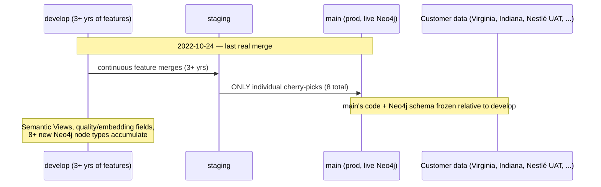

# Platform Core: develop→main reconciliation

> Full contract: `~/.claude/rules/spec-driven.md`.

## 1. Context

`brighthive-platform-core`'s `main` branch (production) and `develop` branch last shared a
real merge on **2022-10-24** (`staging --> main (v1.1.1)`, commit `5d513af0`). Since then,
`main` has received only individually cherry-picked commits
(8 total between the merge-base and current `main` HEAD) — never a real `develop`→`main`
promotion. `develop` has continued evolving for 3+ years: new Neo4j node types, new GraphQL
fields, and entire features (Semantic Views) that `main`'s live schema has no concept of.

This was discovered tonight while trying to run real E2E tests against prod and while
porting a handful of scoped fixes (PII masking, two analyst-agent bugs, an MCP UI feature,
an Analytics dashboard) from `develop`/`staging` to `main`/`production`. Each of those five
ports succeeded as a scoped cherry-pick — but the Analytics dashboard port revealed the real
depth of the problem: it depends on `DataAsset.metadataAvailable` / `embeddingAvailable` /
`qualityReportAvailable`, none of which exist on `main`'s GraphQL schema. Investigating
further, Semantic Views (BH-624 and its dependents) don't exist on `main` at all — the
generated-types diff between `main` and `develop` for the Semantic-View-touching files alone
is **155,000+ lines** (`src/common/ogm-types.ts`, a codegen artifact).



### Use Case / Goal

`main` (production) should be able to safely receive `develop`'s accumulated features —
starting with Semantic Views and the `DataAsset` quality/embedding fields — without breaking
real customer data (Virginia Workforce Data Trust, Indiana Tech, Nestlé's `ProdTestWorkspace`,
and others enumerated in `dynamo-vault/data/prod/`). Success looks like: a documented,
reviewed, phased promotion plan that any future scoped port can follow, plus a CI gate that
prevents this drift from silently recurring (BH-1145).

### How It Works Today

- `main` and `production` are candidate prod branches for `platform-core` (both exist —
  `origin/main` and `origin/production` — their relationship needs clarifying as part of
  this spec; not assumed).
- Deploys to prod happen via GitHub release tags (`vX.Y.Z.W-pre-release` triggers
  `deploy-staging.yml`; a tag without that suffix triggers `deploy-production.yml`) — see
  `docs/deploy_mechanism.md` memory and `platform-saas-ai-context/docs/infrastructure/DEPLOYMENT_GUIDE.md`.
- Neo4j is the durable data store; GraphQL OGM (`src/graphql/ogm/typedefs.ts`) generates the
  node/relationship model. `main`'s live Neo4j instance has been running against `main`'s
  (2022-era-plus-8-cherry-picks) schema this whole time.
- Tonight's cherry-pick precedent (BH-1078 PII masking, BH-776/BH-777 analyst fixes, MCP UI,
  Analytics dashboard) proves the *pattern* works for small, self-contained, frontend-or-
  isolated-backend changes — verified via: cherry-pick attempt → conflict inspection → hand
  resolution → `tsc`/test verification → PR. It does **not** scale to schema-level features.

### Hard Limitations

- Cannot safely force-overwrite `main` with `develop`'s history (`git push --force`). `main`'s
  live Neo4j database has never been migrated through 3 years of `develop`'s schema evolution.
  Overwriting code without a corresponding data migration means new code queries for
  node properties/labels/constraints that don't exist in the real production graph —
  a fast path to runtime crashes or silent data corruption, not a working upgrade.
- GraphQL introspection is disabled on prod (`ApolloServer` config) — schema discovery must
  go through the committed `schema.graphql` file or the codebase itself, never a live
  introspection query.
- No CI gate exists today that would catch a repo whose `main` has drifted this far from
  `develop` (BH-1140–1145, filed 2026-07-21, still open).

### Gaps (verified tonight, non-exhaustive — see §3 Correctness Properties for audit scope)

| Gap | Evidence | Verified how |
|---|---|---|
| Semantic Views entirely absent from `main`'s schema | `git show origin/main:src/graphql/schema/schema.graphql \| grep -c SemanticView` → 0 | Direct schema grep, both branches |
| `DataAsset.metadataAvailable` / `embeddingAvailable` / `qualityReportAvailable` absent from `main` | Same grep method against `type DataAsset {}` block | Direct schema grep |
| At least 8 new Neo4j node types on `develop` not present (by this name) in `main`'s `typedefs.ts` | `AgentCapabilityExecutionNode`, `AnomalyEventNode`, `MetricSnapshotNode`, `NotificationPreferenceNode`, `QualityRuleExecutionNode`, `QualityRuleNode`, `QualityRuleTemplateNode`, `SemanticViewVersionNode` | `comm -23` diff of `type \w*Node` declarations in `src/graphql/ogm/typedefs.ts`, both branches |
| Reverse diff (types on `main` not matched on `develop`) is NOT reliable evidence of deletion | `TransformationNode` appeared "missing" but is still referenced elsewhere on `develop` — likely moved to a different typedefs file during a refactor | Manual spot-check; flagged as needing full audit, not taken as fact |
| 1,618 commits, 2,230 merge conflicts between `main` and `develop`/`staging` | `git log origin/main..origin/staging --oneline \| wc -l` + `git merge-tree` dry run | Direct git commands, this session |

## 2. Interface Contract (MDE)

Not applicable at the spec level yet — the actual GraphQL/Neo4j contract changes are the
*subject* of the audit this spec commissions (§Ticket Breakdown item 1), not something this
spec can specify today without that audit's output. Populate this section once the schema-diff
audit (ticket 1) completes.

## 3. Invariants (DbC)

```
WHEN a schema-diff audit runs, THE System SHALL classify every Neo4j node/relationship type
  and every GraphQL field present on develop but absent on main as one of:
  NEW (safe, additive) | RENAMED (needs compatibility mapping) | REMOVED (needs deprecation review)

WHEN a migration is proposed for a Neo4j node type, THE System SHALL NOT apply it directly
  against a production database with live customer data — it MUST first run against a
  restored copy of prod data in a non-prod environment.

WHEN a feature's backend schema support lands on main, THE System SHALL ship it dark
  (flag off) per the existing three-flag topology (webapp / core / brightbot) documented in
  platform-saas-ai-context/docs/infrastructure/DEPLOYMENT_GUIDE.md — never flip a flag in the
  same deploy that lands the schema.

WHEN this spec's work is in progress, THE System SHALL NOT force-push or rewrite main's
  git history under any circumstance.
```

## 4. Acceptance Criteria (BDD — Gherkin)

```gherkin
Feature: Platform Core develop→main reconciliation

  Scenario: Schema-diff audit produces a classified gap list
    Given develop and main have diverged since 2022-10-24
    When the schema-diff audit (ticket 1) runs
    Then every Neo4j node type, relationship type, and GraphQL field difference is classified
      as NEW, RENAMED, or REMOVED
    And the classification is committed as a reviewable artifact (not left in chat/session state)

  Scenario: A migration is tested against restored prod data before touching real prod
    Given a migration script exists for one NEW node type (e.g. SemanticViewVersionNode)
    When the migration is run
    Then it is first run against a non-prod environment seeded from a restored copy of prod data
    And only after that run succeeds cleanly is it scheduled against real production

  Scenario: A promoted feature ships dark
    Given Semantic View schema support has been migrated onto main
    When the corresponding webapp/brightbot code is also promoted
    Then the feature is flag-gated off by default for all workspaces
    And enabling it per-workspace requires an explicit setRuntimeFeatureFlags call, not a
      global flip

  Scenario: CI catches future drift automatically
    Given BH-1145 (e2e --gate wiring) has shipped
    When a develop commit that touches the GraphQL schema is not promoted to main within
      an agreed window
    Then an automated check surfaces the drift (not silence, as happened for 3+ years)
```

## 5. Out of Scope

- Force-pushing or rewriting `main`'s git history — explicitly ruled out, see §3.
- Fixing `brighthive-webapp`'s separate, smaller `develop`→`production` gap (220 commits,
  19 merge conflicts) — tracked as a parallel, lower-risk effort; not blocked on this spec.
- Building the full BH-1140–1145 CI gates — those are separate tickets already filed; this
  spec depends on BH-1145 landing but does not implement it.
- Deciding the long-term relationship between `platform-core`'s `main` and `production`
  branches (both exist today) — flagged as a question for ticket 1's audit, not resolved here.

## 6. Dependencies

| Dependency | Type | Status |
|------------|------|--------|
| BH-1145 (brighthive-e2e `--gate` wiring to a real promote trigger) | Non-blocking, but should land alongside this work | Ticketed, not started |
| BH-1140/1141 (CI test gates on `brightbot`/`platform-core`) | Non-blocking | Ticketed, not started |
| A restored/anonymized copy of prod Neo4j data in a non-prod environment | **Blocking** for any migration testing (ticket 3) | Not started — needs platform-lead sign-off given customer data sensitivity |
| Platform-lead review/ownership | **Blocking** for actually executing migrations against real prod | Not assigned |

## 7. Correctness Properties

### Property 1: No migration touches real prod data unverified

*For any* proposed Neo4j schema migration, it is applied against a restored non-prod copy of
production data and verified clean **before** being scheduled against the real production
database.

**Validates: §3 Invariant 2, §4 Scenario "A migration is tested against restored prod data before touching real prod"**

### Property 2: Every promoted feature is dark-launched

*For any* feature whose backend schema is promoted from `develop` to `main`, the
corresponding user-visible code ships with its flag defaulted off across all workspaces.

**Validates: §3 Invariant 3, §4 Scenario "A promoted feature ships dark"**

## 8. Eval Criteria

Not applicable — no LLM/agent behavior in this spec's scope.

## 9. Observability Contract

**Required** — this spec produces a production-affecting migration process.

- **Span**: none new (this is an operational/migration process, not a runtime code path) —
  but each migration script run should emit a structured log line with `migration_id`,
  `target_env`, `dry_run: bool`, `node_types_affected: [...]`, `rows_affected`.
- **Log events**: `schema_migration.started`, `schema_migration.dry_run_complete`,
  `schema_migration.applied_to_prod`, `schema_migration.failed`
- **Metrics**: none new required; reuse existing deploy-pipeline dashboards.

## 10. Test Coverage Update

| Repo | Suite | What to add |
|---|---|---|
| `brighthive-platform-core` | `brighthive-platform-core/tests/` | One test per newly-migrated Neo4j node type asserting the constraint/index exists post-migration; one test per new GraphQL field asserting it resolves against a seeded (non-prod) instance |
| `brighthive-e2e` | `brighthive-e2e/e2e/` | Extend `e2e/fixtures/ground_truth.py`'s production entry (per `specs/_template/fixtures.md`'s platform-lead-PR process) only once the corresponding schema fields exist on `main` — do not add fixture fields for schema that isn't promoted yet |

**Real-behavior requirement**: the restored-prod-data migration test (ticket 3) IS the
real-behavior test for this spec — it's the closest thing to production without touching
live customer data, and is mandatory before any migration touches real prod.

Before opening the implementation PR for any individual migration: run the full
`brighthive-platform-core` test suite against the migrated schema, confirm no regression,
and confirm the migration is reversible (documented rollback script) before scheduling
against real prod.

## Areas Involved

| Area | Repo | Impact |
|------|------|--------|
| Platform Core | `brighthive-platform-core` | Schema-diff audit, migration scripts, phased promotion of Semantic Views + DataAsset quality/embedding fields |
| Web App | `brighthive-webapp` | Consumes the new fields once promoted — already has the Analytics dashboard code cherry-picked and waiting (this session's earlier work, currently reverted/discarded pending this spec) |
| BrightBot | `brightbot` | May reference new Neo4j node types (e.g. `QualityRuleNode`, `MetricSnapshotNode`) once promoted — audit scope |
| brighthive-e2e | `brighthive-e2e` | Production `GroundTruth` fixture (per `specs/_template/fixtures.md`) becomes addable once schema exists on `main` |

## Ticket Breakdown

| Ticket | Summary | Points | Epic |
|--------|---------|--------|------|
| [BH-1146](https://brighthiveio.atlassian.net/browse/BH-1146) | Schema-diff audit: classify every Neo4j node/relationship/GraphQL field difference between `main` and `develop` as NEW/RENAMED/REMOVED, commit as a reviewable artifact | 8 | BH-170 |
| [BH-1147](https://brighthiveio.atlassian.net/browse/BH-1147) | Clarify `main` vs `production` branch relationship for `platform-core` (both exist today) — document or consolidate | 2 | BH-170 |
| [BH-1148](https://brighthiveio.atlassian.net/browse/BH-1148) | Stand up a restored/anonymized copy of prod Neo4j data in a non-prod environment for migration testing (needs platform-lead sign-off — real customer data handling) | 5 | BH-170 |
| [BH-1149](https://brighthiveio.atlassian.net/browse/BH-1149) | Write + test migration scripts for the 8 confirmed-NEW node types (`AgentCapabilityExecutionNode`, `AnomalyEventNode`, `MetricSnapshotNode`, `NotificationPreferenceNode`, `QualityRuleExecutionNode`, `QualityRuleNode`, `QualityRuleTemplateNode`, `SemanticViewVersionNode`), each against the restored-data environment first | 8 | BH-170 |
| [BH-1150](https://brighthiveio.atlassian.net/browse/BH-1150) | Promote Semantic View GraphQL schema + resolvers to `main`, flag-gated off | 13 | BH-170 |
| [BH-1151](https://brighthiveio.atlassian.net/browse/BH-1151) | Promote `DataAsset.metadataAvailable`/`embeddingAvailable`/`qualityReportAvailable` to `main`, flag-gated off | 5 | BH-170 |
| [BH-1152](https://brighthiveio.atlassian.net/browse/BH-1152) | Re-attempt the Analytics dashboard webapp port (discarded this session) once the above backend fields exist on `main` | 3 | BH-170 |
| [BH-1153](https://brighthiveio.atlassian.net/browse/BH-1153) | Add production `GroundTruth` fixture entry per `brighthive-e2e/specs/_template/fixtures.md`'s platform-lead-PR process, using the 25 real assets confirmed in `ProdTestWorkspace` (`1c814cd6-c88f-40f6-8c1c-12b75a73758e`) | 3 | BH-170 |

## Related

- **Session precedent**: BH-1078 (PII masking hotfix), BH-776/BH-777 (analyst grounding),
  MCP Settings UI port — all successful same-night cherry-picks, proving the scoped-port
  pattern works for non-schema changes.
- **CI/CD gate audit**: BH-1140–1145 (filed 2026-07-21) — the process gap that let this drift
  go undetected for 3+ years.
- **Deployment guide**: `platform-saas-ai-context/docs/infrastructure/DEPLOYMENT_GUIDE.md` —
  the flag topology and promotion runbook this spec's migrations must follow.
- **Release manifest**: `docs/RELEASE_MANIFEST.json` — tracks the Brighthive 3.0 version
  status across all 5 app repos; this spec's work is separate from and larger than that
  release.
