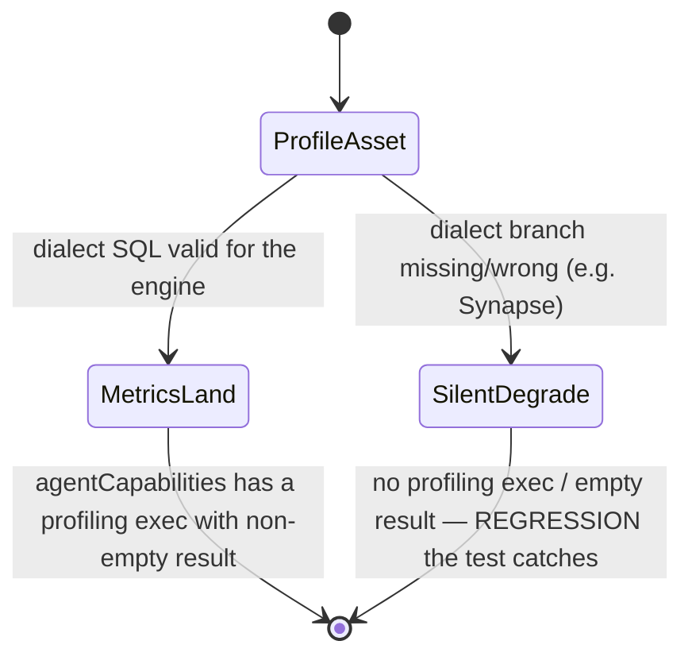

# Spec: Profiler metrics-landing e2e across all BYOW engines

**Ticket:** BH-XXXX (BUGS-V3 / e2e-coverage) · **Status:** Draft · **Author:** Kuri · **Last-Reviewed:** 2026-07-31

## 1. Context

The warehouse profiler generates per-column metrics (row count, null count, distinct
count, min/max) by running **dialect-aware** SQL against a workspace's BYOW warehouse
(`brightbot/utils/data_profiler.py` — `build_data_asset_profile_v2`, `compute_warehouse_metrics`).
The SQL branches on `warehouse_type` at every seam: `COUNT_BIG(*)` vs `COUNT(*)`,
`SELECT TOP n` vs `LIMIT n`, `[bracket]` vs `"double"` quoting, `NVARCHAR(MAX)` vs
`VARCHAR` casts. A missing or wrong dialect branch degrades **silently** — the batch
errors, the caller falls back, and the asset ends up with no profile or a partial one,
with no error surfaced to the user.

The profiler code is unit-verified across all four branches, and the live warehouse-read
surface (introspect/discover) passes on all three staging engines. But **no test asserts
that profile metrics actually LAND per engine** — the strongest signal that the dialect
SQL genuinely ran end-to-end against each real warehouse. This spec closes that §10b gap.

Metrics surface publicly on `DataAsset`: `profilerAvailable: Boolean!` and
`agentCapabilities: [AgentCapabilityExecution!]!` (each carrying `capabilityType`,
`executedAt`, `result: JSON!`). A `profiling` capability execution with a non-empty
`result` is the observable proof the profiler ran against that engine.

Live baseline captured 2026-07-31 (real staging, read-only):

| Engine | Workspace | Assets with landed `profiling` execution |
|---|---|---|
| Snowflake | OneTen | 4 (e.g. `RAW_MARKET_PRICES`, 36 execs) |
| SQL Server (azure_synapse) | Scoop Capital | 11 (all — e.g. `holdings_raw`) |
| Redshift | Brighthive Demo | 129 (e.g. `data_rot_customer_master`) |



## 2. Interface Contract (MDE)

No product code change. This spec adds an e2e regression test that consumes the existing
public GraphQL surface (`brighthive-platform-core`):

```graphql
query($i: WorkspaceInput!) {
  workspace(input: $i) {
    dataAssets { dataAssets {
      name
      profilerAvailable
      agentCapabilities { capabilityType executedAt result }
    } }
  }
}
```

The test runs once per `--workspace-config` (`oneten` / `loopcapital` / `bh-demo`), so
cross-engine coverage happens at the runner level (`scripts/run_health_check.py` loops
configs), never inside the test.

## 3. Invariants (DbC)

- **I-1** For each live BYOW engine, at least one `DataAsset` SHALL expose
  `profilerAvailable == true` — the profiler ran on that engine.
- **I-2** Every asset with `profilerAvailable == true` SHALL have ≥1 `agentCapabilities`
  entry with `capabilityType == "profiling"` and a non-empty `result` — metrics landed,
  not just a flag flipped.
- **I-3** The assertion SHALL hold identically on Snowflake, SQL Server (azure_synapse),
  and Redshift — no engine silently returns zero profiled assets while others succeed.

## 4. Acceptance Criteria (BDD)

```gherkin
Feature: Profiler metrics land on every BYOW engine

  Scenario: Each engine has at least one profiled asset with metrics
    Given a staging workspace on Snowflake, SQL Server, or Redshift
    When the workspace dataAssets are queried for agentCapabilities
    Then at least one asset reports profilerAvailable == true
    And that asset has a "profiling" capability execution with a non-empty result

  Scenario: profilerAvailable implies landed metrics (no flag-without-data)
    Given an asset whose profilerAvailable is true
    When its agentCapabilities are inspected
    Then a profiling execution with a non-empty result JSON is present

  Scenario: Synapse is not silently empty
    Given the SQL Server (azure_synapse) workspace
    When the workspace dataAssets are queried
    Then the count of assets with a landed profiling execution is > 0
```

## 5. Out of Scope

- Triggering a fresh profile run (the test asserts on already-landed executions;
  staging assets are profiled on a schedule). If a workspace has zero profiled assets,
  the test records a finding rather than triggering — triggering is a separate slice.
- Asserting exact metric values (row counts drift with live data) — the invariant is
  presence + non-empty, not specific numbers.
- Profiler write-path dialect (there is none — the profile persists to S3 + graph,
  both engine-neutral).

## 6. Dependencies

- Public `DataAsset.profilerAvailable` + `agentCapabilities` fields — exist
  (`brighthive-platform-core/src/graphql/schema/typedefs.ts:840,845`).
- `GroundTruth` per-engine configs + login secrets — exist
  (`brighthive-e2e/e2e/fixtures/ground_truth.py`).

## 7. Correctness Properties

### Property 1: profilerAvailable is backed by real landed metrics

*For any* asset reporting `profilerAvailable == true` on any engine, a `profiling`
capability execution with a non-empty `result` exists — the flag cannot be true without
the dialect SQL having produced metrics.

**Validates: §3 I-2, §4 Scenario "profilerAvailable implies landed metrics"**

### Property 2: No engine silently degrades to zero

*For any* of the three live engines, the count of assets with a landed profiling
execution is > 0 — a dialect regression on one engine surfaces as a red test, not a
silent empty.

**Validates: §3 I-1, I-3, §4 Scenario "Synapse is not silently empty"**

## 9. Observability Contract

The test emits a `record_finding` (severity HIGH) when an engine has zero profiled
assets or a `profilerAvailable` asset lacks a non-empty profiling `result`, with a
per-config reproducer command. Findings land in `brighthive-e2e/findings/`.

## 10. Test Coverage Update

- **e2e (§10b):** new test in `brighthive-e2e/e2e/features/data/test_assets_governance.py`
  — `test_profiler_metrics_land_on_this_engine` — queries the workspace dataAssets for
  `profilerAvailable` + `agentCapabilities`, asserts §3 I-1/I-2 per config. Runs across
  all three engines via the runner's `--workspace-config` loop (I-3).
- No unit/L0 change — this is a live cross-engine behavior guard, exactly the class of
  coverage that unit dialect tests cannot provide.
