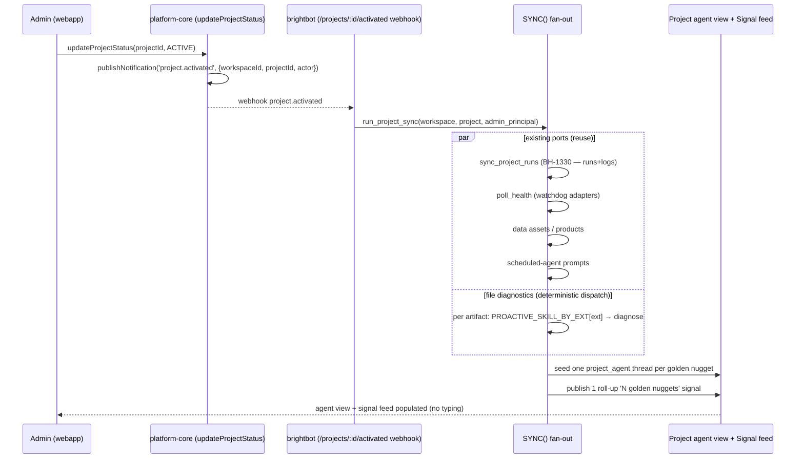

# Project ACTIVE → SYNC(): the activation fan-out that surfaces golden nuggets

> When an operator flips a project to **ACTIVE**, nothing happens. The engine's runs, the
> pipeline health, the data assets/products, the scheduled-agent prompts, and any diagnostic
> files uploaded to the Files tab all sit inert until someone manually opens a chat and asks.
> This spec adds ONE capability: **ACTIVE is the trigger for a project-level `SYNC()`** — an
> admin-scoped fan-out that (1) pulls the project's real state through *existing* ports and
> (2) proactively seeds agent sessions + one roll-up signal so the project agent view lights up
> with **golden nuggets** (diagnostics, specs, improvements, descriptions) the moment it
> activates — no user typing. Every claim in §1 is anchored to traced `file:line`.

## 1. Context

`ACTIVE` is a real, existing project state (`ProjectStatus = PRIVATE, DRAFT, ACTIVE, COMPLETE,
PUBLISHED, ARCHIVED` — `brighthive-platform-core/src/graphql/schema/schema.graphql:121`). The
transition happens but is **event-silent** and drives no downstream work. Traced live,
read-only, across four repos:

- **platform-core** — the status mutation emits **no** notification / signal / webhook. Resource
  create/onboard/link paths emit only `console.log` audit lines (`resource.content_fetched`,
  `resource.content_upload_url_issued` — `src/graphql/models/resource.ts:701,770`); the full
  notifications subsystem (`src/notifications/*`, `src/graphql/models/notifications.ts`) is wired
  to no lifecycle hook. Files are project resources linked by the Neo4j `HAS_RESOURCE` edge
  (`src/graphql/service/neo4j/resource.ts:419`); bytes live in the per-workspace `resource` S3
  bucket keyed `resources/{id}.{ext}` (`resource.ts:558`). Resources have **no** status field —
  only `internal: Boolean`.
- **brightbot** — the run-sync half already exists and is proven: `sync_project_runs`
  (`brightbot/pipelines/project_sync.py`, BH-1330) composes `list_runs`/`get_run_detail`/
  `get_run_logs` on the `PipelineRunner` port. The pipeline watchdog
  (`agents/governance_agent/sub_agents/pipeline_watchdog_task.py:154`) polls
  `PIPELINE_SOURCE_ADAPTERS` (`tools/pipeline_health.py:106`) and publishes health signals. Both
  are reachable **only** via cron/dispatcher or chat — nothing fires them on project activation.
- **brightbot** — file diagnostics exist as *interactive* analyst tools: `analyze_dtsx_package`
  / `analyze_rdl_report` (`agents/analyst_agent/tools/pipeline_diagnostics_tools.py:161,106`),
  reached through skills `ssis-diagnostics` / `ssrs-diagnostics` / `xsd-table-schema`
  (`brightbot/skills/system/*/SKILL.md`). Routing is **prompt-text only** — the skill
  `description` frontmatter is the sole trigger and the model chooses; there is **no** code-level
  `{extension → skill}` map. `.xsl`/`.xslt` is handled **nowhere**. The proactive run endpoint
  `POST /manage/agents/run` (`routes/agent_run_routes.py:63`) allowlists only
  `{quality_check_agent, data_profiler_agent}` — no analyst/diagnostic graph, no activation hook.
- **webapp** — the Files tab (`src/Projects/ProjectFilesPage/*`) uploads via `onboardResource`
  → presigned S3 PUT; `ALLOWED_FILE_TYPES` = pdf/doc/docx/png/jpg/mp4/mp3/**.xsd/.xml** — no
  `.dtsx`/`.rdl`/`.xsl`. Add/Edit/Remove are **admin-only** already. The project agent view
  (`src/Projects/ProjectAgentPage/*`) lists threads via `chatApi.post("/threads/search", {graph_id:"project_agent", project_id})`. A proactive-session mechanism EXISTS but is unused for
  this route: navigating with router state `{ brightbotText }` auto-fires `manualSubmit` →
  `createSession` (`src/BrightAgent/hooks/useAgentLifecycle.ts:123`). No caller seeds the
  project agent route today.

**Verdict: the activation fan-out is entirely absent (not broken).** Every organ exists — the
ACTIVE state, the run-sync (BH-1330), the watchdog, the diagnostic parsers, the signal
publisher, the seed-a-session mechanism — nothing wires them to fire on `project.activated`,
and no deterministic extension→skill dispatch exists for the non-interactive path.

### Use Case / Goal

A Loop Capital **admin** uploads `Orders.dtsx`, `Sales.rdl`, and `student.xsd` to a project's
Files tab, then flips the project to **ACTIVE**. Immediately, without typing: platform-core
emits `project.activated` → brightbot runs `SYNC()` → the Observability tab fills with the
engine's real runs + health, the Data Products view populates, and the **project agent view
lights up with seeded sessions** — one per artifact ("SSIS: Orders.dtsx — missing staging step,
2 fixes"; "SSRS: Sales.rdl — SELECT * in 3 datasets"; "XSD: student.xsd — 4 tables mapped") —
plus one roll-up signal ("OrdersDB activated — 3 golden nuggets"). Engine-agnostic: the same
flow works for a Snowflake or Redshift project because SYNC() depends only on ports.



## 2. Interface Contract (MDE)

**Ports first (the design), then the surfaces — per docs/CLAUDE.md.** SYNC() is a *composition*
of existing ports plus two genuinely new seams: (a) the `project.activated` event, (b) a
deterministic extension→diagnostic dispatch. No warehouse/engine vendor type appears on the
sync path.

### 2.1 The activation event (platform-core → brightbot)

```graphql
# src/graphql/schema/schema.graphql — existing mutation, new side effect only
updateProjectStatus(input: UpdateProjectStatusInput!): UpdateOutput!
# On DRAFT/PRIVATE → ACTIVE, the resolver publishes:
#   Notification{ kind: "project.activated", workspaceId, projectId, actorUserId, occurredAt }
# delivered to brightbot via the existing notifications transport (webhook sink).
```

### 2.2 Deterministic extension → diagnostic dispatch (brightbot, NEW)

```python
# brightbot/agents/analyst_agent/artifact_diagnostics.py  (NEW)
# The proactive path has NO human to pick a skill, so routing must be deterministic —
# a registry, mirroring PROACTIVE parser dispatch (pipeline-artifact-parser-registry.md),
# NOT the prompt-text skill matching the interactive path uses.
class ArtifactDiagnostic(Protocol):
    def diagnose(self, *, file_bytes: bytes, ctx: RequestContext) -> GoldenNugget: ...

PROACTIVE_DIAGNOSTIC_BY_EXT: Final[dict[str, ArtifactDiagnostic]] = {
    DTSX_EXT: SsisPackageDiagnostic(),     # reuses parse_dtsx / analyze_dtsx_package
    RDL_EXT:  SsrsReportDiagnostic(),      # reuses parse_rdl / analyze_rdl_report
    XSD_EXT:  XsdSchemaDiagnostic(),       # reuses xsd-table-schema skill logic
    XSL_EXT:  XsltTransformDiagnostic(),   # NET-NEW parser + xslt-transform-diagnostics skill
}
```

```python
# brightbot/pipelines/golden_nugget.py  (NEW)
@dataclass(frozen=True)
class GoldenNugget:
    source: str                 # "run:<id>" | "health" | "asset" | "schedule" | "file:<name>"
    kind: str                   # diagnostic | spec | improvement | description
    title: str                  # one-line, agent-view label
    detail: str                 # seeds the agent session prompt
    severity: str | None        # info | warn | critical
    seed_prompt: str            # exact brightbotText that starts the proactive session
```

### 2.3 The SYNC() fan-out (brightbot, NEW — composition, engine-agnostic)

```python
# brightbot/pipelines/project_activation_sync.py  (NEW)
@dataclass(frozen=True)
class ProjectSyncReport:
    runs_synced: int                    # from sync_project_runs (BH-1330) — reused, not reimplemented
    health_signals: int                 # from watchdog poll_health adapters — reused
    data_products_registered: int
    schedule_prompts_seen: int
    nuggets: tuple[GoldenNugget, ...]   # what seeds sessions + the roll-up signal
    reason_if_empty: str | None         # NEVER silently empty (INV-4)

async def run_project_sync(
    *, workspace_id: str, project_id: str, principal: Principal, ctx: RequestContext
) -> ProjectSyncReport:
    """Fan-out fired on project.activated. Admin-gated. Composes existing ports; the ONLY
    new work is file diagnostics + nugget assembly + session/signal seeding. Idempotent."""
    ...
```

### 2.4 Nugget surfacing — both seeded threads AND one roll-up signal

- **Seeded threads** — per nugget, brightbot creates a `project_agent` thread carrying
  `seed_prompt` so the webapp agent view (`ProjectSessionNav`) lists it as an openable session.
  Reuses the `brightbotText → manualSubmit → createSession` seam
  (`useAgentLifecycle.ts:123`) via a server-side thread create + metadata `{graph_id:"project_agent", project_id, seeded_by:"activation_sync"}`.
- **Roll-up signal** — one `BrightSignal` ("<project> activated — N golden nuggets") published
  through the existing signal publisher (as the watchdog does), surfaced on the project page
  signal feed; opening it deep-links to the seeded sessions.

## 3. Invariants (DbC)

Budget: 7.

- **INV-1** — SYNC() depends ONLY on existing ports (`PipelineRunner`, watchdog
  `PIPELINE_SOURCE_ADAPTERS`, notifications) + domain types. No warehouse/engine vendor symbol
  on the sync path. (Grep test PS-3/PS-4.)
- **INV-2 (admin gate)** — `WHERE the activating actor is not a workspace admin, THE System SHALL
  NOT run SYNC()` — matches the admin-only Files-tab controls; the seed/signal writes require an
  admin principal.
- **INV-3 (idempotent)** — `IF a project is re-activated (ACTIVE→X→ACTIVE), THEN SYNC() upserts —
  no duplicate seeded session, no duplicate signal, no duplicate data product` (dedup key =
  `(project_id, nugget.source, nugget.kind)`).
- **INV-4 (no silent empty)** — `IF SYNC() produces 0 nuggets, THEN reason_if_empty states why`
  (no files + no runs + healthy). A silent no-op activation is a contract violation.
- **INV-5 (deterministic dispatch)** — `WHERE a file's extension is in
  PROACTIVE_DIAGNOSTIC_BY_EXT, THE System SHALL route it to that diagnostic` — never the model's
  prompt-text guess on the proactive path. Unknown extension → skipped with a logged reason,
  never mis-routed.
- **INV-6 (multi-tenant)** — `WHERE a run/asset/file belongs to another workspace, THE System
  SHALL NOT surface it as a nugget for this project.`
- **INV-7 (reuse, don't reimplement)** — SYNC() calls `sync_project_runs` (BH-1330) and the
  watchdog `poll_health` adapters; it MUST NOT contain a second run-enumeration or health-poll
  implementation.

## 4. Acceptance Criteria (BDD)

```gherkin
Feature: Project ACTIVE triggers SYNC() and surfaces golden nuggets (admin-scoped, engine-agnostic)

  Scenario: activation with diagnostic files seeds sessions + a signal
    Given an admin has uploaded Orders.dtsx, Sales.rdl, and student.xsd to a project
    When the admin flips the project to ACTIVE
    Then platform-core publishes project.activated
    And the project agent view shows one seeded session per file with its diagnostic nugget
    And one roll-up "activated — 3 golden nuggets" signal is published

  Scenario: run/health state syncs on activation without a manual Sync click
    Given a project linked to a dbt Cloud engine with run history
    When the project goes ACTIVE
    Then the Observability tab shows the engine's runs (via sync_project_runs, BH-1330)
    And pipeline health signals are pulled via the watchdog adapters
    And no separate manual Sync action was needed

  Scenario: engine-agnostic — a Redshift/Snowflake project activates the same way
    Given the project's engine is snowflake-native or redshift-target
    When it goes ACTIVE
    Then SYNC() runs through the same ports and no vendor-specific code executes on the sync path

  Scenario: deterministic dispatch routes each file type, including .xsl
    Given files with extensions .dtsx, .rdl, .xsd, and .xsl
    When SYNC() diagnoses them
    Then each is routed by PROACTIVE_DIAGNOSTIC_BY_EXT to its diagnostic
    And the .xsl file is diagnosed by the new xslt-transform diagnostic

  Scenario: non-admin activation does not run SYNC()
    Given a non-admin triggers the ACTIVE transition
    When project.activated would fire
    Then SYNC() does not seed sessions or publish signals

  Scenario: re-activation is idempotent
    Given a project already activated and synced once
    When it is re-activated
    Then no duplicate seeded sessions, signals, or data products are created

  Scenario: nothing to surface — say why
    Given an ACTIVE project with no files, no runs, and healthy pipelines
    When SYNC() runs
    Then it produces 0 nuggets and reason_if_empty states nothing needed attention
```

## 5. Out of Scope

- **The run-sync mechanics themselves** — owned by BH-1330 (`project-engine-run-sync.md`); this
  spec *fires* it on activation, it does not re-implement it.
- **New engine adapters** — SYNC() rides the existing `PIPELINE_SOURCE_ADAPTERS` +
  `PipelineRunner` registries; a new engine is a registry entry (its own ticket), never a
  sync-path change.
- **Interactive file analysis** — the existing analyst skills (`ssis-diagnostics`, etc.) stay for
  chat-initiated analysis; this spec adds only the *proactive, deterministic* path.
- **before+after remediation-PR logs** — BH-1329, separate spec.
- **Auto-remediation / auto-PR from nuggets** — nuggets seed a *session* the admin can act on;
  the SSIS remediation loop (`ssis_remediation_agent.py`) is invoked by the operator from that
  session, not fired unattended by activation.
- **Deleting/resetting on DRAFT** — deactivation cleanup is a follow-up, not this spec.

## 6. Dependencies

- **`ProjectStatus.ACTIVE` + `updateProjectStatus`** (platform-core `schema.graphql:121`) — the
  trigger; this spec adds the `publishNotification('project.activated')` side effect.
- **Notifications transport** (platform-core `src/notifications/*`) — reused to deliver the event
  to brightbot; no new bus.
- **`sync_project_runs` + `PipelineRunner` port** (BH-1330 / `pipeline-run-lifecycle.md`) — reused
  verbatim (INV-7).
- **Watchdog `PIPELINE_SOURCE_ADAPTERS` + `poll_health`** (`tools/pipeline_health.py:106`) —
  reused for the health slice.
- **`analyze_dtsx_package` / `analyze_rdl_report` + `parse_dtsx`/`parse_rdl`**
  (`pipeline_diagnostics_tools.py`) — reused inside the SSIS/SSRS diagnostics.
- **`xsd-table-schema` skill logic** — reused inside the XSD diagnostic.
- **`brightbotText → createSession` seam** (webapp `useAgentLifecycle.ts:123`) — reused (server
  seeds the thread; webapp already knows how to open a seeded `project_agent` session).
- **Signal publisher** (`agents/.../signal_publisher.py`) — reused for the roll-up signal.
- **NET-NEW**: `.xsl`/`.xslt` parser + `xslt-transform-diagnostics/SKILL.md`; webapp
  `ALLOWED_FILE_TYPES` extended with `.dtsx`/`.rdl`/`.xsl`.

### Engine / file matrix SYNC() must cover

| File type | Diagnostic (proactive) | Interactive skill reused | Net-new? |
|---|---|---|---|
| `.dtsx` (SSIS) | `SsisPackageDiagnostic` → `parse_dtsx` | `ssis-diagnostics` | no |
| `.rdl` (SSRS) | `SsrsReportDiagnostic` → `parse_rdl` | `ssrs-diagnostics` | no |
| `.xsd` (schema) | `XsdSchemaDiagnostic` | `xsd-table-schema` | no |
| `.xsl` / `.xslt` | `XsltTransformDiagnostic` | `xslt-transform-diagnostics` | **yes** |

Engine (run/health) slice inherits BH-1330's matrix (dbt Cloud, Snowflake-native, Databricks,
SSIS/SSRS, Redshift-target) unchanged — no new adapter here.

## 7. Correctness Properties

Security boundary (admin gate + multi-tenant) + a no-silent-failure guarantee, so this applies.

### Property 1: admin-only fan-out
*For any* `project.activated` event, SYNC() runs iff the actor is a workspace admin.
**Validates: §3 INV-2, §4 Scenario "non-admin activation does not run SYNC()"**

### Property 2: tenant isolation
*For any* nugget surfaced, its workspace equals the activating project's workspace.
**Validates: §3 INV-6, §4 (all — scoped to the project's workspace)**

### Property 3: idempotence
*For any* project activated twice, the store holds exactly one seeded session, one signal, and
one data-product set per `(project_id, source, kind)`.
**Validates: §3 INV-3, §4 Scenario "re-activation is idempotent"**

### Property 4: no silent empty
*For any* SYNC() producing 0 nuggets, `reason_if_empty` is non-null.
**Validates: §3 INV-4, §4 Scenario "nothing to surface — say why"**

## 8. Eval Criteria

| Evaluator | Node | Mode | Threshold | Method |
|---|---|---|---|---|
| ActivationDispatchEvaluator | run_project_sync | GATE | every known-ext file routed to its diagnostic == 1.0 | deterministic |
| NuggetQualityEvaluator | diagnose | OBSERVE | nugget title+detail actionable & file-specific >= 0.8 | LLM judge |
| ActivationEmptyReasonEvaluator | run_project_sync | GATE | reason_if_empty set whenever nuggets==0 == 1.0 | deterministic |

## 9. Observability Contract

- **Span**: `gen_ai.tool.execute` with `gen_ai.tool.name=project_activation_sync` (reuses the
  BH-1324 `pipeline_verb_telemetry` seam).
- **Attributes**: `workspace.id`, `project.id`, `actor.is_admin`, `activation.files_seen`,
  `activation.nuggets`, `activation.runs_synced`, `activation.health_signals`,
  `activation.sessions_seeded`, `correlation_id`.
- **Log events**: `activation.received`, `activation.admin_denied`, `activation.file_diagnosed`
  (per file, with ext + diagnostic), `activation.file_ext_unsupported`, `activation.run_sync_done`,
  `activation.session_seeded`, `activation.signal_published`, `activation.empty` (with reason).
- **Metrics**: reuse `brightagent.pipeline.verb.executions` / `.duration_ms` with `verb=activation_sync`.

## 10. Test Coverage Update

### a. In-repo layered evals

**brightbot (`tests/` + `brightbot/evals/`):**
- **L0** — `PROACTIVE_DIAGNOSTIC_BY_EXT` maps `.dtsx/.rdl/.xsd/.xsl`; `GoldenNugget` +
  `ProjectSyncReport` shapes (reason_if_empty present when empty); `.xsl` parser present.
- **L1** — SYNC() composes sync_project_runs → poll_health → per-file diagnose → seed sessions →
  publish signal, in order; unknown extension skipped with logged reason (INV-5).
- **L2 (real behavior, no patch())** — one case per §4 scenario: real `parse_dtsx`/`parse_rdl`/
  xsd/xsl parsers on captured sample files (per `test-behavior-real.md`), a `FakePipelineRunner`
  seeded with run history for the run slice, admin vs non-admin principal (INV-2), re-activation
  idempotence (INV-3). Assert on `ProjectSyncReport` + §9 spans/events.

**platform-core (`tests/`):**
- **L0** — `updateProjectStatus` → ACTIVE publishes a `project.activated` notification of the §2.1
  shape.
- **L2** — the notification fires only on transition *into* ACTIVE (not ACTIVE→ACTIVE), carries
  the right workspace/project/actor, and is scoped to the workspace (INV-6). Against a real Neo4j
  test instance where the suite provides one.

**webapp (`tests/e2e` Playwright / `cypress/`):**
- `.dtsx`/`.rdl`/`.xsl` accepted by the upload modal; a seeded `project_agent` session opens from
  `brightbotText` on the project agent route.

### b. Cross-repo e2e (`brighthive-e2e/`)

- **Feature test (happy path, live on staging as admin):** admin uploads a `.dtsx` + `.rdl` +
  `.xsd`, flips project to ACTIVE, asserts (1) the agent view lists seeded sessions, (2) a roll-up
  signal is published, (3) Observability shows synced runs.
- **Admin-gate error path:** non-admin activation → no seeded sessions, no signal.
- **Idempotence:** re-activate → no duplicates.

### Self-verification

All suites green with new cases before the implementation PR opens; each §2/§3/§4/§8 entry has a
matching new test. Live staging run performed **as admin** (per the activation gate).

## Ticket Breakdown

| Ticket | Repo | Gate |
|---|---|---|
| `updateProjectStatus` publishes `project.activated` on transition into ACTIVE | platform-core | L0 + L2 (transition-only) |
| brightbot webhook consumer for `project.activated` (admin-gated) | brightbot | L1 + INV-2 |
| `PROACTIVE_DIAGNOSTIC_BY_EXT` registry + `GoldenNugget` type | brightbot | L0 |
| `.xsl`/`.xslt` parser + `xslt-transform-diagnostics` skill (net-new) | brightbot | parser test + skill |
| `run_project_sync` fan-out — compose run-sync + watchdog + diagnostics + assemble report | brightbot | L2 real-behavior |
| Seed `project_agent` sessions + publish roll-up signal (idempotent) | brightbot | L2 (INV-3) |
| Extend webapp `ALLOWED_FILE_TYPES` with `.dtsx`/`.rdl`/`.xsl`; open seeded sessions | brighthive-webapp | component + e2e |
| e2e: admin activate → seeded sessions + signal + synced runs | brighthive-e2e | full Gherkin, live staging |

## Related

- `project-engine-run-sync.md` — BH-1330; the run/log-sync half SYNC() reuses (INV-7).
- `ssis-ssrs-proactive-pipeline-source.md` — the scheduled SSIS health source; complements the
  activation-fired file diagnostics here.
- `project-files-pipeline-artifact-intake.md` — the poll/pull Files intake; this spec is the
  activation-triggered counterpart it explicitly left out of scope.
- `pipeline-artifact-parser-registry.md` — the extension→parser dispatch pattern that
  `PROACTIVE_DIAGNOSTIC_BY_EXT` mirrors.
- `remediation-pr-engine-run-logs.md` — BH-1329; a nugget-seeded session can invoke it.
