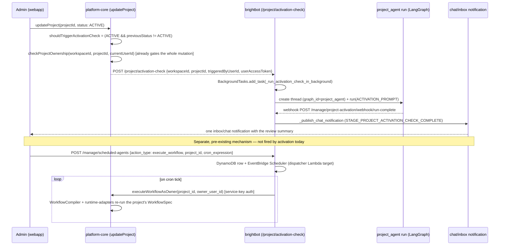

# Project ACTIVE → the real activation-check + recurring-schedule primitives

> **2026-09-23 correction (RED-teamed against live code — see `PROJECT_V2_TRACKER.md`):** every
> version of this spec through 2026-08-01 described a `SYNC()` mechanism —
> `publishNotification('project.activated')`, `run_project_sync()`, `PROACTIVE_DIAGNOSTIC_BY_EXT`,
> multiple seeded sessions, one roll-up `BrightSignal` — that was **never built. Zero code exists
> for any of it.** What IS built and shipped, verified live this pass, is narrower and shaped
> differently: a single-prompt LLM review fired once per activation
> (`routes/project_activation_check_routes.py`, `_run_activation_check_in_background`) and a
> fully generic recurring-schedule mechanism (`routes/scheduled_agents_routes.py` +
> `routes/scheduled_action_catalog.py`, action type `execute_workflow`, BH-877–881) that any
> project can already use to re-run its compiled pipeline on a cadence. §1 and §2 below describe
> the real mechanisms, `file:line`, as they exist today — not the `SYNC()` design. §3/§4/§7 keep
> the invariants/scenarios/properties that are still the right target state, renamed onto the
> real primitives instead of the fictional API.

> When an operator flips a project to **ACTIVE**, brightbot already runs a one-shot LLM review of
> that project (data assets, uploaded files, knowledge base) and DMs the activator a summary via
> the existing chat-notification pipeline. What's genuinely missing is everything the old spec
> assumed already existed on top of that: a **deterministic** per-file-type diagnostic (today the
> model decides what to check, not a registry), composition with the project's pipeline-run/health
> state, more than one seeded thread, a roll-up signal beyond a single chat notification, and any
> recurring re-check once the one-shot review has fired. This rewrite narrows scope to what's real
> and names what remains as actual, buildable tickets — not a reconstruction of the old `SYNC()`
> fan-out.

## 1. Context

`ACTIVE` is a real, existing project state (`ProjectStatus = PRIVATE, DRAFT, ACTIVE, COMPLETE,
PUBLISHED, ARCHIVED` — `brighthive-platform-core/src/graphql/schema/schema.graphql:121`). Unlike
the earlier draft of this spec claimed, the transition is **not** event-silent — it already
triggers a real, shipped review. Traced live, read-only, across platform-core and brightbot:

### 1.1 What fires today, and how (real, traced live)

- **The trigger is a direct HTTP call, not a pub/sub event.** `updateProject`
  (`brighthive-platform-core/src/graphql/models/project.ts:1888-1910`) is gated for *every*
  caller by `AuthModel.checkProjectOwnership(workspaceId, projectId, currentUserId)` — there is
  no separate "is this an admin" check bolted on for activation specifically; whoever is already
  authorized to update the project is who can ever trigger the review. This is the admin/ownership
  gate INV-2 wants, and it already exists — nothing new needs building for it.
- **Idempotence is a transition guard, not a dedup key.** Lines 1960-1970 compute
  `shouldTriggerActivationCheck = args.input.projectStatus === "ACTIVE" && previousStatus !==
  "ACTIVE"`. That single boolean is the entire re-activation guarantee (INV-3): the check fires
  exactly once, only on the transition INTO ACTIVE, and structurally cannot re-fire on
  ACTIVE→ACTIVE. No `(project_id, source, kind)` dedup key is needed on the brightbot side for
  this concern — it's already handled upstream, for free.
- After the Neo4j write succeeds (lines 2082-2099), the resolver fire-and-forgets
  `requestProjectActivationCheck()`
  (`src/graphql/service/project/project-activation-check-client.ts:17-68`), which `POST`s
  `{workspaceId, projectId, triggeredByUserId, userAccessToken, projectName?}` **directly** to
  brightbot's `POST /project/activation-check` — no GraphQL subscription, no notification-bus
  hop, no webhook fan-out on the platform-core side.
- Brightbot (`routes/project_activation_check_routes.py:133-180`) authenticates the request
  (`authenticate_request`) and schedules `_run_activation_check_in_background` on FastAPI's
  `BackgroundTasks` — not a queue. That's the real, still-open gap BH-1508 already tracks; nothing
  here changes it.
- `_run_activation_check_in_background` (lines 70-130) does exactly four things: builds a webhook
  callback URL, creates **one** LangGraph thread (`metadata={workspace_id,
  graph_id:"project_agent", project_id, user_id, ...}`), creates **one** run on the `project_agent`
  assistant with a **single fixed human message** (`ACTIVATION_PROMPT`, lines 40-59), and logs.
  `ACTIVATION_PROMPT` is a prompt, not a registry — it instructs the model to call
  `discover_data_assets`, inspect Project Files S3 uploads (calling `read_project_schema_file`
  for `.xsd`/`.xml` specifically — `.dtsx`/`.rdl`/`.xsl` are not named anywhere in it), call
  `query_knowledge_base`, infer intent from project config, then call
  `submit_activation_findings` once with critical/warning/suggestion counts before summarizing.
  Every "which file needs which diagnostic" decision happens inside the model's own tool-calling,
  in one conversation — there is no `PROACTIVE_DIAGNOSTIC_BY_EXT`-shaped deterministic registry
  anywhere in this path today.
- **Completion is delivered by a webhook, not a signal.**
  `POST /manage/project-activation/webhook/run-complete` (lines 183-251) HMAC-validates a shared
  secret, dedups delivery via `_claim_delivery(run_id, "project_activation")` (this protects
  against webhook *retries* — a different concern from re-activation idempotence, which is
  already fully handled upstream per above), and publishes exactly **one** per-user chat/inbox
  notification via the pre-existing `_publish_chat_notification`
  (`routes/chat_session_notify_routes.py`, reused verbatim) tagged
  `STAGE_PROJECT_ACTIVATION_CHECK_COMPLETE`.

### 1.2 What's absent, named precisely (not "SYNC() doesn't exist" — these four gaps)

1. **No deterministic extension→diagnostic dispatch.** `.dtsx`/`.rdl`/`.xsl` are routed to
   nothing; only `.xsd`/`.xml` are named in the prompt, and even those go through the model's
   judgment, not a registry.
2. **No composition with the run/health slice.** `sync_project_runs` (BH-1330) and the watchdog's
   `poll_health` adapters are never called from this path — a project's Observability tab does not
   populate on activation.
3. **Exactly one seeded thread, never one per artifact/nugget.**
4. **No roll-up "N golden nuggets" signal.** Completion is one chat notification, full stop.

### 1.3 The real recurring-schedule mechanism (`execute_workflow`, BH-877–881)

- Brightbot has exactly **one** generic recurring-schedule mechanism, not several:
  `POST /manage/scheduled-agents` (`routes/scheduled_agents_routes.py`), backed by a DynamoDB
  schedule row plus a real AWS EventBridge Scheduler `Schedule` targeting a dispatcher Lambda
  (`_put_scheduler_schedule`, ~lines 400-460). Every recurring brightbot capability —
  `quality_check_task`, `profiler_task`, `detect_recurring_patterns`, `pipeline_watchdog_task`,
  `fleet_health_digest_task`, and `execute_workflow` — is one `action_type` row in the **same**
  catalog (`routes/scheduled_action_catalog.py:24-53`), not a separate scheduler each.
- `execute_workflow` (`ACTION_TYPE_EXECUTE_WORKFLOW`) requires `{workspace_id, project_id,
  owner_user_id}` in its `action_payload`; `owner_user_id` is force-set server-side from the
  authenticated caller at creation time (`create_schedule`,
  `routes/scheduled_agents_routes.py:671-675`) — never client-supplied — and re-validated live on
  every firing, mirroring `resolveActingUser()`'s pattern for `executeWorkflowAsOwner` in
  platform-core. On each cron tick, the dispatcher Lambda calls platform-core's internal
  `executeWorkflowAsOwner` mutation (service-key auth,
  `brighthive-platform-core/src/graphql/models/workflow-spec-execution.ts`), which re-runs that
  project's already-compiled `WorkflowSpec` (`WorkflowCompiler` + pluggable `runtime-adapters`)
  end to end and notifies the schedule's configured sink on completion
  (`notifyScheduleOfRunCompletion`).
- **The nuance that matters for BH-1504:** `execute_workflow` recurs a project's compiled *data
  pipeline* (dbt/warehouse steps via `WorkflowSpec`) — it does **not** recur the activation-check's
  one-shot LLM review from §1.1. These are two different capabilities that both happen to be
  project-scoped. "Call `execute_workflow` for a recurring re-check" gets the RUN/PIPELINE-freshness
  half of the old `SYNC()` vision for free — a project can already be scheduled to re-run its
  pipeline on a cadence today, with zero new code. It does **not** give a recurring re-run of the
  file/knowledge-base review. If that's still wanted, the buildable shape is a **new**
  `action_type` (e.g. `project_activation_recheck_task`) added to the same catalog — exactly the
  shape `fleet_health_digest_task` (BH-1340) was added in — reusing every piece of scheduler
  infrastructure (DynamoDB rows, EventBridge provisioning, cron validation, dispatcher Lambda,
  sink delivery) and calling `_run_activation_check_in_background`'s logic (or a close variant) as
  the handler instead of `executeWorkflowAsOwner`. Either way: **no new scheduler gets built.**
  BH-1504's own ticket text names a second, separate mechanism — "the existing
  longitudinal-monitoring nightshift scheduler (BH-503)" — as its reuse target; that's also a
  misnomer. Longitudinal monitoring
  (`brightbot/agents/governance_agent/tools/longitudinal_detect.py`) is a metric-snapshot
  comparison *technique* that runs **inside** the `quality_check_task` action type — it is not a
  distinct scheduler. There is exactly one scheduler in this repo, and it's the one described
  above.

### Use Case / Goal

A Loop Capital admin flips a project to **ACTIVE**. Today, without typing: platform-core forwards
the transition directly to brightbot, which starts one `project_agent` review thread that inspects
the project's data assets, uploaded files, and knowledge base, then DMs the admin a summary via
the existing chat-notification pipeline the moment the run completes. Separately, on the same or
any other project, an admin (or an automated activation step, once built) can `POST
/manage/scheduled-agents` with `action_type=execute_workflow` to keep that project's compiled
pipeline re-running on a cadence — reusing infrastructure that already exists for
`quality_check_task` and friends. Closing the remaining gap — a deterministic per-file diagnostic,
composed run/health state, multiple seeded sessions, a roll-up signal, and a recurring re-check of
the *review* (not just the pipeline) — is real, scoped, buildable work; see the Ticket Breakdown.



## 2. Interface Contract (MDE)

**Real surfaces first, labeled by state, then the proposed additions.** Every contract in §2.1–2.3
is shipped and traced to `file:line`. §2.4 labels the genuinely new work still to build — each
entry says exactly which existing port/registry it slots into, per `docs/CLAUDE.md`'s
ports-before-adapters rule. No warehouse/engine vendor type appears on any of these paths.

### 2.1 The activation trigger (real, shipped — platform-core → brightbot, direct HTTP)

```typescript
// brighthive-platform-core/src/graphql/models/project.ts:1888-1910, 1960-1970, 2082-2099
// updateProject is gated for EVERY caller by AuthModel.checkProjectOwnership — this is the
// admin/ownership gate INV-2 wants; it already exists, nothing new needed for it.
updateProject(input: UpdateProjectInput!): Boolean!

// shouldTriggerActivationCheck = input.projectStatus === "ACTIVE" && previousStatus !== "ACTIVE"
// This boolean IS the re-activation idempotence guarantee (INV-3) — no dedup key needed here.

// src/graphql/service/project/project-activation-check-client.ts:17-68
function requestProjectActivationCheck(input: {
  workspaceId: string;
  projectId: string;
  triggeredByUserId: string;
  userAccessToken: string;     // bare Cognito access token for the activating user (BH-982)
  projectName?: string | null;
}): Promise<{ accepted: boolean; reasonIfRejected: string | null }>;
// POSTs directly to brightbot — no GraphQL notification, no webhook fan-out on this side.
```

```python
# brightbot/routes/project_activation_check_routes.py:133-180
@router.post("/project/activation-check", status_code=202)
async def trigger_project_activation_check(
    request: Request, background_tasks: BackgroundTasks, _: dict = Depends(authenticate_request),
) -> dict:
    """Body: {workspaceId, projectId, triggeredByUserId, userAccessToken, projectName?}.
    Schedules _run_activation_check_in_background on FastAPI BackgroundTasks (not a queue —
    BH-1508's real, still-open gap). Returns {"accepted": True}."""
```

### 2.2 The one-shot review (real, shipped — brightbot, single prompt, single thread)

```python
# brightbot/routes/project_activation_check_routes.py:70-130
async def _run_activation_check_in_background(
    *, workspace_id: str, project_id: str, triggered_by_user_id: str,
    user_access_token: str, project_name: str | None = None,
) -> None:
    """Creates ONE LangGraph thread (graph_id="project_agent") and ONE run carrying the fixed
    ACTIVATION_PROMPT (lines 40-59) — the model itself decides which tools to call
    (discover_data_assets, read_project_schema_file for .xsd/.xml, query_knowledge_base,
    submit_activation_findings). No PROACTIVE_DIAGNOSTIC_BY_EXT-shaped registry exists; dispatch
    is entirely inside the model's tool-calling, in one conversation."""
```

```python
# brightbot/routes/project_activation_check_routes.py:183-251
@router.post("/manage/project-activation/webhook/run-complete")
async def project_activation_webhook(payload: dict, x_chat_notify_secret: str | None) -> dict:
    """HMAC-validates the shared secret; dedups delivery via _claim_delivery(run_id,
    "project_activation") — a webhook-retry guard, distinct from re-activation idempotence
    (already handled in §2.1). Publishes exactly ONE per-user notification via the pre-existing
    _publish_chat_notification (routes/chat_session_notify_routes.py), stage
    STAGE_PROJECT_ACTIVATION_CHECK_COMPLETE."""
```

### 2.3 The recurring-schedule primitive (real, shipped — generic, project-agnostic)

```python
# brightbot/routes/scheduled_action_catalog.py:24-53
ACTION_TYPE_EXECUTE_WORKFLOW: Final = "execute_workflow"
SCHEDULABLE_ACTIONS: Final[set[str]] = {
    "quality_check_task", "profiler_task", ACTION_TYPE_EXECUTE_WORKFLOW,
    "detect_recurring_patterns", "pipeline_watchdog_task", "fleet_health_digest_task",
}
ACTION_REQUIRED_INPUTS: Final[dict[str, set[str]]] = {
    ACTION_TYPE_EXECUTE_WORKFLOW: {"workspace_id", "project_id", "owner_user_id"},
    # ... one entry per action_type; a new recurring capability is ONE new entry here,
    # never a new scheduler (routes/scheduled_agents_routes.py is shared by every action_type).
}
```

```python
# brightbot/routes/scheduled_agents_routes.py:642-749 (create_schedule)
@router.post("")
async def create_schedule(request: ScheduleCreateRequest, user_info: dict) -> dict:
    """cron_expression (Unix 5-field), action_type (must be in SCHEDULABLE_ACTIONS),
    action_payload. For execute_workflow: owner_user_id is force-set server-side from the
    authenticated caller (line 675) — never client-supplied, re-validated live on every firing
    by platform-core's executeWorkflowAsOwner (mirrors resolveActingUser()). Persists a DynamoDB
    row + provisions a real AWS EventBridge Scheduler Schedule targeting a dispatcher Lambda."""
```

```typescript
// brighthive-platform-core/src/graphql/models/workflow-spec-execution.ts
// Called by the dispatcher Lambda on every execute_workflow cron tick (service-key auth).
// Re-runs the PROJECT'S already-compiled WorkflowSpec end to end via WorkflowCompiler +
// pluggable runtime-adapters; notifies the schedule's sink on completion.
function executeWorkflowAsOwner(input: { projectId: string; ownerUserId: string }): Promise<WorkflowRun>;
```

**The nuance §1.3 already named**: `execute_workflow` recurs the project's *pipeline*
(`WorkflowSpec`), not the §2.2 *review*. A recurring re-run of the review itself is a proposed new
`action_type` (§2.4), not a reuse of `execute_workflow` verbatim.

### 2.4 Proposed additions — NOT YET BUILT, each one slots into an existing registry

```python
# brightbot/agents/analyst_agent/artifact_diagnostics.py  (PROPOSED)
# Slots into the SAME extension→parser dispatch pattern as pipeline-artifact-parser-registry.md.
# The proactive path has no human to pick a skill, so routing must be deterministic — a
# registry, NOT the prompt-text skill matching ACTIVATION_PROMPT relies on today.
class ArtifactDiagnostic(Protocol):
    def diagnose(self, *, file_bytes: bytes, ctx: RequestContext) -> GoldenNugget: ...

PROACTIVE_DIAGNOSTIC_BY_EXT: Final[dict[str, ArtifactDiagnostic]] = {
    DTSX_EXT: SsisPackageDiagnostic(),     # reuses parse_dtsx / analyze_dtsx_package
    RDL_EXT:  SsrsReportDiagnostic(),      # reuses parse_rdl / analyze_rdl_report
    XSD_EXT:  XsdSchemaDiagnostic(),       # reuses xsd-table-schema skill logic
    XSL_EXT:  XsltTransformDiagnostic(),   # NET-NEW parser + xslt-transform-diagnostics skill
}
```

```python
# brightbot/pipelines/golden_nugget.py  (PROPOSED)
@dataclass(frozen=True)
class GoldenNugget:
    source: str                 # "run:<id>" | "health" | "asset" | "schedule" | "file:<name>"
    kind: str                   # diagnostic | spec | improvement | description
    title: str                  # one-line, agent-view label
    detail: str                 # seeds the agent session prompt
    severity: str | None        # info | warn | critical
    seed_prompt: str            # exact brightbotText that starts the proactive session
```

```python
# brightbot/pipelines/project_activation_review.py  (PROPOSED — extends §2.2, does not replace it)
@dataclass(frozen=True)
class ProjectActivationReport:
    runs_synced: int                    # from sync_project_runs (BH-1330) — reused, not reimplemented
    health_signals: int                 # from watchdog poll_health adapters — reused
    nuggets: tuple[GoldenNugget, ...]   # what seeds sessions + the roll-up signal
    reason_if_empty: str | None         # NEVER silently empty (INV-4)

async def run_activation_review(
    *, workspace_id: str, project_id: str, ctx: RequestContext
) -> ProjectActivationReport:
    """Extends _run_activation_check_in_background's single review with the deterministic
    §2.4 dispatch + BH-1330/watchdog composition. Called from the SAME §2.1 trigger, and
    reachable again on a cadence via a NEW `project_activation_recheck_task` action_type
    registered in §2.3's SCHEDULABLE_ACTIONS — not a new scheduler."""
    ...
```

**Nugget surfacing — both seeded threads AND one roll-up signal (PROPOSED):**

- **Seeded threads** — per nugget, brightbot creates a `project_agent` thread carrying
  `seed_prompt` so the webapp agent view (`ProjectSessionNav`) lists it as an openable session.
  Reuses the `brightbotText → manualSubmit → createSession` seam
  (`useAgentLifecycle.ts:123`) via a server-side thread create + metadata `{graph_id:"project_agent", project_id, seeded_by:"activation_review"}`.
- **Roll-up signal** — one `BrightSignal` ("<project> activated — N golden nuggets") published
  through the existing signal publisher (as the watchdog does), surfaced on the project page
  signal feed; opening it deep-links to the seeded sessions.

## 3. Invariants (DbC)

Budget: 7. Retargeted from the fictional `SYNC()` onto the real activation-check flow (§2.1-2.2)
and its proposed extension (§2.4, `run_activation_review`). Status tag per invariant: **[LIVE]**
already true today, no new code needed; **[TARGET]** the bar any new §2.4 work must clear.

- **INV-1 [TARGET]** — any composition of the run/health slice into `run_activation_review`
  depends ONLY on existing ports (`PipelineRunner`, watchdog `PIPELINE_SOURCE_ADAPTERS`) + domain
  types. No warehouse/engine vendor symbol on that path. (Grep test PS-3/PS-4.)
- **INV-2 (ownership gate) [LIVE]** — `WHERE the activating actor is not authorized to update the
  project, THE System SHALL NOT trigger the activation-check.` Already true: `updateProject`
  (`project.ts:1906-1910`) gates every caller via `AuthModel.checkProjectOwnership` before the
  transition (and therefore the trigger) can ever fire — no separate admin check needs building.
- **INV-3 (idempotent) [LIVE]** — `IF a project is re-activated (ACTIVE→X→ACTIVE), THEN the
  activation-check fires again exactly once for that NEW transition — never twice for the same
  transition.` Already true: `shouldTriggerActivationCheck` (`project.ts:1969-1970`) is a
  transition guard, not a dedup key — it cannot fire twice for one ACTIVE period. A future
  `run_activation_review` that composes nuggets (§2.4) still needs its own dedup key
  (`project_id, nugget.source, nugget.kind`) for THAT layer, since it may run more than once per
  activation (see the recurring re-check in §1.3).
- **INV-4 (no silent empty) [TARGET]** — `IF run_activation_review produces 0 nuggets, THEN
  reason_if_empty states why` (no files + no runs + healthy). A silent no-op activation would be
  a contract violation once nugget assembly exists.
- **INV-5 (deterministic dispatch) [TARGET]** — `WHERE a file's extension is in
  PROACTIVE_DIAGNOSTIC_BY_EXT, THE System SHALL route it to that diagnostic` — never the model's
  own tool-choice, which is what `ACTIVATION_PROMPT` relies on today. Unknown extension → skipped
  with a logged reason, never mis-routed.
- **INV-6 (multi-tenant) [LIVE + TARGET]** — `WHERE a run/asset/file belongs to another
  workspace, THE System SHALL NOT surface it as a nugget for this project.` The trigger itself is
  already workspace-scoped (§2.1); any future nugget assembly (§2.4) must preserve that scoping.
- **INV-7 (reuse, don't reimplement) [TARGET]** — `run_activation_review` MUST call
  `sync_project_runs` (BH-1330) and the watchdog `poll_health` adapters for the run/health slice;
  it MUST NOT contain a second run-enumeration or health-poll implementation.

## 4. Acceptance Criteria (BDD)

Scenarios tagged `@live` already pass today against the shipped activation-check (§2.1-2.2).
Scenarios tagged `@target` describe `run_activation_review` (§2.4) — the acceptance bar for the
tickets that still need building, not current behavior.

```gherkin
Feature: Project ACTIVE triggers a review, and — once built — surfaces golden nuggets (project-owner-scoped, engine-agnostic)

  @target
  Scenario: activation with diagnostic files seeds sessions + a signal
    Given a project owner has uploaded Orders.dtsx, Sales.rdl, and student.xsd to a project
    When the owner flips the project to ACTIVE
    Then platform-core POSTs directly to brightbot's /project/activation-check (already true, @live)
    And the project agent view shows one seeded session per file with its diagnostic nugget
    And one roll-up "activated — 3 golden nuggets" signal is published

  @target
  Scenario: run/health state syncs on activation without a manual Sync click
    Given a project linked to a dbt Cloud engine with run history
    When the project goes ACTIVE
    Then the Observability tab shows the engine's runs (via sync_project_runs, BH-1330)
    And pipeline health signals are pulled via the watchdog adapters
    And no separate manual Sync action was needed

  @target
  Scenario: engine-agnostic — a Redshift/Snowflake project activates the same way
    Given the project's engine is snowflake-native or redshift-target
    When it goes ACTIVE
    Then run_activation_review runs through the same ports and no vendor-specific code executes on that path

  @target
  Scenario: deterministic dispatch routes each file type, including .xsl
    Given files with extensions .dtsx, .rdl, .xsd, and .xsl
    When run_activation_review diagnoses them
    Then each is routed by PROACTIVE_DIAGNOSTIC_BY_EXT to its diagnostic
    And the .xsl file is diagnosed by the new xslt-transform diagnostic

  @live
  Scenario: an unauthorized caller cannot trigger the activation-check
    Given a caller without update rights on the project
    When they attempt to flip the project to ACTIVE
    Then updateProject's checkProjectOwnership gate rejects the mutation
    And no activation-check request ever reaches brightbot

  @live
  Scenario: re-activation is idempotent
    Given a project already ACTIVE, whose activation-check already ran once
    When updateProject is called again with projectStatus=ACTIVE
    Then shouldTriggerActivationCheck evaluates false (previousStatus was already ACTIVE)
    And no second activation-check request is sent

  @target
  Scenario: nothing to surface — say why
    Given an ACTIVE project with no files, no runs, and healthy pipelines
    When run_activation_review runs
    Then it produces 0 nuggets and reason_if_empty states nothing needed attention

  @target
  Scenario: a project's pipeline stays fresh on a cadence, independent of the review
    Given an ACTIVE project has an execute_workflow schedule (POST /manage/scheduled-agents)
    When the cron fires
    Then platform-core's executeWorkflowAsOwner re-runs the project's compiled WorkflowSpec
    And this happens whether or not any activation-check review has ever run for the project
```

## 5. Out of Scope

- **The run-sync mechanics themselves** — owned by BH-1330 (`project-engine-run-sync.md`); any
  future `run_activation_review` *calls* it, it does not re-implement it.
- **New engine adapters** — `run_activation_review` rides the existing
  `PIPELINE_SOURCE_ADAPTERS` + `PipelineRunner` registries; a new engine is a registry entry (its
  own ticket), never a change to this path.
- **Interactive file analysis** — the existing analyst skills (`ssis-diagnostics`, etc.) stay for
  chat-initiated analysis; this spec adds only the *proactive, deterministic* path.
- **before+after remediation-PR logs** — BH-1329, separate spec.
- **Auto-remediation / auto-PR from nuggets** — nuggets seed a *session* the owner can act on;
  the SSIS remediation loop (`ssis_remediation_agent.py`) is invoked by the operator from that
  session, not fired unattended by activation.
- **Deleting/resetting on DRAFT** — deactivation cleanup is a follow-up, not this spec.
- **A new scheduler of any kind** — §1.3 already establishes that `routes/scheduled_agents_routes.py`
  is the one recurring-schedule mechanism in brightbot; any recurring re-check is a new
  `action_type` row in the existing catalog, never a parallel scheduling system.

## 6. Dependencies

- **`ProjectStatus.ACTIVE` + `updateProject`** (platform-core `schema.graphql:121`,
  `project.ts:1888-1910, 1960-1970, 2082-2099`) — the trigger, **already shipped**: the
  transition-into-ACTIVE guard, the `checkProjectOwnership` gate, and the direct POST to
  brightbot all exist today. No new side effect needs adding here.
- **`requestProjectActivationCheck` → `POST /project/activation-check`**
  (`project-activation-check-client.ts` → `project_activation_check_routes.py`) — the transport,
  **already shipped**; a direct HTTP call, not a notification bus. No new transport needed.
- **`sync_project_runs` + `PipelineRunner` port** (BH-1330 / `pipeline-run-lifecycle.md`) — to be
  reused verbatim (INV-7) by any future `run_activation_review`; not yet called from this path.
- **Watchdog `PIPELINE_SOURCE_ADAPTERS` + `poll_health`** (`tools/pipeline_health.py:106`) — to be
  reused for the health slice; not yet called from this path.
- **`analyze_dtsx_package` / `analyze_rdl_report` + `parse_dtsx`/`parse_rdl`**
  (`pipeline_diagnostics_tools.py`) — to be reused inside the proposed SSIS/SSRS diagnostics.
- **`xsd-table-schema` skill logic** — to be reused inside the proposed XSD diagnostic.
- **`brightbotText → createSession` seam** (webapp `useAgentLifecycle.ts:123`) — to be reused for
  multi-session seeding (server seeds the thread; webapp already knows how to open a seeded
  `project_agent` session).
- **Signal publisher** (`agents/.../signal_publisher.py`) — to be reused for the proposed roll-up
  signal.
- **`routes/scheduled_agents_routes.py` + `scheduled_action_catalog.py`** (BH-877–881) — the
  recurring-schedule mechanism any BH-1504 rebuild plugs into as a new `action_type`, or reuses
  directly via `execute_workflow` for the pipeline-freshness half (§1.3).
- **NET-NEW**: `.xsl`/`.xslt` parser + `xslt-transform-diagnostics/SKILL.md`; webapp
  `ALLOWED_FILE_TYPES` extended with `.dtsx`/`.rdl`/`.xsl`.

### Engine / file matrix `run_activation_review` must cover (once built)

| File type | Diagnostic (proactive) | Interactive skill reused | Net-new? |
|---|---|---|---|
| `.dtsx` (SSIS) | `SsisPackageDiagnostic` → `parse_dtsx` | `ssis-diagnostics` | no |
| `.rdl` (SSRS) | `SsrsReportDiagnostic` → `parse_rdl` | `ssrs-diagnostics` | no |
| `.xsd` (schema) | `XsdSchemaDiagnostic` | `xsd-table-schema` | no |
| `.xsl` / `.xslt` | `XsltTransformDiagnostic` | `xslt-transform-diagnostics` | **yes** |

Engine (run/health) slice inherits BH-1330's matrix (dbt Cloud, Snowflake-native, Databricks,
SSIS/SSRS, Redshift-target) unchanged — no new adapter here.

## 7. Correctness Properties

Security boundary (ownership gate + multi-tenant) + a no-silent-failure guarantee, so this
applies. Properties 1 and 3 are **[LIVE]** today via the primitives in §2.1; Properties 2 and 4
are **[TARGET]** — they apply once `run_activation_review` (§2.4) exists to surface nuggets at all.

### Property 1: ownership-gated trigger [LIVE]
*For any* `updateProject` call transitioning a project into ACTIVE, the activation-check request
is sent iff the caller already passed `checkProjectOwnership` for that project (the same gate
every `updateProject` call requires — there is no separate, weaker path to the trigger).
**Validates: §3 INV-2, §4 Scenario "an unauthorized caller cannot trigger the activation-check"**

### Property 2: tenant isolation [TARGET]
*For any* nugget surfaced by `run_activation_review`, its workspace equals the activating
project's workspace.
**Validates: §3 INV-6, §4 (all `@target` scenarios — scoped to the project's workspace)**

### Property 3: idempotence [LIVE]
*For any* project, the activation-check fires at most once per ACTIVE→non-ACTIVE→ACTIVE cycle —
`shouldTriggerActivationCheck` is `false` on every call where `previousStatus` was already ACTIVE.
**Validates: §3 INV-3, §4 Scenario "re-activation is idempotent"**

### Property 4: no silent empty [TARGET]
*For any* `run_activation_review` producing 0 nuggets, `reason_if_empty` is non-null.
**Validates: §3 INV-4, §4 Scenario "nothing to surface — say why"**

## 8. Eval Criteria

Node names are `run_activation_review` and `diagnose` — the §2.4 proposed additions. These
evaluators gate that new work; they don't exist yet because the nodes don't exist yet.

| Evaluator | Node | Mode | Threshold | Method |
|---|---|---|---|---|
| ActivationDispatchEvaluator | run_activation_review | GATE | every known-ext file routed to its diagnostic == 1.0 | deterministic |
| NuggetQualityEvaluator | diagnose | OBSERVE | nugget title+detail actionable & file-specific >= 0.8 | LLM judge |
| ActivationEmptyReasonEvaluator | run_activation_review | GATE | reason_if_empty set whenever nuggets==0 == 1.0 | deterministic |

## 9. Observability Contract

The activation-check flow shipped without dedicated spans/events beyond its own `logger.info`/
`logger.error` calls (`project_activation_check_routes.py:123-130`) — this contract is the
**target** for the §2.4 work, not a description of what's emitted today.

- **Span**: `gen_ai.tool.execute` with `gen_ai.tool.name=project_activation_review` (reuses the
  BH-1324 `pipeline_verb_telemetry` seam).
- **Attributes**: `workspace.id`, `project.id`, `actor.user_id`, `activation.files_seen`,
  `activation.nuggets`, `activation.runs_synced`, `activation.health_signals`,
  `activation.sessions_seeded`, `correlation_id`.
- **Log events**: `activation.received`, `activation.file_diagnosed` (per file, with ext +
  diagnostic), `activation.file_ext_unsupported`, `activation.run_sync_done`,
  `activation.session_seeded`, `activation.signal_published`, `activation.empty` (with reason).
- **Metrics**: reuse `brightagent.pipeline.verb.executions` / `.duration_ms` with `verb=activation_review`.

## 10. Test Coverage Update

### a. In-repo layered evals

**brightbot (`tests/` + `brightbot/evals/`):**
- **L0** — `PROACTIVE_DIAGNOSTIC_BY_EXT` maps `.dtsx/.rdl/.xsd/.xsl`; `GoldenNugget` +
  `ProjectActivationReport` shapes (reason_if_empty present when empty); `.xsl` parser present.
- **L1** — `run_activation_review` composes sync_project_runs → poll_health → per-file diagnose →
  seed sessions → publish signal, in order; unknown extension skipped with logged reason (INV-5).
- **L2 (real behavior, no patch())** — one case per §4 `@target` scenario: real
  `parse_dtsx`/`parse_rdl`/xsd/xsl parsers on captured sample files (per `test-behavior-real.md`),
  a `FakePipelineRunner` seeded with run history for the run slice, re-activation idempotence
  (INV-3). Assert on `ProjectActivationReport` + §9 spans/events.
- **L2, already-real today** — a case against the LIVE `_run_activation_check_in_background`
  asserting: one thread + one run created with `ACTIVATION_PROMPT`, the webhook publishes exactly
  one `STAGE_PROJECT_ACTIVATION_CHECK_COMPLETE` notification, and `_claim_delivery` rejects a
  replayed webhook. This closes the real-behavior gap the current route has zero test coverage for.

**platform-core (`tests/`):**
- **L0** — `updateProject` with `projectStatus: ACTIVE` calls `requestProjectActivationCheck` with
  the §2.1 payload shape, and only when `previousStatus !== "ACTIVE"`.
- **L2** — the request fires only on transition *into* ACTIVE (not ACTIVE→ACTIVE — INV-3), never
  fires when `checkProjectOwnership` would reject the caller (INV-2), and carries the right
  workspace/project/actor. Against a real Neo4j test instance where the suite provides one.

**webapp (`tests/e2e` Playwright / `cypress/`):**
- `.dtsx`/`.rdl`/`.xsl` accepted by the upload modal; a seeded `project_agent` session opens from
  `brightbotText` on the project agent route.

### b. Cross-repo e2e (`brighthive-e2e/`)

- **Feature test, already-real today (live on staging):** flip a project to ACTIVE as its owner,
  assert (1) a `project_agent` thread is created, (2) the run completes, (3) one inbox/chat
  notification with the review summary is delivered.
- **Feature test, target (once §2.4 ships):** owner uploads a `.dtsx` + `.rdl` + `.xsd`, flips
  project to ACTIVE, asserts (1) the agent view lists seeded sessions, (2) a roll-up signal is
  published, (3) Observability shows synced runs.
- **Ownership-gate error path:** an unauthorized caller's `updateProject` call is rejected before
  any activation-check request is sent.
- **Idempotence:** re-activate → no duplicate request, no duplicate notification.
- **Recurring pipeline (already-real today):** create an `execute_workflow` schedule for a
  project, force a cron tick, assert `executeWorkflowAsOwner` re-ran that project's `WorkflowSpec`.

### Self-verification

All suites green with new cases before the implementation PR opens; each §2/§3/§4/§8 entry has a
matching test — including the "already-real today" cases, which close a real, current coverage
gap (the shipped activation-check route has none). Live staging run performed **as the project
owner** (per the ownership gate).

## Ticket Breakdown

The old breakdown's first row ("platform-core publishes `project.activated`") is dropped — that
side effect already exists in a different, real shape (§2.1's direct POST); there is nothing left
to build for the trigger itself.

| Ticket | Repo | Gate |
|---|---|---|
| Real-behavior test coverage for the shipped activation-check route (currently zero) | brightbot | L2 real-behavior (see §10a) |
| Real-behavior + L0/L2 coverage for `updateProject`'s activation-trigger side effect (currently zero) | platform-core | L0 + L2 (transition + ownership gate) |
| `PROACTIVE_DIAGNOSTIC_BY_EXT` registry + `GoldenNugget` type | brightbot | L0 |
| `.xsl`/`.xslt` parser + `xslt-transform-diagnostics` skill (net-new) | brightbot | parser test + skill |
| `run_activation_review` — extend the activation-check with run-sync + watchdog + diagnostics + nugget assembly (§2.4) | brightbot | L2 real-behavior |
| Seed `project_agent` sessions (one per nugget) + publish roll-up signal (idempotent) | brightbot | L2 (INV-3/INV-4) |
| New `project_activation_recheck_task` action_type in `scheduled_action_catalog.py`, if a recurring re-run of the *review* (not just the pipeline) is wanted (BH-1504 retarget) | brightbot | L0 (catalog entry) + L2 |
| Extend webapp `ALLOWED_FILE_TYPES` with `.dtsx`/`.rdl`/`.xsl`; open seeded sessions | brighthive-webapp | component + e2e |
| e2e: owner activates → seeded sessions + signal + synced runs | brighthive-e2e | full Gherkin, live staging |

## Related

- `project-engine-run-sync.md` — BH-1330; the run/log-sync half `run_activation_review` would
  reuse (INV-7).
- `ssis-ssrs-proactive-pipeline-source.md` — the scheduled SSIS health source; complements the
  activation-fired file diagnostics here.
- `project-files-pipeline-artifact-intake.md` — the poll/pull Files intake; this spec is the
  activation-triggered counterpart it explicitly left out of scope.
- `pipeline-artifact-parser-registry.md` — the extension→parser dispatch pattern that
  `PROACTIVE_DIAGNOSTIC_BY_EXT` mirrors.
- `remediation-pr-engine-run-logs.md` — BH-1329; a nugget-seeded session can invoke it.
- `PROJECT_V2_TRACKER.md` — the tracker row (BH-1343/1504) this rewrite closes the loop on; the
  authoritative source for "what's real vs. what's target" across the whole Projects epic.
