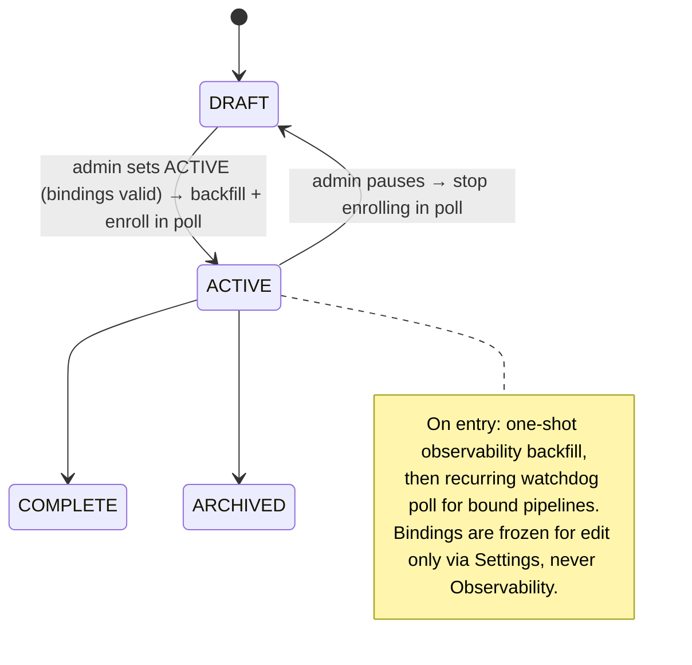

# Project ↔ Transformation Engine ↔ Repo Binding + ACTIVE-triggered Observability

> Supersedes the webapp-only `brighthive-webapp/docs/specs/project-transformation-settings.md`
> (BH-1244), which specced a single-engine/single-repo edit form with the backend "assumed
> available" and no role gate. This spec is the 3-repo superset: multi-repo, pluggable engine,
> workspace-admin gating, ACTIVE→observability, and read-only provenance on the observability view.
> Reuses (does not re-derive) the ports/registries in [`pipeline-run-lifecycle.md`](./pipeline-run-lifecycle.md),
> [`pipeline-self-healing-fleet.md`](./pipeline-self-healing-fleet.md), [`github-enterprise-host-config.md`](./github-enterprise-host-config.md), and the watchdog backend
> in [`proactive-pipeline-ingestion-monitoring.md`](./proactive-pipeline-ingestion-monitoring.md).

## 1. Context

A **Project** is where a data team's transformation work lives. Today (BH-1244) a project carries
a single scalar `transformationServiceId` + `gitRepoUrl`, editable by any project owner, and the
shipped webapp lets those be changed *on the Observability page*. Three things are missing or wrong:
(1) a project can bind only **one** repo though a real dbt/Databricks project spans several; (2)
the engine choice is effectively dbt-only (`TransformationServiceProvider = DBT_CLOUD | DEEPNOTE |
SNOWFLAKE`), with no Databricks or Snowflake-native-pipe adapter; (3) the config is **not
admin-gated** and is editable *from the observability surface* — the opposite of what an
observability view should be. This spec makes per-project engine+repo binding a **workspace-admin
only Project Settings** action, allows **multiple repos**, keeps the engine **pluggable** behind a
port, and makes setting a project **ACTIVE** kick off pipeline observability — while the
observability view shows engine/org/repo as a **read-only provenance label only**.



### Use Case / Goal

A workspace admin opens a project's **Settings**, picks a transformation engine (dbt / Databricks /
Snowflake native pipes), links **one or more** GitHub repos owned by that engine's service, saves,
and sets the project **ACTIVE**. The project immediately begins showing pipeline observability
(runs, health, PRs, lineage) for its bound repos. Non-admins can view but cannot change the
binding. The Observability page shows "dbt Cloud · my-org · repo-a, repo-b" as a top label so a
viewer knows *where the data came from* — with no edit affordance.

### How It Works Today

- **platform-core** (`brighthive-platform-core`): `ProjectNode.status: ProjectStatus!` (incl.
  `ACTIVE`, `pipeline-typedefs.ts:196`); scalar `transformationServiceId`+`gitRepoUrl`
  (`:205-206`) plus a `CONFIGURES` edge to `TransformationServiceNode`. `updateProject`
  (`typedefs.ts:4431`) carries `projectStatus`/`transformationServiceId`/`gitRepoUrl` but has **no
  auth directive** — gated only by imperative `checkProjectOwnership` (`models/project.ts:1905`).
  Engine+repos live on the workspace-scoped `TransformationServiceNode` with a `gitHubRepos:
  [GitHubRepoNode!]` list (`pipeline-typedefs.ts:130-164`); its config mutations use
  `@authorized(requires: WORKSPACE_ADMIN)`. Health is watchdog-pulled via `x-service-key`
  (`watchdog-typedefs.ts`), on its own cadence — **no project-activation trigger**.
- **brightbot**: watchdog / `scheduled_agent_dispatcher` polls workspace transformation services and
  writes `recordWarehouseHealth` / `updateTransformationRunStatus` (`proactive-pipeline-ingestion-
  monitoring.md`). The pluggable engine seam already exists: `PipelineRunner` + `PIPELINE_RUNNERS`
  registry (`pipeline-run-lifecycle.md` §2) and open-discriminator `SourceType` + INV-16
  (`pipeline-self-healing-fleet.md` §2.1).
- **webapp**: `ProjectTransformationSettings.tsx` (engine+repo selects, single repo),
  `ProjectTransformationSummary.tsx` (read-only view — **already exists**), and
  `ProjectObservabilityPage/ProjectTransformationCard.tsx` which **wrongly renders an editable
  card** (Edit→inline form→`updateProject`, BH-1244). Admin gating for workspace-level transform
  config is `navAccess.ts` (`transformation:[Admin]`); the per-project card gates on
  `project.isEditable`, not role.

### Hard Limitations

- One repo per project (`gitRepoUrl` is a scalar). Multi-repo dbt/Databricks projects can't be
  fully represented.
- Engine set is effectively dbt (+Deepnote); Databricks is a disabled UI placeholder, Snowflake
  native pipes are unmodeled as a *transformation* engine (Snowflake is warehouse-only).
- No admin boundary on the binding; the binding is editable from Observability.
- No causal link from "project became ACTIVE" to "observability starts" — a viewer of a fresh
  ACTIVE project may see nothing until the next unrelated watchdog sweep.

### Gaps

Multi-repo persistence on the project; a pluggable engine registry surfaced to the project binding;
`WORKSPACE_ADMIN` enforcement on the binding + activation; an on-activate backfill hook into the
existing watchdog; a read-only provenance label on Observability (strip the edit path); a
Databricks and a Snowflake-native-pipe adapter registered behind the engine port.

## 2. Interface Contract (MDE)

### 2.0 The port + registry FIRST (engine-agnostic — this is the design, not an adapter)

The transformation engine is pluggable. The domain binds to a **`ProjectPipelineEngine` port**
resolved through a **registry**, never to a vendor literal. dbt is adapter #1; Databricks and
Snowflake-native-pipes are registry entries.

```python
# brightbot/pipelines/engines/port.py  (reuses PipelineRunner from pipeline-run-lifecycle.md)
class ProjectPipelineEngine(Protocol):
    """Fetches observability for one project's bound repos on the active engine."""
    def kind(self) -> EngineKind: ...
    def capabilities(self) -> frozenset[Capability]: ...
    async def backfill_observability(self, *, binding: ProjectBinding, ctx: RequestContext) -> ObservabilitySnapshot: ...
    async def poll_observability(self, *, binding: ProjectBinding, ctx: RequestContext) -> ObservabilitySnapshot: ...

EngineFactory = Callable[[EngineConfig], ProjectPipelineEngine]
PROJECT_PIPELINE_ENGINES: Final[dict[EngineKind, EngineFactory]] = {
    DBT:              DbtProjectEngine,        # adapter #1 (ships)
    DATABRICKS:       DatabricksProjectEngine, # registry entry
    SNOWFLAKE_PIPES:  SnowflakePipesEngine,    # registry entry (dynamic tables / streams / tasks)
}
def build_project_engine(*, kind: EngineKind, config: EngineConfig) -> ProjectPipelineEngine:
    return PROJECT_PIPELINE_ENGINES[kind](config)
```

`EngineKind` is an **open discriminator** (registry key, not a closed code branch) — adding an
engine is a registry entry + adapter, never a call-site edit (per `pipeline-self-healing-fleet.md`
INV-16 and `~/.claude/rules/pluggable-scalable.md` PS-1/PS-15).

### 2.1 platform-core GraphQL (schema is source of truth in `typedefs.ts`)

```graphql
# Multi-repo: a project binds to an engine (service) + N repos owned by that service.
type ProjectEngineBinding {
  transformationServiceId: ID!
  engineKind: EngineKind!            # DBT | DATABRICKS | SNOWFLAKE_PIPES (open, registry-backed)
  org: String!                       # derived from the service's repo host, provenance label
  repos: [GitHubRepoRef!]!           # one-or-more; each { repoId, repoUrl, branch }
}
extend type ProjectOutput {
  engineBinding: ProjectEngineBinding    # null until an admin binds one
}

input SetProjectEngineBindingInput {
  workspaceId: ID!
  projectId: ID!
  transformationServiceId: ID!
  repoIds: [ID!]!                    # ≥1; all must belong to the service; empty → error
}

type Mutation {
  # ADMIN-ONLY binding + activation. Both gated by the existing directive.
  setProjectEngineBinding(input: SetProjectEngineBindingInput!): Boolean!
      @authorized(requires: WORKSPACE_ADMIN, workspaceIdLoc: ["args","input","workspaceId"])
  setProjectStatus(workspaceId: ID!, projectId: ID!, status: ProjectStatus!): Boolean!
      @authorized(requires: WORKSPACE_ADMIN, workspaceIdLoc: ["args","workspaceId"])
      # on transition → ACTIVE: enqueue one-shot observability backfill (non-blocking) + enroll in poll
}
```

Error codes (GraphQL `extensions.code`): `not_workspace_admin` · `service_not_found` ·
`repo_not_owned_by_service` (a repoId not under the service) · `no_repos_selected` ·
`binding_required_for_active` (activate with no valid binding) · `engine_kind_unavailable`
(registry has no adapter for the service's provider).

### 2.2 brightbot — activation hook + engine poll (service-principal, `x-service-key`)

```python
# On setProjectStatus(ACTIVE): platform-core emits a backfill request; brightbot consumes it.
async def on_project_activated(*, project_id: str, binding: ProjectBinding, ctx: RequestContext) -> None:
    engine = build_project_engine(kind=binding.engine_kind, config=binding.engine_config)
    snap = await engine.backfill_observability(binding=binding, ctx=ctx)   # one-shot, non-blocking
    await record_project_observability(project_id=project_id, snapshot=snap, ctx=ctx)
    # thereafter the recurring watchdog enrolls ACTIVE projects and calls engine.poll_observability
```

### 2.3 webapp

- **Project Settings** (`ProjectOverviewForm` / a new `ProjectEngineBindingSettings`): engine select
  + **multi-select** repo picker (repos filtered to the chosen service's `gitHubRepos`), calls
  `setProjectEngineBinding`; visible/enabled only when `useGetUserRole(workspaceId) === Admin`.
- **Observability** (`ProjectObservabilityPage`): render `ProjectTransformationSummary` (read-only)
  as a top provenance label — engine · org · repos. **Remove** the edit path from
  `ProjectTransformationCard.tsx` (no Edit button, no inline form, no `updateProject` on this
  surface).

## 3. Invariants (DbC)

1. `IF the caller is not WORKSPACE_ADMIN, THEN THE System SHALL reject setProjectEngineBinding and setProjectStatus with not_workspace_admin.`
2. `WHEN setProjectEngineBinding is called, THE System SHALL require repoIds to be non-empty and every repoId to belong to the given transformationServiceId (else repo_not_owned_by_service / no_repos_selected).`
3. `WHEN a project transitions to ACTIVE, THE System SHALL require a valid engineBinding (else binding_required_for_active).`
4. `WHEN a project enters ACTIVE, THE System SHALL enqueue exactly one observability backfill and enroll the project in the recurring poll; the backfill SHALL NOT block the mutation response.`
5. `THE observability surface SHALL expose the engine/org/repos as read-only; no mutation that changes the binding is reachable from the observability view.` (EARS: `IF a request to change the binding originates from the observability surface, THEN THE System SHALL have no such path.`)
6. `THE engine binding SHALL resolve its adapter through PROJECT_PIPELINE_ENGINES; no domain path SHALL branch on a vendor literal.` (per PS-1/INV-16)
7. `WHEN a project is not ACTIVE, THE System SHALL NOT poll observability for it.`
8. `THE org label SHALL be derived from the service's repo host, never free-typed by the user.` (reuses `parseGitHubRepoUrl`, `github-enterprise-host-config.md`)
9. `A repo binding SHALL be namespaced by workspace_id; no project SHALL bind a repo owned by another workspace's service.` (multi-tenant isolation, PS-13)

Budget: 9/15.

## 4. Acceptance Criteria (BDD — Gherkin)

```gherkin
Feature: Project engine + repo binding (admin-only) and ACTIVE-triggered observability

  Scenario: Admin binds a multi-repo dbt engine
    Given I am a workspace admin on a DRAFT project's Settings
    And the workspace has a dbt Cloud service owning repos "repo-a" and "repo-b"
    When I select engine "dbt Cloud" and repos "repo-a" and "repo-b" and save
    Then setProjectEngineBinding is called with repoIds [repo-a, repo-b]
    And the project's engineBinding shows engineKind DBT, org derived from the repo host, and both repos

  Scenario: Non-admin cannot change the binding
    Given I am a workspace collaborator (not admin) on a project's Settings
    Then the engine + repo controls are not editable
    And a direct setProjectEngineBinding call returns error "not_workspace_admin"

  Scenario: Activating a bound project starts observability
    Given a DRAFT project with a valid engineBinding
    When an admin sets its status to ACTIVE
    Then the mutation returns immediately
    And exactly one observability backfill is enqueued for its bound repos
    And the project is enrolled in the recurring observability poll

  Scenario: Activating an unbound project is rejected
    Given a DRAFT project with no engineBinding
    When an admin sets its status to ACTIVE
    Then the System returns error "binding_required_for_active"

  Scenario: Repo must belong to the chosen engine
    Given a dbt Cloud service that does not own "repo-z"
    When an admin calls setProjectEngineBinding with repoIds [repo-z]
    Then the System returns error "repo_not_owned_by_service"

  Scenario: Observability shows provenance read-only
    Given an ACTIVE project bound to dbt Cloud org "acme" repos "repo-a","repo-b"
    When any user opens the project's Observability page
    Then a top label shows "dbt Cloud · acme · repo-a, repo-b"
    And there is no control to edit the engine or repos on that page

  Scenario: A new engine is added by registry, not code
    Given a Databricks service is configured in the workspace
    When an admin binds the project to it
    Then the binding resolves the Databricks adapter via PROJECT_PIPELINE_ENGINES
    And no observability/domain code path branches on the string "databricks"
```

Budget: 7/20.

## 5. Out of Scope

- Creating / OAuth-linking transformation services or repos (existing workspace config flows own that).
- Triggering *transformation runs* (dbt run, Databricks job) from the binding — this spec fetches
  observability, it does not execute pipelines. (`pipeline-run-lifecycle.md` owns execution.)
- Implementing the Databricks and Snowflake-pipes adapters' full internals — this spec registers
  the port + slots and ships the dbt adapter; the other two adapters are follow-on tickets.
- Reconciling the two GitHub auth models (`TransformationService`-scoped vs `WorkspaceGitHubBinding`)
  beyond consuming the `TransformationService`-scoped one; full reconciliation is its own ticket
  (flagged in `project-files-dbt-github-bridge.md` §6).

## 6. Dependencies

| Dependency | Type | Status |
|------------|------|--------|
| `TransformationServiceNode` + `GitHubRepoNode.gitHubRepos` list (platform-core) | Blocking | Ready (`pipeline-typedefs.ts`) |
| `@authorized(requires: WORKSPACE_ADMIN)` directive | Blocking | Ready (`directives/authorized.ts`) |
| `PipelineRunner`/`PIPELINE_RUNNERS` + open `SourceType` (brightbot) | Blocking | Ready (`pipeline-run-lifecycle.md`, `pipeline-self-healing-fleet.md`) |
| Watchdog service-key poll + `recordWarehouseHealth` (brightbot↔platform-core) | Blocking | Ready (`proactive-pipeline-ingestion-monitoring.md`, BH-1280) |
| `ProjectTransformationSummary.tsx` read-only renderer (webapp) | Non-blocking | Ready |
| `EngineKind` enum widened to include DATABRICKS, SNOWFLAKE_PIPES | Blocking | Not started (this spec) |

## 7. Correctness Properties

### Property 1: Admin-only mutation boundary
*For any* caller C and mutation M ∈ {setProjectEngineBinding, setProjectStatus}, M succeeds only if C holds WORKSPACE_ADMIN in the target workspace.
**Validates: §3 Invariant 1, §4 Scenario "Non-admin cannot change the binding"**

### Property 2: No-observability-edit boundary
*For any* request R originating from the observability surface, R cannot mutate the engine binding — the mutation is unreachable from that surface, not merely hidden.
**Validates: §3 Invariant 5, §4 Scenario "Observability shows provenance read-only"**

### Property 3: Activation implies bound + backfilled exactly once
*For any* project P entering ACTIVE, P has a valid engineBinding and exactly one backfill is enqueued.
**Validates: §3 Invariants 3+4, §4 Scenarios "Activating a bound project starts observability" / "Activating an unbound project is rejected"**

### Property 4: Vendor-neutral resolution
*For any* engine binding, the adapter is resolved via PROJECT_PIPELINE_ENGINES and no domain path branches on a vendor literal.
**Validates: §3 Invariant 6, §4 Scenario "A new engine is added by registry, not code"**

Budget: 4/15.

## 9. Observability Contract

- **Span**: `gen_ai.tool.execute` with `gen_ai.tool.name=project_observability_backfill` on the
  activation hook; `brightagent.pipeline.poll` on each recurring poll.
- **Attributes**: `workspace.id`, `project.id`, `engine.kind`, `repo.count`, `binding.service_id`.
- **Log events**: `project_binding.set`, `project_binding.rejected` (with error code),
  `project_activated`, `observability_backfill.started`, `observability_backfill.success`,
  `observability_backfill.failed`, `observability_poll.enrolled`.
- **Metrics**: `project_observability_backfill_latency_ms`; `active_projects_polled` gauge.

## 10. Test Coverage Update

| Repo | Suite | What to add |
|---|---|---|
| `brighthive-platform-core` | `brighthive-platform-core/tests/` | One test per §2.1 contract entry (setProjectEngineBinding happy + each error code; setProjectStatus→ACTIVE guard); one per §3 invariant observable via the API (admin gate, repo-ownership, binding-required-for-active). Real-behavior: exercise the resolver against a real OGM/Neo4j test instance, asserting the persisted binding + `not_workspace_admin` on a non-admin JWT. |
| `brightbot` | `brightbot/tests/` + `brightbot/brightbot/evals/` (L0/L1/L2) | L0: `build_project_engine` returns the right adapter per `EngineKind` (incl. the two registry slots). L1: activation hook routes to `backfill_observability` for the bound engine. L2: on-activate backfill enqueues exactly once and is non-blocking; a non-ACTIVE project is never polled (§3 inv 4,7). Real-behavior: dbt adapter backfill against a captured dbt Cloud replay. |
| `brighthive-webapp` | `tests/e2e` (Playwright) + `cypress/` | Playwright: admin binds multi-repo engine in Settings and saves (§4 happy path). Cypress: non-admin sees read-only controls; Observability page renders the provenance label with **no** edit control (§3 inv 5). |
| `brighthive-e2e` | `brighthive-e2e/e2e/` | One cross-repo feature test: admin binds + activates a project, observability backfill fires, the webapp Observability page shows runs + the read-only provenance label — against the real staging backend. One error-path: activate-unbound → `binding_required_for_active`. |

**Real-behavior requirement**: the platform-core resolver test (real OGM), the brightbot dbt
backfill (captured replay), and the `brighthive-e2e` feature test each hit a real client/backend —
not a mock. Construct-only shape assertions do not satisfy these rows.

Before opening any implementation PR: run all four suites, confirm each §2/§3/§4 entry has a new
test case, and confirm green.

## Areas Involved

| Area | Repo | Impact |
|------|------|--------|
| Platform Core | `brighthive-platform-core` | New `ProjectEngineBinding` type + `engineBinding` on `ProjectOutput`; `setProjectEngineBinding` + `setProjectStatus` mutations, both `@authorized(WORKSPACE_ADMIN)`; multi-repo persistence; ACTIVE-transition emits backfill request; widen `EngineKind`. |
| BrightBot | `brightbot` | `ProjectPipelineEngine` port + `PROJECT_PIPELINE_ENGINES` registry (dbt adapter ships; Databricks + Snowflake-pipes slots); `on_project_activated` backfill hook; watchdog enrolls ACTIVE projects for poll. |
| Web App | `brighthive-webapp` | Admin-gated engine + **multi**-repo picker in Project Settings calling `setProjectEngineBinding`; strip edit path from `ProjectObservabilityPage/ProjectTransformationCard.tsx` → read-only `ProjectTransformationSummary` provenance label. |

## Ticket Breakdown

| Ticket | Summary | Points | Epic |
|--------|---------|--------|------|
| — | platform-core: `ProjectEngineBinding` type + multi-repo persistence on ProjectNode | 3 | BH-172 |
| — | platform-core: `setProjectEngineBinding` + `setProjectStatus` admin-gated mutations + ACTIVE backfill emit | 3 | BH-172 |
| — | brightbot: `ProjectPipelineEngine` port + registry + dbt adapter + `on_project_activated` backfill hook | 5 | BH-172 |
| — | brightbot: enroll ACTIVE projects in recurring observability poll | 2 | BH-172 |
| — | webapp: admin-gated multi-repo engine binding in Project Settings (`setProjectEngineBinding`) | 3 | BH-172 |
| — | webapp: make Observability provenance read-only — strip edit path from ProjectTransformationCard | 2 | BH-172 |
| — | brighthive-e2e: bind+activate→observability feature test + activate-unbound error path | 2 | BH-172 |

## Related

- **Supersedes**: `brighthive-webapp/docs/specs/project-transformation-settings.md` (BH-1244)
- **Builds on**: `pipeline-run-lifecycle.md`, `pipeline-self-healing-fleet.md`,
  `github-enterprise-host-config.md`, `proactive-pipeline-ingestion-monitoring.md`,
  `warehouse-extensibility-pattern.md` (UI-registry precedent), `quality-rules-configurable.md`
  (admin-gating precedent)
