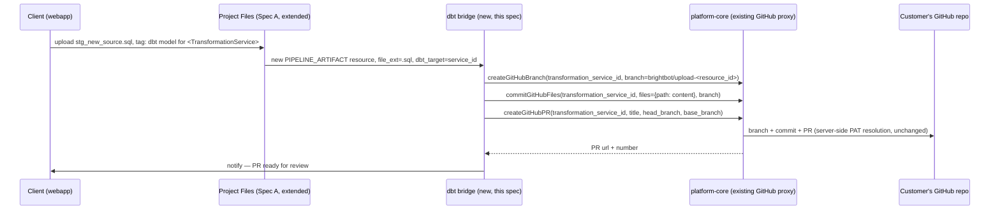

# SPEC: Project Files → dbt GitHub Bridge

> Scope: **This is not a new trust boundary.** BrightAgent already writes to a customer's GitHub
> repo today: `brightbot/agents/dbt_agent/tools/github_tools.py` exposes `github_commit_multiple_files`,
> `github_create_branch`, and `github_create_pull_request` — all proxied through platform-core's
> `commitGitHubFiles`/`createGitHubBranch`/`createGitHubPR` mutations, which resolve the customer's
> GitHub PAT server-side from a `TransformationService`-scoped secret (`gitHubAuthSecretArn`) and
> execute the git operation without the PAT ever entering BrightBot state or logs (docstring,
> `github_tools.py:1-5`). This spec adds exactly one new caller to that existing pipeline: a dbt
> model file uploaded to Project Files (extended to accept `.sql` by
> [`project-files-pipeline-artifact-intake.md`](./project-files-pipeline-artifact-intake.md)) gets committed to the customer's dbt repo via the
> same proxy dbt_agent already uses in chat. No new auth flow, no new secret storage, no new
> platform-core mutation.

## 1. Context

Today, a client wanting a new dbt model committed has to ask BrightAgent in chat to write and
commit it — there's no way to hand BrightAgent a `.sql` file directly and have it land in the repo.
Meanwhile, Project Files (extended by the sibling spec to accept diagnostic artifacts) becomes a
natural second front door for handing BrightAgent *any* file, including a dbt model a client
already wrote, wants reviewed, or wants version-controlled without going through the chat loop.

This spec wires that front door: an uploaded `.sql` (or `.yml` schema file) tagged for a specific
dbt `TransformationService` triggers the existing branch → commit → PR sequence, using the
project's already-configured GitHub auth. The commit is proposed as a PR, never pushed straight to
the default branch — matching how `github_create_pull_request`'s docstring already frames PR
creation as the terminal step of every existing dbt_agent flow.



## 2. Interface Contract (MDE)

### 2.1 Upload tagging — extend Spec A's `PIPELINE_ARTIFACT` intake, don't add a third upload path

```typescript
// ProjectFilesUploadModal.tsx — when file_ext is .sql/.yml AND a dbt TransformationService
// is selected in the upload form, tag the resource with dbt_target metadata (existing `tags`
// field on the onboard mutation, no new mutation field required)
onboardResource({
  variables: {
    input: {
      name: resolvedName,
      workspaceId,
      type: ResourceType.PipelineArtifact,   // from Spec A
      fileExt: file.name.split(".").pop(),
      projectId,
      tags: [`dbt_target:${selectedTransformationServiceId}`],   // new convention, existing field
    },
  },
});
```

### 2.2 `DbtArtifactBridge` — the new caller (brightbot, new file), reusing existing GitHub tools

```python
# brightbot/agents/dbt_agent/tools/artifact_bridge.py (new)
class DbtArtifactBridge:
    """Watches for PIPELINE_ARTIFACT resources tagged dbt_target:<service_id>,
    commits them via the EXISTING github_tools proxy calls. Issues zero new
    GitHub API calls of its own — every git operation goes through
    github_create_branch / github_commit_multiple_files / github_create_pull_request
    (github_tools.py:242, :376, :446), unchanged."""

    async def process_pending_artifacts(self, *, ctx: RequestContext) -> list[BridgeResult]:
        """List untouched dbt-tagged PIPELINE_ARTIFACT resources for this workspace,
        fetch each from S3, derive a repo-relative path from the resource name
        (e.g. models/staging/<name>), and commit via the existing proxy tools."""
```

### 2.3 Repo-relative path resolution (new, small — the one genuinely new decision)

```python
# No existing convention maps "uploaded filename" -> "repo path". This spec's one new rule:
# dbt models -> models/<uploaded-subfolder-or-default>/<filename>
# schema/yml files -> same folder as the model they annotate, inferred by matching stem name
# Ambiguous cases (can't infer folder) -> flagged for human confirmation before commit,
# never guessed silently (mirrors INV-2 below).
```

## 3. Invariants (DbC)

- INV-1 Every GitHub write in this spec goes through the existing `github_tools.py` proxy
  functions — `DbtArtifactBridge` never calls the GitHub API or resolves a PAT directly. No new
  credential storage is introduced.
- INV-2 A dbt-tagged upload whose repo path cannot be confidently inferred is never committed
  silently — it's surfaced for human confirmation of the target path before any branch/commit call.
- INV-3 Every commit lands on a new branch and is proposed as a PR — no upload-triggered commit
  ever targets the repo's default branch directly (mirrors `github_create_pull_request`'s existing
  role as the terminal step of every dbt_agent git flow).
- INV-4 An uploaded artifact is committed at most once — re-processing the same resource (e.g. a
  retry) is idempotent and does not open a second PR for the same upload (mirrors
  `github_create_branch`'s existing `BRANCH_EXISTS`-is-success idempotency, `github_tools.py:274`).
- INV-5 The GitHub PAT never enters this spec's code or logs — same guarantee `github_tools.py`
  already documents (`:1-5`), inherited by construction since this spec calls those functions and
  introduces no parallel credential path.

Budget: 5 invariants.

## 4. Acceptance Criteria (BDD)

```gherkin
Feature: Project Files → dbt GitHub bridge

  Scenario: A tagged dbt model upload results in an open PR
    Given a client uploads stg_new_source.sql tagged dbt_target:<service_id>
    When DbtArtifactBridge.process_pending_artifacts runs
    Then a new branch is created via github_create_branch
    And the file is committed via github_commit_multiple_files
    And a pull request is opened via github_create_pull_request
    And the client is notified with the PR url

  Scenario: An untagged .sql upload is not touched by the bridge
    Given a client uploads a .sql file with no dbt_target tag
    When DbtArtifactBridge.process_pending_artifacts runs
    Then that resource is not committed anywhere
    And it remains available for other diagnostics (Spec A's SQL analyzer, if applicable)

  Scenario: Re-processing an already-committed artifact is a no-op
    Given a PIPELINE_ARTIFACT already committed in a prior run
    When process_pending_artifacts runs again
    Then no second branch or PR is created for that resource

  Scenario: An ambiguous repo path is not guessed
    Given an uploaded .sql file with no inferable target folder
    When the bridge evaluates it
    Then no commit is attempted
    And the client is prompted to confirm the intended repo path
```

Budget: 4 scenarios.

## 5. Out of Scope

- Building any new GitHub authentication, PAT storage, or OAuth flow — `TransformationService`-
  scoped auth already exists and is reused as-is.
- Reconciling the two overlapping GitHub auth models in platform-core
  (`TransformationService`-scoped vs `WorkspaceGitHubBinding`) — flagged in §6 as a pre-existing
  gap, not this spec's job to fix.
- Automatic merge of the opened PR — stays a human review step, same as every other dbt_agent PR
  today (no change to merge policy).
- Diagnosing or validating dbt SQL content itself (linting, dry-run compile) — this spec only
  moves bytes from Project Files to a GitHub PR; content validation is a future spec if needed.
- The `PipelineArtifactSource` diagnostic path (SSIS/SSRS/SQL health signals) — that's Spec A's
  concern; this spec only handles the dbt-tagged subset of uploads.

## 6. Dependencies

- **Spec A (`project-files-pipeline-artifact-intake.md`)** — hard dependency. This spec needs
  `.sql` in `ALLOWED_FILE_TYPES` and the `PIPELINE_ARTIFACT` resource type to exist first; it also
  needs the `tags` field on `onboardResource` to carry `dbt_target:<service_id>` (existing field,
  no schema change, but the upload UI needs a dbt-target picker — new, small webapp work).
- `github_tools.py`'s existing proxy functions (`github_create_branch`, `github_commit_multiple_files`,
  `github_create_pull_request`) — reused unchanged, zero modification.
- `get_transformation_services` (`platform_queries.py:385`) — to populate the dbt-target picker
  with the workspace's configured dbt services.
- **Known pre-existing gap, not blocking this spec:** platform-core has two overlapping GitHub auth
  models (`TransformationService`-scoped auth vs `WorkspaceGitHubBinding`, used today for semantic-
  view YAML commits). This spec uses the `TransformationService`-scoped model exclusively, matching
  what dbt_agent already uses — no new model introduced, but the two should be reconciled
  eventually (tracked as a follow-up, not a blocker here).

## 7. Correctness Properties

### Property 1: No parallel credential path
*For any* commit produced by `DbtArtifactBridge`, the GitHub write executes through
`github_tools.py`'s existing proxy call chain — never a direct GitHub API call or a separately
resolved PAT.
**Validates: §3 INV-1, INV-5**

### Property 2: At-most-once commit per artifact
*For any* `PIPELINE_ARTIFACT` resource tagged with a `dbt_target`, running
`process_pending_artifacts` any number of times results in at most one open PR attributable to
that resource.
**Validates: §3 INV-4, §4 "Re-processing an already-committed artifact is a no-op"**

### Property 3: No silent path guessing
*For any* uploaded artifact whose repo-relative path cannot be inferred with confidence, no branch,
commit, or PR is created without a confirmed target path.
**Validates: §3 INV-2, §4 "An ambiguous repo path is not guessed"**

Budget: 3 properties.

## 8. Eval Criteria

Not applicable — path inference (§2.3) is a deterministic naming-convention lookup, not an LLM
judgment call in this spec's scope; ambiguous cases are punted to a human rather than resolved by
a model. No new LLM behavior is introduced.

## 9. Observability Contract

- **Log events**: `dbt_artifact_bridge.artifact_detected`, `.branch_created`, `.committed`,
  `.pr_opened`, `.path_ambiguous`, `.already_processed` (per artifact).
- **Attributes**: `workspace_id`, `transformation_service_id`, `resource_id`, `pr_number` — never
  file content or PAT material in logs (inherits the existing `github_tools.py` logging discipline).
- **Metrics**: `dbt_artifact_bridge_prs_opened_total`, `dbt_artifact_bridge_path_ambiguous_total`,
  tagged `workspace_id`.

## 10. Test Coverage Update

### a. In-repo layered tests (brightbot)
- **L0** — `DbtArtifactBridge.process_pending_artifacts` contract: result shape for
  committed/skipped/ambiguous cases.
- **L1** — path-inference logic: confident-folder case commits, ambiguous case does not (one case
  per §4 scenario); idempotency — second run on an already-committed resource is a no-op.
- **L2** — real-behavior: against a real (sandbox) GitHub repo already wired to a test
  `TransformationService`, upload a fixture `.sql` file, run the bridge, assert a real branch +
  commit + PR appear in the sandbox repo (RUN_LIVE-gated, reuses the existing dbt_agent e2e sandbox
  credential setup — no new fixture infra invented).

### b. Cross-repo e2e (`brighthive-e2e`)
- One feature test: upload a `.sql` file via the webapp with a dbt-target tag, assert a PR appears
  in the sandbox repo end-to-end.
- One error-path test: upload an untagged `.sql` file, assert no PR is created and the resource
  remains available for other diagnostics.

### Self-verification
Run brightbot's layered suite + the e2e; confirm §2/§3/§4 each have a case; confirm the L2 case
exercises the real `github_commit_multiple_files`/`github_create_pull_request` proxy calls against
a real sandbox repo, not a mocked GitHub client.

## 11. PR Split

1. **webapp** — dbt-target picker on the Project Files upload form (visible only for `.sql`/`.yml`
   uploads), tagging the resource via the existing `tags` field. (S)
2. **brightbot** — `DbtArtifactBridge` + repo-path inference + idempotency check. (M)
3. **brightbot** — real-behavior L2 against a sandbox GitHub repo (RUN_LIVE-gated). (S)
4. **brighthive-e2e** — upload → PR-appears feature test + untagged-upload error-path test. (S)

Ordered 1 → 2 → 3 → 4. Hard-depends on Spec A's PR 1-3 (webapp allowlist, platform-core
`ResourceType`, brightbot `PipelineArtifactSource` registration) landing first — this spec adds a
second consumer of the same `PIPELINE_ARTIFACT` resource type.

## Ticket Breakdown

All children of epic **BH-1255**, `issueType=Task`. Extends the Project Files intake (Spec A) to
cover dbt model version-control, using the GitHub write trust model dbt_agent already ships with.
Numbers to create at handover.

| Ticket | Summary | Size |
|---|---|---|
| BH-1309 | `feat(webapp): dbt-target picker on Project Files upload form for .sql/.yml uploads` | S |
| BH-1310 | `feat(brightbot): DbtArtifactBridge — repo-path inference + idempotent commit via existing GitHub proxy tools` | M |
| BH-1311 | `test(brightbot): real-behavior L2 — upload → branch/commit/PR in sandbox GitHub repo (RUN_LIVE-gated)` | S |
| BH-1312 | `test(e2e): upload → PR appears end-to-end; untagged upload creates no PR` | S |
