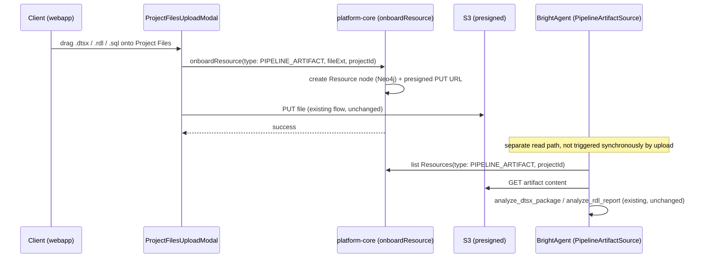

# SPEC: Project Files as a Pipeline-Artifact Intake

> Scope: Project Files already exists as a shipped upload surface
> (`ProjectFilesPage.tsx`, `ProjectFilesUploadModal.tsx`) — presigned S3 upload via
> `onboardResource`, gated by `isFilesEnabled`. It accepts `.pdf/.doc/.docx/.png/.jpg/.mp4/.mp3`
> (`ProjectFilesUploadModal.tsx:37-45`) and has no concept of a pipeline-diagnostic artifact:
> `resourceType()` (`helpers.ts:164-183`) maps every extension to `DOCUMENT`/`IMAGE`/`VIDEO`/`LINK`
> — a `.dtsx` upload today either gets rejected client-side (extension not allowed) or silently
> falls through to `DOCUMENT` with no way for anything downstream to know it's a pipeline artifact.
> This spec is the intake half of a problem the SSIS/SSRS spec already solved the read half of:
> `SsisCatalogPipelineSource` (`ssis_pipeline_source.py:103`) already polls `.dtsx` files from S3 —
> but the *only* way a package gets there today is a human hand-writing
> `workspace_secret_store/<uuid>` → `services.ssis_packages` in AWS Secrets Manager (BH-1274). That
> does not scale past one trial client. This spec replaces the manual secret-store step with a
> drag-and-drop upload, and gives SSRS (which has **no** catalog adapter at all — only a reactive
> `read_file`-driven chat skill, `ssrs-diagnostics/SKILL.md:17-18`) its first real intake path.
>
> **Not in scope:** rewriting `analyze_dtsx_package`/`analyze_rdl_report` (unchanged), building the
> SSRS `PipelineSource` itself (that's BH-1275/`ssis-ssrs-proactive-pipeline-source.md`), or the
> dbt-to-GitHub bridge (separate spec — different trust boundary, see Related).

## 1. Context

Frank's trial success criteria 5 & 6 (legacy SSIS/SSRS diagnostics) are answered on the *read*
side — `SsisCatalogPipelineSource` polls S3, parses, and emits signals. But the *write* side (how
a package's `s3://` URI lands in `services.ssis_packages` in the first place) is a manual,
per-workspace Secrets Manager edit that only DevOps can perform (BH-1274). Onboarding a second
customer means a human touching AWS Secrets Manager again. That's the gap this spec closes: the
client should be able to drag a `.dtsx`/`.rdl`/`.sql` file onto their Project's **Files** tab —
a surface that already exists, already does presigned S3 upload, already has admin-gated access
control — and have BrightAgent pick it up as a diagnostic input, no engineer in the loop.



## 2. Interface Contract (MDE)

### 2.1 Webapp — extend the existing upload allowlist, don't build a new uploader

```typescript
// src/Projects/ProjectFilesPage/ProjectFilesUploadModal.tsx:37-45 — ADD, don't replace
const ALLOWED_FILE_TYPES = [
  ".pdf", ".doc", ".docx", ".png", ".jpg", ".mp4", ".mp3",
  ".dtsx", ".rdl", ".sql",   // new: pipeline-diagnostic artifacts
];
```

```typescript
// src/helpers.ts:164 resourceType() — ADD a branch, existing branches unchanged
export const resourceType = (file: any) => {
  const name = file.name.toLowerCase();
  if ([".dtsx", ".rdl", ".sql"].some((ext) => name.endsWith(ext))) {
    return ResourceType.PipelineArtifact;   // new enum member, §2.2
  }
  if ([".docs", ".doc", ".docx", ".ooxml", ".pdf", ".xls", ".csv"].some(...)) {
    return ResourceType.Document;   // unchanged
  }
  // ... unchanged
};
```

### 2.2 Platform-core — new `ResourceType` member, existing `onboard` mutation unchanged

```typescript
// src/graphql/schema/typedefs.ts — extend the existing enum
export enum ResourceType {
  Document = "DOCUMENT",
  Image = "IMAGE",
  Link = "LINK",
  Video = "VIDEO",
  PipelineArtifact = "PIPELINE_ARTIFACT",   // new
}
```

`Resource.onboard` (`resource.ts:411`) takes `type: ResourceType` as an opaque input already —
no branching on type in the mutation body. Adding a member is additive; the presigned-S3 flow
(`resource.ts:465-534`) is untouched.

### 2.3 `PipelineArtifactSource` — the new port (brightbot, new file), listing Resources by type

```python
# brightbot/agents/governance_agent/tools/pipeline_artifact_source.py (new)
class PipelineArtifactSource:
    """PipelineSource over Project Files uploads tagged PIPELINE_ARTIFACT.
    Read-only: lists + fetches uploaded artifacts, never writes to Project Files."""

    def __init__(self, *, config: dict[str, Any]) -> None: ...

    async def poll_health(self, *, ctx: RequestContext) -> list[PipelineHealthSignal]:
        """List PIPELINE_ARTIFACT resources for this workspace/project via platform-core
        GraphQL, fetch each from its resource S3 path, dispatch to the existing
        PipelineArtifactParser registry (analyze_dtsx_package / analyze_rdl_report /
        a new .sql analyzer) by extension, diff findings vs last poll (mirrors
        SsisCatalogPipelineSource's diffing, INV-1)."""
```

This is a **second adapter** feeding the same `PipelineSource` protocol
(`pipeline_health.py`) that `SsisCatalogPipelineSource` implements — not a replacement. A
workspace may have packages configured via Secrets Manager (BH-1274's stopgap), uploaded via
Project Files (this spec), or both; `pipeline_health.py`'s existing registry (`:86-95`) fans out
to whichever adapters are configured, unchanged.

### 2.4 GraphQL query — list Resources by type + project (extend existing, don't invent)

```graphql
# existing getProjectResources-style query, extended with a type filter
query PipelineArtifactResources($projectId: ID!, $type: ResourceType!) {
  resources(projectId: $projectId, type: $type) {
    id
    name
    fileExt
    s3Path
    updatedAt
  }
}
```

## 3. Invariants (DbC)

- INV-1 Uploaded diagnostic artifacts are read-only inputs — `PipelineArtifactSource` and every
  parser it calls (`analyze_dtsx_package`, `analyze_rdl_report`) never mutate or re-upload the
  artifact (diagnose, don't author — same principle as the SSIS/SSRS spec, extended to intake).
- INV-2 Extending `ALLOWED_FILE_TYPES` and `ResourceType` is additive — no existing upload flow
  (`.pdf/.doc/.docx/.png/.jpg/.mp4/.mp3`) changes behavior.
- INV-3 A `PIPELINE_ARTIFACT` resource is scoped to the `projectId`/`workspaceId` it was uploaded
  into — `PipelineArtifactSource.poll_health` never reads across workspaces (multi-tenant
  isolation, mirrors PS-13).
- INV-4 `poll_health` never emits a signal for a finding identical to the last poll's result for
  that artifact — no duplicate-alert spam (mirrors the SSIS spec's INV-1).
- INV-5 An artifact that fails to fetch or parse emits a `source_unreachable`/`parse_error`
  signal, never a silent skip.

Budget: 5 invariants.

## 4. Acceptance Criteria (BDD)

```gherkin
Feature: Project Files as a pipeline-artifact intake

  Scenario: Client uploads a .dtsx package via drag-and-drop
    Given a client on the Project Files tab with admin access
    When they drag a valid .dtsx file onto the upload modal
    Then the file uploads via the existing presigned-S3 flow
    And the resulting Resource has type PIPELINE_ARTIFACT

  Scenario: Uploaded artifact is picked up by diagnostics
    Given a PIPELINE_ARTIFACT resource with a known anti-pattern
    When PipelineArtifactSource.poll_health runs
    Then a PipelineHealthSignal is emitted naming the specific finding

  Scenario: Re-upload of an unchanged artifact does not re-alert
    Given a PIPELINE_ARTIFACT resource whose last poll already surfaced a finding
    When poll_health runs again with unchanged artifact content
    Then no duplicate signal is emitted for that already-known finding

  Scenario: Existing upload types are unaffected
    Given a client uploads a .pdf to Project Files
    When onboardResource resolves the type
    Then it resolves to DOCUMENT exactly as it does today

  Scenario: Unsupported extension is rejected client-side
    Given a client attempts to upload a .exe file
    When the Uppy dashboard validates the file
    Then the upload is rejected before any network call, same as today's allowlist behavior

  Scenario: Unfetchable artifact fails loudly
    Given a PIPELINE_ARTIFACT resource whose S3 object has been deleted out-of-band
    When poll_health runs
    Then a source_unreachable signal is emitted, not a silent skip
```

Budget: 6 scenarios.

## 5. Out of Scope

- Building the SSRS `PipelineSource`/`.sql` analyzer logic itself — this spec is the intake path;
  the parsers it dispatches to are `ssis-ssrs-proactive-pipeline-source.md`'s and
  `pipeline-artifact-parser-registry.md`'s responsibility.
- Removing or deprecating BH-1274's Secrets-Manager path — both intake methods coexist; BH-1274
  stays as a fallback for artifacts that can't be uploaded (e.g. a client's live SSIS catalog they
  don't want to hand-export).
- Real-time/synchronous diagnosis on upload — `poll_health` runs on the existing watchdog schedule
  (BH-1045's poll loop), not triggered by the upload event itself. Sub-second feedback on upload is
  a future UX improvement, not this spec.
- The dbt-code-to-GitHub bridge — different trust boundary (customer repo write access via the
  existing GitHub proxy), tracked as a separate spec.
- Any change to `Resource` node deletion/versioning semantics — uploads follow whatever
  create/delete/version behavior Project Files already has for other resource types.

## 6. Dependencies

- `ProjectFilesUploadModal.tsx` + `onboardResource` mutation (existing, ships) — extended, not
  rebuilt.
- `PipelineSource` protocol + watchdog poll loop (`pipeline_health.py`, BH-1045's scheduling infra)
  — reused.
- `SsisCatalogPipelineSource` (`ssis_pipeline_source.py:103`) as the precedent adapter shape this
  spec's `PipelineArtifactSource` mirrors.
- `analyze_dtsx_package`/`analyze_rdl_report` (`pipeline_diagnostics_tools.py`) — existing parsers,
  called unchanged. Dispatch-by-extension is the responsibility of
  `pipeline-artifact-parser-registry.md`'s `PipelineArtifactParser` registry — this spec assumes
  that registry exists as the dispatch seam (sequencing: parser registry should land first or
  alongside).
- **External dependency (different epic):** none — this spec has no lineage-subsystem dependency.
- `isFilesEnabled` workspace flag — Project Files must already be enabled for a workspace before
  this intake path is usable; not this spec's concern to toggle.

## 7. Correctness Properties

### Property 1: Read-only intake
*For any* uploaded `PIPELINE_ARTIFACT` resource, no code path in `PipelineArtifactSource` or the
parsers it calls issues a write (S3 PUT, Resource mutation) against that resource.
**Validates: §3 INV-1**

### Property 2: No duplicate alerts
*For any* two consecutive polls with identical parsed findings for an artifact, at most the first
emits a signal.
**Validates: §3 INV-4, §4 "Re-upload of an unchanged artifact does not re-alert"**

### Property 3: Workspace isolation
*For any* `PipelineArtifactSource.poll_health(ctx)` call scoped to workspace W, the resources
listed are exactly those uploaded under W's projects — never another workspace's.
**Validates: §3 INV-3**

Budget: 3 properties.

## 8. Eval Criteria

Not applicable — `analyze_dtsx_package`/`analyze_rdl_report` are deterministic parsers (already
evaluated under GC-16 in the SSIS/SSRS spec); this spec adds a new intake path + list query
around them, no new LLM behavior.

## 9. Observability Contract

- **Log events**: `pipeline_artifact_source.poll_started`, `.new_finding_signal`,
  `.source_unreachable`, `.parse_error`, `.no_change` (per artifact, debug level).
- **Attributes**: `workspace_id`, `project_id`, `resource_id`, `file_ext`, `finding_kind` — never
  full file content in logs.
- **Metrics**: `pipeline_artifact_uploads_total` (tagged `file_ext`),
  `pipeline_artifact_new_findings_total`, `pipeline_artifact_source_unreachable_total` (tagged
  `workspace_id`).

## 10. Test Coverage Update

### a. In-repo layered tests

**webapp** (`brighthive-webapp/cypress` + component tests)
- **L0** — `ALLOWED_FILE_TYPES` includes `.dtsx/.rdl/.sql`; `resourceType()` returns
  `PipelineArtifact` for those extensions and unchanged values for existing ones (§4 "Existing
  upload types are unaffected").
- **L1** — upload modal rejects an unsupported extension client-side before any network call (§4
  "Unsupported extension is rejected client-side").

**platform-core**
- **L0** — `onboard` mutation accepts `type: PIPELINE_ARTIFACT` and returns a presigned URL,
  identical contract shape to existing types.
- **L2** — real-behavior: `onboardResource` against a real (test) S3 bucket, assert the created
  Resource node has `type: PIPELINE_ARTIFACT` and a fetchable presigned URL.

**brightbot**
- **L0** — `PipelineArtifactSource.poll_health` contract: signal shape, `source_unreachable`
  shape (mirrors `SsisCatalogPipelineSource`'s L0).
- **L1** — diff logic: same findings twice → 0 signals; new finding → 1 signal (one case per §4
  scenario).
- **L2** — real-behavior: upload a real `.dtsx` fixture via the actual `onboardResource` flow
  against a sandbox workspace, run `poll_health`, assert a real finding surfaces on first poll and
  does not repeat on second poll with unchanged content (RUN_LIVE-gated, mirrors the SSIS spec's
  L2 pattern — reuses Loop Capital's existing sandbox fixtures, no new fixture invented).

### b. Cross-repo e2e (`brighthive-e2e`)
- One feature test: drag-and-drop upload a `.dtsx` fixture via the webapp UI, run the watchdog
  cycle, assert a signal reaches the notification surface (reuses GC-14's existing watchdog-to-
  webapp path, new only in the Project-Files-as-trigger).
- One surface test: `onboard` mutation with `type: PIPELINE_ARTIFACT` against the real backend
  returns the documented shape.

### Self-verification
Run webapp Cypress + platform-core + brightbot layered suites + the e2e; confirm §2/§3/§4 each
have a case; confirm the L2 case uploads a real fixture through the real presigned-S3 path, not an
invented shape.

## 11. PR Split

1. **webapp** — extend `ALLOWED_FILE_TYPES` + `resourceType()` to recognize `.dtsx/.rdl/.sql`. (S)
2. **platform-core** — add `PipelineArtifact` to the `ResourceType` enum; extend the resources-list
   query with a `type` filter if one doesn't already exist. (S)
3. **brightbot** — `PipelineArtifactSource` port + registration in the watchdog's `PipelineSource`
   registry. (M)
4. **brightbot** — real-behavior L2 against an uploaded LC sandbox `.dtsx` fixture (RUN_LIVE-gated). (S)
5. **brighthive-e2e** — one feature test: drag-drop upload → watchdog cycle → notification surface. (S)

Ordered 1 → 2 → 3 → 4 → 5. Steps 1-2 can proceed in parallel (webapp/platform-core); 3 depends on
both landing (needs the new `ResourceType` member to query against).

## Ticket Breakdown

All children of epic **BH-1255**, `issueType=Task`. Reduces the operational cost of trial criteria
**5 & 6** (SSIS/SSRS intake) from a DevOps-only Secrets Manager edit to a client-driven upload.
Numbers to create at handover.

| Ticket | Summary | Size |
|---|---|---|
| BH-1304 | `feat(webapp): extend ALLOWED_FILE_TYPES + resourceType() to recognize .dtsx/.rdl/.sql` | S |
| BH-1305 | `feat(platform-core): add PipelineArtifact to ResourceType enum + resources-list type filter` | S |
| BH-1306 | `feat(brightbot): PipelineArtifactSource port + registration in watchdog PipelineSource registry` | M |
| BH-1307 | `test(brightbot): real-behavior L2 against uploaded LC sandbox .dtsx fixture (RUN_LIVE-gated)` | S |
| BH-1308 | `test(e2e): drag-drop upload → watchdog cycle → notification surface` | S |
