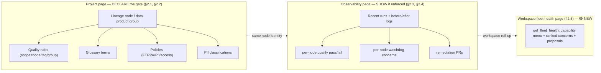

# Project Governance–Observability Convergence

> **This is a surfacing spec, not a backend spec.** Every backend contract it needs already
> exists or is spec'd elsewhere (see §6). Its own contribution is the **webapp convergence
> surface** — the project becomes the place where governance is **DECLARED** at points in the
> lineage, and observability **SHOWS** it being enforced — plus the **one new platform-core
> anchor** (a governance-artifact→lineage-node binding) and the **new workspace fleet-health
> page**. Where a section would restate a backend contract, it references the owning spec instead.

## 1. Context

Five gaps were surfaced (verbatim): (1) connect schemas, glossary, policies & PII in projects;
(2) make observability show quality rules too; (3) the watchdog/monitoring view; (4) the PR
section is incomplete; (5) setting up quality rules on groups/tags/each node of the pipeline is
unclear. Recon (2026-08-01, real `file:line`) found these are **surfacing/wiring gaps, not
backend builds** — with one genuine backend anchor missing.

**The convergence model** (user's framing): a **schema serializes the *gate* at each step of the
pipeline**. Governance artifacts that today float at *workspace* level — quality rules, glossary
terms, policies, PII classifications — get **anchored to a project + a specific lineage node
(or data-product group)**. The project page is where you *declare* the gate; the observability
page is where you *watch* it hold or fail, run-by-run.



**What already exists (recon, real `file:line`):**

- **Quality-rule node binding is a one-prop wire-up, live on one page, dormant on the other.**
  `PipelineLineageSection.tsx:55` declares `onCreateRule(targets: LineageRuleTarget[])`; `:470-473`
  renders a per-node "Create quality rule" action gated on `canCreateRule`. The standalone
  `DataLineagePage.tsx:161` **already passes it** (`openRuleForTargets`, :76) — proof the pattern
  works — but `ProjectObservabilityPage/index.tsx:260-263` mounts the section **without**
  `onCreateRule`, so the action is inert on the project page. (item #5, item #2)
- **Backend scope-by-tag/group** is spec'd in `data-quality-rules.md` (`QualityRuleScope`,
  `typedefs.ts:631-633`; `rulesInScope` resolver is GAP #1 there). (item #5)
- **PR section** exists (`AgentPRs.tsx`, review-and-redirect + `remediationDiagnosis`); BH-1329
  (commit `40cda83`) adds before/after engine run logs. Incomplete = no per-node anchoring, no
  in-app status roll-up. (item #4)
- **Fleet-health backend is built and tested** — `get_fleet_health` MCP tool
  (`brightbot/mcp/tools/fleet_health.py`) composes capability menu + ranked concerns +
  propose-only actions; 12 passing unit tests incl. the Loop Capital null-severity regression.
  **No webapp surface consumes it.** (item #3)
- **Glossary** binds to schema/resource (`TermOutput`, `schema.graphql:2816-2826`); **PII** lives
  on `DataAsset.piiTypes`/`sensitivity` (`801-803`) + `Field.pii` (`755`); **policies** are
  store-only (`Policy` `1069-1080`, `updateGovernance` `4229`, `ENFORCES` analytics-only). (item #1)

**The one genuine backend gap:** there is **no edge binding a governance artifact to a specific
lineage node**. Rules/terms/policies/PII anchor to a *workspace* or an *asset*, never to a
*node in a project's declared lineage*. Everything else is surfacing. This spec adds that anchor
(§2.1) and the surfaces that consume it (§2.2–§2.5).

## 2. Interface Contract (MDE)

> Per `docs/CLAUDE.md`: engine-agnostic; no vendor string in any type here. A gate anchors to a
> **node identity**, never to dbt/SSIS/Snowflake. Types below marked *(exists)* are referenced,
> not redefined — see the owning spec/file.

### 2.0 Capability scoping — one core impl, four surface planes

Every capability this spec introduces follows the shared-core pattern ratified in
**ADR-015** (`platform-saas-ai-context/docs/decisions/decisions.md`): one core verb impl
behind a port, reached by up to four thin surface adapters (global chat, project chat, MCP,
Slack) that only authenticate, resolve scope, and shape the response. **Project-scope is a
`project_id` parameter into the shared core — not a separate surface and not a permission
axis** (the chat plane already works this way: one `deep_agent_graph` + one `base_tools`
registry at `deep_agent.py:291-312`, with `project_id` in session state deciding scope at
`deep_agent.py:267`; the capability catalog has no project dimension —
`capabilities.py:836-851`).

Per-capability surface map for this spec:

| Ticket / capability | Core impl (the one place) | Chat | MCP | Webapp | Slack |
|---|---|---|---|---|---|
| BH-1333 `declareGovernanceGate` + `gatesForNode`/`gatesForProject` | platform-core mutation + resolvers (§2.1) | ✅ via mutation | — | ✅ via mutation | N/A |
| BH-1334/1335 declare gates on a node | `declareGovernanceGate` mutation (§2.1) — one core write | ✅ base_tools authoring tool | — | ✅ node drawer (§2.2) | N/A |
| BH-1336 per-node quality + watchdog | `get_fleet_health_impl` (`fleet_health.py:148`) — **reused, unchanged** | — | ✅ existing `get_fleet_health` tool | ✅ observability overlay (§2.3/§2.4) | N/A |
| BH-1337 fleet-health page | `get_fleet_health_impl` (`fleet_health.py:148`) | — | ✅ existing tool | ✅ new page (§2.5) | N/A |

**Slack is N/A for every row above with reason:** the surfaces this spec adds are project- and
workspace-scoped *webapp pages* plus their existing MCP tool. Slack has no project concept and
its convergence to the shared-core pattern is separately tracked (ADR-015 carve-out, task #48 /
BH-1131) — it is not silently claimed here. INV-9 makes this explicit and mechanically checkable.

### 2.1 The one new backend anchor — `GovernanceGateBinding` (platform-core)

The missing edge: bind an existing governance artifact to a lineage node **within a project**.
Reuses `LineageNode` (spec'd in `lineage-aware-data-quality.md`) as the anchor; the artifact
ids reference existing nodes (`QualityRule`, `TermOutput`, `Policy`, `DataAsset`).

```graphql
# platform-core GraphQL typedefs (new type; raw-Cypher service over a GOVERNED_BY edge).
enum GovernanceArtifactKind { QUALITY_RULE  GLOSSARY_TERM  POLICY  PII_CLASSIFICATION }

type GovernanceGateBinding {
  id: ID!
  workspaceId: String!          # native scalar scoping — mirrors LineageNode (that spec, pass 50)
  projectId: String!            # the project this gate is declared in
  nodeUniqueId: String!         # the anchor node's `id` property (INV-1, INV-3) — see storage note
  artifactKind: GovernanceArtifactKind!
  artifactId: String!           # id of the existing QualityRule / TermOutput / Policy / DataAsset
  createdAt: DateTime!
}

# Read resolvers (webapp consumes): every gate declared at a node / across a project.
# @authorized(requires: WORKSPACE_CONTRIBUTOR) — workspace-scoped (INV-7).
gatesForNode(workspaceId: String!, projectId: String!, nodeUniqueId: String!): [GovernanceGateBinding!]!
gatesForProject(workspaceId: String!, projectId: String!): [GovernanceGateBinding!]!

# Declare mutation — the ONE core write reached by every declare surface (webapp node
# drawer §2.2 + project-chat authoring tool), per ADR-015. Idempotent MERGE; returns null
# when node or artifact is missing (never orphans — INV-2). Records the edge only; never
# creates the artifact. @authorized(requires: WORKSPACE_CONTRIBUTOR, workspaceIdLoc input).
input DeclareGovernanceGateInput { workspaceId: String!  projectId: String!  nodeUniqueId: String!  artifactKind: GovernanceArtifactKind!  artifactId: String! }
declareGovernanceGate(input: DeclareGovernanceGateInput!): GovernanceGateBinding
```

**Note:** binding is an *index*, not a new store — the artifacts already persist. `artifactId`
for `QUALITY_RULE` is the same id `rulesInScope` (`data-quality-rules.md` GAP #1) resolves; the
gate merely records *which node* a rule/term/policy/PII class is declared against, so the two
surfaces (declare / show) share one node identity.

**Storage decision (implementation, BH-1333):** the binding is stored as a `GOVERNED_BY`
relationship *edge* directly to the artifact node —
`(node)-[:GOVERNED_BY {id, artifactKind, workspaceId, projectId, createdAt}]->(artifact)` — not
as a standalone binding node. This makes "index, not a store" literal and makes INV-2 hold *by
construction* for all four artifact kinds: a `DETACH DELETE` of any artifact (the existing
delete path for rules/terms/policies/PII) removes its edges with it, so no cascade hook is
needed and no gate can outlive its artifact. The `type GovernanceGateBinding` above is the read
projection of that edge (via `gatesForNode`/`gatesForProject`), not a second persisted entity.
`nodeUniqueId` binds to the anchor node's `id` property (matched on `id` alone — INV-1 one
identity, INV-3 engine-agnostic), which is what `LineageNode.uniqueId` resolves to in the graph.

**Declare path (implementation, BH-1333):** the earlier draft framed the gate as a
service-principal-only write with "no public mutation" (copied from the pipeline-lineage
precedent, where brightbot writes lineage directly to Neo4j). That does not hold here: brightbot
has **no** direct-to-Neo4j path for governance — every governance write already goes through a
platform-core GraphQL mutation over HTTP (the `createQualityRule` / `updateGovernance` seam). So
the declare surfaces *require* the `declareGovernanceGate` mutation above; it is the single core
write, and both the webapp node drawer (§2.2) and the project-chat authoring tool call it (ADR-015,
INV-9). Auth is `WORKSPACE_CONTRIBUTOR` (matching the read resolvers and `mergeGitHubPR`, both
agent-reachable) — deliberately not `createQualityRule`'s `WORKSPACE_AGENT_GUEST`-prohibit, so the
project-scope agent can declare gates.

### 2.2 Declare surface — per-node governance drawer (webapp, project page)

Wires the **dormant** `onCreateRule` and adds sibling declare-actions on the lineage node.

```typescript
// PipelineLineageSection.tsx — onCreateRule prop already declared at :55; DataLineagePage.tsx:161
// already wires it via openRuleForTargets (:76). The project page (index.tsx:260-263) must PASS it too.
interface PipelineNodeGovernanceProps {
  canCreateRule: boolean;                                  // = Boolean(onCreateRule) (:397)
  onCreateRule: (targets: LineageRuleTarget[]) => void;    // exists (:55) — unwired on the PROJECT page
  onAttachTerm:   (node: LineageRuleTarget) => void;       // NEW — glossary term → node
  onAttachPolicy: (node: LineageRuleTarget) => void;       // NEW — policy → node
  onClassifyPii:  (node: LineageRuleTarget) => void;       // NEW — PII class → node/asset
  gates: Record<string /* nodeUniqueId */, GovernanceGateBinding[]>;  // from gatesForProject (§2.1)
}
// LineageRuleTarget is the shipped shape { id, name } (:41) — `id` IS the node id §2.1 binds on
// (→ nodeUniqueId at the mutation boundary, INV-1), `name` is display-only, never a binding key.
```

`onCreateRule` opens the existing `QualityRuleDrawer.tsx` **pre-scoped** to the node: the drawer's
scope selector (today `AllAssets`/`SelectedAssets`) gains a `Node`/`Tag`/`Group` mode mapping to
`RuleScope.kind` (`data-quality-rules.md` §2.1). No new authoring engine — this is pre-fill + a
new scope-kind option.

### 2.3 Show surface — quality rules pass/fail per node (webapp, observability page)

Observability stays **project-run-scoped** (runs/logs/re-run/PR — the user's constraint). It gains
a per-node governance overlay driven by data it already fetches plus two reads:

```typescript
// useObservabilityData.ts — extend the project-scoped fetch (getObservabilityWorkflow).
interface NodeGovernanceOverlay {
  nodeUniqueId: string;
  gates: GovernanceGateBinding[];                          // §2.1 gatesForNode
  latestQualityResults: QualityResultSummary[];            // per-rule pass/fail for THIS run (exists: quality_asset_result signals)
  watchdogConcerns: HealthConcern[];                        // §2.4 — projected from fleet-health, node-filtered
}
// QualityResultSummary { ruleId, expectationType, status: "passed"|"failed"|"degraded", observed }
//   — status mirrors notification_constants.py:54-56; sourced from the SAME quality_asset_result
//   signal the fleet already routes (data-quality-rules.md §2.4). No new backend read.
```

### 2.4 Show surface — per-node watchdog view (projected fleet-health)

Reuses `get_fleet_health` (built — `fleet_health.py`) **unchanged**. The observability page
projects the workspace summary onto the node: a `HealthConcern` (`summary.py`) whose
`subject_id` resolves to an asset on this node renders inline, with its propose-only
`ProposedAction` (confirm-gated, never auto-executed — the existing contract).

```typescript
// Node-scoped projection of the EXISTING FleetHealthSummary (no new backend).
function concernsForNode(summary: FleetHealthSummary, nodeAssetIds: Set<string>): HealthConcern[];
// A concern surfaces on a node iff concern.subject_id ∈ nodeAssetIds. ProposedAction stays
// requires_confirmation:true (summary.py ProposedAction contract) — the UI confirms, never fires.
```

### 2.5 New workspace fleet-health page (webapp — 🟢 the only net-new page)

The workspace roll-up the user chose: a SystemAdmin page (`SystemAdmin/index.tsx` nested Routes,
`SystemAdminGuard`) consuming `get_fleet_health` via the hand-rolled MCP client
(`WorkspaceSettings/mcpSession.ts` — `openMcpSession` + `buildMcpHeaders`, `tools/call` pattern
from `MCPConnectivityCard.tsx`).

```typescript
// SystemAdmin/FleetHealth/  — new route "fleet-health" (index.tsx sibling of "feature-flags").
// Renders the three organs from ONE get_fleet_health call (FleetHealthResponse, fleet_health.py):
//   1. capabilities: CapabilityMenu   — what the fleet can do, scoped to caller
//   2. summary.concerns: HealthConcern[] — ranked "what needs you", most-urgent-first
//   3. proposed actions — confirm-gated buttons; confirming calls the named verb's own tool
// organs_unavailable rendered honestly (partial ≠ faked healthy — the tool's degradation contract).
```

### 2.6 PR section completion (item #4)

BH-1329 (`40cda83`) already specs before/after engine run logs in remediation PRs. This spec
adds only the **node anchor + status roll-up** on `AgentPRs.tsx`: a remediation PR shows which
lineage node's failed gate it addresses (via the `subject_id`→node map of §2.4) and its live
status. No in-app merge (existing constraint: review-and-redirect).

## 3. Invariants (DbC)

- **INV-1 One node identity across declare and show.** A gate declared at `nodeUniqueId` in §2.2
  SHALL surface on the SAME `nodeUniqueId` in §2.3/§2.4. Grep test: both sides key on
  `LineageNode.uniqueId`, never on display name or table-name regex (see `[[lineage-by-declared-structure-not-names]]`).
- **INV-2 Binding is an index, never a second store.** `GovernanceGateBinding` SHALL reference an
  existing artifact by id; deleting the artifact SHALL cascade-remove the binding, never orphan a
  gate pointing at nothing. Implementation (§2.1): the binding is a `GOVERNED_BY` edge to the
  artifact node, so `DETACH DELETE` of the artifact removes it with zero cascade hook — the
  invariant holds by construction, proven live in the L2 forcing-question test.
- **INV-3 Engine-agnostic gate.** No binding, overlay, or projection SHALL branch on warehouse /
  engine identity. A gate on a node fires identically whatever engine produced it.
- **INV-4 Observability stays project-run-scoped.** The observability page SHALL NOT host a
  workspace-wide signals feed; workspace roll-up lives ONLY on the §2.5 fleet-health page. (user's
  explicit scope constraint)
- **INV-5 Propose-only everywhere.** Every action surfaced on §2.4/§2.5 SHALL carry
  `requires_confirmation:true` and execute nothing until the user confirms — the `fleet_health`
  `ProposedAction` contract holds through the UI unchanged.
- **INV-6 Honest degradation.** WHERE an organ read fails (`organs_unavailable`), THE surface
  SHALL show the picture as partial, never render a faked all-clear. (fleet_health degradation contract)
- **INV-7 Workspace-scoped reads.** Every new resolver (`gatesForNode`/`gatesForProject`) SHALL
  filter on `workspaceId` explicitly (mirrors `LineageNode`); a gate SHALL never cross tenants.
- **INV-8 Scope-kind closed, values open.** The node/tag/group scope added to `QualityRuleDrawer`
  SHALL reuse the closed `RuleScope.kind` set (`data-quality-rules.md` INV-2); the node/tag/group
  values are open workspace data, never code.
- **INV-9 One core impl, thin surfaces (ADR-015).** Every capability this spec introduces SHALL
  expose exactly ONE core impl reached by all applicable surfaces; no surface adapter SHALL
  re-implement the verb (own query, own orchestration, own signal path). Grep test at each impl
  PR: `grep -rn "<verb>_impl"` shows one definition + N call sites. The §2.4/§2.5 fleet-health
  surfaces SHALL call `get_fleet_health_impl` (`fleet_health.py:148`) unchanged, never a second
  copy. Slack registration is explicitly N/A-with-reason (§2.0 table) — the surfaces here are
  project/workspace webapp pages + the existing MCP tool, and Slack convergence is separately
  tracked (ADR-015 carve-out, task #48 / BH-1131), never silently claimed done.

Budget: 9 invariants.

## 4. Acceptance Criteria (BDD)

```gherkin
Feature: Declare governance at a lineage node, watch it enforced in observability

  Scenario: Wire the dormant create-rule action
    Given a project's observability page with a lineage node
    When I open the node's governance drawer and create a NOT-NULL quality rule scoped to that node
    Then a GovernanceGateBinding(artifactKind=QUALITY_RULE, nodeUniqueId=<node>) is persisted
    And the rule appears under that node on the declare surface

  Scenario: A failed gate shows on the node it was declared at
    Given a quality rule declared at node "stg_holdings" that fails on the latest run
    When I open the observability page for that run
    Then node "stg_holdings" shows a failed quality result inline
    And a propose-only "re-run the quality check" action gated on confirmation

  Scenario: Watchdog concern projects onto its node
    Given get_fleet_health returns a concern whose subject_id is an asset on node "mart_exposure"
    When I view the observability page
    Then that concern renders inline on "mart_exposure" with its confirm-gated proposed action

  Scenario: Observability never hosts the workspace feed
    Given the observability page for a project
    Then it shows only that project's runs, logs, per-node gates, and remediation PRs
    And the workspace-wide ranked concern list appears ONLY on the fleet-health page

  Scenario: Fleet-health page composes three organs from one call
    Given a SystemAdmin on the fleet-health page
    When the page loads
    Then one get_fleet_health call renders the capability menu, ranked concerns, and proposals
    And an unprovisioned organ is shown as unavailable, not as healthy

  Scenario: Attach an existing glossary term to a node
    Given a glossary term and a lineage node in a project
    When I attach the term to the node
    Then a GovernanceGateBinding(artifactKind=GLOSSARY_TERM) is persisted and shown under the node

  Scenario: Deleting an artifact removes its gate
    Given a quality rule bound to a node
    When the rule is deleted
    Then its GovernanceGateBinding is removed, leaving no gate pointing at a missing rule
```

Budget: 7 scenarios.

## 5. Out of Scope

- **Building any backend engine** — quality-rule eval, signal routing, lineage computation,
  policy enforcement, run sync all belong to the specs in §6; this spec consumes them.
- **`rulesInScope` tag/group resolver** — owned by `data-quality-rules.md` GAP #1; a dependency here.
- **Policy *enforcement*** (making a policy block an action) — owned by `governance-policy-enforcement.md`
  (BH-766). This spec only *surfaces* a policy as a declared gate on a node.
- **In-app PR merge** — existing review-and-redirect constraint stands; §2.6 adds anchor + status only.
- **Before/after run logs in PRs** — owned by BH-1329 (`40cda83`); §2.6 adds only node anchoring.
- **Column-level lineage / new lineage adapters** — owned by `lineage-aware-data-quality.md`.

## 6. Dependencies

| Dependency | Owning spec / source | Status | Blocking? |
|---|---|---|---|
| `LineageNode` (anchor for §2.1) | `lineage-aware-data-quality.md` (BH-1063) | Spec'd, unbuilt | Blocking §2.1 |
| `rulesInScope(tag\|groupId)` resolver | `data-quality-rules.md` GAP #1 (BH-1283) | Spec'd | Blocking §2.2 tag/group scope |
| `QualityRuleScope` node/tag/group | `data-quality-rules.md` §2.1 | Enum ships; node-kind new | Blocking §2.2 |
| `quality_asset_result` signal (per-rule pass/fail) | `data-quality-rules.md` §2.4 | Signal bridge spec'd | Blocking §2.3 |
| `get_fleet_health` MCP tool | `fleet_health.py` (fleet-health POC) | **Built + tested** | Ready — §2.4/§2.5 |
| Project↔engine run/log sync | `project-engine-run-sync.md` (BH-1330) | Spec'd, in-flight | Blocking §2.3 run context |
| Before/after PR run logs | BH-1329 (`40cda83`) | Spec'd | Blocking §2.6 |
| Webapp MCP client (`mcpSession.ts`) | `WorkspaceSettings/` | Exists | Ready — §2.5 |
| `Policy` / `TermOutput` / `DataAsset.piiTypes` | platform-core `schema.graphql` | Exists | Ready — §2.1 artifact ids |

## 7. Correctness Properties

### Property 1: Declare–show identity
*For any* gate declared at node N, the observability overlay for any run touching N surfaces that
gate — keyed on `LineageNode.uniqueId`, never on a name.
**Validates: §3 INV-1, §4 "A failed gate shows on the node it was declared at"**

### Property 2: Nothing executes without confirmation
*For any* proposed action rendered on §2.4/§2.5, no side effect occurs until the user confirms.
**Validates: §3 INV-5, §4 "Fleet-health page composes three organs"**

### Property 3: No orphan gate
*For any* deleted artifact, no `GovernanceGateBinding` survives pointing at it.
**Validates: §3 INV-2, §4 "Deleting an artifact removes its gate"**

Budget: 3 properties.

## 8. Eval Criteria

Not applicable — this spec adds surfacing + one index binding; it introduces no new LLM behavior.
The LLM-backed capabilities it *surfaces* (quality eval, fleet-health classification) carry their
own eval criteria in their owning specs.

## 9. Observability Contract

- **Span**: `gen_ai.tool.execute` with `gen_ai.tool.name=get_fleet_health` (existing tool) for the
  §2.5 page load; webapp reads carry `workspace.id`, `project.id`.
- **Log events**: `governance_gate.bound`, `governance_gate.removed`, `fleet_health.page_viewed`,
  `node_governance.overlay_rendered` (counts only, no raw values).
- **Metrics**: `governance_gates_total` tagged `workspace_id`, `artifact_kind`.

## 10. Test Coverage Update

### a. In-repo layered tests
- **platform-core** — L0: `gatesForNode`/`gatesForProject` resolver shape per §2.1; L2: a real
  binding persisted + read back workspace-scoped (INV-7); cascade-delete removes the gate (INV-2).
- **brightbot** — L2: `get_fleet_health` already covered (`test_fleet_health_mcp.py`); add one
  case asserting a concern's `subject_id` is node-projectable (INV-1 substrate). No new backend.
- **webapp (Playwright/`cypress`)** — L1: `onCreateRule` wired (index.tsx passes it → drawer opens
  pre-scoped to node); L2: a failed gate renders on its node (§4); the fleet-health page composes
  three organs from one call and shows an unavailable organ honestly (§4, INV-6).

### b. Cross-repo e2e (`brighthive-e2e`)
- One feature test: declare a node-scoped quality rule on the project page → it fails on a seeded
  run → the observability page shows it failed on that node, with a confirm-gated re-run proposal.
- One surface test: the fleet-health page hits real `get_fleet_health` against staging and renders
  capability menu + ranked concerns (guards §2.5 against the real MCP boundary).

### Self-verification
Run platform-core + brightbot layered suites + webapp e2e + `brighthive-e2e`; confirm every
§2/§3/§4 entry has a case; confirm the fleet-health page test hits the REAL tool (not a mock) per
`[[test-behavior-real]]`.

## 11. PR Split

1. **platform-core** — `GovernanceGateBinding` OGM type + `gatesForNode`/`gatesForProject` resolver
   + cascade-delete (§2.1). (M)
2. **webapp** — wire dormant `onCreateRule` (index.tsx → drawer pre-scoped to node) + `Node` scope
   kind in `QualityRuleDrawer` (§2.2). (S)
3. **webapp** — declare surface: attach glossary/policy/PII to a node; render gates under each node
   (§2.2). (M)
4. **webapp** — observability overlay: per-node quality pass/fail + watchdog projection (§2.3/§2.4). (M)
5. **webapp** — new `fleet-health` SystemAdmin page consuming `get_fleet_health` (§2.5). (M)
6. **webapp** — PR section node anchor + status roll-up (§2.6). (S)
7. **e2e** — feature + surface tests (§10b). (S)

Ordered 1→2→3→4→5→6→7. Steps 2 and 5 are independently shippable behind a flag the moment their
dependencies (§6) land — step 5's backend is already built, so it can ship first as the highest
value-to-effort item.

## Ticket Breakdown

All children of epic **BH-1255**, `issueType=Task`.

| Ticket | Summary | Size | PR step |
|---|---|---|---|
| BH-1333 | `feat(platform-core): declareGovernanceGate mutation + GovernanceGateBinding gatesForNode/Project resolvers` | M | 1 |
| BH-1334 | `feat(webapp): wire dormant onCreateRule + node scope in QualityRuleDrawer` | S | 2 |
| BH-1335 | `feat(webapp): declare glossary/policy/PII gates on a lineage node` | M | 3 |
| BH-1336 | `feat(webapp): observability per-node quality pass/fail + watchdog projection` | M | 4 |
| BH-1337 | `feat(webapp): workspace fleet-health page from get_fleet_health` | M | 5 |
| BH-1338 | `feat(webapp): remediation PR node anchor + status roll-up` | S | 6 |
| BH-1339 | `test(e2e): node-scoped rule failure surfaces on observability + fleet-health page` | S | 7 |
