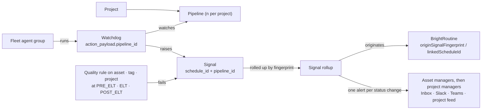

# Projects at enterprise scale — n projects × n pipelines

## Glossary

| Term | Meaning |
|---|---|
| **MCP** | Model Context Protocol: the tool surface BrightAgent exposes to outside clients. |
| **Project** | `ProjectNode` in platform-core. The unit a team owns. Belongs to one workspace through `GOVERNS`. |
| **Pipeline** | One `WorkflowSpecNode` inside a project. Today a project has exactly one; this spec makes it many (decision 1). |
| **Fleet** | The BrightAgent agent groups reported by `get_fleet_health` (14 groups today, each with a capability list). |
| **Watchdog** | A scheduled agent (agent service `/manage/scheduled-agents`, MCP `list_scheduled_agents`). Types: `quality_check_task`, `profiler_task`, `pipeline_watchdog_task`, `execute_workflow`, `detect_recurring_patterns`, `fleet_health_digest_task`. |
| **Signal** | A BrightSignals event (MCP `list_workspace_signals`, platform-core `notifications`). A **signal rollup** is all signals sharing one fingerprint `(workspace, stage, status, subject)`, shown once with a count. |
| **Routine** | A BrightRoutines suggestion or scheduled routine (`routineSuggestionsForWorkspace`, `scheduledRoutinesForWorkspace`). |
| **Pipeline story** | The answer the Workflows page gives per pipeline: fleet → watchdogs → signals → routines. |
| **Asset owner / managers** | The owner is the Organization or Project that `OWNS` a data asset, never a person. The managers are the people who `MANAGE` it: the asset's accountable people (the model has no steward). |
| **Tag group** | All assets in one workspace that carry one tag. |
| **Quality rule** | A `QualityRuleNode`: one check (a GX (Great Expectations) expectation or SQL), a severity and a target. |
| **Stage** | Where in the ELT (extract, load, transform) flow a rule runs: `PRE_ELT` (before load), `ELT` (during transform), `POST_ELT` (after load). These names exist in code. |
| **Alert** | One push to one person on one channel about one status change of a rollup. |
| **Channel** | Where an alert lands: `INBOX` (webapp bell), `SLACK`, `TEAMS` (Microsoft Teams), `PROJECT_FEED`. |

## 1. Context

Nestlé runs worldwide and needs **hundreds of projects with several pipelines each**. For every project and pipeline, the Workflows page must say:

> *This fleet is scanning these pipelines → these watchdogs monitor them → these are the signals they raised → hence these BrightRoutines.*

Data teams also need to **guard their data at every stage**. Assets have owners and managers, assets can be grouped by tag, and assets live in projects. So a quality rule can attach to an asset, a tag group or a project, at a named stage (before load, during transform, after load). When it fails, the asset's managers hear first, then the project's managers, on the channels each person chose.

All of this under full control (who may create, change and pause what), full audit (every rule change and every alert traceable to a person and a time) and full monitoring without alert fatigue. The page may only claim a link the data actually has.



### What the data supports today — projects, pipelines, signals

| Link | Today | Source |
|---|---|---|
| Project → pipelines | Exactly **one**: `workflowSpec @relationship(type:"HAS_SPEC")`. `createWorkflowSpec` is idempotent; `getWorkflowSpec(workspaceId, projectId)` returns one. | platform-core `src/graphql/ogm/pipeline-typedefs.ts:237` |
| Project list | `GetProjectsDocument` loads every project with owner, managers and counts. The Workflows picker (webapp #1488, BH-1625) is a plain select. | webapp |
| Watchdog → what it watches | `action_payload.data_asset_ids` (quality, profiler); `action_payload.project_id` (`execute_workflow`, optional for `pipeline_watchdog_task`). **No pipeline id.** MCP `ScheduledAgent` drops `action_payload`. | agent service |
| Signal → watchdog / pipeline | `event_id, stage, status, severity, timestamp, asset_id, metadata`. **No schedule, project or pipeline id.** | BrightSignals |
| Routine → origin | Routines carry `projectId`. `patternId` points to a cluster of **chat** requests. `linked_schedule_id` is stored, not exposed. **"Signal → routine" does not exist in data.** | platform-core |
| Fleet → pipeline | Concerns carry `subject_id` (schedule or asset id). **Nothing says which pipeline an agent scans.** | `get_fleet_health` |

### What exists today — assets, rules, alerts

Legend: ✅ works · ⚠️ partly works · ⚪ missing. PC = brighthive-platform-core, BB = brightbot, SS = brightbot-slack-server, WA = brighthive-webapp.

| Piece | State | Today | Where |
|---|---|---|---|
| Asset owner + managers | ✅ | One owner (Organization or Project) via `OWNS`, any number of managers (users) via `MANAGES`. Create paths set the creator's org as owner and the creator as manager. | PC `ogm/typedefs.ts:608-609`, `service/neo4j/data-asset.ts:810-853` |
| On-prem dbt outputs | ⚠️ | Project owner, **zero managers**; only admins can edit them. | PC `service/neo4j/onprem-run-report.ts:323-327`, `service/auth.ts:106-186` |
| Changing owner / managers | ⚠️ | `updateDataAsset` only swaps Organization owners, accepts any org id, accepts `managerIds: []`. No owner picker; MCP has owner tools for projects only. | PC `models/data-asset.ts:2152-2289`; BB `mcp/tools/project_access_writes.py:268` |
| Tags | ⚠️ | `TagNode` name is unique **globally**, no workspace edge, no tag listing query, no tag filter. | PC `ogm/typedefs.ts:360-372`, `schema/typedefs.ts:2103-2107` |
| Rule targets | ⚠️ | Asset, input group, product group, tag, transformation, destination. **No project target.** No target or stage picker in the webapp. | PC `schema/quality-stage-typedefs.ts:24-63`; WA `Governance/components/QualityRuleDrawer.tsx:95` |
| Which rules run | ⚠️ | BrightAgent runs only `ACTIVE` rules attached directly to the asset. Tag, group and workspace-wide rules are listed but **never run**. New rules start `DRAFT` and nothing activates them. | BB `tools/ogm_queries.py:255-261` vs PC `service/neo4j/quality-rule.ts:240-275` |
| Stage | ⚠️ | Stored and derived from the lineage tier; **no caller passes it**, so every run runs every stage. The "ingestion" run fires **after** load. Nothing checks data before load. | BB `sub_agents/quality_check_agent.py:274-281`; PC `new_openmetadata_webhook_lambda/utils/quality_check_trigger.py:59-75` |
| During-transform checks | ⚠️ | Workflow test steps (`quality_test`, `dbt_test_gate`, `dbt_test`, `sql_assertion`) never read or write quality rules. | PC `service/workflow/pipeline-node-catalog.ts:210-232` |
| Rule change audit | ⚪ | Only `createdBy` and console lines; no `modifiedBy`; delete hard-deletes rule and history. | PC `models/quality-rule.ts:141-240`, `service/neo4j/quality-rule.ts:453-466` |
| Who gets a failure | ⚪ | Only a scheduled run's creator. Asset managers and project managers are never addressed. | BB `quality_check_agent.py:1820-1823` |
| Inbox | ⚠️ | Backend built; webapp bell behind `VITE_NOTIFICATIONS_ENABLED` (off); producers publish only with the per-workspace `NOTIFICATIONS` flag (off). | PC `service/aws/notification-inbox.ts`; WA `Notifications/notificationsFlag.ts` |
| Slack | ✅ | Live via the slack-server poller: workspace channel (admins) or personal DM. | SS `notifications/channels/slack.ts` |
| Teams | ⚠️ | Teams subscriptions can be created; **nothing delivers**. A workspace Teams row makes Slack post to the webhook URL, fail and stall the poller. | SS `notifications/poller.ts:503-510`; PC `lambdas/notification_dispatcher/delivery.py:281-320` (not deployed) |
| Project feed | ⚪ | Project events reach only the user who triggered them. | BB `routes/project_activation_check_routes.py:238-250` |
| Per-person channel choice | ⚪ | Only Slack subscriptions; the webapp channel picker is never rendered and has no backend. | WA `Notifications/sections/PreferencesSection.tsx` |
| Dedup | ⚠️ | `idempotencyKey` is not on `PublishNotificationInput`, so every publish is new; the poller **drops** keyed event ids. | PC `schema/typedefs.ts:4278-4293`; SS `notifications/poller.ts:479-484` |
| Delivery audit | ⚪ | Log lines, 7-day Slack claims, 30-day user-deletable inbox rows. | SS `notifications/observe.ts` |
| Signal read-back privacy | ⚠️ | `getDataAssetNotifications` / MCP `list_workspace_signals` return `visibility='user'` signals to any member. | PC `models/notifications.ts:800-842` |

### What staging shows (2026-10-08)

| Workspace | Watchdogs | Signals (last 200) | Routines |
|---|---|---|---|
| OneTen | 10 (5 on): 3 quality checks all failing "Warehouse configuration not found or incomplete"; profiler OK; weekly workflow failing | **5 distinct** `(stage, status, subject)`; one check failed **143 times in a row** | 1 pattern, 0 scores, 0 offered suggestions |
| Second workspace | 8: a quality check on a deleted asset failing every 4 h; a daily workflow failing; 2 ETL (extract, transform, load) jobs with source unreachable | **15 distinct**; **168 repeats** of one failure | 0 routines, 0 scores |

The pattern detector (`detect_recurring_patterns`) is **disabled since 2026-07-13**. `get_fleet_health` reports BrightSignals unreadable for OneTen while `list_workspace_signals` reads it. At Nestlé's scale these become hundreds of identical alerts per pipeline, sent to nobody who owns the data, and no routines.

### Control and audit today

- Every platform-core GraphQL mutation is audited as a call (BH-1579, `platform.audit.action`); every agent-service write is audited (BH-1580). Neither stores a rule's before/after. MCP writes are confirm-gated and need `mcp:write`.
- Authorization (BH-1464 permission matrix): staging enforces CREATE/UPDATE/DELETE/RUN with READ shadowed; dev and prod shadow every verb. Rule CRUD is checked at `WORKSPACE` level only (no `QUALITY_RULE` kind). `OWNER_OR_MANAGER` never matches assets: `updateDataAsset` passes no `dataAssetIdLoc`.
- Cross-tenant fixes are on staging, **not prod**: BH-1586, BH-1588, BH-1589, the `deleteProject` id probe. BH-1624 is open. Project link mutations (`addResourceToProject`, `addDataAssetToProject`) do not check the project's workspace; `removeDataAssetFromProject` has no `workspaceId`. Plaintext keys in platform-core `configuration.py`, rotation pending owner approval.

### Decisions (Kuri, 2026-10-09)

1. **A pipeline is the existing `WorkflowSpecNode`**, many per project. No separate pipeline node.
2. **On-prem runner credentials are per pipeline.** Each pipeline gets its own runner login.
3. **Signals never auto-trigger routines for now**; they link only. Auto-trigger comes later behind an explicit per-routine opt-in.
4. **"The agent groups that run its watchdogs"** is enough to say which fleet scans a pipeline, for P0.
5. **Repeated failures**: alert on status change, then **one daily reminder** while it stays broken.

### Phases

| Phase | Delivers | Why first |
|---|---|---|
| **P0 — Links, dedup, owners, prod safety** | `pipeline_id` + `schedule_id` on watchdogs and signals; signal rollups with real dedup (keyed publish, poller accepts keyed ids) and the daily reminder; `linkedScheduleId` + routine origin; pattern detector back on; **one rule resolution** (asset, tag, group, workspace-wide) shared by platform-core and BrightAgent; failures routed to **asset managers then project managers** on inbox and Slack; stored audit for rule changes and alert deliveries; same-workspace checks on rule targets and project links; read-back privacy; BH-1586/1588/1589 promoted; prod enforcement ramp started | Without links the story is fiction; without owner routing, alerts reach nobody accountable; without prod authz, n tenants is n risks |
| **P1 — n pipelines, staged rules, all channels** | Pipeline id on every workflow op; expand/contract migration; `PIPELINE` and `QUALITY_RULE` permission cells; per-tenant watchdog fairness; `PROJECT` rule target; rules run at their stage (`PRE_ELT` before load, `ELT` as a pipeline step, `POST_ELT` after load); per-person channel choice; Teams delivery; project feed; workspace tag listing; owner/manager fixes | The model change |
| **P2 — The story at scale** | Paginated project and pipeline pickers; per-pipeline story with its rules and alerts on the Workflows page; rule editor with target and stage pickers; asset owner picker; MCP asset owner/manager/tag tools | The UI promise |

Until P1 lands, P0 writes `pipeline_id` = the project's single `WorkflowSpecNode.id`, so P0 data stays valid after the migration.

## 2. Interface Contract (MDE)

### 2.1 Pipeline (P1, platform-core GraphQL)

A pipeline **is** a `WorkflowSpecNode` (decision 1).

```graphql
type ProjectNode { workflowSpecs: [WorkflowSpecNode!]! @relationship(type: "HAS_SPEC", direction: OUT) }  # was singular
type WorkflowSpecNode { id: ID!  name: String!  status: PipelineStatus!  runnerLoginId: ID }  # per-pipeline runner login (decision 2)

createPipeline(input: { workspaceId: ID!, projectId: ID!, name: String! }): WorkflowSpecNode!   # not idempotent by project
pipelines(workspaceId: ID!, projectId: ID!, search: String, first: Int = 25, after: String): PipelinePage!
getWorkflowSpec(workspaceId: ID!, projectId: ID!, pipelineId: ID!): WorkflowSpecNode           # pipelineId added
```

Every workflow op takes `pipelineId: ID!`: steps, runs, issues, bindings, schedules, signals, rules. `createWorkflowSpec` is removed in the contract step.

**Migration (expand → contract):** *expand* — add `name`, `status`, accept optional `pipelineId` defaulting to the project's single spec; *backfill* — each spec becomes the project's first pipeline (`name = project.name`) and `pipeline_id` is stamped where `project_id` is known; *switch* — webapp and agent service send `pipelineId` everywhere; *contract* — `pipelineId` required, singular `workflowSpec` and `createWorkflowSpec` removed.

### 2.2 Lean project list (P2, platform-core GraphQL)

```graphql
projectsPage(workspaceId: ID!, search: String, status: ProjectStatus,
             orderBy: ProjectOrder = RECENT_ACTIVITY, first: Int = 25, after: String): ProjectPage!
type ProjectSummary { id: ID!  name: String!  status: ProjectStatus!  pipelineCount: Int!
                      openSignalRollups: Int!  lastActivityAt: DateTime }
```

Search is server-side by name. No owner or manager expansion. `first` is capped at 100.

### 2.3 Watchdogs (P0, agent service REST + MCP)

| Field | Where | Rule |
|---|---|---|
| `action_payload.project_id` | `quality_check_task`, `profiler_task`, `pipeline_watchdog_task`, `execute_workflow` | required when created inside a project |
| `action_payload.pipeline_id` | same four types | required when `project_id` is set |
| `action_payload.stage` | `quality_check_task` | optional; when set, only rules of that stage run |
| `GET /manage/scheduled-agents?project_id=&pipeline_id=` | REST | new filters, paginated |
| MCP `ScheduledAgent` | `list_scheduled_agents` | adds `project_id`, `pipeline_id`, `watched_asset_ids`, `last_status`; same filters |

Workspace-wide types (`detect_recurring_patterns`, `fleet_health_digest_task`) carry neither id.

### 2.4 Signals and dedup (P0, BrightSignals)

New fields on every watchdog or rule signal: `schedule_id`, `project_id`, `pipeline_id`, `rule_id`, `rule_stage`, `fingerprint` = hash of `(workspace_id, stage, status, subject_id)`. For a rule failure, `subject_id = rule_id + ":" + asset_id`.

`PublishNotificationInput` gains `idempotencyKey` (producers send `run_id + asset_id + rule_id`). The slack-server poller watermarks on a separate timestamp attribute, so keyed event ids are delivered, not dropped.

```graphql
signalRollups(workspaceId: ID!, projectId: ID, pipelineId: ID, ruleId: ID, status: SignalStatus,
              first: Int = 25, after: String): SignalRollupPage!
type SignalRollup { fingerprint: ID!  stage: String!  status: String!  severity: Severity!
                    subjectId: ID  scheduleId: ID  pipelineId: ID  ruleId: ID
                    count: Int!  firstSeenAt: DateTime!  lastSeenAt: DateTime!
                    lastAlertAt: DateTime  latestEventId: ID! }
```

MCP `list_workspace_signals` gains `rollup: bool = true` and the same filters. Read-back hides `visibility='user'` signals unless the caller is in the audience, and pages newest first.

### 2.5 Routine origin (P0, platform-core GraphQL)

```graphql
type RoutineSuggestion {           # also on scheduled routines
  linkedScheduleId: ID             # already stored, now exposed
  origin: RoutineOrigin!           # CHAT_PATTERN | SIGNAL | SCHEDULE
  originSignalFingerprint: ID      # set when origin = SIGNAL; a link, never a trigger (decision 3)
  originScheduleId: ID
  pipelineId: ID
}
```

### 2.6 Pipeline story (P0 data, P2 page; agent service REST + MCP)

```text
GET /manage/projects/{project_id}/pipelines/{pipeline_id}/story
MCP get_pipeline_story(project_id, pipeline_id)
→ { pipeline, fleet: [AgentGroupRef], watchdogs: [WatchdogRef], rules: [RuleRef], signals: [SignalRollup],
    routines: [RoutineRef], gaps: [{ link, reason }] }
```

- `fleet` = the agent groups that run this pipeline's watchdogs (decision 4), labelled "runs these watchdogs". `rules` = the rules that resolve to this pipeline's assets, by stage.
- `gaps` lists every link the page cannot claim (for example, "3 signals have no schedule id: published before P0").

### 2.7 Control (P1, platform-core permission matrix)

New resource kinds `PIPELINE` and `QUALITY_RULE`. Watchdogs use the `ROUTINE` kind from BH-1572, with a new `CREATE · ROUTINE` cell. `@authorized` on every asset, project-link and rule op passes the resource id (`dataAssetIdLoc`, `projectIdLoc`), and `OWNER_OR_MANAGER` on an asset matches its managers.

| Role | CREATE/UPDATE/DELETE · PIPELINE | CREATE/UPDATE/RETIRE · QUALITY_RULE | CREATE · ROUTINE | UPDATE/RUN · ROUTINE |
|---|---|---|---|---|
| WORKSPACE_ADMIN | allow | allow | allow | allow |
| COLLABORATOR | `OWNER_OR_MANAGER` of the project | manager of the target asset or project | `OWNER_OR_MANAGER` of the project | `OWNER_OR_MANAGER` |
| CONTRIBUTOR, VIEWER, AGENT_GUEST | none | none | none | none |

### 2.8 Fairness (P1, scheduler)

Per-workspace cap on concurrent watchdog runs (`TierConfig.max_concurrent_watchdogs`, per-environment default) and round-robin across projects inside a workspace. Uses the cron + SQS (Amazon Simple Queue Service) fan-out of `brightroutines-detector-fanout-fairness.md`.

### 2.9 Asset owners and tags (P0 rules, P1 fixes, P2 tools)

- **Accountable people for an asset** = its managers. If the asset has no managers and its owner is a Project (on-prem dbt outputs), the Project's managers stand in.
- `updateDataAsset` (P1): `ownerId` must be an Organization in the workspace or a Project the workspace `GOVERNS`; the swap covers the whole owner union; `managerIds` must be active workspace members and never empty. On-prem dbt runs add the triggering user as manager.
- New queries (P1): `dataAssetOwnerCandidates(workspaceId, dataAssetId)`, `workspaceTags(workspaceId, search, first, after): [{ id, name, assetCount }]`, and a `tags` filter on `DataAssetFilterInput`.
- MCP (P2): `list_asset_managers`, `change_asset_owner_or_managers` (confirm-gated, `ToolAuthzTarget(UPDATE, DATA_ASSET)`), and `discover_data_assets` returns owner, managers and tags.
- A tag group is always read through the workspace: an asset is in tag group T for workspace W only if W `USES` the asset.

### 2.10 Quality rules on assets, tag groups and projects (P0 resolution, P1 project target + stages)

```graphql
enum QualityRuleTargetKind { DATA_ASSET ASSET_GROUP FINAL_PRODUCT_GROUP TAG TRANSFORMATION DESTINATION PROJECT }  # PROJECT new (P1)
enum QualityRuleStage { PRE_ELT ELT POST_ELT }                                                                  # exists

createQualityRule(input: { workspaceId: ID!, targetKind: QualityRuleTargetKind!, targetIds: [ID!]!,
                           stage: QualityRuleStage, pipelineId: ID, status: QualityRuleStatus = DRAFT, ... }): QualityRule!
retireQualityRule(workspaceId: ID!, ruleId: ID!, reason: String!): QualityRule!   # replaces hard delete
rulesForAsset(workspaceId: ID!, assetId: ID!, stage: QualityRuleStage): [QualityRule!]!
qualityRuleHistory(workspaceId: ID!, ruleId: ID!, first: Int = 25, after: String): QualityRuleChangePage!
type QualityRuleChange { action: CREATED | UPDATED | STATUS_CHANGED | RETIRED
                         actorId: ID!  at: DateTime!  before: JSON  after: JSON  reason: String }
```

**One resolution rule**, used by `rulesForAsset` and by BrightAgent's runner: the `ACTIVE` rules of the workspace whose target is the asset, a tag the asset carries now, a group or project that includes the asset now, or `ALL_ASSETS`; filtered by stage, where a rule with no stage counts as `POST_ELT`. A `PROJECT` target covers the project's direct assets, input groups and product groups.

**Where each stage runs** (P1):

| Stage | Runs | Trigger |
|---|---|---|
| `PRE_ELT` (before load) | against the source or landing table before the load step | the pipeline's load step calls the runner with `stage=PRE_ELT` |
| `ELT` (during transform) | as a pipeline test step bound to the library | `quality_test` / `sql_assertion` steps run the stage's rules and write rule executions |
| `POST_ELT` (after load) | after the data product is built | ingestion trigger, scheduled watchdog, on-demand button; each passes `stage=POST_ELT` |

Each execution stores `workspaceId`, `projectId`, `pipelineId`, `stage`, `runContext` and `ruleId`.

### 2.11 Alert routing and channels (P0 inbox + Slack, P1 Teams + project feed + choice)

On each status change of a rule rollup (and once a day while it stays failing, decision 5), recipients are built in this order; a person reached twice keeps the first reason:

1. `ASSET_MANAGER` — the asset's accountable people (§2.9).
2. `PROJECT_MANAGER` — managers of the rule's project context: the `PROJECT` target, or the project whose pipeline ran the check.
3. `SUBSCRIBER` — existing subscription rows that match.

Anyone who is not an active member of the rule's workspace is dropped. If nobody is left, the workspace admins get it (open question 3).

```graphql
enum AlertChannel { INBOX SLACK TEAMS PROJECT_FEED }
setMyAlertChannels(workspaceId: ID!, channels: [AlertChannel!]!): AlertChannelChoice!   # default [INBOX]
projectFeed(workspaceId: ID!, projectId: ID!, first: Int = 25, after: String): ProjectFeedPage!
alertDeliveries(workspaceId: ID!, fingerprint: ID, ruleId: ID, first: Int = 25, after: String): AlertDeliveryPage!
type AlertDelivery { fingerprint: ID!  statusChange: String!  isReminder: Boolean!  userId: ID
                     reason: ASSET_MANAGER | PROJECT_MANAGER | SUBSCRIBER  channel: AlertChannel!
                     outcome: DELIVERED | FAILED | SKIPPED  at: DateTime! }
```

- `PROJECT_FEED` is one post per project per status change, visible to project members (P1).
- Teams gets its own delivery channel in the slack-server poller, and subscriptions are filtered by channel type before delivery (P1).
- The delivery claim key is `(fingerprint, status change or reminder day, user, channel)`. `AlertDelivery` rows are stored for 400 days and users cannot delete them.

## 3. Invariants (DbC)

- **INV-1** WHEN a watchdog is created inside a project, THE System SHALL store both `project_id` and `pipeline_id`, and the pipeline SHALL belong to that project and workspace.
- **INV-2** WHEN a watchdog or rule publishes a signal, THE System SHALL stamp `schedule_id` or `rule_id`, and `project_id` + `pipeline_id` when known.
- **INV-3** WHILE a fingerprint's status is unchanged, THE System SHALL NOT push another alert except one daily reminder while it is failing. A status change pushes once.
- **INV-4** THE pipeline story SHALL NOT show a link the stored data does not carry. Missing links go to `gaps`.
- **INV-5** IF a routine has `origin = SIGNAL`, THEN `originSignalFingerprint` SHALL resolve to a rollup in the same workspace, and no signal SHALL start a routine.
- **INV-6** Every op on a pipeline, its steps, runs, schedules, signals or project links SHALL check that every id belongs to the caller's workspace before acting.
- **INV-7** Every create, pause, resume, run and delete of a pipeline or watchdog SHALL produce one `platform.audit.action` record carrying `workspace_id`, `project_id`, `pipeline_id`, the acting user and, for scheduled runs, the run-as user.
- **INV-8** No workspace SHALL hold more than its `max_concurrent_watchdogs` running watchdogs, and a due watchdog in any workspace SHALL start within its schedule interval.
- **INV-9** `projectsPage`, `pipelines`, `signalRollups`, `projectFeed` and `alertDeliveries` SHALL return at most `first` items (≤ 100).
- **INV-10** After migration, every project SHALL have at least one pipeline, and every pre-migration spec SHALL be a pipeline of its original project.
- **INV-11** The pattern detector SHALL run on its schedule in every environment where BrightRoutines is on.
- **INV-12** A rule and every asset, tag, group and project it targets SHALL share one workspace. IF a target id is unknown or belongs to another workspace, THEN THE System SHALL return the same `ForbiddenError` with the same message.
- **INV-13** THE System SHALL send a rule alert only to active members of the rule's workspace, asset managers first, then project managers, on each person's chosen channels, and at most once per `(fingerprint, status change, person, channel)`.
- **INV-14** Every rule create, update, status change and retire, and every alert delivery, SHALL store a record with actor (or recipient), time and outcome. Rules SHALL be retired, never hard-deleted.
- **INV-15** BrightAgent and platform-core SHALL resolve the same rule set for an asset and stage, and a run with a stage SHALL execute only that stage's rules.

## 4. Acceptance Criteria (BDD)

```gherkin
Feature: Projects at enterprise scale

  Scenario: Pipeline story shows the real chain
    Given pipeline P1 in project "Coffee EU" has a quality-check watchdog W
    And W failed 143 times on the same table
    When an analyst opens P1 on the Workflows page
    Then the page shows the agent group that runs W, W, its rules by stage, one signal rollup with count 143, and the routine linked to it

  Scenario: Repeated failure alerts once, then daily
    Given a fingerprint is already failing and alerted today
    When W fails again 20 times that day
    Then the rollup count goes up by 20 and nobody gets another alert until the next day's single reminder

  Scenario: Recovery alerts once
    Given a fingerprint is failing
    When W succeeds
    Then each recipient gets one recovery alert per chosen channel

  Scenario: Missing links are shown as gaps
    Given signals published before P0 have no schedule id
    When the pipeline story is requested
    Then those signals appear under gaps, not linked to any watchdog

  Scenario: Hundreds of projects load fast
    Given a workspace with 500 projects
    When a user searches "coffee" in the project picker
    Then the server returns at most 25 matching projects ordered by recent activity

  Scenario: Create a second pipeline and migrate the first
    Given project "Coffee EU" was created before P1 with one workflow spec and two watchdogs
    When the backfill runs and a project manager creates pipeline "Returns"
    Then the old spec is the first pipeline, both watchdogs carry its id, and "Returns" has its own steps, runs and watchdogs

  Scenario: Collaborator who does not manage the project cannot add a watchdog or rule
    Given collaborator C manages neither "Coffee EU" nor its assets
    When C creates a watchdog on pipeline P1 or a rule on the project
    Then the response is 403 and nothing is created

  Scenario: Foreign or unknown ids get the same answer
    Given asset A, tag T and pipeline P1 belong to workspace X
    When an admin of workspace Y targets A or T with a rule, links A to a Y project, or pauses P1's watchdog
    And the same admin uses an id that exists nowhere
    Then every request gets the same ForbiddenError and reveals nothing

  Scenario: Every watchdog action is audited per pipeline
    When an admin pauses watchdog W on P1
    Then one audit record carries workspace, project, pipeline, schedule and the admin

  Scenario: One tenant cannot starve the others
    Given workspace A has 2,000 due watchdogs and workspace B has 3
    When the scheduler runs
    Then A never exceeds its concurrency cap and B's 3 start within their interval

  Scenario: Routine traces to its signal without being triggered by it
    Given a routine was suggested from a signal rollup
    When the rollup fails again
    Then the routine shows origin SIGNAL, the fingerprint and the watchdog, and it does not run

  Scenario: Pattern detector is learning
    Given BrightRoutines is on in staging
    Then detect_recurring_patterns has run in the last 24 hours and routine scores are visible to admins

  Scenario: Rule on a tag group runs at its stage
    Given a POST_ELT rule on tag "PII" and asset A tagged "PII" after the rule was made
    When the scheduled quality check runs on A with stage POST_ELT
    Then the rule runs on A, BrightAgent and rulesForAsset list the same rules, and PRE_ELT rules do not run

  Scenario: Before-load rule runs in the pipeline
    Given a PRE_ELT rule on project "Coffee EU" and pipeline P1 with a load step
    When P1 runs
    Then the rule runs before the load step and its execution records the pipeline and stage

  Scenario: Failure reaches the asset managers, then the project managers
    Given asset A is managed by Ana, who chose Slack and Teams, and "Coffee EU" is managed by Bo, who chose the inbox
    And Ana also manages "Coffee EU"
    When a rule on A fails inside P1
    Then Ana gets one alert on Slack and one on Teams, Bo gets one inbox alert, the project feed gets one post, and a member of another workspace gets nothing

  Scenario: Rule changes and alerts are audited
    When manager Ana raises a rule's threshold and later retires it
    Then qualityRuleHistory shows both changes with Ana, the time, before and after
    And alertDeliveries lists every alert the rule sent, with recipient, channel and outcome
```

## 5. Out of Scope

- Signals **triggering** routines (decision 3; later behind a per-routine opt-in) and building per-pipeline runner logins (decision 2 fixes the shape; the build is its own ticket).
- Cross-workspace views (a Nestlé-wide view across workspaces).
- Email alerts. `EMAIL` stays reserved on routine delivery targets.
- Fixing the Snowflake config fallback gap (BH-684 configured-rule path) and the deleted-asset quality check. The story surfaces them as failures.
- Whether the workspace catalog should hide `RESTRICTED` assets. Ownership here only routes alerts and gates edits.
- Rotating the committed `configuration.py` keys (owner approval pending).

## 6. Dependencies

| Dependency | Needed by |
|---|---|
| BH-1625 (webapp #1488, Workflows project picker) | P2 replaces its plain select |
| BH-1579, BH-1580 (audit); BH-1464 + ADR-0003 (permission matrix) and its prod enforcement ramp | INV-7; P0 starts the ramp, P1 cells need it |
| BH-1586, BH-1588, BH-1589, `deleteProject` id probe — promoted to prod; BH-1624 | P0 (INV-6) |
| BH-1572..BH-1577 (`ROUTINE` kind) | §2.7 watchdog cells |
| `brightroutines-detector-fanout-fairness.md` (BH-876, parked) | §2.8 |
| BH-1331 / BH-1340 (fleet health, digest) | §2.6 fleet, rollup-aware digest |
| Per-workspace `NOTIFICATIONS` flag on, `VITE_NOTIFICATIONS_ENABLED` on, notification tables in prod (verify, do not cite the runbook) | P0 inbox alerts |
| PC ADR-0001 and `SPEC-STAGED-QUALITY-LINEAGE` (still Proposed/Draft) accepted | §2.10 stages |
| No ticket yet: re-enable `detect_recurring_patterns`; `get_fleet_health` BrightSignals read for OneTen; asset-alert routing; rule resolution parity; rule audit | P0 |

## 7. Correctness Properties

### Property 1: No cross-tenant access
*For any* pipeline, watchdog, signal, routine, rule, asset, tag or project id and any caller, an op succeeds only if every id belongs to the caller's workspace; unknown and foreign ids give the same error.
**Validates: §3 INV-1, INV-6, INV-12, §4 "Foreign or unknown ids get the same answer"**

### Property 2: The story never invents a link
*For any* pipeline story, every arrow shown is backed by a stored id, and every missing one is listed in `gaps`.
**Validates: §3 INV-2, INV-4, INV-5, §4 "Pipeline story shows the real chain", "Missing links are shown as gaps"**

### Property 3: Pushes follow status, not volume
*For any* sequence of signals with one fingerprint, pushes per recipient and channel = status changes + one per calendar day spent failing.
**Validates: §3 INV-3, §4 "Repeated failure alerts once, then daily", "Recovery alerts once"**

### Property 4: Migration loses nothing
*For any* pre-migration project, its spec, runs and watchdogs are reachable through exactly one pipeline after backfill.
**Validates: §3 INV-10, §4 "Create a second pipeline and migrate the first"**

### Property 5: Fair scheduling
*For any* load across workspaces, each workspace's running watchdogs stay within its cap and no due watchdog waits longer than its interval.
**Validates: §3 INV-8, §4 "One tenant cannot starve the others"**

### Property 6: An alert reaches only people in the rule's workspace
*For any* rule failure, every recipient of every alert, on every channel and in the project feed, is an active member of the rule's workspace.
**Validates: §3 INV-12, INV-13, §4 "Failure reaches the asset managers, then the project managers"**

### Property 7: One alert per status change across all channels
*For any* status change and any person, that person gets at most one alert per channel they chose, however many routes (asset manager, project manager, subscriber) reach them, and the project feed gets one post.
**Validates: §3 INV-3, INV-13, §4 "Failure reaches the asset managers, then the project managers", "Recovery alerts once"**

### Property 8: One rule set everywhere
*For any* asset, stage and moment, `rulesForAsset` and BrightAgent's runner pick the same rules, including tag-group rules for assets tagged after the rule was made.
**Validates: §3 INV-15, §4 "Rule on a tag group runs at its stage", "Before-load rule runs in the pipeline"**

### Property 9: Nothing changes without a record
*For any* rule change or alert delivery, exactly one stored record names the actor or recipient and the time, and survives rule retirement.
**Validates: §3 INV-7, INV-14, §4 "Rule changes and alerts are audited", "Every watchdog action is audited per pipeline"**

## 8. Eval Criteria

Omitted. No new LLM behavior. The pattern detector's gate stays in `brightroutines-online-judge-eval-circuit-breaker.md`; this spec only requires that it runs (INV-11). Rules are deterministic checks.

## 9. Observability Contract

- **Audit:** `platform.audit.action` gains `project_id`, `pipeline_id`, `schedule_id`, `rule_id` attributes; rule changes and alert deliveries also land in their stored records (§2.10, §2.11).
- **Spans:** `gen_ai.tool.execute` with `gen_ai.tool.name=get_pipeline_story`; scheduled runs and rule runs carry `brighthive.project.id`, `brighthive.pipeline.id`, `brighthive.schedule.id`, `brighthive.rule.stage`.
- **Log events:** `signals.rollup.incremented`, `signals.rollup.state_changed`, `alerts.routed`, `alerts.delivered`, `alerts.reminder_sent`, `alerts.no_recipient`, `quality_rule.changed`, `quality_rule.stage_skipped`, `scheduler.watchdog.deferred`, `pipelines.migration.backfilled`, `pipeline_story.gap`.
- **Metrics:** `watchdog_queue_depth{workspace}`, `watchdog_running{workspace}`, `signal_rollup_count{workspace,pipeline}`, `signal_pushes_suppressed_total{workspace}`, `alerts_delivered_total{workspace,channel,outcome}`, `pattern_detector_last_run_age_s{workspace}`.

## 10. Test Coverage Update

| Layer | Where | Cases |
|---|---|---|
| L0 surface | platform-core schema tests; brightbot repo `brightbot/evals/layers/surface.py` | `projectsPage`, `pipelines`, `signalRollups`, routine origin, `rulesForAsset`, `qualityRuleHistory`, `alertDeliveries`, `setMyAlertChannels`, `get_pipeline_story`, `ScheduledAgent` match §2 |
| L1 routing | brightbot repo `brightbot/evals/layers/routing.py` | "what is watching pipeline X" → `get_pipeline_story`; "why so many alerts" → rollups; "who gets this rule's alerts" → `alertDeliveries` |
| L2 behavior (real stores) | brightbot `brightbot/evals/layers/behavior.py` + `tests/integration/` (moto DynamoDB); platform-core `tests/integration/` (real Neo4j); slack-server `tests/notifications/` (poller with keyed ids, Teams channel) | INV-1..INV-15: ids stamped; one push per status change + daily reminder; recipients and channels; same `ForbiddenError` for foreign and unknown; resolution parity on a real tag/group/project graph; stage filter; audit records; cap under load |
| e2e features | brighthive-e2e `e2e/features/projects/test_pipelines.py` (new, beside `test_lifecycle.py`), `e2e/features/scheduler/test_scheduled_agents.py`, `e2e/features/observability/test_audit_trail.py`, `e2e/features/governance/` quality tests | story on staging; second pipeline; tag rule fails → asset manager inbox + Slack; foreign ids refused |
| e2e surfaces | brighthive-e2e `e2e/surfaces/test_routines.py`, `test_routes.py`, `test_webapp.py` | §2 shapes against the real backend; picker returns ≤ 25 |

At least one L2 case and every e2e case run against real backends, never mocks.

## Open Questions for Kuri

1. **Nestlé tenancy.** One workspace with hundreds of projects, or one workspace per region? It changes where fairness matters.
2. **Teams: build or drop?** Subscriptions exist but nothing delivers. Proposal: build it in P1 inside the slack-server poller; until then, block creating Teams subscriptions.
3. **Asset with no accountable person.** Org-owned, zero managers, outside a project. Proposal: workspace admins get it, and the alert says "this asset has no manager".
4. **Does a tag rule cover assets tagged later?** This spec says yes (resolved at run time). Alternative: freeze the asset list when the rule is made.
5. **Project managers: at once or on escalation?** This spec alerts both at once. Alternative: project managers only if no asset manager acknowledges within N hours.
6. **May a person mute a channel for one project?** For example, Slack for "Coffee EU" only. This spec has one channel choice per workspace.
7. **Should a failing `PRE_ELT` rule stop the load?** This spec only alerts. Blocking would make before-load rules a gate on the pipeline.
8. **Tags per workspace or global?** Today a tag name is shared across all tenants. This spec keeps global tags and anchors every read to the workspace; a workspace-scoped tag is cleaner but needs a migration.
