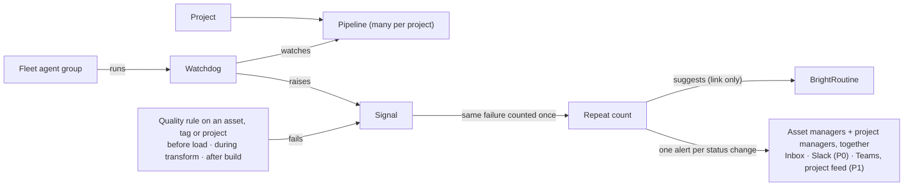

# Projects at enterprise scale — n projects × n pipelines

## The story in one table

| Question | Answer | When |
|---|---|---|
| **Who owns the data?** | Every asset belongs to an Organization or a Project. Its **managers** are the accountable people (what many companies call data stewards). An asset with no managers falls back to its project's managers, then to the workspace admins (open question 3). | owners exist today; fixes in P1 |
| **What checks the data?** | Quality rules on one asset, a tag, a group of assets or a whole project, at a stage: before load, during transform, or after the data product is built. | asset, tag, group in P0; project and stages in P1 |
| **Who hears about a failure, and where?** | The asset's managers and the project's managers, **together**. Inbox and Slack in P0; each person's own channel choice, Teams and the project feed in P1. | P0 / P1 |
| **What is recorded?** | Every rule change and every alert sent, with who and when, kept 400 days. | P0 |

## Glossary

| Term | Meaning | In code |
|---|---|---|
| **Acronyms** | ADR (Architecture Decision Record) · BDD (Behavior-Driven Development) · CDO (Chief Data Officer) · CRUD (create, read, update, delete) · DbC (Design by Contract) · dbt (data build tool) · e2e (end-to-end) · ELT (extract, load, transform) · ETL (extract, transform, load) · GraphQL (the platform-core query API) · GX (Great Expectations) · JSON (JavaScript Object Notation) · L0/L1/L2 (surface / routing / behavior test layers) · MCP (Model Context Protocol: the tool surface BrightAgent exposes to outside clients) · MDE (Model-Driven Engineering) · PII (personally identifiable information) · REST (plain HTTP web API) · SQL (Structured Query Language) · SQS (Amazon Simple Queue Service) · UI (user interface) | PC = brighthive-platform-core, BB = brightbot, SS = brightbot-slack-server, WA = brighthive-webapp |
| **Project** | The unit a team owns, inside one workspace. | `ProjectNode`, tied to its workspace by `GOVERNS` |
| **Pipeline** | One flow of steps inside a project. Today a project has exactly one; this spec makes it many (decision 1). | `WorkflowSpecNode` |
| **BrightAgent / agent service** | BrightAgent is the product. The agent service is its backend, which also runs scheduled agents. Same system. | BB, `/manage/*` routes |
| **Fleet** | BrightAgent's groups of agents, each with a list of skills (14 groups today). | `get_fleet_health` |
| **Watchdog** | A scheduled agent that checks something on a timer. | `/manage/scheduled-agents`, MCP `list_scheduled_agents`; types `quality_check_task`, `profiler_task`, `pipeline_watchdog_task`, `execute_workflow`, `detect_recurring_patterns`, `fleet_health_digest_task` |
| **Signal** | One event a watchdog or rule raises (passed, failed, warning). | BrightSignals; MCP `list_workspace_signals`; PC `notifications` |
| **Repeat count** | All signals about the same thing at the same stage, shown once with a count and its current status. Its same-failure key ignores status, so a status change updates it instead of starting a new one. | `SignalRollup`, keyed by `fingerprint` |
| **Routine** | A BrightRoutines suggestion or scheduled routine. | `routineSuggestionsForWorkspace`, `scheduledRoutinesForWorkspace` |
| **Pipeline story** | The answer the Workflows page (the webapp page for a project's pipelines, runs and health) gives per pipeline: fleet → watchdogs → rules → signals → routines. | `get_pipeline_story` |
| **Asset owner / managers** | The owner is the Organization or Project the asset belongs to, never a person. The managers are the accountable people. | `OWNS`, `MANAGES` |
| **Input group / product group** | A named set of assets feeding a project / the finished assets a project delivers (its data product). | `ASSET_GROUP`, `FINAL_PRODUCT_GROUP` |
| **Tag group** | All assets in one workspace that carry one tag (tagged inside that workspace, §2.9). | `TagNode`, `TAGGED` |
| **Quality rule** | One check (a GX expectation, i.e. a named test such as "column is never null", or a SQL query), a severity, a target and a status. | `QualityRuleNode` |
| **Stage** | When a rule runs: Before load · During transform · After the data product is built. | `PRE_ELT` · `ELT` · `POST_ELT` (exist in code) |
| **On-prem runner** | Software in the customer's own network that runs a pipeline's steps; it signs in with its own runner login. | on-prem dbt runner |
| **Alert** | One message about one status change of a repeat count (or its daily reminder), to one person on one channel or to one destination. | `AlertDelivery` |
| **Channel / destination** | A channel is where a person chose to be told: inbox bell, Slack, Teams. A destination is a shared place not tied to one person: a workspace Slack channel, a Teams channel, the project feed. | `AlertChannel`, `DeliveryChannel` |
| **Roles** | Workspace admin: everything in the workspace. Collaborator: creates and changes what they manage. Contributor, viewer, agent guest (an outside agent's login): read only, for everything in this spec. | `WORKSPACE_ADMIN`, `COLLABORATOR`, `CONTRIBUTOR`, `VIEWER`, `AGENT_GUEST` |

## 1. Context

Nestlé runs worldwide and needs **hundreds of projects with several pipelines each**. For every project and pipeline, the Workflows page must say:

> *This fleet is scanning these pipelines → these watchdogs monitor them → these are the signals they raised → hence these BrightRoutines.*

Data teams also need to **check their data at every stage** and to know who is told when a check fails. Assets have owners and managers, can be grouped by tag, and live in projects, so a quality rule can attach to an asset, a tag group or a project at a named stage. When it fails, the asset's managers and the project's managers are alerted together.

**End state (P2):** every rule change and every alert is stored for 400 days with who and when; creating, changing and pausing are limited by role; one alert per status change plus one daily reminder while something stays broken; the page claims only links the data actually has. **P0 delivers** the real links, no duplicate alerts, and failure alerts to asset and project managers on inbox and Slack. Each person's channel choice, Teams (pending open question 2) and the project feed come in P1. A failing before-load rule only alerts; whether it should block the load is open question 7.



### What the data supports today — projects, pipelines, signals

| Link | Today | Source |
|---|---|---|
| Project → pipelines | Exactly **one**: `workflowSpec @relationship(type:"HAS_SPEC")`. `createWorkflowSpec` is idempotent; `getWorkflowSpec(workspaceId, projectId)` returns one. | PC `src/graphql/ogm/pipeline-typedefs.ts:237` |
| Project list | `GetProjectsDocument` loads every project with owner, managers and counts. The Workflows picker (webapp #1488, BH-1625) is a plain select. | WA |
| Watchdog → what it watches | `action_payload.data_asset_ids` (quality, profiler); `action_payload.project_id` (`execute_workflow`, optional for `pipeline_watchdog_task`). **No pipeline id.** MCP `ScheduledAgent` drops `action_payload`. | agent service |
| Signal → watchdog / pipeline | `event_id, stage, status, severity, timestamp, asset_id, metadata`. **No schedule, project or pipeline id.** | BrightSignals |
| Routine → origin | Routines carry `projectId`. `patternId` points to a cluster of **chat** requests. `linked_schedule_id` is stored, not exposed. **"Signal → routine" does not exist in data.** | PC |
| Fleet → pipeline | Concerns carry `subject_id` (schedule or asset id). **Nothing says which pipeline an agent scans.** | `get_fleet_health` |

### What exists today — assets, rules, alerts (✅ works · ⚠️ partly works · ⚪ missing)

| Piece | State | Today | Where |
|---|---|---|---|
| Asset owner + managers | ✅ | One owner (Organization or Project) via `OWNS`, any number of managers (users) via `MANAGES`. Create paths set the creator's org as owner and the creator as manager. | PC `ogm/typedefs.ts:608-609`, `service/neo4j/data-asset.ts:810-853` |
| On-prem dbt outputs | ⚠️ | Project owner, **zero managers**; only admins can edit them. | PC `service/neo4j/onprem-run-report.ts:323-327`, `service/auth.ts:106-186` |
| Changing owner / managers | ⚠️ | `updateDataAsset` only swaps Organization owners, accepts any org id, accepts `managerIds: []`. No owner picker; MCP has owner tools for projects only. | PC `models/data-asset.ts:2152-2289`; BB `mcp/tools/project_access_writes.py:268` |
| Tags | ⚠️ | `TagNode` name is unique **globally**, no workspace edge, no tag listing query, no tag filter. | PC `ogm/typedefs.ts:360-372`, `schema/typedefs.ts:2103-2107` |
| Rule targets | ⚠️ | Asset, input group, product group, tag, transformation, destination. **No project target.** No target or stage picker in the webapp. | PC `schema/quality-stage-typedefs.ts:24-63`; WA `Governance/components/QualityRuleDrawer.tsx:95` |
| Which rules run | ⚠️ | BrightAgent runs only `ACTIVE` rules attached directly to the asset. Tag, group and workspace-wide rules are listed but **never run**. New rules start `DRAFT` and no operation exists to activate them. | BB `tools/ogm_queries.py:255-261` vs PC `service/neo4j/quality-rule.ts:240-275` |
| Stage | ⚠️ | Stored and derived from the lineage tier; **no caller passes it**, so every run runs every stage. The "ingestion" run fires **after** load. Nothing checks data before load. | BB `sub_agents/quality_check_agent.py:274-281`; PC `new_openmetadata_webhook_lambda/utils/quality_check_trigger.py:59-75` |
| During-transform checks | ⚠️ | Workflow test steps (`quality_test`, `dbt_test_gate`, `dbt_test`, `sql_assertion`) never read or write quality rules. | PC `service/workflow/pipeline-node-catalog.ts:210-232` |
| Rule change audit | ⚪ | Only `createdBy` and console lines; no `modifiedBy`; delete hard-deletes rule and history. | PC `models/quality-rule.ts:141-240`, `service/neo4j/quality-rule.ts:453-466` |
| Who gets a failure | ⚪ | Only a scheduled run's creator. Asset managers and project managers are never addressed. | BB `quality_check_agent.py:1820-1823` |
| Inbox | ⚠️ | Backend built; webapp bell behind `VITE_NOTIFICATIONS_ENABLED` (off); producers publish only with the per-workspace `NOTIFICATIONS` flag (off). | PC `service/aws/notification-inbox.ts`; WA `Notifications/notificationsFlag.ts` |
| Slack | ✅ staging · prod unverified | Code on main: the slack-server poller posts to a workspace channel (admins) or a personal DM. Prod tables and env not checked. | SS `notifications/channels/slack.ts` |
| Teams | ⚠️ | Teams subscriptions can be created; **nothing delivers**. A workspace Teams row makes Slack post to the webhook URL, fail and stall the poller. The webhook URL is returned to any workspace READ role. | SS `notifications/poller.ts:503-510`; PC `lambdas/notification_dispatcher/delivery.py:281-320` (not deployed) |
| Project feed | ⚪ | Project events reach only the user who triggered them. | BB `routes/project_activation_check_routes.py:238-250` |
| Per-person channel choice | ⚪ | Only Slack subscriptions; the webapp channel picker is never rendered and has no backend. | WA `Notifications/sections/PreferencesSection.tsx` |
| Duplicate alerts | ⚠️ | `idempotencyKey` is not on `PublishNotificationInput`, so every publish is new; the poller **drops** keyed event ids. | PC `schema/typedefs.ts:4278-4293`; SS `notifications/poller.ts:479-484` |
| Delivery audit | ⚪ | Log lines, 7-day Slack claims, 30-day user-deletable inbox rows. | SS `notifications/observe.ts` |
| Signal read-back privacy | ⚠️ | `getDataAssetNotifications` / MCP `list_workspace_signals` return `visibility='user'` signals to any member. | PC `models/notifications.ts:800-842` |

### What staging shows (2026-10-08)

| Workspace | Watchdogs | Signals (last 200) | Routines |
|---|---|---|---|
| OneTen | 10 (5 on): 3 quality checks all failing "Warehouse configuration not found or incomplete"; profiler OK; weekly workflow failing | **5 distinct** `(stage, status, subject)`; one check failed **143 times in a row** | 1 pattern, 0 scores, 0 offered suggestions |
| Second workspace | 8: a quality check on a deleted asset failing every 4 h; a daily workflow failing; 2 ETL jobs with source unreachable | **15 distinct**; **168 repeats** of one failure | 0 routines, 0 scores |

The pattern detector (`detect_recurring_patterns`) is **disabled since 2026-07-13**. `get_fleet_health` reports BrightSignals unreadable for OneTen while `list_workspace_signals` reads it. Most of these failures are watchdog and workflow failures, not rule failures, so §2.11 routes both. At Nestlé's scale these become hundreds of identical alerts per pipeline, sent to nobody who owns the data, and no routines.

### Control and audit today

| Area | Staging | Prod (dev matches prod) |
|---|---|---|
| Call audit | Every PC GraphQL mutation (BH-1579, PC #1321, `platform.audit.action`) and every agent-service write (BH-1580, BB #1118) is audited as a call; neither stores a rule's before/after. Merged to `staging`; **not on develop or main**. | none |
| Permission matrix (BH-1464) | CREATE/UPDATE/DELETE/RUN enforced; READ logged but not enforced | every verb logged but not enforced |
| Rule permissions | Checked at `WORKSPACE` level only (no `QUALITY_RULE` kind). `OWNER_OR_MANAGER` never matches assets: `updateDataAsset` passes no `dataAssetIdLoc`. | same |
| `ROUTINE` kind (BH-1572) | In staging `authorized.ts:95`; develop PR #1317 still **open** | absent |
| Cross-tenant fixes | BH-1586, BH-1588, BH-1589, the `deleteProject` id probe; BH-1624 open | absent |
| Project links | `addResourceToProject`, `addDataAssetToProject` do not check the project's workspace; `removeDataAssetFromProject` has no `workspaceId` | same |
| MCP writes | Ask the user to confirm and need `mcp:write` | same |
| Committed keys | Plaintext keys in PC `configuration.py`; rotation pending owner approval | same |

### Decisions (Kuri, 2026-10-09)

1. **A pipeline is the existing `WorkflowSpecNode`**, many per project. No separate pipeline node.
2. **On-prem runner credentials are per pipeline.** Each pipeline gets its own runner login.
3. **Signals never auto-trigger routines for now**; they link only. Auto-trigger comes later behind an explicit per-routine opt-in.
4. **"The agent groups that run its watchdogs"** is enough to say which fleet scans a pipeline, for P0.
5. **Repeated failures**: alert on status change, then **one daily reminder** while it stays broken.

### Phases

| Phase | Delivers | Why first |
|---|---|---|
| **P0 — Real links, no duplicate alerts, owners alerted, prod safety** | `pipeline_id` + `schedule_id` on watchdogs and signals; repeat counts with no duplicate alerts (keyed publish, the poller delivers keyed ids) and the daily reminder; routine origin; pattern detector back on; **one answer to "which rules apply to this asset"** (asset, tag, group, all assets) shared by PC and BrightAgent; rule activation (`setQualityRuleStatus`); rule, pipeline and watchdog failures alerted to **asset and project managers together** on inbox and Slack; Slack delivery skips non-Slack subscription rows; stored records of rule changes and alerts; same-workspace checks on every id; read-back privacy; BH-1579, BH-1580, BH-1572, BH-1586, BH-1588, BH-1589 promoted to develop and prod; prod enforcement ramp started | Without links the story is fiction; without owner alerts nobody accountable hears; without prod authz, n tenants is n risks |
| **P1 — n pipelines, staged rules, all channels** | Pipeline id on every workflow op; four-step migration (§2.1); `PIPELINE` cells adjusted and `QUALITY_RULE` cells added; per-tenant watchdog fairness; `PROJECT` rule target; rules run at their stage; each person's channel choice; Teams delivery with a masked webhook; project feed; workspace tag listing; owner/manager fixes | The model change |
| **P2 — The story at scale** | Paged project and pipeline pickers; per-pipeline story with its rules and alerts on the Workflows page; rule editor with target and stage pickers; asset owner picker; MCP asset owner/manager/tag tools | The UI promise |
Until P1 lands, P0 writes `pipeline_id` = the project's single `WorkflowSpecNode.id`, so P0 data stays valid after the migration.

## 2. Interface Contract (MDE)

Shared types. Every `*Page` is `{ items: [T!]!, nextCursor: String }`; `first` defaults to 25 and is capped at 100 on every paged query and REST route.

```graphql
enum PipelineStatus { ACTIVE PAUSED ARCHIVED }    enum ProjectOrder { RECENT_ACTIVITY NAME CREATED_AT }
type AgentGroupRef { id: ID!  name: String! }    type WatchdogRef { scheduleId: ID!  type: String!  enabled: Boolean!  lastStatus: String }
type RuleRef { ruleId: ID!  name: String!  stage: QualityRuleStage!  status: QualityRuleStatus! }    type RoutineRef { id: ID!  name: String!  origin: RoutineOrigin! }
```

### 2.1 Pipeline (P1, PC GraphQL) — a pipeline **is** a `WorkflowSpecNode` (decision 1)

```graphql
type ProjectNode { workflowSpecs: [WorkflowSpecNode!]! @relationship(type: "HAS_SPEC", direction: OUT) }  # was singular
type WorkflowSpecNode { id: ID!  name: String!  status: PipelineStatus!  runnerLoginId: ID }  # per-pipeline runner login (decision 2)
createPipeline(input: { workspaceId: ID!, projectId: ID!, name: String! }): WorkflowSpecNode!   # not idempotent by project
pipelines(workspaceId: ID!, projectId: ID!, search: String, first: Int = 25, after: String): PipelinePage!
getWorkflowSpec(workspaceId: ID!, projectId: ID!, pipelineId: ID!): WorkflowSpecNode           # pipelineId added
```

Every workflow op takes `pipelineId: ID!`: steps, runs, issues, bindings, schedules, signals, rules. The change ships in four steps:

| Migration step | What happens |
|---|---|
| Expand | Add `name` and `status`; ops accept an optional `pipelineId` that defaults to the project's single spec. |
| Backfill | Each spec becomes its project's first pipeline (`name = project.name`); `pipeline_id` is written onto watchdogs and signals wherever `project_id` is known. |
| Switch | The webapp and the agent service send `pipelineId` everywhere. |
| Contract | `pipelineId` is required; the singular `workflowSpec` and `createWorkflowSpec` are removed. |

### 2.2 Lean project list (P2, PC GraphQL)

```graphql
projectsPage(workspaceId: ID!, search: String, status: ProjectStatus, orderBy: ProjectOrder = RECENT_ACTIVITY, first: Int = 25, after: String): ProjectPage!  # server-side name search
type ProjectSummary { id: ID!  name: String!  status: ProjectStatus!  pipelineCount: Int!  openSignalRollups: Int!  lastActivityAt: DateTime }  # no owner or manager expansion
```

### 2.3 Watchdogs (P0, agent service REST + MCP)

| Field | Where | Rule |
|---|---|---|
| `action_payload.project_id` | `quality_check_task`, `profiler_task`, `pipeline_watchdog_task`, `execute_workflow` | required when created inside a project |
| `action_payload.pipeline_id` | same four types | required when `project_id` is set |
| `action_payload.stage` | `quality_check_task` | optional; when set, only rules of that stage run |
| `GET /manage/scheduled-agents?project_id=&pipeline_id=` | REST | new filters, paged; `Response 4xx: { error: "forbidden" \| "not_found" \| "invalid_pipeline" }` |
| MCP `ScheduledAgent` | `list_scheduled_agents` | adds `project_id`, `pipeline_id`, `watched_asset_ids`, `last_status`; same filters |
| (none) | `detect_recurring_patterns`, `fleet_health_digest_task` | workspace-wide: carry neither id |

### 2.4 Signals and repeat counts (P0, BrightSignals)

New fields on every watchdog or rule signal: `schedule_id`, `project_id`, `pipeline_id`, `rule_id`, `rule_stage`, and `fingerprint` = hash of `(workspace_id, stage, subject_id)`. Status is **not** in the key: it is the repeat count's current state, and each status change adds one to `statusChangeSeq`. `subject_id` is `rule_id + ":" + asset_id` for a rule, and the watched asset id or the schedule id for a watchdog with no rule.

`PublishNotificationInput` gains `idempotencyKey`: `run_id + asset_id + rule_id` for rule signals, `run_id + schedule_id + subject_id` for profiler, workflow and other watchdog signals. The slack-server poller keeps its read position on a separate timestamp attribute, so keyed event ids are delivered, not dropped.

```graphql
signalRollups(workspaceId: ID!, projectId: ID, pipelineId: ID, ruleId: ID, status: SignalStatus, first: Int = 25, after: String): SignalRollupPage!
type SignalRollup { fingerprint: ID!  stage: String!  status: String!  statusChangeSeq: Int!  severity: Severity!  subjectId: ID  scheduleId: ID
                    pipelineId: ID  ruleId: ID  count: Int!  firstSeenAt: DateTime!  lastSeenAt: DateTime!  lastAlertAt: DateTime  latestEventId: ID! }
```

MCP `list_workspace_signals` gains `rollup: bool = true` and the same filters. Every read of signals (`signalRollups`, `list_workspace_signals`, the pipeline story) hides `visibility='user'` signals unless the caller is in the audience, and pages newest first.

### 2.5 Routine origin (P0, PC GraphQL)

```graphql
type RoutineSuggestion { linkedScheduleId: ID  origin: RoutineOrigin!  originSignalFingerprint: ID  originScheduleId: ID  pipelineId: ID }  # also on scheduled routines
enum RoutineOrigin { CHAT_PATTERN SIGNAL SCHEDULE }
```

`linkedScheduleId` is already stored and now exposed. `originSignalFingerprint` is set when `origin = SIGNAL`: a link, never a trigger (decision 3).

### 2.6 Pipeline story (P0 data, P2 page; agent service REST + MCP)

```text
GET /manage/projects/{project_id}/pipelines/{pipeline_id}/story
MCP get_pipeline_story(project_id, pipeline_id)
→ 200 { pipeline, fleet: [AgentGroupRef], watchdogs: [WatchdogRef], rules: [RuleRef], signals: [SignalRollup], routines: [RoutineRef], gaps: [{ link, reason }] }
→ 4xx { error: "forbidden" | "not_found" | "invalid_pipeline" }
```

`fleet` = the agent groups that run this pipeline's watchdogs (decision 4), labelled "runs these watchdogs". `rules` = the rules that apply to this pipeline's assets (§2.10), by stage. `signals` apply the §2.4 audience filter. `gaps` lists every link the page cannot claim (for example, "3 signals have no schedule id: published before P0").

### 2.7 Control (P1, PC permission matrix)

`PIPELINE` **already exists** in `AuthResourceKind` on develop (`authorized.ts:91`) and guards pipeline ops today (`typedefs.ts:444` READ, `:4528` CREATE, `:4712`/`:4714` CREATE/DELETE with `projectIdLoc`). P1 adjusts its matrix cells and adds `OWNER_OR_MANAGER` conditions; it adds no new kind. `QUALITY_RULE` is the only new kind. Watchdogs use the `ROUTINE` kind (BH-1572, staging only) with a new `CREATE · ROUTINE` cell. `@authorized` on every asset, project-link and rule op passes the resource id (`dataAssetIdLoc`, `projectIdLoc`), and `OWNER_OR_MANAGER` on an asset matches its managers.

| Role | CREATE/UPDATE/DELETE · PIPELINE | CREATE/UPDATE/STATUS · QUALITY_RULE | READ · QUALITY_RULE (incl. `qualityRuleHistory`) | CREATE · ROUTINE | UPDATE/RUN · ROUTINE | `alertDeliveries` rows |
|---|---|---|---|---|---|---|
| WORKSPACE_ADMIN | allow | allow | allow | allow | allow | all |
| COLLABORATOR | `OWNER_OR_MANAGER` of the project | manager of the target asset or project | allow | `OWNER_OR_MANAGER` of the project | `OWNER_OR_MANAGER` | own, plus all rows of rules whose asset or project they manage |
| CONTRIBUTOR, VIEWER, AGENT_GUEST | none | none | allow | none | none | own |

### 2.8 Fairness (P1, scheduler)

Per-workspace cap on concurrent watchdog runs (`TierConfig.max_concurrent_watchdogs`, per-environment default), taking projects in turn inside a workspace. Uses the cron + SQS queue of `brightroutines-detector-fanout-fairness.md`. A workspace at its cap defers its extra due watchdogs (`scheduler.watchdog.deferred`) and never delays another workspace.

### 2.9 Asset owners and tags (P0 rules, P1 fixes, P2 tools)

- **Accountable people for an asset** = its managers. With no managers and a Project owner (on-prem dbt outputs), the Project's managers stand in; failing that, the workspace admins (open question 3).
- `updateDataAsset` (P1): `ownerId` must be an Organization in the workspace or a Project the workspace `GOVERNS`; the swap covers both owner kinds; `managerIds` must be active workspace members and never empty. On-prem dbt runs add the triggering user as manager.
- New queries (P1): `dataAssetOwnerCandidates(workspaceId, dataAssetId)`, `workspaceTags(workspaceId, search, first, after): WorkspaceTagPage` (`{ id, name, assetCount }`), and a `tags` filter on `DataAssetFilterInput`. MCP (P2): `list_asset_managers`, `change_asset_owner_or_managers` (asks the user to confirm, `ToolAuthzTarget(UPDATE, DATA_ASSET)`), and `discover_data_assets` returns owner, managers and tags.
- **Tags cross workspaces today.** `TAGGED` edges sit on the asset, and one asset can be used by several workspaces, so a manager in workspace X who tags shared asset A "PII" would silently add A to workspace Y's TAG rules and alerts. P0 therefore adds `workspaceId` to the `TAGGED` edge: a TAG rule covers an asset only through a tag applied inside the rule's own workspace. Existing edges get the workspace when the asset is used by exactly one workspace; the rest stay unscoped and match no TAG rule until re-tagged.

### 2.10 Quality rules on assets, tag groups and projects (P0 activation + matching, P1 project target + stages)

```graphql
enum QualityRuleTargetKind { DATA_ASSET ASSET_GROUP FINAL_PRODUCT_GROUP TAG TRANSFORMATION DESTINATION PROJECT ALL_ASSETS }  # PROJECT (P1), ALL_ASSETS new
enum QualityRuleStage { PRE_ELT ELT POST_ELT }                                                                             # exists
enum QualityRuleStatus { DRAFT ACTIVE PAUSED RETIRED }
enum QualityRuleChangeAction { CREATED UPDATED STATUS_CHANGED RETIRED }

createQualityRule(input: { workspaceId: ID!, name: String!, description: String, targetKind: QualityRuleTargetKind!,
                           targetIds: [ID!]!,  # empty only for ALL_ASSETS
                           stage: QualityRuleStage, pipelineId: ID, checkKind: QualityCheckKind!,  # GX_EXPECTATION | SQL
                           expectation: JSON, sql: String, severity: Severity! }): QualityRule!   # always created DRAFT
setQualityRuleStatus(workspaceId: ID!, ruleId: ID!, status: QualityRuleStatus!, reason: String!): QualityRule!   # replaces hard delete
rulesForAsset(workspaceId: ID!, assetId: ID!, stage: QualityRuleStage): [QualityRule!]!
qualityRuleHistory(workspaceId: ID!, ruleId: ID!, first: Int = 25, after: String): QualityRuleChangePage!
type QualityRuleChange { action: QualityRuleChangeAction!  actorId: ID!  at: DateTime!  before: JSON  after: JSON  reason: String }
```
Status moves only `DRAFT → ACTIVE`, `ACTIVE ⇄ PAUSED`, and any status `→ RETIRED`. `RETIRED` is final. Any other move returns `invalid_status_transition`.

**Which rules apply to an asset** — one rule, used by `rulesForAsset` and by BrightAgent's runner: the `ACTIVE` rules of the asset's workspace whose target matches, filtered by stage (a rule with no stage counts as `POST_ELT`). Matching is checked at run time:

| Target kind | Applies to asset A when… |
|---|---|
| `DATA_ASSET` | A is in `targetIds` |
| `TAG` | A carries the tag through a `TAGGED` edge made in the rule's workspace (§2.9) |
| `ASSET_GROUP` / `FINAL_PRODUCT_GROUP` | A is in that input group / product group (both count) |
| `PROJECT` (P1) | A is a direct asset of the project or in its input or product groups |
| `ALL_ASSETS` | the rule's workspace `USES` A |
| `TRANSFORMATION`, `DESTINATION` | never applies to an asset; how these run is out of scope (§5) |

**Where each stage runs** (P1). Each execution stores `workspaceId`, `projectId`, `pipelineId`, `stage`, `runContext` and `ruleId`.

| Stage | Runs | Trigger |
|---|---|---|
| Before load (`PRE_ELT`) | against the source or landing table before the load step | the pipeline's load step calls the runner with `stage=PRE_ELT` |
| During transform (`ELT`) | as a pipeline test step tied to the rule library | `quality_test` / `sql_assertion` steps run the stage's rules and write rule executions |
| After the data product is built (`POST_ELT`) | after the product group is built | ingestion trigger, scheduled watchdog, on-demand button; each passes `stage=POST_ELT` |

### 2.11 Alerts (P0 inbox + Slack, P1 Teams + project feed + choice)

Alerts fire on each status change of a repeat count (`statusChangeSeq` goes up) and once a day while it stays failing (decision 5). This covers **rule failures and failing pipeline runs, workflows and watchdogs** alike.

**People.** All reasons are worked out at the same time and everyone is alerted together; nobody waits for anyone else (escalation is open question 5). If one person is reached twice, they get one alert and keep the first reason in this order: (1) `ASSET_MANAGER`, the asset's accountable people (§2.9), for rule failures; (2) `PROJECT_MANAGER`, managers of the `PROJECT` target or of the project whose pipeline, workflow or watchdog failed; (3) `WATCHDOG_CREATOR`, who created the failing watchdog; (4) `SUBSCRIBER`, matching personal subscription rows. Anyone who is not an active member of the workspace is dropped. If nobody is left, the workspace admins get it (`WORKSPACE_ADMIN`; open question 3).

**Destinations** (a workspace Slack channel in P0; a Teams channel and the project feed in P1) are not people, so membership cannot be checked on them. Instead: only workspace admins create them (true today for workspace Slack; required for Teams); `visibility='user'` signals never go to a destination; a destination gets the workspace-level message only. The project feed is one post per project per status change, readable by workspace members with READ on the project (checked through `GOVERNS`), stored as an `AlertDelivery` with `userId` null and reason `PROJECT_FEED`.

```graphql
enum AlertChannel { INBOX SLACK TEAMS }                  # what a person may choose
enum DeliveryChannel { INBOX SLACK TEAMS PROJECT_FEED }
enum AlertReason { ASSET_MANAGER PROJECT_MANAGER WATCHDOG_CREATOR SUBSCRIBER WORKSPACE_ADMIN DESTINATION PROJECT_FEED }
enum AlertOutcome { DELIVERED FAILED SKIPPED }
setMyAlertChannels(workspaceId: ID!, channels: [AlertChannel!]!): AlertChannelChoice!   # default [INBOX]
projectFeed(workspaceId: ID!, projectId: ID!, first: Int = 25, after: String): ProjectFeedPage!
alertDeliveries(workspaceId: ID!, fingerprint: ID, ruleId: ID, first: Int = 25, after: String): AlertDeliveryPage!   # rows per §2.7
type AlertDelivery { fingerprint: ID!  statusChangeSeq: Int!  isReminder: Boolean!  userId: ID  destinationId: ID
                     reason: AlertReason!  channel: DeliveryChannel!  outcome: AlertOutcome!  at: DateTime! }
```

- **P0:** Slack delivery reads only Slack subscription rows; any other row is recorded `SKIPPED` and never stalls the poller. A failed send is recorded `FAILED`; other channels and the poller carry on.
- **P1 Teams:** its own delivery channel in the slack-server poller. The webhook URL is stored as a secret reference, list queries return it masked, and listing workspace subscriptions needs workspace admin.
- One send per `(fingerprint, statusChangeSeq or reminder day, userId or destinationId, channel)`. `AlertDelivery` rows are kept 400 days and users cannot delete them.

## 3. Invariants (DbC)

- **INV-1** WHEN a watchdog is created inside a project, THE System SHALL store both `project_id` and `pipeline_id`, and the pipeline SHALL belong to that project and workspace.
- **INV-2** WHEN a watchdog or rule publishes a signal, THE System SHALL store `schedule_id` or `rule_id`, and `project_id` + `pipeline_id` when known.
- **INV-3** WHILE a fingerprint's `statusChangeSeq` is unchanged, THE System SHALL NOT push another alert except one daily reminder while it is failing. Each status change raises `statusChangeSeq` by one and pushes once.
- **INV-4** THE pipeline story SHALL NOT show a link the stored data does not carry. Missing links go to `gaps`.
- **INV-5** IF a routine has `origin = SIGNAL`, THEN `originSignalFingerprint` SHALL resolve to a repeat count in the same workspace, and no signal SHALL start a routine.
- **INV-6** Every id in any argument or filter of a §2 query, mutation, REST route or MCP tool SHALL belong to the caller's workspace before the op acts or returns anything. A foreign or unknown parent id (workspace, project, pipeline, asset, tag, group, rule, schedule, fingerprint) SHALL get the same `ForbiddenError` with the same message; a missing child (run, step, execution) under a parent the caller may read SHALL get `NOT_FOUND`, as BH-1586 ships. An empty page is allowed only after every id passes.
- **INV-7** Every create, pause, resume, run and delete of a pipeline or watchdog SHALL produce one `platform.audit.action` record carrying `workspace_id`, `project_id`, `pipeline_id`, the acting user and, for scheduled runs, the user the run acts on behalf of.
- **INV-8** No workspace SHALL hold more than its `max_concurrent_watchdogs` running watchdogs. WHILE a workspace is below its cap, every due watchdog in it SHALL start within its schedule interval; a workspace at its cap SHALL defer its extra watchdogs and SHALL NOT delay any other workspace.
- **INV-9** A create, update, status change or retire of a pipeline, watchdog or rule SHALL succeed only for `WORKSPACE_ADMIN` or a manager of the target asset or project. Rule history and alert-delivery reads follow §2.7.
- **INV-10** After migration, every project SHALL have at least one pipeline, and every pre-migration spec SHALL be a pipeline of its original project.
- **INV-11** The pattern detector SHALL run on its schedule in every environment where BrightRoutines is on.
- **INV-12** A rule, its `pipelineId` and every target (asset, tag, input group, product group, project, transformation, destination) SHALL share one workspace; otherwise INV-6's `ForbiddenError`.
- **INV-13** THE System SHALL alert only people who are active members of the workspace — asset managers and project managers together — on each person's chosen channels, at most once per `(fingerprint, statusChangeSeq, person, channel)`. Destinations SHALL be created only by workspace admins, SHALL NOT receive `visibility='user'` signals and SHALL get the workspace-level message only.
- **INV-14** Every rule create, update, status change and retire, and every alert delivery, SHALL store a record with actor (or recipient), time and outcome. Rules SHALL be retired, never hard-deleted. Rule status SHALL move only `DRAFT → ACTIVE`, `ACTIVE ⇄ PAUSED`, any `→ RETIRED`; a `RETIRED` rule SHALL never apply to an asset and never become active again.
- **INV-15** BrightAgent and PC SHALL pick the same rule set for an asset and stage (§2.10), and a run with a stage SHALL execute only that stage's rules.

## 4. Acceptance Criteria (BDD)

```gherkin
Feature: Projects at enterprise scale

  Scenario: Pipeline story shows the real chain
    Given pipeline P1 in project "Coffee EU" has a quality-check watchdog W
    And W failed 143 times on the same table
    When an analyst opens P1 on the Workflows page
    Then the page shows the agent group that runs W, W, its rules by stage, one repeat count of 143, and the routine linked to it
  Scenario: Repeated failure alerts once, then daily
    Given a fingerprint is already failing and alerted today
    When W fails again 20 times that day
    Then the count goes up by 20, statusChangeSeq is unchanged, and nobody gets another alert until the next day's single reminder
  Scenario: Recovery alerts once
    Given a fingerprint is failing
    When W succeeds
    Then statusChangeSeq goes up by one and each recipient gets one recovery alert per chosen channel
  Scenario: Missing links are shown as gaps
    Given signals published before P0 have no schedule id
    When the pipeline story is requested
    Then those signals appear under gaps, not linked to any watchdog
  Scenario: Hundreds of projects are searchable page by page
    Given a workspace with 500 projects
    When a user searches "coffee" in the project picker
    Then the server returns at most 25 matching projects ordered by recent activity, with a cursor for the next page
  Scenario: Create a second pipeline and migrate the first
    Given project "Coffee EU" was created before P1 with one workflow spec and two watchdogs
    When the backfill runs and a project manager creates pipeline "Returns"
    Then the old spec is the first pipeline, both watchdogs carry its id, and "Returns" has its own steps, runs and watchdogs
  Scenario: Collaborator who does not manage the project cannot add a watchdog or rule
    Given collaborator C manages neither "Coffee EU" nor its assets
    When C creates a watchdog on pipeline P1 or a rule on the project
    Then the response is 403 and nothing is created
  Scenario Outline: Foreign or unknown ids get the same answer
    Given asset A, tag T, pipeline P1 and rule R belong to workspace X
    And U is an admin of workspace Y only
    When U <action> <id>
    Then U gets the same ForbiddenError with the same message and learns nothing
    Examples:
      | action                                  | id                        |
      | targets a new rule at                   | A                         |
      | targets a new rule at                   | T                         |
      | links to a Y project                    | A                         |
      | pauses the watchdog of                  | P1                        |
      | reads signalRollups filtered by         | R                         |
      | reads the pipeline story of             | P1                        |
      | targets a new rule at                   | an id that exists nowhere |
  Scenario: Every watchdog action is audited per pipeline
    Given admin U of workspace X and watchdog W on pipeline P1
    When U pauses W
    Then one audit record carries workspace, project, pipeline, schedule and U
  Scenario: One tenant cannot starve the others
    Given workspace A has 2,000 due watchdogs, more than its cap allows, and workspace B has 3
    When the scheduler runs
    Then A never exceeds its cap and logs its deferred watchdogs, and B's 3 start within their interval
  Scenario: Routine traces to its signal without being triggered by it
    Given a routine was suggested from a repeat count
    When the repeat count fails again
    Then the routine shows origin SIGNAL, the fingerprint and the watchdog, and it does not run
  Scenario: Pattern detector is learning
    Given BrightRoutines is on in staging
    When an admin opens the routine scores
    Then detect_recurring_patterns has run in the last 24 hours and the scores are visible
  Scenario: Rule on a tag group runs at its stage
    Given an ACTIVE POST_ELT rule on tag "PII" in workspace X and asset A tagged "PII" in X after the rule was made
    When the scheduled quality check runs on A with stage POST_ELT
    Then the rule runs on A, BrightAgent and rulesForAsset list the same rules, and PRE_ELT rules do not run
  Scenario: Before-load rule runs in the pipeline
    Given an ACTIVE PRE_ELT rule on project "Coffee EU" and pipeline P1 with a load step
    When P1 runs
    Then the rule runs before the load step and its execution records the pipeline and stage
  Scenario: Failure reaches the asset managers and the project managers together
    Given asset A is managed by Ana, who chose Slack and Teams, and "Coffee EU" is managed by Ana and by Bo, who chose the inbox
    When an ACTIVE rule on A fails inside P1
    Then Ana and Bo are alerted at the same time: Ana once on Slack and once on Teams, Bo once in the inbox
    And the project feed gets one post, and a member of another workspace gets nothing
  Scenario: A failing pipeline alerts its project managers
    Given Bo manages "Coffee EU" and Cy created the daily workflow watchdog on P1
    When the workflow run fails
    Then Bo and Cy each get one alert per chosen channel, and nobody else in the workspace does
  Scenario: One failed channel does not block the others
    Given Ana chose Slack and the inbox, and the workspace also has a Teams subscription row
    When Slack rejects the message for Ana
    Then her Slack delivery is recorded FAILED, her inbox alert is DELIVERED, the Teams row is SKIPPED, and the poller moves on
  Scenario: Rule changes and alerts are audited
    Given Ana manages asset A and ACTIVE rule R targets A
    When Ana raises R's threshold and later retires it
    Then qualityRuleHistory shows both changes with Ana, the time, before and after
    And alertDeliveries lists every alert R sent, with recipient, channel and outcome
    And R no longer runs and cannot be made active again
```

## 5. Out of Scope

- Signals **triggering** routines (decision 3; later behind a per-routine opt-in) and building per-pipeline runner logins (decision 2 fixes the shape; the build is its own ticket).
- Cross-workspace views (a Nestlé-wide view across workspaces).
- Email alerts. `EMAIL` stays reserved on routine delivery targets.
- How `TRANSFORMATION` and `DESTINATION` rule targets run; they never apply to an asset here (§2.10).
- Escalation timing (open question 5) and a per-person daily digest that bundles reminders.
- Fixing the Snowflake config fallback gap (BH-684 configured-rule path) and the deleted-asset quality check. The story shows them as failures.
- Whether the workspace catalog should hide `RESTRICTED` assets. Ownership here only routes alerts and gates edits.
- Rotating the committed `configuration.py` keys (owner approval pending).

## 6. Dependencies

| Dependency | Needed by |
|---|---|
| BH-1625 (webapp #1488, Workflows project picker) | P2 replaces its plain select |
| Promote BH-1579 (PC #1321) and BH-1580 (BB #1118) audit, and BH-1572 `ROUTINE` kind (develop PR #1317, open; follow-ups BH-1573..BH-1577), from staging to develop and prod | P0 (INV-7, §2.7 watchdog cells) |
| BH-1464 + ADR-0003 (permission matrix) and its prod enforcement ramp | P0 starts the ramp, P1 cells need it |
| BH-1586, BH-1588, BH-1589, `deleteProject` id probe — promoted to prod; BH-1624 | P0 (INV-6) |
| `brightroutines-detector-fanout-fairness.md` (BH-876, parked) | §2.8 |
| BH-1331 / BH-1340 (fleet health, digest) | §2.6 fleet, repeat-count-aware digest |
| Per-workspace `NOTIFICATIONS` flag on, `VITE_NOTIFICATIONS_ENABLED` on, notification tables in prod; Slack prod tables and env (verify, do not cite the runbook) | P0 inbox and Slack alerts |
| PC ADR-0001 and `SPEC-STAGED-QUALITY-LINEAGE` (still Proposed/Draft) accepted | §2.10 stages |
| No ticket yet: re-enable `detect_recurring_patterns`; `get_fleet_health` BrightSignals read for OneTen; owner alert routing; rule matching parity; rule status and audit; workspace-scoped `TAGGED` edge | P0 |

## 7. Correctness Properties

| # | Property | Claim | Validates |
|---|---|---|---|
| 1 | **No cross-tenant access** | *For any* id in any §2 argument or filter and any caller, an op acts or returns data only if every id belongs to the caller's workspace; unknown and foreign parent ids give the same error. | §3 INV-1, INV-6, INV-12, §4 "Foreign or unknown ids get the same answer" |
| 2 | **The story never invents a link** | *For any* pipeline story, every arrow shown is backed by a stored id, and every missing one is listed in `gaps`. | §3 INV-2, INV-4, INV-5, §4 "Pipeline story shows the real chain", "Missing links are shown as gaps" |
| 3 | **Pushes follow status, not volume** | *For any* sequence of signals with one fingerprint, pushes per recipient and channel = increments of `statusChangeSeq` + one per calendar day spent failing. | §3 INV-3, §4 "Repeated failure alerts once, then daily", "Recovery alerts once" |
| 4 | **Migration loses nothing** | *For any* pre-migration project, its spec, runs and watchdogs are reachable through exactly one pipeline after backfill. | §3 INV-10, §4 "Create a second pipeline and migrate the first" |
| 5 | **Fair scheduling** | *For any* load, each workspace's running watchdogs stay within its cap; in a workspace below its cap no due watchdog waits longer than its interval; a workspace at its cap never delays another. | §3 INV-8, §4 "One tenant cannot starve the others" |
| 6 | **An alert reaches only people in the workspace** | *For any* failure, every person who receives an alert, on any channel, is an active member of the workspace. | §3 INV-12, INV-13, §4 "Failure reaches the asset managers and the project managers together", "A failing pipeline alerts its project managers" |
| 7 | **One alert per status change across all channels** | *For any* status change and any person, that person gets at most one alert per channel they chose, however many reasons reach them, and the project feed gets one post. | §3 INV-3, INV-13, §4 "Failure reaches the asset managers and the project managers together", "One failed channel does not block the others" |
| 8 | **One rule set everywhere** | *For any* asset, stage and moment, `rulesForAsset` and BrightAgent's runner pick the same `ACTIVE` rules, including tag rules for assets tagged later in the same workspace, and never a `RETIRED` rule. | §3 INV-14, INV-15, §4 "Rule on a tag group runs at its stage", "Before-load rule runs in the pipeline" |
| 9 | **Nothing changes without a record** | *For any* rule change or alert delivery, exactly one stored record names the actor or recipient and the time, and survives rule retirement; a retired rule never returns. | §3 INV-7, INV-14, §4 "Rule changes and alerts are audited", "Every watchdog action is audited per pipeline" |
| 10 | **Only admins and managers change what they own** | *For any* caller and any create, update, status change or retire of a pipeline, watchdog or rule, the op succeeds only if the caller is a workspace admin or a manager of the target asset or project. | §3 INV-9, §4 "Collaborator who does not manage the project cannot add a watchdog or rule" |
| 11 | **Shared destinations never carry a personal signal** | *For any* destination and any signal, a `visibility='user'` signal is never delivered there, and every destination was created by a workspace admin. | §3 INV-13, §4 "Failure reaches the asset managers and the project managers together" |

## 8. Eval Criteria

Omitted. No new LLM behavior. The pattern detector's gate stays in `brightroutines-online-judge-eval-circuit-breaker.md`; this spec only requires that it runs (INV-11). Rules are deterministic checks.

## 9. Observability Contract

- **Audit:** `platform.audit.action` gains `project_id`, `pipeline_id`, `schedule_id`, `rule_id` attributes; rule changes and alert deliveries also land in their stored records (§2.10, §2.11).
- **Spans:** `gen_ai.tool.execute` with `gen_ai.tool.name=get_pipeline_story`; scheduled runs and rule runs carry `brighthive.project.id`, `brighthive.pipeline.id`, `brighthive.schedule.id`, `brighthive.rule.stage`.
- **Log events:** `signals.rollup.incremented`, `signals.rollup.state_changed`, `alerts.routed`, `alerts.delivered`, `alerts.delivery_failed`, `alerts.skipped_channel_type`, `alerts.reminder_sent`, `alerts.no_recipient`, `quality_rule.changed`, `quality_rule.status_changed`, `quality_rule.stage_skipped`, `scheduler.watchdog.deferred`, `pipelines.migration.backfilled`, `pipeline_story.gap`.
- **Metrics:** `watchdog_queue_depth{workspace}`, `watchdog_running{workspace}`, `signal_rollup_count{workspace,pipeline}`, `signal_pushes_suppressed_total{workspace}`, `alerts_delivered_total{workspace,channel,outcome}`, `pattern_detector_last_run_age_s{workspace}`.

## 10. Test Coverage Update

| Layer | Where | Cases |
|---|---|---|
| L0 surface | PC schema tests; BB `brightbot/evals/layers/surface.py` | Every §2.1–§2.11 op and type matches §2: shared Page/Ref types, `createPipeline`, `pipelines`, `getWorkflowSpec(pipelineId)`, `projectsPage`, `ScheduledAgent` + REST filters and 4xx, `PublishNotificationInput.idempotencyKey`, `signalRollups`, `list_workspace_signals` rollup + filters, routine origin, story REST + MCP and 4xx, `updateDataAsset` validation, `dataAssetOwnerCandidates`, `workspaceTags`, `createQualityRule` (every target kind incl. `PROJECT`, `ALL_ASSETS`, and stage), `setQualityRuleStatus` incl. `invalid_status_transition`, `rulesForAsset`, `qualityRuleHistory`, `setMyAlertChannels` (rejects `PROJECT_FEED`), `projectFeed`, `alertDeliveries`. Deferred to P2 with their tools: MCP `list_asset_managers`, `change_asset_owner_or_managers` |
| L1 routing | BB `brightbot/evals/layers/routing.py` | "what is watching pipeline X" → `get_pipeline_story`; "why so many alerts" → repeat counts; "who gets this rule's alerts" → `alertDeliveries` |
| L2 behavior | BB `brightbot/evals/layers/behavior.py` + `tests/integration/` (moto DynamoDB, an in-memory fake); PC `tests/integration/` (real Neo4j); SS `tests/notifications/` | INV-1..INV-15: ids stored; one push per `statusChangeSeq` + daily reminder; people and destinations; same `ForbiddenError` for foreign and unknown parents, `NOT_FOUND` for missing children; read access per §2.7 (`alertDeliveries` own rows, `qualityRuleHistory` READ, story audience filter); rule status transitions; shared asset used by two workspaces is not pulled into the other's TAG rule; stage filter; audit records; cap under load; Slack skips non-Slack rows (`SKIPPED`) and records `FAILED` without stalling |
| L2 real backend — rules | PC `tests/integration/` + BB runner against the same real Neo4j graph | **Rule matching parity:** `rulesForAsset` and the BB runner return the same rules for one asset across asset, tag, group and project targets on a real tag/group/project graph |
| L2 real backend — alerts | SS poller against real staging DynamoDB | **Keyed delivery:** a publish with `idempotencyKey` is delivered once, not dropped, and writes one `AlertDelivery` row |
| e2e features | brighthive-e2e `e2e/features/projects/test_pipelines.py` and `e2e/features/projects/test_quality_alerts.py` (both new, beside `test_lifecycle.py`; no quality, notification or alert suite exists anywhere in brighthive-e2e), `e2e/features/scheduler/test_scheduled_agents.py`, `e2e/features/observability/test_audit_trail.py` | story on staging; second pipeline; tag rule fails → asset manager inbox + Slack; foreign ids refused |
| e2e surfaces | brighthive-e2e `e2e/surfaces/test_routines.py`, `test_routes.py`, `test_webapp.py` | §2 shapes against the real backend; picker returns ≤ 25 |

The two "L2 real backend" rows and every e2e case run against real backends, never mocks.

## Open Questions for Kuri

1. **Nestlé tenancy.** One workspace with hundreds of projects, or one workspace per region? It changes where fairness matters.
2. **Teams: build or drop?** Subscriptions exist but nothing delivers. P0 already makes Slack skip Teams rows so they cannot stall it. Proposal: build Teams in P1 inside the slack-server poller with a masked webhook; until then, block creating Teams subscriptions.
3. **Asset with no accountable person.** Org-owned, zero managers, outside a project. Proposal: workspace admins get it, and the alert says "this asset has no manager".
4. **Does a tag rule cover assets tagged later?** This spec says yes (checked at run time, same workspace only). Alternative: freeze the asset list when the rule is made.
5. **Project managers: at once or on escalation?** This spec alerts asset and project managers together. Alternative: project managers only if no asset manager acknowledges within N hours.
6. **May a person mute a channel for one project?** For example, Slack for "Coffee EU" only. This spec has one channel choice per workspace.
7. **Should a failing `PRE_ELT` rule stop the load?** This spec only alerts. Blocking would make before-load rules a gate on the pipeline.
8. **Tags per workspace or global?** Today a tag name is shared across all tenants, so one workspace's tagging can change another's rule coverage and alerts. P0 scopes the `TAGGED` edge to a workspace (§2.9); fully workspace-owned tags are cleaner but need a migration of `TagNode`.
