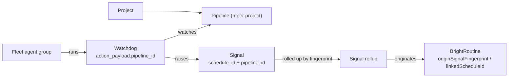

# Projects at enterprise scale — n projects × n pipelines

## Glossary

| Term | Meaning |
|---|---|
| **Project** | `ProjectNode` in platform-core. The unit a team owns. |
| **Pipeline** | One workflow inside a project. Today it is the project's single `WorkflowSpecNode`. This spec makes it many per project. |
| **Fleet** | The BrightAgent agent groups reported by `get_fleet_health` (14 groups today, each with a capability list). |
| **Watchdog** | A scheduled agent (agent service `/manage/scheduled-agents`, MCP `list_scheduled_agents`). Types: `quality_check_task`, `profiler_task`, `pipeline_watchdog_task`, `execute_workflow`, `detect_recurring_patterns`, `fleet_health_digest_task`. |
| **Signal** | A BrightSignals event (MCP `list_workspace_signals`, platform-core `getDataAssetNotifications` / `notifications`). |
| **Signal rollup** | All signals that share one fingerprint `(workspace, stage, status, subject)`, shown once with a count. |
| **Routine** | A BrightRoutines suggestion or scheduled routine (`routineSuggestionsForWorkspace`, `scheduledRoutinesForWorkspace`). |
| **Pipeline story** | The four-part answer the Workflows page gives per pipeline: fleet → watchdogs → signals → routines. |

## 1. Context

Nestlé runs worldwide and needs **hundreds of projects with several pipelines each**. For every project and every pipeline, the Workflows page must say:

> *This fleet is scanning these pipelines → these watchdogs monitor them → these are the signals they raised → hence these BrightRoutines.*

It must say this under full control (who may create and pause what), full audit (every agent action traceable to a pipeline) and full monitoring (no alert fatigue). The page may only claim a link the data actually has.



### What the data supports today

Every arrow above is missing at least one key today.

| Link | Today | Source |
|---|---|---|
| Project → pipelines | Exactly **one**: `workflowSpec: WorkflowSpecNode @relationship(type:"HAS_SPEC")`. `createWorkflowSpec` is idempotent and returns the existing spec; `getWorkflowSpec(workspaceId, projectId)` returns one. | platform-core `src/graphql/ogm/pipeline-typedefs.ts:237` |
| Project list | `GetProjectsDocument` loads every project with owner, managers and counts in one query. The Workflows picker (webapp #1488, BH-1625) is a plain select. | webapp |
| Watchdog → what it watches | `action_payload.data_asset_ids` (quality, profiler); `action_payload.project_id` (`execute_workflow`, optional for `pipeline_watchdog_task`). **No pipeline id.** The MCP `ScheduledAgent` view drops `action_payload`. | agent service |
| Signal → watchdog / pipeline | Fields: `event_id, stage, status, severity, timestamp, asset_id, metadata`. **No schedule id, no project or pipeline id.** | BrightSignals |
| Signal dedup | None. | live staging |
| Routine → origin | Routines carry `projectId`. `patternId` points to a cluster of users' **chat** requests, not to signals. `linked_schedule_id` is stored but not exposed. **"Signal → routine" does not exist in data.** | platform-core |
| Fleet → pipeline | Concerns carry `subject_id` (schedule or asset id). **Nothing says which pipeline an agent scans.** | `get_fleet_health` |

### What staging shows (2026-10-08)

| Workspace | Watchdogs | Signals (last 200) | Routines |
|---|---|---|---|
| OneTen | 10 (5 on): 3 quality checks all failing "Warehouse configuration not found or incomplete" (Snowflake config fallback gap); profiler OK; weekly workflow failing | **5 distinct** `(stage, status, subject)`; one quality check failed **143 times in a row** | 1 pattern, 0 scores, 0 offered suggestions |
| Second workspace | 8: 1 quality check on a deleted asset failing every 4 h; a daily workflow failing; 2 ETL jobs with source unreachable | **15 distinct**; **168 repeats** of one failure | 0 routines, 0 scores |

Also: the pattern detector (`detect_recurring_patterns`) is **disabled since 2026-07-13**, so nothing learns. `get_fleet_health` reports BrightSignals unreadable for OneTen while `list_workspace_signals` reads it fine.

At Nestlé's scale these become hundreds of identical alerts per pipeline and no routines at all.

### Control and audit today

- Every platform-core GraphQL mutation is audited (BH-1579, `platform.audit.action`). Every agent-service HTTP write is audited (BH-1580). MCP writes are confirm-gated and need `mcp:write` (admins).
- Authorization (BH-1464 permission matrix, shadow → enforce): staging enforces CREATE/UPDATE/DELETE/RUN with READ shadowed; dev and prod shadow every verb.
- Cross-tenant fixes are on staging, **not prod**: BH-1586 (pipelines), BH-1588 (project helpers), BH-1589 (30 project-id ops, batches 1+2), the `deleteProject` id probe. BH-1624 is open: 8 glossary/schema mutations fail closed for everyone. Plaintext keys are committed in platform-core `configuration.py`, rotation pending owner approval.

### Phases

| Phase | Delivers | Why first |
|---|---|---|
| **P0 — Links, dedup, prod safety** | `pipeline_id` + `schedule_id` on watchdogs and signals; signal rollups; `linkedScheduleId` exposed; routine origin link; pattern detector back on with scores visible; BH-1586/1588/1589 promoted to prod; prod enforcement ramp started | Without links the story is fiction; without prod authz, n tenants is n risks |
| **P1 — n pipelines per project** | Pipeline id on every workflow op; expand/contract migration; per-pipeline permission cells; per-tenant watchdog fairness | The model change |
| **P2 — The story at scale** | Paginated, searchable project and pipeline pickers; per-pipeline story on the Workflows page; fleet view scoped to the project | The UI promise |

Until P1 lands, P0 writes `pipeline_id` = the project's single `WorkflowSpecNode.id`, so P0 data stays valid after the migration.

## 2. Interface Contract (MDE)

### 2.1 Pipeline (P1, platform-core GraphQL)

Default proposal: a pipeline **is** a `WorkflowSpecNode` (see open question 1).

```graphql
type ProjectNode { workflowSpecs: [WorkflowSpecNode!]! @relationship(type: "HAS_SPEC", direction: OUT) }  # was singular
type WorkflowSpecNode { id: ID!  name: String!  status: PipelineStatus! }

createPipeline(input: { workspaceId: ID!, projectId: ID!, name: String! }): WorkflowSpecNode!   # not idempotent by project
pipelines(workspaceId: ID!, projectId: ID!, search: String, first: Int = 25, after: String): PipelinePage!
getWorkflowSpec(workspaceId: ID!, projectId: ID!, pipelineId: ID!): WorkflowSpecNode           # pipelineId added
```

Every workflow op takes `pipelineId: ID!`: steps, runs, issues, bindings, schedules, signals. `createWorkflowSpec` (idempotent per project) is removed in the contract step.

**Migration (expand → contract):**

| Step | Change |
|---|---|
| Expand | Add `name`, `status`; accept optional `pipelineId` on every op, defaulting to the project's single spec. |
| Backfill | Each existing spec becomes the project's first pipeline, `name = project.name`. Stamp `pipeline_id` on existing schedules and signals where `project_id` is known. |
| Switch | Webapp and agent service send `pipelineId` everywhere. |
| Contract | `pipelineId` required; singular `workflowSpec` field and `createWorkflowSpec` removed. |

### 2.2 Lean project list (P2, platform-core GraphQL)

```graphql
projectsPage(workspaceId: ID!, search: String, status: ProjectStatus,
             orderBy: ProjectOrder = RECENT_ACTIVITY, first: Int = 25, after: String): ProjectPage!
type ProjectPage    { items: [ProjectSummary!]!  nextCursor: String  total: Int! }
type ProjectSummary { id: ID!  name: String!  status: ProjectStatus!  pipelineCount: Int!
                      openSignalRollups: Int!  lastActivityAt: DateTime }
```

Search is server-side by name. No owner or manager expansion in the list. `first` is capped at 100.

### 2.3 Watchdogs (P0, agent service REST + MCP)

| Field | Where | Rule |
|---|---|---|
| `action_payload.project_id` | `quality_check_task`, `profiler_task`, `pipeline_watchdog_task`, `execute_workflow` | required when the watchdog is created inside a project |
| `action_payload.pipeline_id` | same four types | required when `project_id` is set |
| `GET /manage/scheduled-agents?project_id=&pipeline_id=` | REST | new filters, paginated |
| MCP `ScheduledAgent` | `list_scheduled_agents` | adds `project_id`, `pipeline_id`, `watched_asset_ids`, `last_status`; accepts the same filters |

Workspace-wide types (`detect_recurring_patterns`, `fleet_health_digest_task`) carry neither id.

### 2.4 Signals (P0, BrightSignals)

New fields on every signal a watchdog publishes: `schedule_id`, `project_id`, `pipeline_id`, `fingerprint` = hash of `(workspace_id, stage, status, subject_id)`.

```graphql
signalRollups(workspaceId: ID!, projectId: ID, pipelineId: ID, status: SignalStatus,
              first: Int = 25, after: String): SignalRollupPage!
type SignalRollup { fingerprint: ID!  stage: String!  status: String!  severity: Severity!
                    subjectId: ID  scheduleId: ID  pipelineId: ID
                    count: Int!  firstSeenAt: DateTime!  lastSeenAt: DateTime!  latestEventId: ID! }
```

MCP `list_workspace_signals` gains `rollup: bool = true` and the same `project_id` / `pipeline_id` filters.

### 2.5 Routine origin (P0, platform-core GraphQL)

```graphql
type RoutineSuggestion {           # also on scheduled routines
  linkedScheduleId: ID             # already stored, now exposed
  origin: RoutineOrigin!           # CHAT_PATTERN | SIGNAL | SCHEDULE
  originSignalFingerprint: ID      # set when origin = SIGNAL
  originScheduleId: ID             # the watchdog whose signals led here
  pipelineId: ID
}
```

`patternId` keeps pointing at the chat cluster for `CHAT_PATTERN`.

### 2.6 Pipeline story (P2, agent service REST + MCP)

```text
GET /manage/projects/{project_id}/pipelines/{pipeline_id}/story
MCP get_pipeline_story(project_id, pipeline_id)
→ { pipeline, fleet: [AgentGroupRef], watchdogs: [WatchdogRef], signals: [SignalRollup],
    routines: [RoutineRef], gaps: [{ link, reason }] }
```

- `fleet` = the agent groups that run this pipeline's watchdogs (from `action_type`). It is labelled "runs these watchdogs", never "scanning the whole pipeline".
- `gaps` lists every link the page cannot claim (for example, "3 signals have no schedule id: published before P0").

### 2.7 Control (P1, platform-core permission matrix)

New resource kind `PIPELINE`. Watchdogs use the `ROUTINE` kind from BH-1572, with a new `CREATE · ROUTINE` cell.

| Role | CREATE/UPDATE/DELETE · PIPELINE | CREATE · ROUTINE (watchdog in a pipeline) | UPDATE/RUN · ROUTINE (pause, run) |
|---|---|---|---|
| WORKSPACE_ADMIN | allow | allow | allow |
| COLLABORATOR | `OWNER_OR_MANAGER` of the project | `OWNER_OR_MANAGER` of the project | `OWNER_OR_MANAGER` |
| CONTRIBUTOR, VIEWER, AGENT_GUEST | none | none | none |

### 2.8 Fairness (P1, scheduler)

Per-workspace cap on concurrent watchdog runs and round-robin across projects inside a workspace. The cap is `TierConfig.max_concurrent_watchdogs` with a per-environment default. Uses the single cron + SQS fan-out of `brightroutines-detector-fanout-fairness.md`.

## 3. Invariants (DbC)

- **INV-1** WHEN a watchdog is created inside a project, THE System SHALL store both `project_id` and `pipeline_id`, and the pipeline SHALL belong to that project and workspace.
- **INV-2** WHEN a watchdog publishes a signal, THE System SHALL stamp `schedule_id`, and `project_id` + `pipeline_id` when the watchdog has them.
- **INV-3** WHILE a fingerprint's status is unchanged, THE System SHALL NOT push another alert for it. It SHALL increment the rollup count. A status change pushes once.
- **INV-4** THE pipeline story SHALL NOT show a link the stored data does not carry. Missing links go to `gaps`.
- **INV-5** IF a routine has `origin = SIGNAL`, THEN `originSignalFingerprint` SHALL resolve to a rollup in the same workspace.
- **INV-6** Every op on a pipeline, its steps, runs, schedules or signals SHALL check that the pipeline id belongs to the caller's workspace before acting (no cross-tenant id probe).
- **INV-7** Every create, pause, resume, run and delete of a pipeline or watchdog SHALL produce one `platform.audit.action` record carrying `workspace_id`, `project_id`, `pipeline_id`, the acting user and, for scheduled runs, the run-as user.
- **INV-8** No workspace SHALL hold more than its `max_concurrent_watchdogs` running watchdogs, and a due watchdog in any workspace SHALL start within its schedule interval.
- **INV-9** `projectsPage`, `pipelines` and `signalRollups` SHALL return at most `first` items (≤ 100) and SHALL NOT load owners, managers or members.
- **INV-10** After migration, every project SHALL have at least one pipeline, and every pre-migration spec SHALL be a pipeline of its original project.
- **INV-11** The pattern detector SHALL run on its schedule in every environment where BrightRoutines is on.

## 4. Acceptance Criteria (BDD)

```gherkin
Feature: Projects at enterprise scale

  Scenario: Pipeline story shows the real chain
    Given pipeline P1 in project "Coffee EU" has a quality-check watchdog W
    And W failed 143 times on the same table
    When an analyst opens P1 on the Workflows page
    Then the page shows the agent group that runs W, W itself, one signal rollup with count 143, and the routine that originated from it

  Scenario: Repeated failure pushes once
    Given a fingerprint is already failing
    When W fails again
    Then the rollup count goes up by one and no new Slack or bell alert is sent

  Scenario: Recovery pushes once
    Given a fingerprint is failing
    When W succeeds
    Then one recovery alert is pushed

  Scenario: Missing links are shown as gaps
    Given signals published before P0 have no schedule id
    When the pipeline story is requested
    Then those signals appear under gaps, not linked to any watchdog

  Scenario: Hundreds of projects load fast
    Given a workspace with 500 projects
    When a user searches "coffee" in the project picker
    Then the server returns at most 25 matching projects ordered by recent activity

  Scenario: Create a second pipeline
    Given project "Coffee EU" has one pipeline
    When a project manager creates pipeline "Returns"
    Then the project has two pipelines and each has its own steps, runs and watchdogs

  Scenario: Existing project survives migration
    Given a project created before P1 with one workflow spec and two watchdogs
    When the backfill runs
    Then the spec is the project's first pipeline and both watchdogs carry its pipeline id

  Scenario: Collaborator who does not manage the project cannot add a watchdog
    Given collaborator C is not an owner or manager of "Coffee EU"
    When C creates a watchdog on pipeline P1
    Then the response is 403 and nothing is created

  Scenario: Pipeline id from another workspace
    Given pipeline P1 belongs to workspace X
    When an admin of workspace Y requests its story or pauses its watchdog
    Then the request is refused and reveals nothing about P1

  Scenario: Every watchdog action is audited per pipeline
    When an admin pauses watchdog W on P1
    Then one audit record carries workspace, project, pipeline, schedule and the admin

  Scenario: One tenant cannot starve the others
    Given workspace A has 2,000 due watchdogs and workspace B has 3
    When the scheduler runs
    Then A never exceeds its concurrency cap and B's 3 start within their interval

  Scenario: Routine traces to its signal
    Given a routine was suggested from a signal rollup
    When it is viewed
    Then it shows origin SIGNAL, the fingerprint and the watchdog behind it

  Scenario: Pattern detector is learning
    Given BrightRoutines is on in staging
    Then detect_recurring_patterns has run in the last 24 hours and routine scores are visible to admins
```

## 5. Out of Scope

- Signals automatically **triggering** routines. This spec only links them (open question 3).
- Per-runner credentials for on-prem pipelines (open question 2).
- Cross-workspace views (a Nestlé-wide view across workspaces).
- Fixing the Snowflake config fallback gap and the deleted-asset quality check. They are data the story will surface as failures, not part of this spec.
- Rotating the committed `configuration.py` keys (tracked separately, owner approval pending).
- New delivery channels. Rollups use the existing push path.

## 6. Dependencies

| Dependency | Needed by |
|---|---|
| BH-1625 (webapp #1488, Workflows project picker) | P2 replaces its plain select |
| BH-1579 (GraphQL audit plugin), BH-1580 (agent-service write audit) | INV-7 |
| BH-1464 + ADR-0003 (permission matrix, shadow → enforce); prod enforcement ramp | P0 starts it, P1 cells need it |
| BH-1586, BH-1588, BH-1589, `deleteProject` id probe — promoted to prod | P0 (INV-6) |
| BH-1624 (8 glossary/schema mutations fail closed) | P0 prod promotion |
| BH-1572..BH-1577 (`ROUTINE` kind, routine node per schedule) | §2.7 watchdog cells |
| `brightroutines-detector-fanout-fairness.md` (BH-876, parked) | §2.8 fairness |
| BH-1331 / BH-1340 (fleet health, digest) | §2.6 fleet, rollup-aware digest |
| No ticket yet: re-enable `detect_recurring_patterns`; `get_fleet_health` BrightSignals read for OneTen | P0 |

## 7. Correctness Properties

### Property 1: No cross-tenant pipeline access
*For any* pipeline, watchdog, signal or routine id and any caller, an op succeeds only if the id belongs to the caller's workspace.
**Validates: §3 INV-1, INV-6, §4 "Pipeline id from another workspace"**

### Property 2: The story never invents a link
*For any* pipeline story, every arrow shown is backed by a stored id, and every missing one is listed in `gaps`.
**Validates: §3 INV-2, INV-4, INV-5, §4 "Pipeline story shows the real chain", "Missing links are shown as gaps"**

### Property 3: One push per state change
*For any* sequence of signals with one fingerprint, the number of pushes equals the number of status changes.
**Validates: §3 INV-3, §4 "Repeated failure pushes once", "Recovery pushes once"**

### Property 4: Migration loses nothing
*For any* pre-migration project, its spec, runs and watchdogs are reachable through exactly one pipeline after backfill.
**Validates: §3 INV-10, §4 "Existing project survives migration"**

### Property 5: Fair scheduling
*For any* load across workspaces, each workspace's running watchdogs stay within its cap and no due watchdog waits longer than its interval.
**Validates: §3 INV-8, §4 "One tenant cannot starve the others"**

## 8. Eval Criteria

Omitted. No new LLM behavior. The pattern detector's quality gate stays in `brightroutines-online-judge-eval-circuit-breaker.md`; this spec only requires that it runs (INV-11).

## 9. Observability Contract

- **Audit:** `platform.audit.action` gains `project_id`, `pipeline_id`, `schedule_id` attributes on pipeline and watchdog actions.
- **Spans:** `gen_ai.tool.execute` with `gen_ai.tool.name=get_pipeline_story`; scheduled runs carry `brighthive.project.id`, `brighthive.pipeline.id`, `brighthive.schedule.id`.
- **Log events:** `signals.rollup.incremented`, `signals.rollup.state_changed`, `scheduler.watchdog.deferred` (cap reached), `pipelines.migration.backfilled`, `pipeline_story.gap`.
- **Metrics:** `watchdog_queue_depth{workspace}`, `watchdog_running{workspace}`, `signal_rollup_count{workspace,pipeline}`, `signal_pushes_suppressed_total{workspace}`, `pattern_detector_last_run_age_s{workspace}`.

## 10. Test Coverage Update

| Layer | Where | Cases |
|---|---|---|
| L0 surface | platform-core schema tests; brightbot repo `brightbot/evals/layers/surface.py` | `projectsPage`, `pipelines`, `signalRollups`, routine origin fields, `get_pipeline_story` and `ScheduledAgent` shapes match §2 |
| L1 routing | brightbot repo `brightbot/evals/layers/routing.py` | "what is watching pipeline X" routes to `get_pipeline_story`; "why so many alerts" routes to rollups |
| L2 behavior (real stores) | brightbot repo `brightbot/evals/layers/behavior.py` + `tests/integration/` (moto DynamoDB); platform-core `tests/integration/` (real Neo4j) | INV-1..INV-10: ids stamped; one push per state change; gaps listed; migration backfill; cross-tenant id refused; audit record per action; cap holds under load |
| e2e features | brighthive-e2e `e2e/features/projects/` (new `test_pipelines.py` beside `test_lifecycle.py`), `e2e/features/scheduler/test_scheduled_agents.py`, `e2e/features/observability/test_audit_trail.py` | happy-path story on staging; second pipeline; foreign-workspace pipeline id refused |
| e2e surfaces | brighthive-e2e `e2e/surfaces/test_routines.py`, `test_routes.py`, `test_webapp.py` | §2 shapes against the real backend; picker search returns ≤ 25 |

At least one L2 case and every e2e case run against real backends, never mocks.

## Open Questions for Kuri

1. **Pipeline = `WorkflowSpecNode`, or a separate `PipelineNode` that owns a spec?** This spec assumes the former (smaller migration). A separate node allows versioned specs per pipeline.
2. **Per-runner credentials for on-prem pipelines.** Does each pipeline get its own runner login, or do all pipelines in a project share one?
3. **Which signals may auto-trigger a routine?** Proposal: none in this spec; later, only `pipeline_watchdog_task` recoveries with an admin-approved routine.
4. **Fleet "scanning" a pipeline.** Is "the agent groups that run its watchdogs" enough, or should agents record the pipeline they act on in every chat turn?
5. **Rollup window.** Should a fingerprint that stays failing re-push after N hours (a reminder), or only on state change?
6. **Nestlé tenancy.** One workspace with hundreds of projects, or one workspace per region? It changes where fairness matters.
