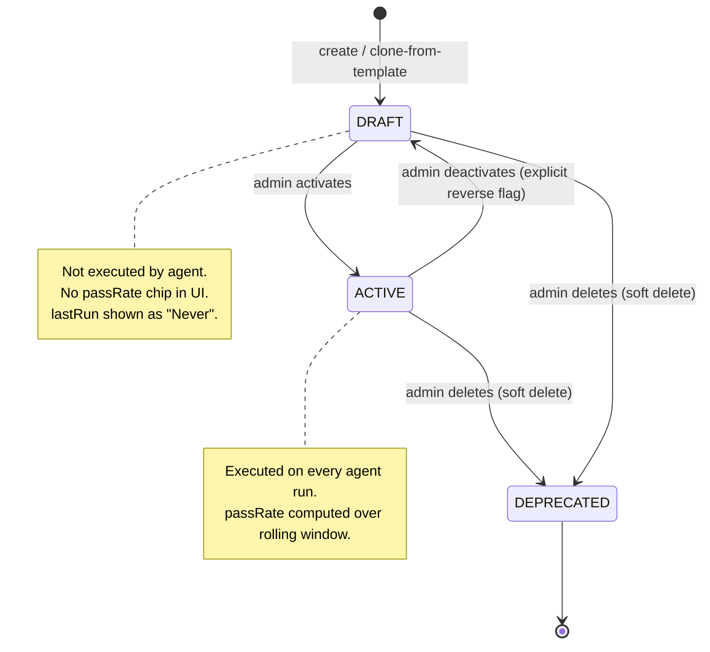

# Configurable Quality Agent

## Problem

The webapp Quality Rules page (`src/Governance/pages/QualityRulesPage.tsx`) is mock data behind a `PreviewBanner`. There is no way for a workspace to declare which data-quality rules it cares about, edit thresholds, or see whether a rule passed over time.

The brightbot quality agent works, but it regenerates a fresh Great Expectations suite from an LLM on every run. Nothing a workspace "decides" survives between runs. For enterprise data-governance buyers, workspace-level rule control is table stakes — without it the page reads as a static demo.

## Use Case / Goal

A workspace admin opens the Quality Rules page, sees the rules that apply to their data, edits a threshold (e.g. completeness from 95 to 98 percent), activates or deactivates rules, clones from a template library, runs a check on demand, and watches the pass rate trend over time. Viewers and collaborators see the same rules read-only.

Success: the page renders live data, every rule shows a real pass rate and last-run from execution history, and the quality agent executes exactly the active rules a workspace chose — not LLM-regenerated ones.

## Current Situation

### How It Works Today

Quality lives in `brightbot/agents/governance_agent/tools/quality_tools.py` as three LangGraph tools:

1. `analyze_dataset_structure_tool` — samples 5000 rows from the warehouse, profiles columns.
2. `generate_quality_expectations_tool` — Claude proposes 10 to 25 GE expectations from the profile.
3. `run_quality_validation_tool` — builds a GE suite, runs it on the sample, formats a report.

Great Expectations 1.9 in **ephemeral** mode (`gx.get_context(mode="ephemeral")`, quality_tools.py:469). The suite is built programmatically:

- `generate_chosen_expectations_gx()` maps each `ChosenExpectation` pydantic model to a live GE object via `getattr(gxe, name)(**kwargs, meta=meta)` (expectation_mapped.py:555-557).
- `gx.ExpectationSuite(name=..., expectations=[...])` then `context.suites.add()` (quality_tools.py:476-479).
- `validation_definition.run(batch_parameters={"dataframe": df})` executes (line 500).
- `convert_gx_validation_result()` produces a dict with `statistics` plus a per-expectation `results` array (quality_utils.py:16-88).

Results persist as an `AgentCapabilityExecutionNode` in Neo4j (capabilityType `quality_check`, result is a JSON blob) plus artifact files in S3. Execution is on demand via `POST manage agents run` (graph_id `quality_check_agent`, 5-minute cooldown) and scheduled via EventBridge plus DynamoDB.

Nav visibility is governed by `src/routes/navAccess.ts` (added in BH-517): a `NAV_ACCESS` map of route `key` to allowed `WorkspaceRoleEnum[]`, consumed by `genNav.tsx` via `isNavAllowed(key, role)`. The `VITE_ROUTE_VISIBILITY_CONFIG` whitelist overrides it. Today `quality-rules` is visible to Admin, Collaborator, Viewer.

### Hard Limitations

- **Rules are ephemeral.** Every run produces a different LLM-generated suite. A workspace cannot pin "these are our rules".
- **No per-rule history.** Results are one JSON blob per run, so pass rate by rule over time is not queryable.
- **No CRUD surface.** Nothing lets the webapp create, edit, activate, or delete a rule.

### Gaps

- No persistent rule entity scoped to a workspace.
- No aggregation of pass rate or last-run per rule.
- No GraphQL types on platform-core for the webapp to consume.
- No template library to lower time-to-first-rule.
- No server-side enforcement distinguishing who can VIEW rules from who can MUTATE them. `navAccess.ts` hides tabs but is not security.

## Proposals / Solutions

### Recommended Approach

Persist rule definitions ourselves in Neo4j; use Great Expectations purely as a stateless execution engine.

**Key finding (validated against brightbot code):** GE 1.9 supports the full round-trip the design needs.

| Capability | Status | Evidence |
|---|---|---|
| Stable expectation name string | Supported | `expectation_name: Literal[*EXPECTATION_NAMES]` (expectation_mapped.py:75) |
| Params serialize to JSON | Supported | `suggested_parameters: dict[str, Any]` (line 81) |
| Suite built programmatically | Supported | `gx.ExpectationSuite(name, expectations=[...])` (quality_tools.py:476) |
| Reconstruct expectation from stored name plus params | Supported | `getattr(gxe, name)(**kwargs, meta=meta)` (expectation_mapped.py:555) |
| Per-expectation results for fanout | Supported | `for result in validation_result.results` (quality_utils.py:34) |
| Custom params: mostly, min_value, max_value, regex, type_list | Supported | passed through as `**kwargs` (line 69-70) |

**Architectural decision: GE is a stateless engine.** We do NOT use GE native suite persistence (GE Cloud or filestore), which is version-fragile. We store rule definitions (name plus params) as `QualityRuleNode` in Neo4j and rebuild an ephemeral GE suite on every run through the existing `_convert_expectation_to_gx` bridge. This makes BH-507 a low-risk change: feed the bridge our stored rules instead of LLM output.

### Rule Lifecycle



### Alternatives Considered

| Approach | Pros | Cons | Why Not |
|----------|------|------|---------|
| GE native suite persistence (filestore or Cloud) | GE-managed lifecycle | Version-fragile across GE releases, extra infra, harder multi-tenant isolation | Store definitions in Neo4j instead; GE stays stateless |
| Keep LLM regeneration, just cache last suite | Minimal change | Rules still not workspace-controlled, drift between runs | Defeats the goal of workspace configurability |
| Full-table validation against warehouse now | Trustworthy pass rate | Large scope, per-warehouse adapters, slow | Ship on sample first, label honestly, upgrade later |

## Areas Involved

| Area | Repo | Impact |
|------|------|--------|
| Platform Core | `brighthive-platform-core` | Neo4j OGM node type definitions (the schema), plus GraphQL types and resolvers proxying brightbot REST |
| BrightBot | `brightbot` | REST CRUD, agent reads rules from library, per-rule execution fanout, template seed, Pydantic models and OGM query strings |
| Web App | `brighthive-webapp` | Quality Rules page wired to live data, editor sheet, history drawer; depends on BH-517 navAccess |

## Interface Contract

### Neo4j nodes — OGM type definitions (platform-core)

Important: brightbot does not define Neo4j schema in Python. The Neo4j schema is declared as Neo4j GraphQL type definitions in `brighthive-platform-core/src/graphql/ogm/typedefs.ts` (the `@node`/`@relationship`/`@id` directive style). brightbot reaches these nodes by sending GraphQL queries to the OGM server over HTTP via `OGMAPISession`. So node definitions live in platform-core; brightbot holds only Pydantic business models and OGM query strings. Shipped in BH-505.

`QualityRuleNode` — id, name, description, expectationType (string matching GE name), expectationParams (JSON string), targetColumn (nullable), severity (CRITICAL | WARNING | INFO), status (DRAFT | ACTIVE | DEPRECATED), createdAt, modifiedAt, createdBy. Scoped to a workspace and asset via relationships below.

`QualityRuleExecutionNode` — id, runId, evaluatedCount, successCount, partialUnexpectedCount, passed (bool), sampleSize, evaluatedAt.

`QualityRuleTemplateNode` (global, not workspace-scoped) — id, name, description, category, expectationType, defaultParams (JSON string), suggestedSeverity, tags, createdAt, modifiedAt.

Relationships: `(DataAssetNode)-[:HAS_QUALITY_RULE]->(QualityRuleNode)`; `(WorkspaceNode)-[:OWNS_QUALITY_RULE]->(QualityRuleNode)`; `(QualityRuleNode)-[:HAS_EXECUTION]->(QualityRuleExecutionNode)`. Workspace scoping is via the OWNS_QUALITY_RULE edge (not a denormalized workspace_id field).

### REST (brightbot)

```
GET    /workspace/{ws}/quality-rules          list, paginated, filter asset/severity/status
GET    /workspace/{ws}/quality-rules/{id}      single rule + embedded latest execution
POST   /workspace/{ws}/quality-rules           create from explicit params
POST   /workspace/{ws}/quality-rules/from-template/{templateId}   clone a template
PATCH  /workspace/{ws}/quality-rules/{id}      update params, severity, status
DELETE /workspace/{ws}/quality-rules/{id}      soft delete (status -> deprecated)
GET    /workspace/{ws}/quality-rules/{id}/history   paginated executions, date window
GET    /quality-rule-templates                 global catalog grouped by category
```

### GraphQL (platform-core)

Types: QualityRule, QualityRuleExecution, QualityRuleTemplate, enums QualityRuleSeverity and QualityRuleStatus. Queries: `workspace.qualityRules`, `qualityRule(id)`, `dataAsset.qualityRules`, `qualityRuleTemplates`. Mutations: createQualityRule, updateQualityRule, deleteQualityRule, cloneQualityRuleFromTemplate, runQualityCheck. `QualityRule.passRate` is a Float 0 to 100 for direct UI binding.

## Invariants

1. WHEN a rule is read, queried, or mutated, THE System SHALL scope it to the caller workspace_id; cross-workspace access SHALL return not-found.
2. Rule status transitions SHALL follow draft to active to deprecated. Reverse transitions SHALL require an explicit flag.
3. WHEN the agent runs against an asset, THE System SHALL execute only that asset active rules, never LLM-regenerated ones.
4. IF an asset has zero active rules, THE System SHALL return an explicit empty state and SHALL NOT regenerate rules silently.
5. A run evaluating N rules SHALL create exactly N QualityRuleExecutionNodes (no double counting, no blob).
6. Rule definitions are the source of truth; GE suites SHALL be reconstructed per run and SHALL NOT be persisted in GE.
7. Tab visibility (navAccess.ts) is presentation only. THE System SHALL enforce mutate permissions server-side independently of nav hiding.
8. WHERE role is Viewer or Collaborator, THE System SHALL allow read of rules but SHALL reject create, update, delete, and run with forbidden.
9. WHERE role is Admin, THE System SHALL allow all rule operations.
10. passRate SHALL be computed from QualityRuleExecutionNode history over a configurable window (default 30 days), never stored as a static field.
11. expectation_type SHALL be one of the GE expectation names enumerated in EXPECTATION_NAMES; unknown types SHALL be rejected at create time.
12. Cloning a template SHALL create a QualityRuleNode in draft status, never active.

## Correctness Properties

### Property 1: Workspace isolation is absolute

*For any* rule R owned by workspace W, *for any* caller C in workspace W' ≠ W, *the* server SHALL respond to read or mutate of R with not-found — never forbidden, never partial data, never an empty list with HTTP 200.

**Validates: §Invariants 1, §AC Scenario "Viewer attempts to mutate a rule" (cross-workspace variant)**

### Property 2: FSM monotonicity

*For any* rule R, *the* status transition graph SHALL be `DRAFT → ACTIVE → DEPRECATED`. *For any* reverse transition (`ACTIVE → DRAFT`, `DEPRECATED → ACTIVE`, etc.), *the* server SHALL require an explicit `force_reverse: true` flag on the PATCH and SHALL log the override.

**Validates: §Invariants 2, §AC Scenario "Admin activates a draft rule"**

### Property 3: Execution fanout exactness

*For any* agent run that evaluates N active rules against an asset, *the* system SHALL create exactly N `QualityRuleExecutionNode` records with `passed`, `evaluatedCount`, and `successCount` populated. *No* `AgentCapabilityExecutionNode` SHALL be written as a JSON blob for that run.

**Validates: §Invariants 5, §AC Scenario "Agent run produces per-rule executions"**

### Property 4: Zero-rules is not silent regeneration

*For any* asset with zero active rules at run time, *the* agent SHALL return `{empty: true, suggestion: "propose-from-profile"}` and SHALL NOT call any LLM expectation-generation tool.

**Validates: §Invariants 3, 4, §AC Scenario "Zero active rules"**

### Property 5: Mutate permission enforced server-side

*For any* request to create, update, delete, or run a quality rule from a Viewer or Collaborator role, *the* REST handler AND the GraphQL resolver SHALL return 403 Forbidden before reaching persistence. Nav hiding (`navAccess.ts`) is presentational only and SHALL NOT be relied upon.

**Validates: §Invariants 7, 8, §AC Scenario "Viewer attempts to mutate a rule"**

## Acceptance Criteria

```gherkin
Feature: Configurable Quality Rules

  Scenario: Admin creates and activates a rule
    Given an Admin viewing a workspace asset
    When they create a rule from explicit params
    Then the rule is persisted in DRAFT status
    And the rule does not appear in the next agent run

  Scenario: Admin activates a draft rule
    Given a rule in DRAFT status
    When the Admin activates it
    Then the rule transitions to ACTIVE
    And the next agent run for that asset executes it exactly once

  Scenario: Viewer attempts to mutate a rule
    Given a Viewer in the workspace
    When they POST/PATCH/DELETE on a quality rule
    Then the server returns 403 Forbidden
    And no rule state changes

  Scenario: Agent run produces per-rule executions
    Given an asset with N active rules
    When the quality agent runs against the asset
    Then exactly N QualityRuleExecutionNodes are created
    And no AgentCapabilityExecutionNode is written as a JSON blob

  Scenario: Zero active rules
    Given an asset with no active rules
    When the quality agent runs
    Then the response is an explicit empty state
    And no LLM regeneration occurs
    And the UI suggests propose-from-profile

  Scenario: Cloning a template
    Given a QualityRuleTemplate in the global catalog
    When an Admin clones it for an asset
    Then a new QualityRuleNode is created in DRAFT status
    And the clone is not auto-activated

  Scenario: Draft rule rendering
    Given a rule in DRAFT status with zero executions
    When the Quality Rules page renders the rule card
    Then no passRate chip is shown
    And lastRun is shown as "Never"

  Scenario: passRate window label
    Given a rule with execution history
    When the rule card renders the passRate chip
    Then the chip label includes the rolling window (e.g. "30-day pass rate")
```

- [ ] All scenarios above pass as integration tests
- [ ] At least 20 templates seeded across categories; clone creates a draft rule
- [ ] Webapp page renders live data, PreviewBanner removed
- [ ] Detail drawer shows a 30-day trend chart
- [ ] Multi-agent review (UX, sales-strategist, react-frontend-expert, brighthive-ux-voice) signed off

## Auth Model (explicit, since nav hiding is not security)

| Operation | Admin | Collaborator | Viewer | Enforced where |
|-----------|-------|--------------|--------|----------------|
| See Quality Rules tab | yes | yes | yes | navAccess.ts `quality-rules` (client hide) |
| Read / list rules | yes | yes | yes | brightbot REST + platform-core resolver |
| Create / edit / delete | yes | no | no | brightbot REST (server) |
| Activate / deactivate | yes | no | no | brightbot REST (server) |
| Run check now | yes | no | no | brightbot REST (server) |

navAccess.ts `quality-rules: [Admin, Collaborator, Viewer]` matches the read row. Mutations are NOT expressible in navAccess (it only hides tabs) and MUST be enforced in the REST handlers and GraphQL resolvers.

## Observability Contract

Spans (OTel GenAI conventions where applicable):

- **`quality_rule.crud`** — REST handler span for create/update/delete/clone
  - Attributes: `workspace.id`, `quality_rule.id`, `quality_rule.operation` (create|update|delete|clone), `quality_rule.severity`, `quality_rule.status`, `actor.role`
- **`quality_rule.execute`** — per-rule execution span (one per `QualityRuleExecutionNode`)
  - Attributes: `workspace.id`, `quality_rule.id`, `quality_rule.expectation_type`, `data_asset.id`, `quality_rule.passed` (bool), `quality_rule.evaluated_count`, `quality_rule.sample_size`, `quality_rule.duration_ms`
- **`quality_agent.run`** — parent span for the agent invocation
  - Attributes: `workspace.id`, `data_asset.id`, `quality_agent.rules_evaluated` (count), `quality_agent.rules_passed`, `quality_agent.rules_failed`, `quality_agent.zero_active_rules` (bool)

Log events (structured):

- `quality_rule.created`, `quality_rule.updated`, `quality_rule.deleted`, `quality_rule.cloned_from_template`
- `quality_rule.status_transitioned` — includes `from`, `to`, `force_reverse` flag
- `quality_rule.forbidden` — emitted on 403 from REST or GraphQL (audit signal)
- `quality_rule.execution.passed`, `quality_rule.execution.failed`
- `quality_agent.zero_active_rules` — emitted when an asset has no active rules at run time
- `quality_rule.unknown_expectation_type` — rejected at create time (invariant 11)

Metrics:

- `brighthive.quality_rule.executions_total{passed, severity}` counter
- `brighthive.quality_rule.pass_rate{workspace_id, asset_id}` gauge — 30-day rolling
- `brighthive.quality_rule.active_count{workspace_id}` gauge

## Dependencies

| Dependency | Type | Status |
|------------|------|--------|
| BH-517 navAccess.ts merged | Blocking for webapp ticket | In progress (harbour) |
| BH-376 nav restructure merged | Blocking for webapp ticket | In review (PR 1100) |
| brightbot OGM (BH-505) | Blocking for all backend | Not started |
| Great Expectations 1.9 round-trip | Validated | Confirmed in this spec |

## Template Catalog (BH-511 scope)

Minimum 20 templates seeded across these categories. Each maps to a Great Expectations expectation name from `EXPECTATION_NAMES`.

| Category | Template name | GE expectation | Default params | Suggested severity |
|---|---|---|---|---|
| **Completeness** | Column not null > 95% | `expect_column_values_to_not_be_null` | `mostly=0.95` | CRITICAL |
| | Column not null > 99% | `expect_column_values_to_not_be_null` | `mostly=0.99` | CRITICAL |
| | Required columns present | `expect_table_columns_to_match_set` | column_list per asset | CRITICAL |
| **Uniqueness** | No duplicate primary keys | `expect_column_values_to_be_unique` | — | CRITICAL |
| | Compound key uniqueness | `expect_compound_columns_to_be_unique` | column_list | CRITICAL |
| **Range / Validity** | Numeric within bounds | `expect_column_values_to_be_between` | `min_value`, `max_value` | WARNING |
| | Percentage 0–100 | `expect_column_values_to_be_between` | `min_value=0, max_value=100` | WARNING |
| | Positive amounts only | `expect_column_values_to_be_between` | `min_value=0` | WARNING |
| **Type / Format** | Type matches catalog | `expect_column_values_to_be_in_type_list` | `type_list` | WARNING |
| | Email format valid | `expect_column_values_to_match_regex` | RFC 5322 simplified | WARNING |
| | UUID format valid | `expect_column_values_to_match_regex` | UUID v4 pattern | WARNING |
| | ISO 8601 date | `expect_column_values_to_match_strftime_format` | `%Y-%m-%d` | WARNING |
| **Categorical** | Value in allowed set | `expect_column_values_to_be_in_set` | `value_set` | WARNING |
| | Status enum valid | `expect_column_values_to_be_in_set` | `value_set` | CRITICAL |
| **Distribution** | Row count within range | `expect_table_row_count_to_be_between` | `min_value`, `max_value` | INFO |
| | Mean within bounds | `expect_column_mean_to_be_between` | `min_value`, `max_value` | INFO |
| | Median within bounds | `expect_column_median_to_be_between` | `min_value`, `max_value` | INFO |
| **Freshness** | Max timestamp within N hours | `expect_column_max_to_be_between` | `min_value=now()-Nh` | WARNING |
| **PII / Governance** | PII column tagged | custom check via catalog metadata | catalog tag presence | CRITICAL |
| **Schema** | No schema drift | `expect_table_columns_to_match_ordered_list` | column_list snapshot | WARNING |

Tags drive filtering in the webapp: `completeness`, `uniqueness`, `range`, `type`, `format`, `categorical`, `distribution`, `freshness`, `pii`, `schema`. Categories double as the section headers in the template-picker drawer.

## Ticket Breakdown

| Ticket | Summary | Points | Epic |
|--------|---------|--------|------|
| BH-504 | Spec (this doc) | 2 | BH-503 |
| BH-505 | OGM node typedefs in platform-core (QualityRule, Execution, Template) | 3 | BH-503 |
| BH-506 | REST CRUD endpoints | 3 | BH-503 |
| BH-507 | Agent reads rules from library | 3 | BH-503 |
| BH-508 | Per-rule execution fanout + aggregation | 2 | BH-503 |
| BH-509 | platform-core GraphQL types + resolvers | 2 | BH-503 |
| BH-510 | webapp page wire-up + editor + history drawer (+ extract preview seed to `brighthive-webapp/src/mock-data/qualityRules.ts`) | 3 | BH-503 |
| BH-511 | Seed library of 20+ templates per catalog above (+ test fixtures in platform-core/brightbot, demo seed in testing-infra-cdk) | 2 | BH-503 |

## Related

- **Epic**: BH-503
- **Webapp parent**: BH-114 (Governance page lives here)
- **Alerts on failure**: BH-409 BrightSignals
- **Quality trends in analytics**: BH-359
