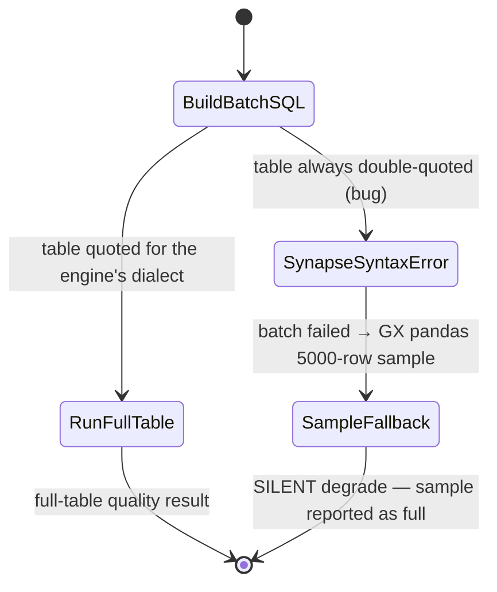

# Spec: Quality-rule batch SQL must quote the table dialect-aware (Synapse fix)

**Ticket:** BH-1168 (BUGS-V3 epic) · **Status:** Draft · **Author:** Kuri · **Last-Reviewed:** 2026-07-31

## 1. Context

The library data-quality path runs one batch aggregate query across all batchable
rules against the workspace warehouse (`run_library_quality_check_direct`,
`brightbot/agents/governance_agent/tools/quality_tools.py`). It builds per-column
references with the **dialect-aware** `qcol()` helper (`[c]` for Synapse, `"C"` for
Snowflake, `"c"` for Redshift/Postgres) but wraps the **table** with
`quote_table_name(...)`, which *always* emits ANSI double-quotes `"schema"."table"`.

On `azure_synapse` (SQL Server family — Loop Capital's live engine) this composes
invalid mixed-dialect T-SQL: `[col]` column refs against a `"schema"."table"` FROM
clause. The batch query errors, the code hits its "batch failed → Great Expectations
pandas fallback" branch, and **every rule silently degrades to a 5000-row sample
instead of validating the full table.** No error surfaces to the user; quality
scores on Synapse are computed from a sample and reported as if full-table.

A dialect-aware table-quoting helper already exists and is used by the profiler
(`_quote_dataset_table_name` → `quote_table_name_azure_sql`, `brightbot/utils/data_profiler.py`).
The quality batch path simply doesn't call it.



## 2. Interface Contract (MDE)

New dialect dispatcher in `brightbot/agents/governance_agent/utils/table_name_utils.py`:

```python
def quote_qualified_table(table_name: str, *, warehouse_type: str) -> str:
    """Quote a dotted table name for the given warehouse dialect.

    azure_synapse → [schema].[table] (T-SQL brackets); all other engines →
    "schema"."table" (ANSI double-quotes). Mirrors the profiler's
    _quote_dataset_table_name so the quality batch path matches the profiler.
    """
```

Call-site change (`quality_tools.py`, batch build):

```
- quoted_table = quote_table_name(dataset_table_name)
+ quoted_table = quote_qualified_table(dataset_table_name, warehouse_type=warehouse_type)
```

No GraphQL, wire, or DTO shape changes. `warehouse_type` is already resolved in scope.

## 3. Invariants (DbC)

- **I-1** WHEN `warehouse_type == "azure_synapse"`, THE batch table reference SHALL use bracket identifiers `[schema].[table]`, never double-quotes.
- **I-2** WHEN `warehouse_type` is any other engine, THE batch table reference SHALL be byte-for-byte identical to the prior `quote_table_name` output (no regression for Snowflake/Redshift/Postgres).
- **I-3** On Synapse, the batch table quoting SHALL match the column quoting dialect (both bracket) so the composed query is valid single-dialect T-SQL.

## 4. Acceptance Criteria (BDD)

```gherkin
Feature: Quality-rule batch SQL quotes the table for the warehouse dialect

  Scenario: Synapse batch query uses bracket-quoted table
    Given a workspace whose warehouse type is azure_synapse
    And a dataset table "analytics.holdings_raw"
    When the library quality batch SQL is built
    Then the FROM clause references [analytics].[holdings_raw]
    And the query contains no double-quoted table identifier

  Scenario: Non-Synapse engines are unchanged
    Given a workspace whose warehouse type is snowflake or redshift or postgres
    When the library quality batch SQL is built
    Then the table is quoted exactly as quote_table_name produced before

  Scenario: Synapse full-table batch does not fall back to the sample path
    Given a Synapse workspace with batchable completeness rules
    When run_library_quality_check_direct executes
    Then the batch SQL runs against the full table (no GX pandas fallback triggered by a quoting syntax error)
```

## 5. Out of Scope

- **Missing Synapse regex branches** (`_rule_to_sql_fragment`: `ExpectColumnValuesToMatchRegex`/`NotMatchRegex`/`MatchRegexList` have no `azure_synapse` case — T-SQL has no native regex). Separate slice: decide `LIKE`/`PATINDEX` approximation vs explicit unsupported→GX.
- **`ExpectColumnValuesToBeDateutilParseable`** absent for `postgres`/`azure_synapse` — separate slice.
- **`executedSql` field** — the field does not exist anywhere (result dict, OGM mutation, platform-core schema). Adding it is a cross-repo feature, not this bug fix. Separate slice.
- GX SQLAlchemy connection string for Snowflake returning `None`.

## 6. Dependencies

- `quote_table_name_azure_sql` (`table_name_utils.py`) — exists.
- `warehouse_type_from_secret` — already used at the call site.

## 7. Correctness Properties

### Property 1: Synapse batch SQL is single-dialect

*For any* Synapse workspace and dotted table name, the composed batch query's table
and column identifiers use the same bracket dialect, so no mixed-quote syntax error
forces the sample fallback.

**Validates: §3 I-1, I-3, §4 Scenario "Synapse batch query uses bracket-quoted table"**

### Property 2: No regression for other engines

*For any* non-Synapse engine, `quote_qualified_table` returns exactly what
`quote_table_name` returned before.

**Validates: §3 I-2, §4 Scenario "Non-Synapse engines are unchanged"**

## 10. Test Coverage Update

- **L0/L2 (surface + behavior):** extend `tests/unit/agents/governance_agent/test_quality_sql_dialects.py` — the existing dialect suite — with a 4-engine parametrization of `quote_qualified_table` and an assertion that the composed batch table ref is bracketed on Synapse, double-quoted elsewhere.
- New unit file for the helper itself if the dialect suite is the wrong home: `test_table_name_dialect_quoting.py`.
- **e2e (§10b):** deferred to BH-1320f's live Synapse run — the Loop Capital Synapse sandbox quality-check run confirms full-table (not sample) execution. Logged as follow-up, not silently skipped.
