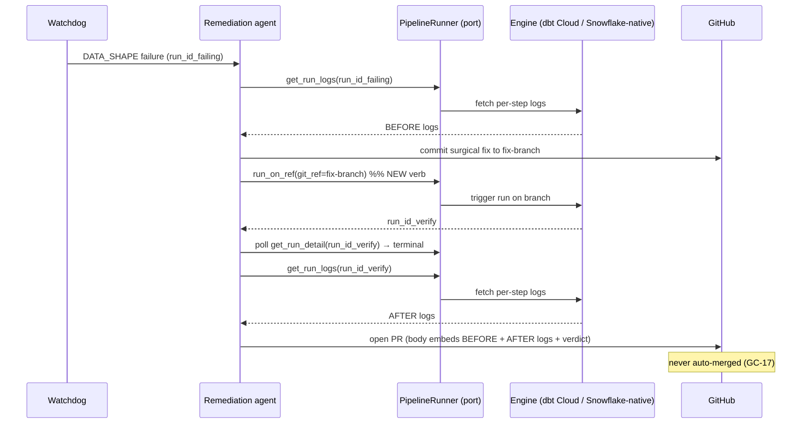

# Surgical Remediation PRs carry the engine's before+after run logs

> Extends the self-healing loop ([`self-healing-pipelines.md`](./self-healing-pipelines.md), epic BH-526 / GC-16) with ONE
> new guarantee: every surgical remediation PR embeds the transformation engine's own run
> logs — the **failing** run that triggered the fix *and* a **post-fix verification** run on
> the fix branch — and it does so through the engine-agnostic `PipelineRunner` port
> ([`pipeline-run-lifecycle.md`](./pipeline-run-lifecycle.md), epic BH-1255), never a dbt-Cloud-specific tool. What already
> ships is named in §1 with `file:line` evidence so no ticket reinvents it.

## 1. Context

The surgical-PR remediation loop ships today: a watchdog-detected dbt failure is classified
(`root_cause_classifier.classify_data_shape_mode`), and a scoped ReAct agent drafts a fix and
opens a PR via `REMEDIATION_TOOLS`
(`brightbot/agents/dbt_agent/dbt_agent_react.py:249`) — GitHub ops only, `merge` intentionally
omitted (GC-17). The PR body is a diff plus a plain-language diagnosis
(`_REMEDIATION_SYSTEM_PROMPT`, `brightbot/agents/dbt_agent/remediation_agent.py:43`).

**What it does NOT carry: the engine's run logs.** A reviewer approving a Loop Capital
remediation PR sees *what changed* and *why in prose*, but not the dbt Cloud run output that
proves (a) the failure was real and what it actually said, and (b) the fix builds green on the
branch before merge. For an enterprise ops reviewer — Frank at Loop Capital, approving fixes to
1000s of pipelines — "trust the prose" is not the bar. The evidence must be in the PR.

The read tools exist but are (1) dbt-Cloud-specific and (2) not in the remediation tool set:
- `get_job_run_error` (`brightbot/agents/dbt_agent/tools/dbt_cloud_tools.py:649`) — per-step
  logs + `run_results.json` error nodes for a run. dbt-Cloud only; not in `REMEDIATION_TOOLS`.
- `run_dbt_cloud_command` (`…/dbt_cloud_tools.py:736`) — triggers a dbt Cloud run. dbt-Cloud only.

The engine-agnostic substrate also exists — the `PipelineRunner` port
(`brightbot/pipelines/runner_port.py:165`) already has `get_run_logs`
(`:251` → `RunLogs`) and `get_run_detail` (`:265` → `RunDetail`). What it lacks is a verb to
**trigger a run against a specific git ref (the fix branch)** and return a `run_id` to poll —
`run_segment` (`:177`) takes a `LineageSegment`, no branch/ref. That gap is the one genuine new
port change this spec introduces.

### Use Case / Goal

The remediation agent detects a failure, drafts a surgical fix, commits it to a branch, then —
**through the port, engine-agnostic** — (1) fetches the failing run's logs (why), (2) triggers a
verification run on the fix branch and polls it to terminal state (proof), and opens a PR whose
body embeds BOTH log excerpts in fenced blocks with a one-line verdict (`✅ verification run
{id} succeeded` / `❌ still failing`). A dbt Cloud workspace and a Snowflake-native workspace
both get before+after logs in the PR because the logic depends only on the port. Success = a
Loop Capital GC-16 remediation PR a reviewer can approve on the evidence, not the prose.



## 2. Interface Contract (MDE)

**Port first (the design), then the first adapter's behavior — per docs/CLAUDE.md.**

### 2.1 New port verb — `run_on_ref`

```python
# brightbot/pipelines/runner_port.py — added to the PipelineRunner Protocol
class RunnerCapability(Enum):
    ...
    RUN_ON_REF = "run_on_ref"          # NEW — engine can trigger a run pinned to a git ref

async def run_on_ref(
    self,
    *,
    pipeline_id: str,
    git_ref: str,                       # branch name or commit SHA of the fix
    ctx: RequestContext,
) -> RunHandle:                         # existing type (runner_port.py:42)
    """Trigger a run of `pipeline_id` pinned to `git_ref`; returns a RunHandle to poll.

    Raises:
        NotImplementedError: RUN_ON_REF not in capabilities()
        ValueError: pipeline_id not found or git_ref invalid
        RuntimeError: dispatch failed
    """
    ...
```

Reused unchanged: `get_run_logs(run_id) -> RunLogs` (`:251`), `get_run_detail(run_id) ->
RunDetail` (`:265`). The verify-run poll loop uses `get_run_detail` until `RunDetail.status`
is terminal, then `get_run_logs`.

### 2.2 Remediation evidence assembly (engine-agnostic, in the app core)

```python
# brightbot/agents/dbt_agent/remediation_evidence.py  (NEW module)
@dataclass(frozen=True)
class RunLogExcerpt:
    run_id: str
    status: str                         # from RunDetail.status.value
    steps: tuple[LoggedStep, ...]       # from RunLogs.steps (already engine-agnostic)
    truncated: bool                     # True if any step log exceeded MAX_LOG_CHARS

async def collect_failing_run_logs(*, runner: PipelineRunner, run_id: str,
                                   ctx: RequestContext) -> RunLogExcerpt: ...

async def run_and_collect_verification(*, runner: PipelineRunner, pipeline_id: str,
                                       git_ref: str, ctx: RequestContext,
                                       poll_timeout_s: int, poll_interval_s: int
                                       ) -> RunLogExcerpt | VerificationTimeout: ...

def render_pr_evidence(*, before: RunLogExcerpt,
                       after: RunLogExcerpt | VerificationTimeout) -> str:
    """Markdown block for the PR body: BEFORE logs, AFTER logs, one-line verdict."""
    ...
```

### 2.3 Tool + prompt changes (the consumer)

- `REMEDIATION_TOOLS` (`dbt_agent_react.py:249`) gains ONE engine-agnostic tool,
  `attach_engine_run_evidence_tool`, that wraps §2.2. It does **not** gain
  `get_job_run_error`/`run_dbt_cloud_command` (those stay dbt-only and out of the agnostic path).
- `_REMEDIATION_SYSTEM_PROMPT` (`remediation_agent.py:43`) gains a hard rule: the PR body MUST
  include the `render_pr_evidence` output; a PR opened without it is a contract violation.

## 3. Invariants (DbC)

Budget: 7.

- **INV-1** — Every remediation PR opened by this loop contains a non-empty BEFORE (failing-run)
  log block. `IF a remediation PR is opened, THEN its body contains the failing run's log excerpt.`
- **INV-2** — Every remediation PR contains an AFTER block that is EITHER a verification-run log
  excerpt OR an explicit `VerificationTimeout` notice — never silently absent.
- **INV-3** — The AFTER verdict states the verification run's terminal status truthfully; a PR
  whose fix branch's verification run failed says `❌`, never `✅`. `WHERE the verification run
  status is not success, THE System SHALL render a failing verdict.`
- **INV-4** — The evidence path depends ONLY on `PipelineRunner` (port) + domain types
  (`RunLogs`, `RunDetail`, `RunHandle`). No `dbt`-named symbol, no vendor SDK, appears in
  `remediation_evidence.py`. (Grep test: PS-3/PS-4.)
- **INV-5** — Log excerpts are bounded: each step's log is truncated to `MAX_LOG_CHARS` with a
  `truncated=True` flag and a "(truncated)" marker; a PR body never embeds an unbounded log dump.
- **INV-6** — The loop never merges. `run_on_ref` triggers a run; it never calls a merge path
  (GC-17 preserved — the merge tool is absent from `REMEDIATION_TOOLS`).
- **INV-7** — A verification run that does not reach terminal state within `poll_timeout_s` yields
  `VerificationTimeout` (INV-2 AFTER block), and the PR still opens with the BEFORE logs — a slow
  engine never blocks the fix from reaching a human.

## 4. Acceptance Criteria (BDD)

```gherkin
Feature: Surgical remediation PRs carry engine before+after run logs (GC-16, engine-agnostic)

  Scenario: PR embeds the failing run's logs
    Given a DATA_SHAPE failure with failing run_id "run-fail-1"
    When the remediation agent drafts a fix and opens a PR
    Then the PR body contains a fenced block with run-fail-1's per-step logs
    And the block is labeled as the failing run that triggered the fix

  Scenario: PR embeds a green verification run on the fix branch
    Given the agent committed a surgical fix to branch "fix/schema-drift-1"
    When a verification run on that branch finishes successfully
    Then the PR body contains that run's logs
    And the verdict line reads a success marker with the verification run id

  Scenario: a fix that still fails verification is reported honestly, PR still opens
    Given the verification run on the fix branch finishes with status "error"
    When the PR is opened
    Then the verdict line reads a failing marker
    And the PR is NOT auto-merged

  Scenario: engine-agnostic — a non-dbt engine gets the same PR shape
    Given the workspace's pipeline engine is snowflake-native
    When the remediation loop runs against the FakePipelineRunner for that engine
    Then the PR body carries before+after log blocks with identical structure to the dbt path

  Scenario: verification run times out — before logs still ship
    Given the verification run does not reach a terminal state within the poll timeout
    When the PR is opened
    Then the AFTER block states a verification-timeout notice
    And the BEFORE failing-run logs are still present

  Scenario: engine cannot run on a ref — before-only, stated
    Given the workspace's engine does not advertise RUN_ON_REF
    When the remediation loop runs
    Then the PR embeds the failing-run logs
    And the AFTER block states the engine does not support branch verification
    And no verification run is attempted
```

## 5. Out of Scope

- The auto-merge decision — GC-17 owns it; this spec never merges (INV-6).
- Post-*merge* recurrence verification — BH-1091 (`self-healing-pipelines.md`) owns the
  `VERIFYING` cooldown state; this spec is pre-merge evidence only.
- PR-existence-after-agent-run verification — BH-1092 owns it.
- The classifier / detector layer — unchanged (`root_cause_classifier`, watchdog).
- Iterative "re-run until green" — one verification run per PR; no unattended retry loop.

## 6. Dependencies

- `PipelineRunner` port + `FakePipelineRunner` — exists (BH-1255, `runner_port.py`,
  `fake_runner.py`). This spec adds `run_on_ref` + `RUN_ON_REF` capability to both, and the
  dbt Cloud + Snowflake-native adapters.
- Remediation loop — exists (BH-526 / GC-16, `remediation_agent.py`). This spec adds the
  evidence tool + prompt rule.
- `RunLogs` / `RunDetail` / `RunHandle` domain types — exist, reused unchanged.

## 7. Correctness Properties

Security/safety boundary (write-path + honesty), so this section applies.

### Property 1: no merge path
*For any* remediation run, the set of tools reachable is `REMEDIATION_TOOLS`, which excludes
every merge symbol.
**Validates: §3 INV-6, §4 Scenario "a fix that still fails verification…"**

### Property 2: honest verdict
*For any* verification run with terminal status `s`, the rendered verdict is success **iff**
`s == success`.
**Validates: §3 INV-3, §4 Scenario "a fix that still fails verification…"**

### Property 3: evidence never silently absent
*For any* opened remediation PR, both a BEFORE block and an AFTER block (log excerpt OR typed
timeout/unsupported notice) are present.
**Validates: §3 INV-1, INV-2, INV-7, §4 Scenarios "times out", "cannot run on a ref"**

## 8. Eval Criteria

| Evaluator | Node | Mode | Threshold | Method |
|---|---|---|---|---|
| RemediationEvidenceEvaluator | draft_or_alert | GATE | before+after blocks present == 1.0 | deterministic (PR-body parse, no LLM judge) |
| VerdictHonestyEvaluator | draft_or_alert | GATE | verdict matches run status == 1.0 | deterministic |

Both are deterministic PR-body/status checks — no LLM judge, mirroring BH-1092's
`PRExistenceCheck` design in `self-healing-pipelines.md`.

## 9. Observability Contract

- **Span**: `gen_ai.tool.execute` with `gen_ai.tool.name=attach_engine_run_evidence` (reuses the
  BH-1324 `pipeline_verb_telemetry` seam).
- **Attributes**: `workspace.id`, `brightagent.pipeline.engine`, `pipeline.run_id` (failing),
  `pipeline.verify_run_id`, `correlation_id`, `tool.result.status`.
- **Log events**: `remediation.evidence.before_collected`, `remediation.evidence.verify_started`,
  `remediation.evidence.verify_succeeded`, `remediation.evidence.verify_failed`,
  `remediation.evidence.verify_timeout`, `remediation.evidence.unsupported`.
- **Metrics**: reuse `brightagent.pipeline.verb.executions` / `.duration_ms` with `verb=run_on_ref`.

## 10. Test Coverage Update

### a. In-repo layered evals (`brightbot/tests/`)

- **L0 (surface)** — `run_on_ref` present on `PipelineRunner` + `FakePipelineRunner` with
  `RUN_ON_REF` capability; `render_pr_evidence` output shape (BEFORE/AFTER/verdict) per §2.2.
- **L1 (routing)** — `REMEDIATION_TOOLS` contains `attach_engine_run_evidence_tool` and NOT any
  merge tool (INV-6); the remediation prompt references the evidence rule.
- **L2 (behavior, real FakePipelineRunner — no patch())** — one case per §4 scenario, driving
  the real `FakePipelineRunner` (with `InjectedFault` for the failing + verify-fail + timeout +
  no-RUN_ON_REF paths). Assert on the rendered PR body (INV-1..3, INV-7) and the §9 span/events.
  This is the mandated real-behavior L2 (`test-behavior-real.md`).

### b. Cross-repo e2e (`brighthive-e2e/`)

- One feature test: GC-16 happy path end-to-end against a real dbt Cloud sandbox run
  (authorized, confirm each write) — the opened PR body carries real before+after logs.
- Error-path: a fix branch whose verification run fails → PR opens with `❌` verdict.

### Self-verification

All suites green with new cases before the implementation PR opens; each §2/§3/§4/§8 entry has
a matching new test case.

## Ticket Breakdown

| Ticket | Repo | Gate |
|---|---|---|
| `run_on_ref` verb + `RUN_ON_REF` capability on port + FakePipelineRunner | brightbot | L0 + contract |
| dbt Cloud adapter: `run_on_ref` (trigger run pinned to branch) | brightbot | adapter test + live |
| Snowflake-native adapter: `run_on_ref` (or advertise unsupported) | brightbot | adapter test |
| `remediation_evidence.py` — collect + verify + render (engine-agnostic) | brightbot | L2 real-behavior |
| Wire evidence tool into `REMEDIATION_TOOLS` + prompt rule | brightbot | L1 + behavior |
| Deterministic evaluators (evidence present, verdict honest) | brightbot | eval GATE |
| GC-16 e2e: real before+after logs in a live remediation PR | brighthive-e2e | full Gherkin / UAT |

## Related

- `self-healing-pipelines.md` — parent loop (BH-526 / GC-16); this spec adds the run-log
  evidence guarantee its Gherkin does not currently assert.
- `pipeline-run-lifecycle.md` — owns the `PipelineRunner` port (BH-1255) this extends.
- `proactive-pipeline-ingestion-monitoring.md` — BH-1047 trigger source + `RemediationScopeEvaluator`.
