# resetWorkspaceResources — purge a workspace to zero-state, zero orphans, keep the workspace

> Full contract: `~/.claude/rules/spec-driven.md`. §8 (LLM eval) is omitted — this is a deterministic
> GraphQL mutation with no LLM behavior. §7 and §9 apply (safety boundary + production surface).

## 1. Context

We need to hand Loop Capital a **clean, plug-and-play workspace** so the full before/after demo
reproduces deterministically for Frank. The workspace shell, members, and secrets must survive
(so the champion re-attaches into the *same* workspace and its BYOW warehouse connection); only
its *resources* — the catalog and everything the catalog touches across every store — get purged.
Today platform-core has **no workspace-level reset**: `deleteProject`/`deleteDataAsset` do plain
Neo4j-OGM `.delete` calls that **orphan** their children (metric snapshots, anomaly events,
quality rules), and the per-user `NotificationInbox` DynamoDB rows keyed by `workspaceId` are
**never** cleaned on any node delete — the exact "signal fired but inert" orphan class. Emptying a
workspace by hand-firing individual deletes leaves orphans in Neo4j, Redis, and DynamoDB.

```mermaid
stateDiagram-v2
    [*] --> Populated: workspace has assets, projects, signals
    Populated --> Refused: confirm != true
    Refused --> Populated: (no change; report describes what would purge)
    Populated --> Purging: confirm == true (@superAdminOnly)
    Purging --> ZeroState: all resources + children + inbox rows gone
    ZeroState --> [*]: WorkspaceNode + members + secrets INTACT
```



### Use Case / Goal

Success = one `@superAdminOnly` mutation that takes a `workspaceId`, and leaves the workspace with
**zero data assets, zero projects, zero orphaned child nodes, zero notification-inbox rows, zero
orphan Redis embeddings, and no stale S3/Glue/OpenMetadata artifacts** — while the `WorkspaceNode`,
its members, roles, and secret store are untouched. A `DeletionReport` records the outcome per store
so partial failures are visible and the op is retryable. Beneficiary: whoever re-zeroes a pilot or
demo workspace (Loop Capital first; reusable for every trial).

### How It Works Today

`brighthive-platform-core` is a GraphQL API over a Neo4j OGM plus AWS stores (S3, DynamoDB, Glue,
OpenMetadata, Redis). The privileged teardown building blocks already exist in
`src/graphql/models/admin-resource-deletion.ts` (`@superAdminOnly`): `deleteDataAssetAsAdmin`
reverses **S3 + DynamoDB + Glue + group-disconnect + node-delete + Redis embedding purge** for one
asset (delegating to `DataAssetModel.deleteDataAsset`), and there are sibling `*AsAdmin` deletes for
warehouse/ingestion/transformation services. `src/graphql/models/admin-cleanup.ts` has
`purgeOrphanEmbeddingsAsAdmin` (orphan Redis sweep) and a read-only `reconcileWorkspaceAsAdmin`
cross-store diff. `NotificationInbox` (`src/graphql/service/aws/notification-inbox.ts`) is a
DynamoDB table keyed `PK=USER#<uid>`, `SK=WS#<wsid>#<eventId>`, with `remove(user, ws, event)` — but
**no delete-by-workspace**.

### Hard Limitations

- **No workspace-wide reset / bulk purge exists** (grep-confirmed: no `reset*workspace`,
  `purge*workspace`, `wipe`, `clearWorkspace`, `deleteWorkspace`).
- `deleteProject` (`service/project.ts:296`) and the node-delete inside `deleteDataAsset` are plain
  OGM `.delete` with no nested cascade → **child nodes are orphaned** (metric snapshots, anomaly
  events, quality rules, groups, workflow specs/runs).
- Signals/notifications live **outside Neo4j** (DynamoDB inbox rows) → never touched by any node
  delete. Deleting all assets still leaves every prior signal in every member's inbox.

### Gaps

1. No single call to empty a workspace's catalog.
2. No `NotificationInbox` delete-by-workspace (must enumerate members × their inbox partition).
3. No DETACH-DELETE cascade for the child node types the per-resource deletes orphan.
4. No orchestration that runs the external-first teardown across **all** of a workspace's resources
   and then sweeps orphan Redis embeddings, in one auditable report.

## 2. Interface Contract (MDE)

New `@superAdminOnly` GraphQL mutation. Reuses the existing `DeletionReport` shape from
SPEC-SUPERADMIN-RESOURCE-DELETION (extended with counts so a caller can assert zero-state).

```graphql
input ResetWorkspaceResourcesInput {
  workspaceId: ID!
  confirm: Boolean!            # must be true to purge; false/absent → dry-run report
}

type ResetDeletionStep {
  system: String!              # NEO4J | SECRETS_MANAGER | OPENMETADATA | AIRBYTE | DYNAMODB | REDIS | S3 | GLUE
  status: String!              # OK | FAILED | SKIPPED
  detail: String               # never contains secret values (I-8)
  count: Int                   # resources affected by this step (0 for dry-run)
}

type ResetDeletionReport {
  success: Boolean!
  dryRun: Boolean!             # true when confirm != true
  workspaceId: ID!
  assetsPurged: Int!
  projectsPurged: Int!
  inboxRowsPurged: Int!
  orphanEmbeddingsPurged: Int!
  steps: [ResetDeletionStep!]!
}

extend type Mutation {
  resetWorkspaceResources(input: ResetWorkspaceResourcesInput!): ResetDeletionReport! @superAdminOnly
}
```

**Model signature (TypeScript):**

```typescript
AdminWorkspaceResetModel.resetWorkspaceResources(
  _parent: unknown,
  { input }: { input: { workspaceId: string; confirm: boolean } },
  context: Context,
): Promise<ResetDeletionReport>
```

## 3. Invariants (DbC)

- **I-1** `WHEN resetWorkspaceResources succeeds, THE System SHALL NOT delete, detach, or modify the
  WorkspaceNode, its member edges, its roles, or its secret store.**
- **I-2** `WHEN resetWorkspaceResources succeeds, THE System SHALL leave workspace.dataAssets length
  == 0 AND workspace projects == 0.**
- **I-3** `WHEN a data asset is purged, THE System SHALL also delete its child nodes (MetricSnapshot,
  AnomalyEvent, QualityRule, and any CHILD_OF DataAsset) — no orphaned child node survives.**
- **I-4** `WHEN resetWorkspaceResources succeeds, THE System SHALL leave zero NotificationInbox rows
  for that workspaceId across all members' partitions.**
- **I-5** `WHEN nodes are deleted, THE System SHALL sweep orphan Redis embedding keys for that
  workspace so no embedding key points at a deleted node.**
- **I-6** `IF confirm is not exactly true, THEN THE System SHALL make NO destructive change and
  return dryRun=true with the counts it WOULD purge.**
- **I-7** `WHERE any external teardown step (S3/Dynamo/Glue/OMD/Redis) throws for a resource, THE
  System SHALL record it FAILED in the report and SHALL NOT delete that resource's Neo4j node`
  (external-first ordering; the op stays retryable, per the existing `*AsAdmin` contract).
- **I-8** `THE System SHALL NOT place any secret value in a report `detail` field or audit log.`
- **I-9** `THE caller SHALL be a SUPERADMIN` (enforced by the `@superAdminOnly` directive; the
  resolver assumes an authorized caller).
- **I-10** `THE System SHALL emit one structured audit record naming the actor, workspaceId, per-store
  step outcomes, and success` (mirrors `admin-resource-deletion.ts` `auditLog`).
- **I-11** `THE reset SHALL be scoped to exactly one workspaceId; no resource outside that workspace
  is read or deleted` (cross-tenant guard, mirrors I-10 of the per-resource deletes).

## 4. Acceptance Criteria (BDD — Gherkin)

```gherkin
Feature: resetWorkspaceResources

  Scenario: Purge a populated workspace to zero-state
    Given a workspace with 11 data assets, 2 projects, quality rules, and notification-inbox rows
    When a SUPERADMIN calls resetWorkspaceResources(workspaceId, confirm: true)
    Then workspace.dataAssets length is 0
    And the workspace has 0 projects
    And no MetricSnapshot/AnomalyEvent/QualityRule child nodes for those assets remain
    And 0 NotificationInbox rows exist for that workspaceId
    And 0 orphan Redis embedding keys remain for that workspace
    And the WorkspaceNode, its members, and its secret store still exist
    And the report success is true with assetsPurged=11 and projectsPurged=2

  Scenario: Dry-run when confirm is not true
    Given a workspace with resources
    When a SUPERADMIN calls resetWorkspaceResources(workspaceId, confirm: false)
    Then no resource is deleted
    And the report dryRun is true
    And the report reports the counts that WOULD be purged

  Scenario: Reject a non-superadmin caller
    Given an authenticated non-superadmin user
    When they call resetWorkspaceResources
    Then the call is rejected by the @superAdminOnly directive
    And no resource is deleted

  Scenario: External teardown failure leaves that node intact and retryable
    Given a workspace where one asset's S3 delete will throw
    When a SUPERADMIN calls resetWorkspaceResources(workspaceId, confirm: true)
    Then that asset's step is recorded FAILED
    And that asset's Neo4j node is NOT deleted
    And the report success is false
    And re-running the mutation retries the failed resource

  Scenario: Cross-tenant isolation
    Given two workspaces A and B each with resources
    When a SUPERADMIN calls resetWorkspaceResources(workspaceId: A, confirm: true)
    Then workspace B's resources, children, and inbox rows are unchanged
```

## 5. Out of Scope

- Deleting the `WorkspaceNode`, its members, roles, or **any** secret (Cognito, Secrets Manager,
  BYOW warehouse credentials). The workspace shell and its BYOW connection survive.
- Any secret mutation of any kind (hard rule: no secret read-modify-write without named confirmation).
- Cross-workspace / bulk multi-workspace reset — exactly one `workspaceId` per call.
- A webapp UI for the reset (this is an admin/ops mutation; UI is a later ticket if wanted).
- Restoring/undo — this is a one-way purge; there is no snapshot-restore in this spec.

## 6. Dependencies

| Dependency | Type | Status |
|------------|------|--------|
| `AdminResourceDeletionModel.deleteDataAssetAsAdmin` (S3+Dynamo+Glue+Redis+node per asset) | Non-blocking (reuse) | Ready |
| `admin-cleanup.ts` `purgeOrphanEmbeddingsAsAdmin` (orphan Redis sweep) | Non-blocking (reuse) | Ready |
| `NotificationInbox` service — needs new `deleteByWorkspace(workspaceId, memberUserIds)` | Blocking | Not started |
| Workspace member-enumeration service method (users with inbox for the workspace) | Blocking | Recon in progress |
| `@superAdminOnly` directive | Non-blocking (reuse) | Ready |
| Per-workspace "list all assets/projects/services" service methods | Blocking | Recon in progress |

## 7. Correctness Properties

### Property 1: Zero-orphan guarantee

*For any* workspace purged with `confirm: true` that reports `success: true`, there exists no Neo4j
child node (MetricSnapshot, AnomalyEvent, QualityRule, CHILD_OF asset), no NotificationInbox row, and
no Redis embedding key that references a deleted node of that workspace.

**Validates: §3 Invariants I-3, I-4, I-5; §4 Scenario "Purge a populated workspace to zero-state"**

### Property 2: Workspace-shell preservation

*For any* successful reset, the `WorkspaceNode`, its member edges, and its secret store are
bit-for-bit unchanged — a purge is never a workspace delete.

**Validates: §3 Invariant I-1; §4 Scenario "Purge a populated workspace to zero-state"**

### Property 3: No destructive change without confirm

*For any* call where `confirm != true`, the store state before and after is identical.

**Validates: §3 Invariant I-6; §4 Scenario "Dry-run when confirm is not true"**

### Property 4: Retryable, orphan-free on partial failure

*For any* reset where an external step throws for resource R, R's Neo4j node survives, R is reported
FAILED, and a re-run retries R — no half-deleted resource is left with its node gone but externals
intact (or vice-versa) beyond what the external-first ordering guarantees.

**Validates: §3 Invariant I-7; §4 Scenario "External teardown failure leaves that node intact and retryable"**

## 9. Observability Contract

- **Audit log**: one `[SUPERADMIN_AUDIT]` structured record per call — `{ mutation:
  "resetWorkspaceResources", actorUserId, workspaceId, success, assetsPurged, projectsPurged,
  inboxRowsPurged, orphanEmbeddingsPurged, steps }` (mirrors `admin-resource-deletion.ts`).
- **No secret values** in any `detail` (I-8).
- **Log events**: `reset_workspace.started`, `reset_workspace.asset_purged`,
  `reset_workspace.inbox_flushed`, `reset_workspace.completed`, `reset_workspace.step_failed`.
- **Metrics**: none.

## 10. Test Coverage Update

| Repo | Suite | What to add |
|---|---|---|
| `brighthive-platform-core` | `brighthive-platform-core/tests/` | **L0 (contract):** one test per §2 field — mutation returns `ResetDeletionReport` with the declared fields; dry-run returns `dryRun:true`, counts, and mutates nothing. **L2 (behavior, real-backend):** against a real (or LocalStack) Neo4j + DynamoDB — seed a workspace with assets + child nodes + inbox rows, run reset, assert I-2/I-3/I-4/I-5 hold and I-1 (workspace + secrets survive). One test for I-7 (inject an S3 throw → node survives, report FAILED). One for I-11 (two workspaces → B untouched). One for `@superAdminOnly` rejection (I-9). |
| `brighthive-e2e` | `brighthive-e2e/e2e/` | One feature test: populate the LC-shaped workspace, call `resetWorkspaceResources`, then assert via the real GraphQL API that `workspace.dataAssets == 0` AND the notification query returns 0 items — end-to-end across Neo4j + DynamoDB on staging. |

**Real-behavior requirement** (`~/.claude/rules/test-behavior-real.md`): the L2 zero-state test MUST
hit a real Neo4j + DynamoDB (or LocalStack replay), not a mock — a mocked reset proves the wiring of
the test, not that orphans are actually gone. This is the exact bug class (orphaned inbox rows) the
spec exists to kill, so it must be verified against a real store.

Before opening the implementation PR: seed → reset → assert zero-state on a real backend, and run
the full platform-core suite green.

## Areas Involved

| Area | Repo | Impact |
|------|------|--------|
| Platform Core | `brighthive-platform-core` | New `@superAdminOnly resetWorkspaceResources` mutation: typedef + resolver + `AdminWorkspaceResetModel` + `NotificationInbox.deleteByWorkspace` + child-node DETACH DELETE cascade + orphan Redis sweep. |
| Cross-repo e2e | `brighthive-e2e` | One feature test asserting zero-state across Neo4j + DynamoDB. |

## Ticket Breakdown

| Ticket | Summary | Points | Epic |
|--------|---------|--------|------|
| BH-1352 | resetWorkspaceResources mutation + model + inbox delete-by-workspace + cascade + tests | 5 | BH-1245 |

## Related

- **Recon**: platform-core cascade/delete/admin-auth ground truth (2026-08-03) — no existing
  workspace reset; per-resource deletes orphan children; inbox rows never cleaned on node delete.
- Reuses SPEC-SUPERADMIN-RESOURCE-DELETION building blocks (`admin-resource-deletion.ts`).
