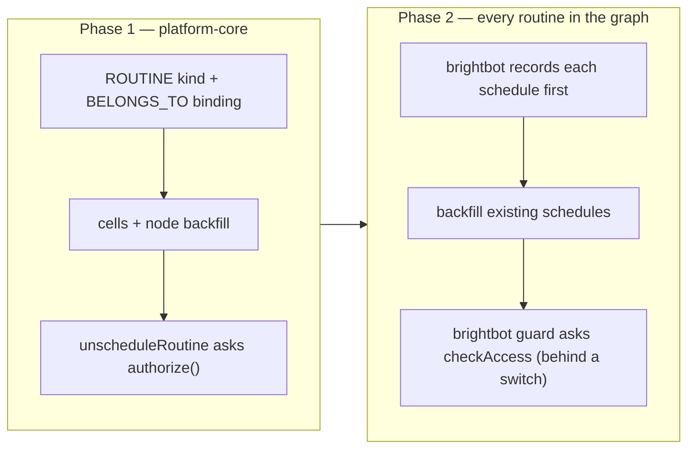

# Routine permissions — one decision in platform-core

## Glossary

| Term | Meaning |
|---|---|
| **Routine** | A recurring job BrightAgent runs on a schedule, whether it started as a suggested routine or was created from the Schedules page, the agent or MCP (Model Context Protocol). Stored as a brightbot schedule row in DynamoDB. |
| **`RoutineScheduleNode`** | The Neo4j node that represents one routine in the permission graph. Its `id` is the brightbot schedule id. |
| **`authorize()`** | platform-core's single access decision (`service/authz/authorize.ts`): tenant check → resource scope → platform-admin step → permission matrix (+ conditions). |
| **`checkAccess`** | The GraphQL query that returns an `authorize()` decision for the caller's JWT (JSON Web Token). |
| **Permission matrix** | Per-workspace, per-role cells `(verb, resource kind)` that admins can edit. A cell may carry a condition. |
| **`OWNER_OR_MANAGER`** | A cell condition that allows the action only if the user has an `OWNS`, `MANAGES` or `CONTRIBUTES_TO` edge to the resource. |
| **Shadow mode** | Per-verb rollout setting (ADR-0003). A shadowed verb's refusal is returned as `ALLOW` with `decidedBy: "shadow"`, so nothing is blocked yet. |
| **Service key** | The shared secret platform-core and Slack use to call brightbot without a user JWT, acting for a named user. |

## 1. Context

Who may change a routine is decided in two places today, with two copies of the same rule: **the owner, or a workspace admin**.

- brightbot `routes/schedule_access.py` (BH-1564) guards edit, enable/disable, run-now and delete on `/manage/scheduled-agents/{id}`. It compares `workspaceRole == "ADMIN"` in Python.
- platform-core `unscheduleRoutine` (`models/routine-suggestion.ts`) checks `owner_user_id === token.sub`, else the workspace admin group.

The access-decision spec's INV-12 says no access verdict may be computed outside `authorize()`, and a workspace admin can't change either copy from the permission-matrix editor. This spec moves the rule into `authorize()` as a new **ROUTINE** resource kind.

What the code allows today:

1. `authorize()` checks resource scope (does this id belong to this workspace?) **before** any admin step (`authorize.ts:145`). A routine with no bound node is refused for everyone, admins included.
2. Ownership is read from Neo4j edges only. Today only routines scheduled from a suggestion get a `RoutineScheduleNode` (`routine-ownership.ts`). It carries `workspaceId` as a property but **no edge to its workspace**. Schedules created anywhere else have no node at all.
3. `checkAccess` is enforced on staging but shadowed on dev and prod.

So the work ships in two phases, and brightbot keeps its local guard until Phase 2 is verified in each environment.



## 2. Interface Contract (MDE)

### 2.1 Vocabulary

`ROUTINE` joins the closed resource-kind vocabulary (access-decision spec INV-10) in: `permission-matrix.ts`, the API and OGM SDLs (Schema Definition Language), `@authorized`'s `AuthResourceKind`, the generated `schema.graphql`, and brightbot's `ResourceKind` mirror.

`resource.id` for ROUTINE is the brightbot **schedule id** (DynamoDB `schedule_id`, also `linked_schedule_id` on a routine suggestion).

### 2.2 Graph shape

```text
(RoutineScheduleNode {id: scheduleId, workspaceId})-[:BELONGS_TO]->(WorkspaceNode)
(UserNode)-[:OWNS]->(RoutineScheduleNode)   one per owner: the creator, and the run-as user for execute_workflow
```

- `BINDING_CYPHER.ROUTINE` binds through `BELONGS_TO`, the same pattern as `AGENT`.
- The ownership lookup (`attribute-reader.ts`) gets a per-kind node label, so ROUTINE matches `RoutineScheduleNode` by an indexed label instead of a label-less scan.

### 2.3 Default cells (`SEED_DEFAULTS`, plus a backfill for existing workspaces)

| Role | UPDATE · ROUTINE | DELETE · ROUTINE | RUN · ROUTINE |
|---|---|---|---|
| WORKSPACE_ADMIN | allow | allow | allow |
| COLLABORATOR, CONTRIBUTOR, VIEWER | `OWNER_OR_MANAGER` | `OWNER_OR_MANAGER` | `OWNER_OR_MANAGER` |
| AGENT_GUEST | none | none | none |

This reproduces today's rule for every human role. AGENT_GUEST stays at "no cells", per its seed policy.

### 2.4 Writing the graph

**Phase 1.**
- `persistRoutineOwnership` also MERGEs `BELONGS_TO`.
- A one-time backfill links every existing `RoutineScheduleNode` to its workspace.
- The backfill deletes nodes whose schedule id has no row in that environment's scheduled-agents table. These are leftovers from earlier turn-offs.

**Phase 2.** Two platform-core mutations, callable with the service key only:

```graphql
recordRoutineSchedule(input: { workspaceId: ID!, scheduleId: ID!, ownerUserIds: [ID!]! }): Boolean!
forgetRoutineSchedule(input: { workspaceId: ID!, scheduleId: ID! }): Boolean!
```

- **`record`.** MERGEs the node and `BELONGS_TO`. It MATCHes each existing `UserNode`, never creating one, and MERGEs `OWNS`. It is idempotent. It is the single writer of `OWNS`. `persistRoutineOwnership` keeps writing only its audit edges (`ACCEPTED`, `RECEIVES`, `DERIVED_FROM`) on the same node. Both paths stamp the same owner, because brightbot sets `created_by` and `owner_user_id` from the acting user.
- **`forget`.** Runs `DETACH DELETE`. It is a no-op if the node is already gone.
- **Create order.** brightbot calls `record` before it writes DynamoDB or EventBridge.
  - If `record` fails, the create returns 503 and nothing is written.
  - If the later DynamoDB write fails, brightbot calls `forget`.
  - A node without a schedule is harmless. A schedule without a node is unmanageable.
- **Delete order.** brightbot deletes the schedule, then calls `forget`. If `forget` fails, it logs the failure, and a nightly sweep removes the stale node. Schedule ids are uuid4 and never reused.

### 2.5 brightbot route → check (Phase 2)

| Route | Verb |
|---|---|
| `PATCH /manage/scheduled-agents/{id}` (edit, enable/disable) | UPDATE |
| `DELETE /manage/scheduled-agents/{id}` | DELETE |
| `POST /manage/scheduled-agents/{id}/run` | RUN |

`checkAccess` gains one additive field, `enforced: Boolean!`. It is false when the verb is shadowed in this environment.

| Answer | brightbot response |
|---|---|
| `effect: ALLOW` and `decidedBy != "shadow"` | continue |
| `effect: BLOCK`, or `decidedBy == "shadow"` (the real answer was BLOCK) | 403, same detail as today |
| no answer within 3 s, or an error (platform-core's own budget is 1 s) | 503, same detail as today |

Which guard brightbot uses is set by a brightbot feature flag, `SCHEDULE_ACCESS_FROM_PLATFORM`. It defaults to off, which means the local guard. That flag is the rollback switch for this check.

### 2.6 `unscheduleRoutine` (Phase 1)

- It calls `authorize()` directly (not the shadow wrapper), with `DELETE · ROUTINE` on the row's `linked_schedule_id`.
- A SCHEDULED row without `linked_schedule_id` is refused, as today's "no recorded owner" case is.
- On success it calls the same node removal as `forget`.

## 3. Invariants (DbC)

- **INV-1** WHEN a bearer-token caller changes a routine, THE System SHALL take the verdict from `authorize()` and SHALL NOT compare role names in code. *Exception:* service-key callers (§5).
- **INV-2** IF the decision is BLOCK, or ALLOW decided by shadow, THEN THE System SHALL refuse the change.
- **INV-3** IF no decision can be obtained, THEN THE System SHALL refuse with a retryable 503.
- **INV-4** Ownership SHALL come from Neo4j `OWNS` edges, never from a caller-supplied id.
- **INV-5** Every `RoutineScheduleNode` SHALL have exactly one `BELONGS_TO` edge to the workspace in its `workspaceId` (Phase 1 onward).
- **INV-6** Every existing brightbot schedule SHALL have a `RoutineScheduleNode` (Phase 2 onward). A disabled schedule still exists. Only delete or turn-off removes it, and the node with it.
- **INV-7** brightbot SHALL NOT switch `SCHEDULE_ACCESS_FROM_PLATFORM` on in an environment until INV-6 is verified there.

## 4. Acceptance Criteria (BDD)

```gherkin
Feature: One permission decision for routines

  Scenario: Owner changes their routine
    Given a routine owned by user A
    When A edits, disables, runs or deletes it
    Then authorize() returns ALLOW by condition and the change happens

  Scenario: Workspace admin changes another member's routine
    Given a routine owned by user A
    When admin B deletes it
    Then authorize() returns ALLOW by matrix

  Scenario: Collaborator is refused
    Given a routine owned by user A
    When collaborator C tries to edit it
    Then the response is 403 and nothing changes

  Scenario: Shadow mode does not open the door
    Given DELETE is shadowed in this environment
    When collaborator C deletes A's routine
    Then checkAccess returns ALLOW decided by "shadow" with enforced false
    And brightbot still refuses with 403

  Scenario: Admin edits the matrix
    Given an admin grants UPDATE · ROUTINE without a condition to COLLABORATOR
    When collaborator C edits A's routine
    Then the change is allowed

  Scenario: Permission service down
    Given checkAccess times out
    When admin B deletes A's routine
    Then the response is 503 and the routine still exists

  Scenario: Existing routines stay manageable after Phase 1
    Given a routine scheduled before Phase 1 shipped
    When the backfill has run
    And A turns it off
    Then the turn-off succeeds and its node is removed

  Scenario: Routine id from another workspace
    Given a routine in workspace X
    When admin B of workspace Y asks to delete it
    Then authorize() returns BLOCK for resource scope

  Scenario: Recording fails, so the create fails
    Given platform-core rejects recordRoutineSchedule
    When A creates a schedule from the Schedules page
    Then the response is 503 and no schedule row exists

  Scenario: Every schedule is recorded
    Given A creates a schedule from the Schedules page
    Then a RoutineScheduleNode bound to the workspace exists with (A)-[:OWNS]-> it
```

## 5. Out of Scope

- Gating reading or creating schedules.
- **Slack exception (named, temporary).** Service-key callers keep brightbot's owner-only check. There is no JWT to ask `checkAccess` with. Removing this needs a service-key form of `checkAccess`.
- Showing owner names in the webapp (BH-1567 shows locked controls only).
- **ADR-0003 exception (named).** brightbot treats a shadowed refusal as a refusal, because this check replaces a guard that is already enforced everywhere. Rollback is the brightbot flag (§2.5), not `AUTHZ_SHADOW_VERBS`. Every other verb/kind keeps ADR-0003's ramp.

## 6. Dependencies

- BH-1564 (brightbot guard, merged).
- BH-1472 (`checkAccess`).
- BH-1476 (`OWNER_OR_MANAGER`).
- BH-1488 (resource binding).
- [ADR-0003](https://github.com/brighthive/brighthive-platform-core/blob/develop/docs/adr/0003-governance-enforcement-ramp.md).
- Phase 1 node cleanup and Phase 2 backfill need read access to each environment's scheduled-agents DynamoDB table.

## 7. Correctness Properties

### Property 1: No role names in code
*For any* bearer-token routine change, the verdict comes from `authorize()`.
**Validates: §3 INV-1, §4 "Admin edits the matrix"**

### Property 2: Shadow never grants
*For any* shadow configuration, a refused routine change stays refused.
**Validates: §3 INV-2, §4 "Shadow mode does not open the door"**

### Property 3: Outage never grants
*For any* failure to obtain a decision, the change is refused with 503.
**Validates: §3 INV-3, §4 "Permission service down"**

### Property 4: Nothing is unmanageable
*For any* schedule that exists, a bound node exists before the schedule can be changed. Deleting the schedule removes the node.
**Validates: §3 INV-5, INV-6, §4 "Existing routines stay manageable", "Recording fails", "Every schedule is recorded"**

## 8. Eval Criteria

Omitted, because this spec has no LLM behavior.

## 9. Observability Contract

- **brightbot log events:**
  - `[SCHEDULER] Refused schedule change`, with fields `schedule`, `caller`, `verb`, `reason`, `decidedBy`, `enforced`.
  - `[SCHEDULER] Permission check unavailable`.
  - `[SCHEDULER] forget failed`.
- **platform-core log events:** existing `authorize()` decision logging, plus `[routines] record/forget schedule failed`.
- **Metrics:** none new.

## 10. Test Coverage Update

| Layer | Where | Cases |
|---|---|---|
| L0 surface | platform-core `tests/unit/permission-matrix.test.ts` | ROUTINE in every kind enum; seed cell expectations updated; `check:core-api-schema` passes after regenerating the SDL; `AuthDecision.enforced` present |
| L1 routing | platform-core `tests/unit/authorize.test.ts`, `tests/unit/check-access.test.ts` | ROUTINE × {UPDATE, DELETE, RUN}: admin → matrix ALLOW; owner → condition ALLOW; non-owner → BLOCK; unbound or foreign id → `resource_scope` BLOCK; `enforced` reflects the shadow setting |
| L2 behavior (real Neo4j) | platform-core `tests/integration/authorize.behavior.test.ts` | owner/admin/collaborator against real `OWNS` + `BELONGS_TO`; backfill links a pre-Phase-1 node; `forget` removes the node |
| L2 behavior (LocalStack DynamoDB) | platform-core `tests/unit/routine-unschedule-mutation.test.ts` (LocalStack-backed despite the folder) | turn-off decided by `authorize()`; no `linked_schedule_id` → refused; node removed on success |
| L2 behavior (moto DynamoDB) | brightbot `tests/integration/test_scheduled_agents_execute_workflow_dynamodb.py` | flag on: shadow ALLOW → 403, outage → 503, real ALLOW → passes; create fails when record fails; flag off: today's guard unchanged |
| e2e | brighthive-e2e (BH-1569) | real staging ADMIN and COLLABORATOR against a recorded schedule |

## 11. Ticket Breakdown

| # | Ticket | Repo | Size | Depends on |
|---|---|---|---|---|
| P1-a BH-1572 | ROUTINE kind, `BELONGS_TO` binding, labelled ownership lookup, default cells, cell + node backfill script | platform-core | M | — |
| P1-b BH-1573 | `unscheduleRoutine` asks `authorize()`, removes the node | platform-core | S | P1-a |
| P2-a BH-1574 | `recordRoutineSchedule` / `forgetRoutineSchedule` + nightly stale-node sweep, plus `AuthDecision.enforced` | platform-core | M | P1-a |
| P2-b BH-1575 | brightbot records on create (before write), forgets on delete | brightbot | S | P2-a |
| P2-c BH-1576 | Backfill every existing schedule per environment | brightbot script | S | P2-b |
| P2-d BH-1577 | brightbot guard asks `checkAccess` behind `SCHEDULE_ACCESS_FROM_PLATFORM` | brightbot | S | P2-c verified |
