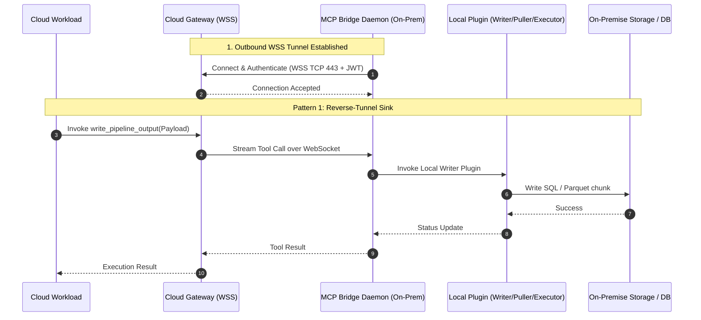
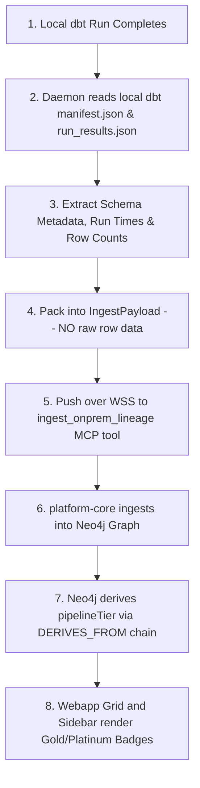
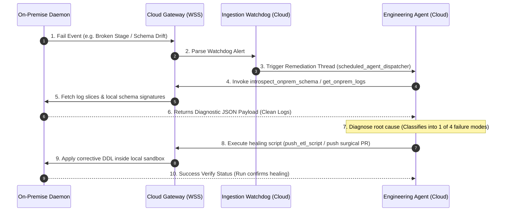

# Enterprise-Grade Design for saas-mcp-bridge Integration

## 1. Context

Enterprise clients operate in highly restricted environments where inbound firewall ports are strictly blocked, yet they require seamless integration with cloud-native SaaS services. The `saas-mcp-bridge` enables bidirectional, secure communication between cloud pipelines/AI swarms and local, on-premises systems. By utilizing an outbound-only reverse-tunnel WebSocket (WSS) connection, the bridge removes the need for incoming network holes, satisfying strict enterprise security compliance.

In the BrightHive ecosystem, the FastMCP server is hosted within `brightbot` (Python) and serves tools in-process with our LangGraph graphs (`deep_agent`). It is served locally at `/bh-mcp/` and exposed in staging/production via dedicated ingress (`https://brightagent-mcp.{env}.brighthive.net/mcp`) to avoid shadow routing issues. This specification defines how the `saas-mcp-bridge` integrates with `brightbot`'s MCP server and `brighthive-platform-core`'s workspace secret-store patterns.

### Use Case / Goal

To establish a secure, reliable, and compliant bridge between cloud-hosted AI/SaaS workloads and on-premises infrastructure. Success is defined by:
- Secure, outbound-only tunnel establishment with zero inbound port requirements.
- Safe, audited transit of small/medium data and scripts via `brightbot` tool calls.
- Highly efficient and reliable retrieval of multi-GB datasets via authenticated chunked-pull.
- Secure, sandboxed code execution on-premises without data exfiltration risk.
- Zero-drift integration with `brightbot`'s FastMCP permissions, principal validation, and testing frameworks.

### How It Works Today

Currently, there is no standardized secure connection adapter to access client local databases and filesystems. Data teams must rely on ad-hoc VPN setups, manual file exports, or insecure, custom-engineered SFTP syncs. This leads to slow client onboarding, inconsistent audit trails, and security compliance bottlenecks.



### Hard Limitations

- **No Inbound TCP Ports**: Clients absolutely block any inbound connections to their DMZ/firewall.
- **Strict Data Exfiltration Rules**: Legal requirements prevent raw database content or sensitive tables from leaving the local network.
- **Payload Limits**: WebSocket connections are inefficient and unstable for transporting files larger than 50 MiB.

### Gaps

- **Lack of Outbound Tunnel Service**: No system exists to maintain outbound-only persistent connections.
- **Credential Storage**: No secure method for local agents to retrieve database connection secrets dynamically without exposing them to the cloud.
- **No Native Bridge Interface in FastMCP**: Our current FastMCP server (`brightbot/mcp/server.py`) has no tools to trigger or orchestrate on-premises bridge actions.
- **Audit Trails**: Missing centralized logging that satisfies both the cloud-side compliance rules and the local enterprise compliance rules.

---

## 2. Interface Contract (MDE)

### 2.1 Model Control Protocol (MCP) Tool Contracts

All tools are registered under a new dedicated FastMCP module: `brightbot/mcp/tools/saas_bridge.py`. 

**CRITICAL SECURITY REQUIREMENT**: To prevent cross-tenant spoofing, `workspace_id` is NEVER accepted as an input argument in any tool signature. It must be resolved server-side from the validated `principal` object (derived from incoming `Bearer` + `Mcp-Session-Id` + `X-Workspace-Id` auth headers). This is strictly enforced by `test_no_principal_fields_in_tool_args` in `tests/unit/mcp_server/test_tool_invariants.py`.

#### Pattern 1: `write_pipeline_output`
Allows the cloud platform to write small SQL scripts or light Parquet files directly.

```python
# brightbot/mcp/tools/saas_bridge.py
@mcp.tool()
async def write_pipeline_output(
    target_db_identifier: str,
    data: str,
    format: str, # "sql" | "parquet_chunk"
) -> dict[str, Any]:
    """Writes SQL/Parquet data directly down the tunnel to local systems.
    
    The target_db_identifier must map to a local DB configuration key 
    stored on-premises within the daemon's local /etc/bridge/config.yaml.
    """
    # workspace_id is resolved internally from the principal context:
    # workspace_id = context.get_principal().workspace_id
    ...
```

#### Pattern 2: `dataset_ready`
Signals the local daemon that a large dataset is prepared for retrieval in the cloud staging buffer.

```python
# brightbot/mcp/tools/saas_bridge.py
@mcp.tool()
async def dataset_ready(
    manifest_url: str,
    one_time_token: str,
) -> dict[str, Any]:
    """Notifies the daemon that a large bulk dataset is ready for chunk pull."""
    ...
```

#### Pattern 3: `push_etl_script`
Sends transformation or analytical logic to be run on-premises inside a sandbox.

```python
# brightbot/mcp/tools/saas_bridge.py
@mcp.tool()
async def push_etl_script(
    script_payload: str,
    runtime: str, # "python3" | "sql-cmd"
    allowed_dsn: str,
    max_memory_mb: int = 4096,
    timeout_sec: int = 300,
) -> dict[str, Any]:
    """Pushes SQL/Python scripts for execution inside the on-premises sandbox."""
    ...
```

### 2.2 Core FastMCP Server Registry Integration

To enable these tools globally, the module must be registered within `brightbot/mcp/server.py`:

```python
# brightbot/mcp/server.py
_CORE_TOOL_MODULES = [
    "brightbot.mcp.tools.longitudinal",
    "brightbot.mcp.tools.analyst_ask",
    "brightbot.mcp.tools.dbt_introspection",
    "brightbot.mcp.tools.governance_quality",
    "brightbot.mcp.tools.saas_bridge",  # NEW: Always-on bridge orchestration tools
]
```

### 2.3 Permissions Catalog Integration

Because these tools execute mutation and write actions, they require explicit catalog configuration in `brightbot/mcp/capabilities.py`. Skipping this configuration will trigger a CI compilation/validation failure in `tests/unit/mcp_server/test_permissions.py`.

```python
# brightbot/mcp/capabilities.py
_t("write_pipeline_output", "Writes SQL or Parquet data to target local DB", ToolPermission.WRITE)
_t("dataset_ready", "Notifies local daemon of available bulk staging datasets", ToolPermission.WRITE)
_t("push_etl_script", "Runs analytical/ETL scripts inside local sandboxes", ToolPermission.WRITE)
```

---

## 3. Invariants (DbC)

1. **Outbound Initiation**: The MCP Bridge Daemon SHALL only initiate connections outbound via WSS (TCP port 443).
2. **Strict Sizing Limit**: WHEN the payload of `write_pipeline_output` exceeds 50 MiB, THE Cloud Gateway SHALL reject the call immediately with `PayloadTooLarge`.
3. **No Caller Workspace Arguments**: All `saas_bridge` tools SHALL NOT accept a `workspace_id` parameter; the server SHALL resolve it exclusively from the validated MCP `principal` object.
4. **KMS Isolation**: Objects placed in the cloud staging bucket for Pattern 2 SHALL be encrypted using customer-managed KMS keys.
5. **Token Expiry (Pattern 2)**: The `one_time_token` payload SHALL contain an `exp` claim. THE Daemon and Gateway SHALL reject any token used past its expiration.
6. **Single-Use Enforcement**: The `one_time_token` SHALL be valid for exactly one bulk download pipeline sequence.
7. **Data Integrity**: THE Chunk Puller Plugin SHALL calculate and verify the SHA-256 checksum of each staging object, aborting the transaction if any mismatch occurs.
8. **Sandbox Isolation**: WHEN running scripts in Pattern 3, THE Script Executor Plugin SHALL use seccomp, firejail, or user namespace restrictions to isolate processes, explicitly disabling all network interface egress.
9. **Resource Control**: THE Script Executor Plugin SHALL enforce cgroup restrictions (CPU ≤ 2 cores, RAM ≤ 4 GiB, Timeout ≤ 300s).
10. **No Hardcoded Secrets**: All database connection info, client keys, and API tokens SHALL be loaded dynamically from the configured Vault/KMS providers.

---

## 4. Acceptance Criteria (BDD — Gherkin)

```gherkin
Feature: saas-mcp-bridge Integration

  Scenario: Pattern 1 - Successful Small SQL Write
    Given an established WSS tunnel between On-Premise Daemon and Cloud Gateway
    When a cloud pipeline calls "write_pipeline_output" with a 5 KiB SQL payload
    Then the Cloud Gateway forwards the request over the WebSocket tunnel
    And the Local Writer Plugin applies the SQL script to the local Postgres database
    And returns a success status back to the Cloud Gateway

  Scenario: Pattern 1 - Rejected Payload Exceeding Limit
    Given an established WSS tunnel
    When a cloud pipeline calls "write_pipeline_output" with a 60 MiB payload
    Then the Cloud Gateway rejects the call with PayloadTooLarge error code 413
    And no message is forwarded down the WebSocket tunnel

  Scenario: Pattern 2 - Large Dataset Pull with Valid Manifest
    Given a large Parquet dataset written to an encrypted cloud staging bucket
    And a JSON manifest containing URL structures and SHA-256 signatures
    When the Gateway sends "dataset_ready" with a valid manifest URL and a one-time token
    Then the Daemon parallel downloads the Parquet chunks using HTTPS GET
    And verifies the SHA-256 checksum of every chunk
    And bulk-loads the data into the local data system
    And responds with transfer metrics status "SUCCESS"

  Scenario: Pattern 2 - Checksum Corruption Failure
    Given a Parquet dataset in cloud staging where one chunk is corrupted during download
    When the Daemon downloads the manifest chunks
    Then the Daemon detects a SHA-256 checksum mismatch for the corrupted chunk
    And aborts the entire transaction
    And rolls back local writes
    And reports error "ChecksumMismatch" to the Gateway

  Scenario: Pattern 3 - Sandbox Sandboxed Run Success
    Given a dbt transformation SQL model generated by the AI agent
    When the Gateway sends "push_etl_script" containing the SQL model and a policy token
    Then the Daemon spawns the Script Executor inside a sandboxed namespace
    And runs the SQL queries against the on-premises database with net-egress disabled
    And returns exit code 0 and stdout metrics

  Scenario: Pattern 3 - Sandbox Network Egress Blocked
    Given a malicious script payload that attempts to exfiltrate database rows to an external IP
    When the Daemon executes the script inside the Script Executor sandbox
    Then any network socket creation attempt is denied by seccomp
    And the execution is terminated
    And reports exit code 1 with "SandboxSecurityViolation"
```

---

## 5. Out of Scope

- Hosting the cloud-side gateway on anything other than Google Cloud GKE / AWS ECS.
- Support for on-premises client daemons running outside standard Linux distributions (e.g. legacy Unix, macOS).
- Handling automatic database schema migrations (Schema evolution is the responsibility of other specialized migration pipelines).

---

## 6. Dependencies

| Dependency | Type | Status |
|------------|------|--------|
| Cloud Gateway (WSS Router) | Blocking | In progress |
| Local daemon daemon executable | Blocking | Not started |
| Docker / firejail runtimes on-premise | Non-blocking | Ready |
| Cloud KMS Integration | Blocking | Ready |

---

## 7. Correctness Properties

### Property 1: Sandbox Egress Prevention

*For any* execution trace of a script pushed via `push_etl_script`, *there exists no* network package leaving the sandbox boundary containing local database rows.

**Validates: §3 Invariant 8, §4 Scenario "Sandbox Network Egress Blocked"**

### Property 2: One-Time Token Revocation

*For any* token used to fetch staging files via `dataset_ready`, *any secondary* presentation of the exact same token signature SHALL return an HTTP 401 Unauthorized response.

**Validates: §3 Invariant 6, §4 Scenario "Large Dataset Pull with Valid Manifest"**

---

## 8. Eval Criteria

This spec coordinates tool-dispatch and workflow logic. To ensure brightbot agents correctly route payloads to the correct tunnel patterns, we define:

| Evaluator | Node | Mode | Threshold | Method |
|---|---|---|---|---|
| Pattern Selection Accuracy | `agent_bridge_router` | GATE | accuracy >= 0.98 | Deterministic payload size and compliance type verification |
| SQL Dialect Safety | `script_generator` | GATE | score >= 0.95 | LLM judge evaluating compliance with on-premises target SQL dialects |

---

## 9. Observability Contract

- **Span**: `gen_ai.tool.execute` with `gen_ai.tool.name=write_pipeline_output | dataset_ready | push_etl_script`
- **Attributes**: `workspace.id` (derived from validated principal), `mcp.connection.status`, `mcp.payload.bytes`, `mcp.sandbox.violations`
- **Log events**:
  - `bridge.tunnel.established`
  - `bridge.tool.calls_received`
  - `bridge.sandbox.execution_started`
  - `bridge.sandbox.violation_detected`
- **Metrics**:
  - `bridge.tunnel.uptime_seconds` (Gauge)
  - `bridge.tool.calls_total` (Counter, partitioned by tool name and status)
  - `bridge.chunk.pull.bytes_total` (Counter)
  - `bridge.chunk.pull.errors` (Counter, partitioned by error type)
  - `bridge.script.exec.duration_seconds` (Histogram)

---

## 10. Syncing Intermediate Tables & Data Products (Medallion Tiers)

To ensure that the cloud-side webapp and Slack integrations correctly render intermediate tables and data products with their accurate Medallion tiers (RAW, BRONZE, SILVER, GOLD, PLATINUM) under strict zero-data-leak constraints, the following metadata-only sync loop is defined:



### 10.1 Ingestion Contract (Metadata Ingest)

We introduce an always-on, read-write telemetry/metadata tool `ingest_onprem_lineage` in `brightbot/mcp/tools/saas_bridge.py`:

```python
# brightbot/mcp/tools/saas_bridge.py
@mcp.tool()
async def ingest_onprem_lineage(
    dbt_manifest_payload: str, # Compressed base64 representation of compiled manifest.json
    run_results_payload: str,   # Compressed base64 representation of dbt run_results.json
) -> dict[str, Any]:
    """Ingests off-cloud model relationships, row-counts, and dependency trees.
    
    This metadata is used to derive the Medallion pipeline tier inside the Neo4j
    semantic catalog without exfiltrating any actual row data.
    """
    ...
```

The cloud-side GraphQL server (`brighthive-platform-core`) reads this schema signature and dependency lineage, inserting the nodes directly into the Neo4j catalog. Because the node structure inherits the standard `DERIVES_FROM` relationship, the Medallion tier gets derived instantly via the Cypher lineage engine, and is rendered automatically in the **Created Data Products** grid.

---

## 11. Integrated Self-Healing Loop over the Bridge

When a pipeline failure occurs on-premises, we chain our self-healing agent loop (Golden Case 11 / GAP-7) across the bridge boundary without manual intervention:



### 11.1 Remediation & Trigger Steps

1. **Failure Capturing**: The local daemon traps database/dbt exit errors and pushes a telemetry event `bridge.run.failed` to the gateway containing `job_id`, `failure_type`, and a truncated stack trace (max 10 KiB).
2. **Watchdog Firing**: The ingestion watchdog `pipeline_watchdog_task.py` inside `brightbot` handles this, creating a fresh agent thread via `scheduled_agent_dispatcher`.
3. **Information Gathering**: The agent requests the active local schema using the `introspect_warehouse_schema` and `get_onprem_logs` bridge tools.
4. **Classification**: The agent runs the diagnose block, classifying into:
   - `schema_drift` -> Generates an `ALTER TABLE` DDL.
   - `broken_stage` -> Generates corrective external stage points.
   - `missing_partition` -> Identifies missing date slice.
   - `dbt_contract` -> Locates contract mismatch.
5. **Heal Action Dispatch**:
   - For DDL-based remediations (`schema_drift`, `broken_stage`), the agent invokes `push_etl_script` to run the fix locally inside the secure sandbox.
   - For code-based remediations (`dbt_contract`), the agent opens a **surgical PR** on GitHub and halts execution. Once the operator approves and merges, the daemon triggers a local compile/pull sequence.
6. **PRExistenceCheck & Evaluation**: Once applied, the daemon runs the sandbox `detect()` verification sequence to confirm the failure state has cleared and reports `SUCCESS` back over the tunnel.

---

## 12. Test Coverage Update

### 12.1 Verification Harness and Mocks

We must extend the current unit/integration testing suites to ensure robust coverage before merging:

| Repo | Suite | What to add |
|---|---|---|
| `brightbot` | `tests/unit/mcp_server/test_saas_bridge.py` | Add unit tests for `write_pipeline_output`, `dataset_ready`, `push_etl_script`, and `ingest_onprem_lineage` to mock Gateway responses. |
| `brightbot` | `tests/unit/mcp_server/test_tool_invariants.py` | Automatically checks that `saas_bridge` tools comply with `test_no_principal_fields_in_tool_args`. |
| `brighthive-platform-core` | `brighthive-platform-core/tests/` | Endpoint checks verifying single-use `one_time_token` and token generation with correct KMS scopes. Verify Neo4j correctly derives `pipelineTier` over off-cloud mock lineages. |
| `brighthive-e2e` | `brighthive-e2e/e2e/` | Run end-to-end integration flows simulating a mock on-premise daemon executing and returning metrics for Patterns 1, 2, and 3. |

### 12.2 Real-Behavior Integration Test Coverage

At least one execution path must perform a real-behavior loop. In `tests/integration/mcp_server/test_bridge_e2e.py`, spin up a local instance of the MCP daemon bound to a localhost SQLite adapter, invoke `write_pipeline_output` from `brightbot` via the actual WebSocket routing mechanism, and assert that the rows are correctly inserted into the local SQLite database.

---

## Areas Involved

| Area | Repo | Impact |
|------|------|--------|
| BrightBot | `brightbot` | Integration of bridge connection utilities, routing agent tool payloads, metadata lineage sync, and sandbox dialect validation. |
| Platform Core | `brighthive-platform-core` | Implementation of JWT generation, Cloud Gateway routing mechanism, Neo4j schema updates, and DB schemas for tenant connections. |

---

## Ticket Breakdown

Generated via `/create-jira-ticket` from this spec.

| Ticket | Summary | Points | Epic |
|--------|---------|--------|------|
| BH-1251 | Scaffold MCP Bridge Gateway and WSS connection endpoint in platform-core | 5 | BH-1250-mcp-bridge |
| BH-1252 | Implement MCP On-Premise Daemon connection loop and retry logic | 5 | BH-1250-mcp-bridge |
| BH-1253 | Create `brightbot/mcp/tools/saas_bridge.py` and register in `server.py` | 3 | BH-1250-mcp-bridge |
| BH-1254 | Implement Pattern 1 (Reverse-Tunnel Sink) for direct light-write plugin | 3 | BH-1250-mcp-bridge |
| BH-1255 | Implement Pattern 2 (Staging Buffer & Outbound Puller) with SHA-256 checks | 8 | BH-1250-mcp-bridge |
| BH-1256 | Implement Pattern 3 (Sandboxed Script Executor) with network egress block | 8 | BH-1250-mcp-bridge |
| BH-1257 | Implement `ingest_onprem_lineage` tool and wire Neo4j Medallion tier updates | 5 | BH-1250-mcp-bridge |
| BH-1258 | Chain pipeline_watchdog_task with bridge diagnostic tools for self-healing | 8 | BH-1250-mcp-bridge |
| BH-1259 | Add tool permissions row to capabilities.py and wire metrics instrumentation | 3 | BH-1250-mcp-bridge |

---

## Related

- **POC**: `docs/pocs/saas-mcp-tunnel-latency.md` (Validated by initial tunnel connection experiments)
- **Feature doc**: `docs/features/saas-mcp-bridge-integration.md` (To be created upon release completion)
