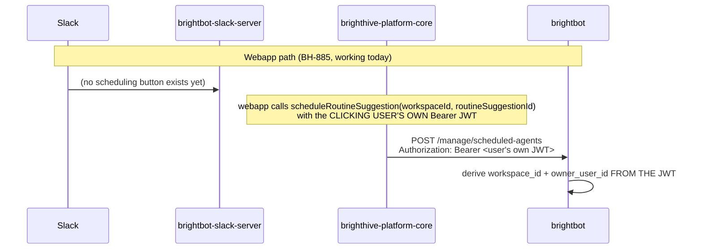

# Slack routine-suggestion scheduling — acting-user auth

> Not a UI/copy spec — this is an authentication-surface spec. BH-887 ("Slack cards for routine
> suggestions") cannot ship a working Schedule/Dismiss button without this: both mutations it
> would call require a real user Bearer JWT today, and Slack has none to give.

## Contents

- [1. Context](#1-context)
- [2. Interface Contract (MDE)](#2-interface-contract-mde)
- [3. Invariants (DbC)](#3-invariants-dbc)
- [4. Acceptance Criteria (BDD — Gherkin)](#4-acceptance-criteria-bdd--gherkin)
- [5. Out of Scope](#5-out-of-scope)
- [6. Dependencies](#6-dependencies)
- [7. Correctness Properties](#7-correctness-properties)
- [9. Observability Contract](#9-observability-contract)
- [10. Test Coverage Update](#10-test-coverage-update)
- [Areas Involved](#areas-involved)
- [Ticket Breakdown](#ticket-breakdown)
- [Related](#related)

## 1. Context

BH-886 (done — brighthive-platform-core#1017, brightbot#795) put a routine-suggestion
notification into the webapp inbox. BH-887 asks for the same offer to render as a Slack message
with **Schedule** / **Dismiss** buttons (`brightbot-slack-server`'s notification Block Kit
already has the extension point — `STAGE_ACTIONS` in `src/notifications/blocks.ts` is currently
empty for every stage per BH-971, which disabled all action buttons until each one has a real
handler; `workflow_suggestion` needs an entry there wired to a real `app.action(...)` handler).

The blocker is identity, not UI. `scheduleRoutineSuggestion` / `dismissRoutineSuggestion`
(`brighthive-platform-core/src/graphql/models/routine-suggestion.ts`) both require
`isAuthenticated && token?.sub` — a real Cognito JWT for the specific user — and
`scheduleRoutineSuggestion` additionally forwards `jwtToken` as a Bearer token to brightbot's
`/manage/scheduled-agents` (`routine-scheduler-client.ts::createRoutineSchedule`), which uses
that same JWT to derive `workspace_id`/`owner_user_id` for the created schedule. A Slack click has
no JWT to give either mutation.

### Use Case / Goal

A user sees a routine-suggestion Slack message, clicks **Schedule**, and the routine gets
scheduled under **their own BrightHive identity** — not a generic service identity, not
whichever Cognito service-user happens to run the workspace's Slack integration. Clicking
**Dismiss** similarly records the dismissal as caused by them.

### How It Works Today



- **`resolveSlackUser`** (`brightbot-slack-server/src/auth/workspace-token-manager.ts:450`) maps
  a Slack user ID → real BrightHive `userId` via a platform-core GraphQL query. This is solved —
  slack-server already knows *who* clicked.
- **`getWorkspaceToken`/`fetchTokenFromCognito`** (same file, line 200/232) mints a JWT for a
  per-workspace **service** Cognito user (`InitiateAuthCommand` with stored credentials) — this
  JWT's `sub` is the service user, not the clicking human. Used today for read-only /
  workspace-scoped calls where "who acted" doesn't matter.
- **`brightbot`'s `authenticate_request()`** (`brightbot/utils/token_validator.py`) accepts
  Bearer JWT (validated against platform-core) or `X-Api-Key` (resolves to a generic
  `system_api_key_user` identity). Neither path means "act as this specific resolved user without
  their own JWT."
- **`executeWorkflowAsOwner`** / **`updateWorkflowRunStep`**
  (`brighthive-platform-core/src/graphql/models/workflow-spec-execution.ts:414,492`) are the
  existing, reviewed precedent for "an internal service acts as a named user": gate on
  `x-service-key` (`isValidServiceKey()`, constant-time comparison), then **revalidate** the named
  `ownerUserId`'s current workspace role via `AuthModel.findWorkspaceRoleByUserId` +
  `assertWorkspacePermission` before doing anything — never trust a forwarded/stored identity
  claim.

### Hard Limitations

- Slack interactivity payloads carry a Slack user ID, never a BrightHive Cognito JWT. There is no
  way to "just forward a token" the way the webapp does.
- The service-Cognito-user JWT (`getWorkspaceToken`) authenticates as the *workspace's service
  account*, not the clicking human. Using it for `createRoutineSchedule` would stamp the wrong
  `owner_user_id` on the created schedule — an identity-correctness bug, not just a missing
  permission check.
- `scheduleRoutineSuggestion` performs a real state-machine transition (`OFFERED` = suggested,
  not yet acted on → `SCHEDULING` = a transient write-lock held while the brightbot schedule is
  being created → `SCHEDULED` = committed; with stale-lock reclaim and orphaned-schedule cleanup)
  — this is not a read; a wrong actor identity here has lasting effects (Neo4j ownership edges,
  who a future audit blames for the schedule).

### Gaps

1. `scheduleRoutineSuggestion` / `dismissRoutineSuggestion` have no service-key auth path at all
   (confirmed: `grep -n "serviceKey\|x-service-key\|isValidServiceKey" src/graphql/models/routine-suggestion.ts` → zero results).
2. brightbot's `/manage/scheduled-agents` route has no "act as this resolved user" auth mode —
   only real-JWT or generic-system-identity.
3. `brightbot-slack-server` has no route that: resolves the Slack user → calls platform-core with
   an acting-user identity → renders success/failure back into the Slack thread.
4. `STAGE_ACTIONS["workflow_suggestion"]` doesn't exist yet in `blocks.ts`, and no
   `app.action("bh_notif_routine_schedule")` handler exists in `app.ts`.

## 2. Interface Contract (MDE)

### 2.1 platform-core — service-key acting-user auth on the two mutations

```graphql
mutation scheduleRoutineSuggestion(
  workspaceId: ID!
  routineSuggestionId: ID!
  recipientUserIds: [ID!]
  actingUserId: ID          # NEW — required when called via x-service-key; forbidden via user JWT
): RoutineSuggestion!
  Headers (service-key path): x-service-key: <SCHEDULER_SERVICE_API_KEY>
  Response 4xx:
    FORBIDDEN                          — no JWT AND no valid service key
    ROUTINE_SUGGESTION_ACTOR_REQUIRED  — service-key path missing actingUserId
    ROUTINE_SUGGESTION_ACTOR_UNAUTHORIZED — actingUserId lacks workspace membership/permission

mutation dismissRoutineSuggestion(
  workspaceId: ID!
  routineSuggestionId: ID!
  actingUserId: ID          # NEW, same rule as above
): RoutineSuggestion!
```

### 2.2 brightbot — acting-user schedule creation

```text
POST /manage/scheduled-agents
  Headers (service-key path, NEW): x-service-key: <SCHEDULER_SERVICE_API_KEY>
                                    x-acting-user-id: <brighthive_user_id>
  Behavior: identical to the existing Bearer-JWT path, except workspace_id/owner_user_id are
            taken from x-acting-user-id (revalidated against platform-core's currentUser/
            workspace-role lookup) instead of decoded from a JWT.
  Response 4xx: 403 if x-service-key invalid; 403 if x-acting-user-id isn't a member of the
                target workspace.
```

### 2.3 brightbot-slack-server — new internal action route

```text
POST /internal/routine-suggestion-action   (NEW, called only by app.ts's Bolt action handler —
                                             not Slack-facing directly)
  Request: { slackTeamId, slackUserId, workspaceId, routineSuggestionId, action: "schedule" | "dismiss" }
  Behavior: resolveSlackUser(slackTeamId, slackUserId) -> brighthiveUserId; then calls
            platform-core's scheduleRoutineSuggestion/dismissRoutineSuggestion with
            x-service-key + actingUserId=brighthiveUserId (NOT the service-Cognito-user JWT).
  Response: { ok: boolean, status: RoutineSuggestionStatus, error?: string }
```

## 3. Invariants (DbC)

1. `actingUserId` is REQUIRED on the service-key path and FORBIDDEN (ignored, or rejected — pick
   one, see AC) on the user-JWT path — the two auth modes never mix on one request.
2. The acting user's workspace membership + `projectUpdate`-equivalent permission is
   revalidated on every call — never cached, never trusted from a prior call.
3. `createRoutineSchedule`'s resulting schedule's `owner_user_id` MUST equal the resolved acting
   user's BrightHive `userId` — never the service-Cognito-user's `sub`.
4. A Slack user with no `resolveSlackUser` mapping (unlinked account) gets a clear, actionable
   error in the Slack thread, never a silent no-op or a schedule attributed to the wrong person.
5. The service key (`SCHEDULER_SERVICE_API_KEY`) is compared via `isValidServiceKey()` — the
   existing constant-time comparator, reused, not reimplemented.
6. WHEN the service-key path is used, THE System SHALL NOT allow `actingUserId` to be supplied by
   an unauthenticated caller as a way to impersonate — the service key itself is the trust
   boundary; only brightbot-slack-server (holder of the key) may call this path.

## 4. Acceptance Criteria (BDD — Gherkin)

```gherkin
Feature: Slack-triggered routine scheduling with correct actor identity

  Scenario: User schedules a routine suggestion from Slack
    Given a routine suggestion is OFFERED in workspace W
    And Slack user U is linked to BrightHive user B via resolveSlackUser
    When U clicks "Schedule" on the Slack notification
    Then scheduleRoutineSuggestion is called with x-service-key and actingUserId=B
    And the created schedule's owner_user_id equals B
    And the suggestion status becomes SCHEDULED
    And the Slack thread shows a success confirmation

  Scenario: User dismisses a routine suggestion from Slack
    Given a routine suggestion is OFFERED in workspace W
    And Slack user U is linked to BrightHive user B
    When U clicks "Dismiss" on the Slack notification
    Then dismissRoutineSuggestion is called with actingUserId=B
    And the suggestion status becomes DISMISSED

  Scenario: Unlinked Slack user attempts to schedule
    Given Slack user U has no resolveSlackUser mapping in workspace W
    When U clicks "Schedule"
    Then the Slack thread shows an actionable "link your account" error
    And no mutation is sent to platform-core

  Scenario: Service-key call with an actingUserId lacking workspace membership
    Given BrightHive user B is not a member of workspace W
    When brightbot-slack-server calls scheduleRoutineSuggestion with x-service-key and actingUserId=B
    Then platform-core responds ROUTINE_SUGGESTION_ACTOR_UNAUTHORIZED
    And no schedule is created

  Scenario: Invalid service key
    When a caller sends x-service-key that does not match SCHEDULER_SERVICE_API_KEY
    Then platform-core responds FORBIDDEN
    And no suggestion state changes

  Scenario: User-JWT path is unaffected
    Given a webapp user schedules a routine suggestion via their own Bearer JWT (BH-885, existing)
    When scheduleRoutineSuggestion is called with no x-service-key header
    Then behavior is identical to pre-BH-887 — actingUserId is ignored on this path
```

## 5. Out of Scope

- Slack card visual design / copy (follows the existing `buildNotificationBlocks` pattern already
  used for other stages — no new design system work).
- Any change to the webapp's existing user-JWT scheduling path (BH-885) — this spec only adds a
  second, service-key auth mode alongside it.
- Slash-command or modal-based scheduling from Slack — buttons only, matching BH-887's original
  ask.
- Re-enabling action buttons for any OTHER notification stage (`quality_checks`, `schema_drift`,
  etc.) — `DISABLED_STAGE_ACTIONS` in `blocks.ts` stays disabled for those; this spec only adds a
  `workflow_suggestion` entry to `STAGE_ACTIONS`.

## 6. Dependencies

| Dependency | Type | Status |
|------------|------|--------|
| BH-886 (inbox card + write-side signal) | Non-blocking | Done — brighthive-platform-core#1017, brightbot#795 |
| `isValidServiceKey()` / `SCHEDULER_SERVICE_API_KEY` | Blocking (reused, not new) | Ready — exists in `workflow-spec-execution.ts` |
| `resolveSlackUser` GraphQL query | Blocking (reused) | Ready — exists in platform-core, consumed by slack-server today |
| `AuthModel.findWorkspaceRoleByUserId` / `assertWorkspacePermission` | Blocking (reused) | Ready — exists, used by `executeWorkflowAsOwner` |

## 7. Correctness Properties

### Property 1: Actor identity is always the resolved human, never the service identity

*For any* schedule created via the service-key path, `owner_user_id` on the resulting brightbot
schedule equals the `actingUserId` resolved from `resolveSlackUser`, never the Cognito
service-user's `sub` used by `getWorkspaceToken`.

**Validates: §3 Invariant 3, §4 Scenario "User schedules a routine suggestion from Slack"**

### Property 2: Service-key path always revalidates, never trusts

*For any* request on the service-key path, platform-core calls
`AuthModel.findWorkspaceRoleByUserId(actingUserId, workspaceId)` and `assertWorkspacePermission`
before mutating suggestion state — a stale or forged `actingUserId` with no real membership is
rejected every time, not cached from a prior successful call.

**Validates: §3 Invariant 2, §4 Scenario "Service-key call with an actingUserId lacking workspace membership"**

## 9. Observability Contract

- **Log events** (brightbot-slack-server): `routine_suggestion_action.received`,
  `routine_suggestion_action.resolved_user` (or `.unresolved_user`),
  `routine_suggestion_action.upstream_success` / `.upstream_error`.
- **Log events** (platform-core, `routine-suggestion.ts`): existing `console.error` pattern
  extended — `[routines] scheduleRoutineSuggestion actor_unauthorized actingUserId=<id> workspaceId=<id>`
  on the new rejection path, matching the file's existing bracketed-tag log style.
- **Metrics**: none new — this reuses existing mutation call counters if platform-core has any at
  the resolver layer already; no new metric surface introduced by this spec.

## 10. Test Coverage Update

| Repo | Suite | What to add |
|---|---|---|
| `brighthive-platform-core` | `tests/unit/` (new `routine-suggestion-service-auth.test.ts`, mirroring `notifications-service-key.test.ts`'s real-behavior-against-the-resolver pattern) | One test per §4 scenario touching platform-core: valid service-key + valid actingUserId succeeds; invalid service key → FORBIDDEN; valid key + unauthorized actingUserId → ROUTINE_SUGGESTION_ACTOR_UNAUTHORIZED; missing actingUserId on service-key path → ROUTINE_SUGGESTION_ACTOR_REQUIRED; existing user-JWT path unaffected (regression) |
| `brightbot` | `tests/unit/` + `tests/integration/` (extend the scheduled-agents route test file) | One test asserting `x-acting-user-id` + valid service key creates a schedule with `owner_user_id` set to the acting user (Property 1), and one negative test for a non-member acting user |
| `brightbot-slack-server` | `src/**/*.test.ts` (new test alongside `app.ts`'s existing action-handler tests) | One test per §4 Slack-facing scenario: schedule success, dismiss success, unlinked-user error path, upstream error surfaces a Slack-visible message |
| `brighthive-e2e` | `e2e/features/scheduler/` (extend the existing BH-947 chain test directory) | One end-to-end feature test: real Slack action payload → real slack-server → real platform-core (staging) → assert suggestion status transitions to SCHEDULED and the brightbot schedule's owner matches the acting user |

**Real-behavior requirement**: the platform-core test row drives the real
`RoutineSuggestionModel.scheduleRoutineSuggestion` resolver (not a mock of it) the same way
`notifications-service-key.test.ts` and `notifications-reconcile.test.ts` already do for sibling
mutations. The brightbot-e2e row hits real staging services, not stubs.

## Areas Involved

| Area | Repo | Impact |
|------|------|--------|
| Platform Core | `brighthive-platform-core` | `scheduleRoutineSuggestion`/`dismissRoutineSuggestion` gain a service-key + `actingUserId` auth mode, mirroring `executeWorkflowAsOwner` |
| BrightBot | `brightbot` | `/manage/scheduled-agents` gains an `x-acting-user-id` mode alongside existing Bearer-JWT/API-key auth |
| Slack Server | `brightbot-slack-server` | New internal route + Bolt action handler; `STAGE_ACTIONS["workflow_suggestion"]` populated in `blocks.ts` |

## Ticket Breakdown

| Ticket | Summary | Points | Epic |
|--------|---------|--------|------|
| BH-1001 | platform-core: add service-key + actingUserId auth mode to scheduleRoutineSuggestion/dismissRoutineSuggestion | 3 | BH-876 |
| BH-1002 | brightbot: add x-acting-user-id mode to /manage/scheduled-agents, revalidated against platform-core | 3 | BH-876 |
| BH-1003 | brightbot-slack-server: internal routine-suggestion-action route + Bolt handler + Slack card copy | 3 | BH-876 |
| BH-1004 | brighthive-e2e: end-to-end Slack scheduling chain test against staging | 2 | BH-876 |

## Related

- **Parent epic**: BH-876 (BrightRoutines)
- **Precedent**: `executeWorkflowAsOwner` / `updateWorkflowRunStep` (BH-878/BH-926) — the reviewed
  service-key + acting-user-revalidation pattern this spec extends to a second pair of mutations.
- **BH-886**: inbox card + write-side signal (done) — this spec's sibling surface for the same
  RoutineSuggestion offer.
