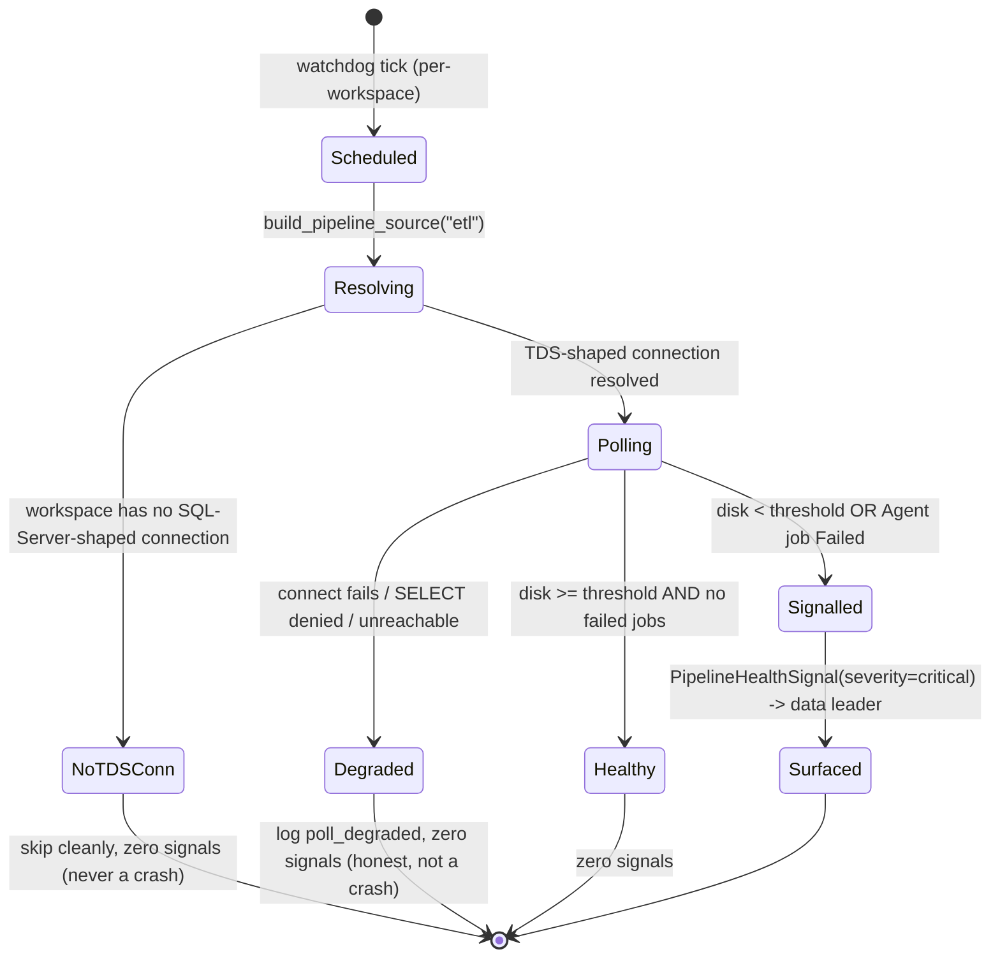

# Proactive SQL Server Health Watch

> Full contract: `~/.claude/rules/spec-driven.md`. **This is a VERIFY-ONLY spec.** The
> capability already ships (`SqlServerPipelineSource`, BH-1045 / GC-15). This spec pins the
> Loop Capital trial success-criterion-4 acceptance bar around code that already exists,
> wires the schedule/surfacing, and flags the two real gaps the code itself documents. Every
> type and behavior below carries a `file:line` reference to the real implementation — nothing
> here is invented. Engine-agnostic: SQL Server is ONE adapter behind the existing
> `PipelineSource` port + registry.

## 1. Context

Loop Capital's trial success-criterion 4 asks BrightHive to **proactively detect operational
health problems on a legacy SQL Server that has no MCP and no BrightHive software installed** —
specifically (a) the data volume running low on free disk, and (b) a SQL Server Agent job that
has failed — and surface them as governed health signals a data leader sees, before an SSIS
extract silently starts failing for lack of space. Frank's literal challenge was "SQL Server
with no MCP... disk at 20%." The capability that answers it already exists: `SqlServerPipelineSource`
(`brightbot/agents/governance_agent/tools/sql_server_pipeline_source.py:182`) polls disk via
`sys.dm_os_volume_stats` and Agent jobs via `msdb.dbo.sysjobs`/`sysjobhistory` through the
**existing** `SynapseConnection` (plain pymssql/TDS) — no on-host collector. This spec's job is
to (1) pin the trial-4 acceptance bar as executable Gherkin against that code, (2) specify the
schedule + surfacing wiring around it, and (3) name the two gaps the code's own comments flag.

### Watch flow



### Use Case / Goal

Frank's on-call engineer (and Frank's data leader) learn that the SQL Server volume is below the
free-disk threshold, or that a named Agent job failed and *why*, from a governed signal in the
product — not from a downstream SSIS job crashing hours later.

### How It Works Today

- **`SqlServerPipelineSource`** (`sql_server_pipeline_source.py:182`) — the reference adapter.
  Connects through the existing `WarehouseTool` / `SynapseConnection` chain
  (`warehouse_connections.py:248-424`, plain pymssql/TDS), never a new agent. `poll_health`
  (`:197`) offloads the blocking connect+query chain via `asyncio.to_thread` (`:220`) so a
  blocked TDS socket cannot freeze the event loop (BH-1217).
- **Disk check** (`_check_disk`, `:237`) runs `_DISK_CHECK_SQL` (`:69`, `sys.dm_os_volume_stats`),
  dedupes to one signal per database at the lowest `percent_free`, and ties "largest file" to the
  specific low-free volume. Emits `failure_type="source_disk_low"` (`FAILURE_TYPE_SOURCE_DISK_LOW`,
  `:48`), `severity="critical"`, `source_type="etl"`.
- **Agent-job check** (`_check_jobs`, `:347`) runs `_JOB_STATUS_SQL` (`:98`) + a best-effort
  `_JOB_FAILURE_DETAIL_SQL` (`:115`) for the failed step's error text. Emits
  `failure_type="etl_job_failure"` (`FAILURE_TYPE_ETL_JOB_FAILURE`, `:49`), keyed
  `job_id=f"{connection_key}:{job_name}"` (`:411`).
- **Threshold** is a constructor arg `disk_free_pct_threshold` (`:189`) defaulting to
  `DEFAULT_DISK_FREE_PCT_THRESHOLD = 20.0` (`:52`) — Frank's literal "20% remaining."
- **Sandbox** (`clients/trials/loopcapital/sandbox/`) — real Dockerized SQL Server. `fill_disk.sh`
  drives the fixed-size volume toward ~18-20% free; `sql/02_create_agent_jobs.sql` seeds one
  Succeeded and one Failed Agent job. GC-15 golden test already passes against it.

### Hard Limitations

- **`source_type` is a CLOSED `Literal["dbt","databricks","etl"]`** (`pipeline_health.py:72`).
  SQL Server signals ride the `"etl"` discriminator — there is **no** `"sqlserver"` literal, by
  design. Any consumer distinguishing SQL Server does so via `failure_type`, not `source_type`.
- **`sys.dm_os_volume_stats` requires server-level `VIEW SERVER STATE`** — a standard BYOW
  database-level SELECT grant does not cover it (`:128-133`). On a non-sysadmin login the disk
  check surfaces a permission error and returns zero disk signals (matched on `"permission"` in
  the error text, `:243`, because `WarehouseTool.query()` exposes no structured error code).
- Every live caller today builds the adapter with an **empty config** (`:198-202`), so
  `warehouse_service_id` is `None` and connection resolution falls to "first TDS-shaped entry."
  The disambiguation branch (`:165-168`) is exercised only by unit tests until a caller threads a
  real service id.

### Gaps

1. **Grant gap (KNOWN GAP #2 in code):** the read-only BYOW login the trial provisions must be
   granted `VIEW SERVER STATE` or the disk check is silently permission-denied. This spec makes
   that a documented pre-req + an invariant, not a surprise.
2. **Schedule + surfacing wiring:** this spec pins *when* `poll_health` runs (per-workspace
   watchdog tick) and *how* a `severity="critical"` signal reaches the data leader. The adapter
   emits signals; the schedule/surfacing path around it is what trial-4 acceptance exercises.

## 2. Interface Contract (MDE)

**Engine-agnostic first: the PORT + REGISTRY are the design. SQL Server is the first adapter, not the design.**

### The port (UNCHANGED — cite, do not redefine)

```python
# brightbot/agents/governance_agent/tools/pipeline_health.py:86-95
class PipelineSource(Protocol):
    def capabilities(self) -> frozenset[Capability]: ...          # :93
    async def poll_health(self, *, ctx: RequestContext) -> list[PipelineHealthSignal]: ...  # :95

Capability = Literal["JOB_STATUS", "DISK_METRICS"]                # :29
```

### The signal DTO (UNCHANGED — cite the real shape, do not invent)

```python
# pipeline_health.py:60-83  (frozen dataclass)
@dataclass(frozen=True)
class PipelineHealthSignal:
    workspace_id: str
    source_type: Literal["dbt", "databricks", "etl"]   # :72 — SQL Server emits "etl", NOT "sqlserver"
    job_id: str                                          # stable per-connection/per-job id (Invariant 9)
    failure_type: str                                    # "source_disk_low" | "etl_job_failure"
    severity: Literal["info", "warning", "critical"]     # :75
    root_cause_class: RootCauseClass                     # :53-57 — SQL Server uses JOB_RUNTIME
    detected_at: datetime
    diagnosis: str                                       # human-readable; deterministic (see §8)
    metadata: dict[str, Any]                             # exact-key payload per failure_type
```

### The registry + factory (UNCHANGED — cite)

```python
# pipeline_health.py:106
PIPELINE_SOURCE_ADAPTERS: dict[str, type[PipelineSource]] = {}
# :135  ETL_GENERIC = "etl"  ->  SqlServerPipelineSource   (registered in register_adapters(), :109-139)

def build_pipeline_source(*, source_type: str, config: dict[str, Any]) -> PipelineSource: ...  # :142-155
    # raises ValueError on unknown source_type (:150-154), never a bare KeyError
```

### The first adapter, NOT the design

```python
# sql_server_pipeline_source.py:182
class SqlServerPipelineSource:
    def __init__(self, *, config: dict[str, Any],
                 disk_free_pct_threshold: float = DEFAULT_DISK_FREE_PCT_THRESHOLD) -> None: ...  # :185
        # disk_free_pct_threshold is CONFIG with an override seam (pluggable-scalable PS-5),
        # NOT a literal baked into domain logic. DEFAULT = 20.0 (:52).
    def capabilities(self) -> frozenset[str]: return frozenset({"JOB_STATUS", "DISK_METRICS"})   # :194
    async def poll_health(self, *, ctx: RequestContext) -> list[PipelineHealthSignal]: ...        # :197
```

### `metadata` payload contracts (exact keys, per failure_type)

```
source_disk_low  (sql_server_pipeline_source.py:332-342):
  { database_name, percent_free, connection_key,
    largest_file_name, largest_file_type, largest_file_size_mb }

etl_job_failure  (:417-425):
  { job_name, connection_key, failed_step_name, failure_message }   # failure_message trimmed to 300 chars (:400)
```

## 3. Invariants (DbC)

1. `WHEN` a workspace has zero SQL-Server-shaped (TDS) connections, `THE System SHALL` return an
   empty signal list and never raise (`sql_server_pipeline_source.py:207-212`).
2. `WHEN` the disk `percent_free` for a database is `< disk_free_pct_threshold`, `THE System SHALL`
   emit exactly one `source_disk_low` signal for that database at severity `critical` (`:309-344`).
3. `THE System SHALL` treat `disk_free_pct_threshold` as configurable per adapter instance, never a
   hard-coded constant in domain logic (`:189`, PS-5).
4. `THE System SHALL NOT` silently drop a `critical` signal: every signal `poll_health` returns is
   handed to the surfacing path (§9 log event fires for each).
5. `THE System SHALL` issue only SELECT / read-only queries against `msdb` and `sys.*`
   (`_DISK_CHECK_SQL` :69, `_JOB_STATUS_SQL` :98, `_JOB_FAILURE_DETAIL_SQL` :115) — it `SHALL NOT`
   issue any INSERT/UPDATE/DELETE/DDL against the client's SQL Server. **The product never writes
   to Frank's SQL Server.**
6. `THE System SHALL` connect only through a TDS-shaped connection; `IF` the resolved connection is
   non-TDS (Redshift/Snowflake), `THEN THE System SHALL NOT` force it through the Synapse chain
   (`:149-156`, BH-1217 — wrong wire protocol hangs on connect).
7. `WHEN` the disk query fails on a permission error, `THE System SHALL` log a permission-specific
   warning and return zero disk signals — never crash the poll (`:243-251`).
8. `WHEN` the failed-step-detail query fails, `THE System SHALL` still emit the `etl_job_failure`
   signal with job name only (best-effort enrichment, `:379-385`).
9. `THE System SHALL` set `job_id` to a stable, non-empty, non-timestamp-derived identifier: the
   connection key for disk signals (`:323`), `"{connection_key}:{job_name}"` for job signals
   (`:411`).
10. `THE System SHALL NOT` place any secret or credential value in `source_config` / adapter
    `config`; connection secrets resolve via `get_workspace_secret` (`:158-160`), never inline.
11. `THE System SHALL` emit `source_type="etl"` for every SQL Server signal — never a `"sqlserver"`
    literal (bounded by the closed `Literal`, `pipeline_health.py:72`).
12. `THE System SHALL` set `root_cause_class = RootCauseClass.JOB_RUNTIME` for both SQL Server
    failure types (`:326`, `:414`) — no data-shape signature.
13. `THE System SHALL` dedupe multi-file databases to one disk signal per database at the lowest
    `percent_free` seen (`:282-291`).
14. `WHEN` an unknown `source_type` is passed to `build_pipeline_source`, `THE System SHALL` raise a
    hand-written actionable `ValueError`, never a bare `KeyError` (`pipeline_health.py:150-154`).

## 4. Acceptance Criteria (BDD — Gherkin)

```gherkin
Feature: Proactive SQL Server health watch (Loop Capital trial-4)

  Scenario: Disk below threshold produces a critical signal
    Given a workspace with a TDS-shaped SQL Server connection
    And the sandbox data volume is filled to below 20% free
    When the watchdog polls health for that workspace
    Then a signal with failure_type "source_disk_low" and severity "critical" is emitted
    And its metadata carries database_name, percent_free, and largest_file_name

  Scenario: Failed Agent job produces a signal with the actual error
    Given a SQL Server with an Agent job whose last run status is Failed
    When the watchdog polls health
    Then a signal with failure_type "etl_job_failure" and severity "critical" is emitted
    And its diagnosis names the failed step and the raw failure message (trimmed to 300 chars)

  Scenario: Healthy server produces no signal
    Given disk free is above the threshold and no Agent job is Failed
    When the watchdog polls health
    Then zero signals are emitted

  Scenario: No SQL-Server connection skips cleanly
    Given a workspace with only a Redshift connection and no TDS-shaped connection
    When the watchdog polls health
    Then zero signals are emitted and no exception is raised

  Scenario: Unreachable / denied server degrades honestly, does not crash
    Given the SQL Server refuses the disk query on a permission error (missing VIEW SERVER STATE)
    When the watchdog polls health
    Then a permission-specific warning is logged
    And zero disk signals are emitted and the poll returns normally

  Scenario: Multi-file database does not fire duplicate alerts
    Given a database with a data file and a log file on the same low-free volume
    When the watchdog polls health
    Then exactly one source_disk_low signal is emitted for that database at the lowest percent_free

  Scenario: Unknown source_type is rejected with an actionable error
    Given build_pipeline_source is called with source_type "oracle"
    When the factory resolves the adapter
    Then a ValueError naming the known types is raised, not a KeyError
```

## 5. Out of Scope

- Writing/remediating anything on the client's SQL Server (read-only only — Invariant 5).
- Installing any on-host agent/collector (the whole point: no MCP, no software on Frank's box).
- Adding a `"sqlserver"` `source_type` literal (rides `"etl"` by design).
- SSIS/SSRS package-level monitoring beyond Agent-job run status (separate golden case; see
  `ssis-ssrs-proactive-pipeline-source.md`).
- The self-healing remediation modes (routed by `pipeline-self-healing-fleet.md`;
  `RootCauseClass.JOB_RUNTIME` routes to retry/escalate/alert-only, not data-shape self-heal).
- Per-workspace $ budget / tenant-tier fields on `RequestContext` (deliberately omitted, `:42-44`).

## 6. Dependencies

| Dependency | Type | Status |
|---|---|---|
| `SqlServerPipelineSource` (BH-1045 / GC-15) | Blocking | Ready (shipped) |
| `PipelineSource` port + `PIPELINE_SOURCE_ADAPTERS` registry (BH-1042) | Blocking | Ready |
| `SynapseConnection` / `WarehouseTool` TDS chain | Blocking | Ready |
| BYOW read-only login **with `VIEW SERVER STATE`** granted (GAP #1) | Blocking | Not started — trial pre-req |
| Loop Capital SQL Server sandbox (`clients/trials/loopcapital/sandbox/`) | Non-blocking | Ready |
| Watchdog schedule + surfacing path (GAP #2) | Blocking | In progress |

## 7. Correctness Properties

### Property 1: Read-only guarantee — the product never writes to the client's SQL Server

*For any* poll cycle against *any* SQL Server, every statement the adapter issues is a SELECT
against `sys.*` / `msdb.dbo.*` system views; no code path issues INSERT/UPDATE/DELETE/DDL. A
minimum-privilege read-only login (SELECT on `msdb` + `VIEW SERVER STATE`) is sufficient for full
function — proving the product cannot mutate Frank's server even if compromised.

**Validates: §3 Invariant 5, §3 Invariant 10, §4 Scenario "Unreachable / denied server degrades honestly".**

### Property 2: Threshold monotonicity

*For any* two thresholds `t1 < t2` over the same disk reading `p`: if a `source_disk_low` signal
fires at `t1` (i.e. `p < t1`), it necessarily fires at `t2` (`p < t2`). Lowering the configured
threshold never produces *more* alerts for the same reading; raising it never produces *fewer*.
The comparison is a single `percent_free < threshold` (`:310`) with no side conditions.

**Validates: §3 Invariant 2, §3 Invariant 3, §4 Scenario "Disk below threshold produces a critical signal".**

### Property 3: Never-silent-drop of critical signals

*For any* signal returned by `poll_health`, the surfacing path emits a §9 log event and forwards it;
there is no branch that discards a `critical` signal after detection.

**Validates: §3 Invariant 4, §4 Scenario "Failed Agent job produces a signal".**

## 8. Eval Criteria

**Deterministic — no LLM in the detection or diagnosis path.** The `diagnosis` string is built by
string composition, not an LLM (disk: `:328-331`; job: `:402-406`). Detection is a numeric
threshold compare and a `run_status_text == "Failed"` check. There is therefore **no LLM
behavior to gate here** — §3 invariants + §4 scenarios fully cover correctness, and this section
is intentionally deterministic rather than an LLM-judge eval. (If a future ticket routes the
`diagnosis` text through an LLM for richer phrasing, add a `DiagnosisClarityEvaluator` bound to
that node, mode OBSERVE, threshold `score >= 0.8`, method LLM judge — not before.)

## 9. Observability Contract

- **Span**: `gen_ai.tool.execute` with `gen_ai.tool.name=sql_server_health_watch` (OTel GenAI
  convention) wrapping `poll_health`; child span per query for connect + disk + jobs.
- **Attributes**: `workspace.id`, `source_type` (`"etl"`), `failure_type`
  (`source_disk_low` | `etl_job_failure`), `brightagent.pipeline.connection_key`,
  `brightagent.pipeline.signal_count`, `brightagent.pipeline.disk_free_pct_threshold`.
- **Log events**:
  - `sql_server_health.disk_low` — one per emitted disk signal (carries `database_name`, `percent_free`).
  - `sql_server_health.job_failed` — one per emitted job signal (carries `job_name`, `failed_step_name`).
  - `sql_server_health.poll_degraded` — permission error / unreachable / no-TDS-connection skip
    (maps to the existing warnings at `:244`, `:253`, `:208`).
  - `sql_server_health.poll_healthy` — zero signals, poll succeeded.
- **Metrics**: none (signal counts ride span attributes).

## 10. Test Coverage Update

Mandatory. **Extend the REAL existing suites — do not create sibling files.**

| Repo | Suite (existing file) | What to add |
|---|---|---|
| `brightbot` | `tests/unit/agents/governance_agent/test_sql_server_pipeline_source.py` | L2 unit cases for each new §3 invariant not yet covered: threshold monotonicity (Invariant 2/3), never-drop (Invariant 4), no-secret-in-config (Invariant 10). Extend the existing `_StubWarehouseTool` fixtures — do not add a new file. |
| `brightbot` | `tests/integration/golden_cases/test_gc_15_sql_server_disk_monitoring.py` | **Real-behavior L2** against the Dockerized sandbox (already gated by `RUN_LIVE_SQLSERVER=1`): one case asserting an `etl_job_failure` signal fires for the seeded `LoopCapital_NightlyExtract_FAILED` job (`sql/02_create_agent_jobs.sql`), and one asserting the healthy job produces no signal. Reuse the existing `_source`/`_ctx` harness. |
| `brightbot` | `brightbot/evals/` (L0 surface / L1 routing) | L0: one case per §2 entry asserting `build_pipeline_source(source_type="etl")` returns `SqlServerPipelineSource` and the signal DTO shape matches. L1: one case asserting a workspace-level watchdog tick routes to the `"etl"` adapter. |
| `brighthive-webapp` | `tests/e2e` (Playwright) | One Playwright spec: a seeded `source_disk_low` critical signal is visible to the data leader on the health surface (trial-4 happy path). |
| `brighthive-e2e` | `e2e/` (cross-repo) | One feature test exercising the §4 disk-low happy path end-to-end (watchdog → signal → surfaced) against real surfaces; one error-path test for the permission-denied degraded case. |

**Real-behavior requirement** (`~/.claude/rules/test-behavior-real.md`): the GC-15 integration
rows above hit the **real Dockerized SQL Server sandbox** via `SynapseConnection` unchanged —
never a stub. Drive disk-low with `clients/trials/loopcapital/sandbox/fill_disk.sh`; the failed
job is seeded by `sql/02_create_agent_jobs.sql`. Run:
`cd clients/trials/loopcapital/sandbox && MSSQL_SA_PASSWORD=<pw> LOOPCAPITAL_SCENARIO=disk-pressure ./setup.sh`
then `RUN_LIVE_SQLSERVER=1 MSSQL_SA_PASSWORD=<pw> pytest tests/integration/golden_cases/test_gc_15_...`.

Before opening the implementation PR: run every suite above, confirm each new §2/§3/§4 entry has a
corresponding new case, and confirm all suites are green.

## Areas Involved

| Area | Repo | Impact |
|---|---|---|
| BrightBot | `brightbot` | Verify existing adapter against trial-4 bar; add schedule/surfacing wiring + §9 spans/log events; extend GC-15 job-failure coverage |
| Web App | `brighthive-webapp` | Surface `critical` health signals to the data leader |
| Sandbox | `agentic-project-mgmt/clients/trials/loopcapital/sandbox/` | Real-behavior fixture (no change; consumed by tests) |

## Ticket Breakdown

Every row is `issueType: "Task"` under epic **BH-1255** — never `"Story"`. BH numbers are
placeholders until created via `/create-jira-ticket`.

| Ticket | Summary | Points | Epic |
|---|---|---|---|
| BH-XXXX (to create) | `test(brightbot): extend GC-15 real-sandbox coverage to failed Agent job + healthy-no-signal` | 3 | BH-1255 |
| BH-XXXX (to create) | `feat(brightbot): emit sql_server_health OTel span + disk_low/job_failed/poll_degraded log events (§9)` | 3 | BH-1255 |
| BH-XXXX (to create) | `feat(brightbot): wire per-workspace watchdog schedule + surface critical health signals to data leader` | 5 | BH-1255 |
| BH-XXXX (to create) | `chore(brightbot): document + provision read-only BYOW login with VIEW SERVER STATE for trial-4 (GAP #1)` | 2 | BH-1255 |
| BH-XXXX (to create) | `test(brightbot): unit L2 cases for threshold monotonicity, never-drop, no-secret-in-config invariants` | 2 | BH-1255 |

## Related

- **Adapter**: `brightbot/agents/governance_agent/tools/sql_server_pipeline_source.py` (BH-1045 / GC-15)
- **Port + registry**: `brightbot/agents/governance_agent/tools/pipeline_health.py` (BH-1042)
- **Sibling spec**: `docs/specs/pipeline-run-lifecycle.md` (BH-1255)
- **Golden cases**: `docs/specs/golden-cases-loopcapital.md`
- **Sandbox**: `clients/trials/loopcapital/sandbox/README.md`
