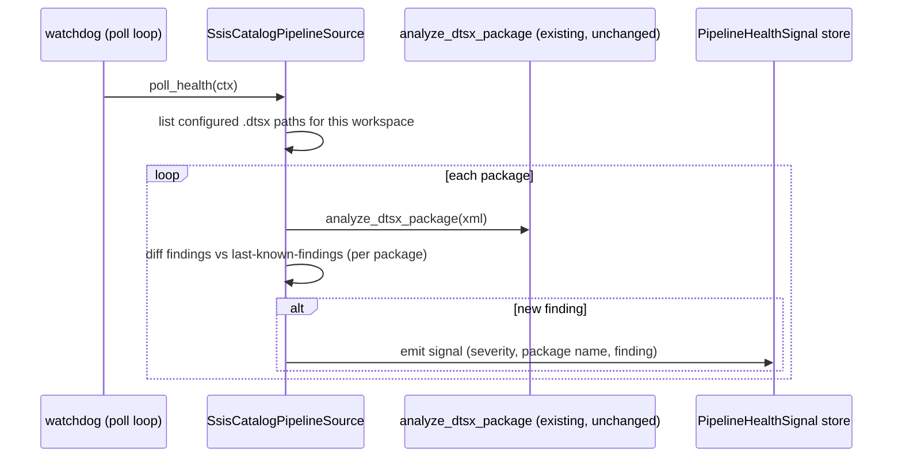

# SPEC: SSIS/SSRS as a Proactive PipelineSource

> Scope: SQL Server BYOW (BH-1075/BH-1107) and SSIS/SSRS diagnostics
> (`analyze_dtsx_package`/`analyze_rdl_report`, GC-15/GC-16) are both real and
> both shipped — verified merged and live on staging (Loop Capital's warehouse
> connects to `54.88.115.112`, `analyst_ask` diagnoses `Extract_Holdings_
> Nightly.dtsx` for real). What's missing: SSIS/SSRS diagnosis is
> **reactive-only** (a user uploads/pastes a `.dtsx`/`.rdl` and asks). There is
> no `PipelineSource` for SSIS/SSRS the way `SqlServerPipelineSource`
> (BH-1045) exists for disk/job-status — so a legacy SSIS catalog can never be
> *proactively* watched the way a SQL Server warehouse can.

**Terms.** `PipelineSource` is the `Protocol` in
`brightbot/agents/governance_agent/tools/pipeline_health.py` — one method,
`async def poll_health(*, ctx: RequestContext) -> list[PipelineHealthSignal]`.
`SqlServerPipelineSource` (BH-1045) is the only real implementation today.
`analyze_dtsx_package`/`analyze_rdl_report`
(`brightbot/agents/analyst_agent/tools/pipeline_diagnostics_tools.py`) are
deterministic XML parsers — general-purpose, not Loop-Capital-specific code —
invoked today only via chat (`ssis-diagnostics`/`ssrs-diagnostics` skills) or
`ssis_remediation_agent.py`'s surgical-PR loop, never on a schedule.

## 1. Context

Frank's stated skepticism (2026-07-09, "this is not live") was answered for
disk-space monitoring via GC-15's `SqlServerPipelineSource` — a real,
polled signal. The same proactive story doesn't exist for SSIS package
health: today, BrightAgent only diagnoses a `.dtsx`/`.rdl` when a human hands
it one in chat. There's no watchdog that says "your nightly SSIS job's
package just got worse (new anti-pattern introduced)" the way GC-15 says
"your disk just hit 18% free."

This spec adds an `SsisCatalogPipelineSource` that polls a **known set of
SSIS package paths** (configured per workspace, mirroring how
`SqlServerPipelineSource` takes a connection key) and re-runs
`analyze_dtsx_package` against each on a schedule, emitting a
`PipelineHealthSignal` when a *new* anti-pattern appears that wasn't present
on the last poll (not on every poll — that would spam identical findings).



## 2. Interface Contract (MDE)

### 2.1 `SsisCatalogPipelineSource` (`brightbot/agents/governance_agent/tools/ssis_pipeline_source.py`, new file)

```python
class SsisCatalogPipelineSource:
    """PipelineSource over a configured set of SSIS package paths.
    Mirrors SqlServerPipelineSource's shape: config-in, poll_health-out."""

    def __init__(self, *, config: dict[str, Any]) -> None: ...

    async def poll_health(self, *, ctx: RequestContext) -> list[PipelineHealthSignal]:
        """Re-parse each configured package; diff findings vs last poll;
        emit one signal per NEW finding (not every poll)."""
```

### 2.2 Config shape (workspace-scoped, mirrors `sql_server_pipeline_source.py`'s `_get_warehouse_connection_key`)

```python
# What SsisCatalogPipelineSource needs per workspace — a list of readable
# package sources. "Readable" is doing real work here: SSIS boxes have no
# MCP (GC-15's whole premise) — so paths must resolve via an existing
# readable channel (S3 mirror, git-tracked fixture, or a file share the
# workspace's warehouse credential can reach), never a raw filesystem path
# assumed reachable from brightbot's runtime.
{
    "packages": [
        {"name": "Extract_Holdings_Nightly", "source_uri": "s3://.../Extract_Holdings_Nightly.dtsx"},
        ...
    ]
}
```

### 2.3 Last-known-findings storage

```
# keyed by (workspace_id, package_name) -> last finding-set fingerprint
# reuses the same DynamoDB table BH-1045 already writes pipeline health
# state to — no new storage system.
```

## 3. Invariants (DbC)

- INV-1 `poll_health` never emits a signal for a finding identical to the last poll's result for that package — no duplicate-alert spam.
- INV-2 a package that fails to fetch/parse emits a `source_unreachable` signal, never a silent skip (mirrors GC-15's Invariant on `SqlServerPipelineSource` — detection without a renderer is a documented failure mode this spec must not repeat).
- INV-3 `analyze_dtsx_package`/`analyze_rdl_report` themselves are UNCHANGED — this spec is a new caller (a scheduler), not a rewrite of the parser.
- INV-4 no auto-remediation from this loop — a new finding surfaces a signal; opening a surgical PR remains `ssis_remediation_agent.py`'s job, invoked explicitly (GC-17's auto-merge exclusion holds unconditionally either way).

Budget: 4 invariants.

## 4. Acceptance Criteria (BDD)

```gherkin
Feature: Proactive SSIS package health

  Scenario: A new anti-pattern in a polled package emits a signal
    Given a configured package with a known-clean poll history
    And the package now has a missing error-row redirect (a NEW finding)
    When poll_health runs
    Then exactly one PipelineHealthSignal is emitted for that package
    And it names the specific finding (has_error_redirect: false)

  Scenario: An unchanged finding does not re-alert
    Given a package whose last poll already surfaced "no staging step"
    When poll_health runs again with the same package content
    Then no signal is emitted for that already-known finding

  Scenario: An unreachable package source fails loudly
    Given a configured package whose source_uri 404s
    When poll_health runs
    Then a source_unreachable signal is emitted, not a silent skip
```

Budget: 3 scenarios (small, additive spec).

## 5. Out of Scope

- SSRS proactive polling — this spec covers SSIS packages only; SSRS
  (`analyze_rdl_report`) proactive polling is the same shape and should be a
  follow-up ticket once this pattern is proven, not built blind alongside it.
- Auto-remediation / auto-PR from a new signal — stays a human-invoked step
  via the existing `ssis_remediation_agent.py`.
- Any change to `analyze_dtsx_package`'s parsing logic — untouched, per INV-3.
- Generalizing beyond Loop Capital's package set for THIS ticket — the
  config shape (§2.2) is workspace-scoped and BYOW-agnostic by construction,
  but onboarding a second customer's SSIS catalog is a rollout task, not
  additional code, once this ships.

## 6. Dependencies

- `PipelineSource` protocol + the existing watchdog poll loop (BH-1045's
  scheduling infra) — reused, not rebuilt.
- `analyze_dtsx_package` (existing, unchanged).
- A readable channel for `.dtsx` files at poll time (S3 mirror is the
  default assumption in §2.2 — confirm against how Loop Capital's package
  actually gets updated in production, not just the demo sandbox's local
  file, before implementation starts).
- Last-known-findings storage: confirm BH-1045's DynamoDB table has room for
  a per-package fingerprint key without a schema migration.

## 7. Correctness Properties

### Property 1: No duplicate alerts
*For any* two consecutive polls with identical parsed findings for a package, at most the first emits a signal.
**Validates: §3 INV-1, §4 "An unchanged finding does not re-alert"**

### Property 2: Unreachable is loud, not silent
*For any* package source that fails to fetch, `poll_health` emits `source_unreachable`, never an empty/omitted result for that package.
**Validates: §3 INV-2, §4 "An unreachable package source fails loudly"**

Budget: 2 properties.

## 8. Eval Criteria

Not applicable — `analyze_dtsx_package` is a deterministic parser (already
evaluated under GC-16); this spec adds scheduling + diffing around it, no new
LLM behavior.

## 9. Observability Contract

- **Log events**: `ssis_pipeline_source.poll_started`, `.new_finding_signal`,
  `.source_unreachable`, `.no_change` (per package, at debug level).
- **Attributes**: `workspace_id`, `package_name`, `finding_kind` — never the
  full XML content in logs.
- **Metrics**: `ssis_new_findings_total`, `ssis_source_unreachable_total`,
  tagged `workspace_id`.

## 10. Test Coverage Update

### a. In-repo layered tests (brightbot)
- **L0** — `SsisCatalogPipelineSource.poll_health` contract: signal shape, `source_unreachable` shape.
- **L1** — the diff logic: same findings twice → 0 signals; new finding → 1 signal (one case per §4 scenario).
- **L2** — real-behavior: run against Loop Capital's actual sandbox `Extract_Holdings_Nightly.dtsx` fixture (already in `clients/trials/loopcapital/sandbox/ssis/`), assert a real finding surfaces on first poll and does not repeat on second poll with unchanged content. Mirrors `test_warehouse_scan_real_sandbox.py`'s RUN_LIVE-gated pattern — no new fixture invented.

### b. Cross-repo e2e (`brighthive-e2e`)
- One feature test: seed a "worsened" package fixture, run the watchdog cycle, assert a signal reaches the notification/webapp surface (reuses GC-14's existing watchdog-to-webapp path, new only in the SSIS trigger).

### Self-verification
Run brightbot's layered suite + the e2e; confirm §2/§3/§4 each have a case; confirm the real-sandbox L2 case actually parses the real `.dtsx` fixture, not an invented shape.

## 11. PR Split

1. **brightbot** — `SsisCatalogPipelineSource` + diff/fingerprint logic + wiring into the existing watchdog poll loop. (M)
2. **brightbot** — real-behavior test against the LC sandbox fixture (L2, RUN_LIVE-gated). (S)
3. **brighthive-e2e** — one feature test proving a new SSIS finding reaches the notification surface. (S)

Ordered 1 → 2 → 3. No platform-core or webapp changes required — this reuses
BH-1045's existing signal→notification pipeline end to end.
