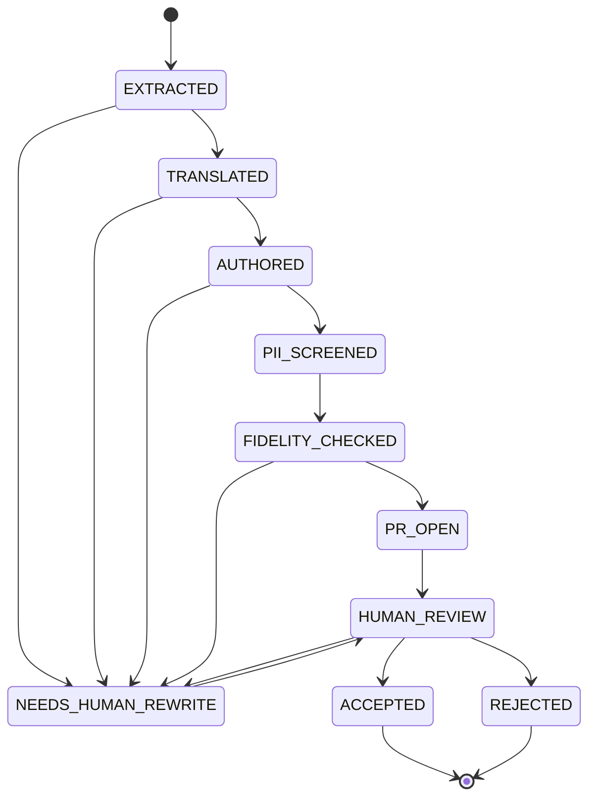

# SPEC: Legacy Pipeline Regenerator — SSIS/SSRS → dbt

> ⚠️ **OUT OF TRIAL SCOPE — MODERNIZE / POC play.** The signed Loop Capital trial is *diagnose & operate, don't author*: in-trial SSIS/SSRS work is diagnostics (read + flag), never regeneration. This spec captures the regenerate-to-dbt capability as a **post-trial modernization POC**, not a trial deliverable. It maps to none of the 9 trial success criteria. Kept in the family so the seam (`SourceArtifactReader` port) is designed once, not retrofitted.

**Ticket:** BH-1255 (epic) · **Status:** Draft · **Last-Reviewed:** 2026-07-29 · **Author:** drchinca

## 1. Context

Loop Capital (SQL Server 2019 + SSIS/SSRS on an Azure VM) needs its legacy `.dtsx` (SSIS) and
`.rdl` (SSRS) pipelines reborn as dbt models on the workspace warehouse. This is **Act 1 —
REGENERATE** of the three-act arc: *Act 1 REGENERATE* (this spec) → *Act 2 MODERNIZE* (dbt is the
destination form) → *Act 3 SELF-HEAL* (the watchdog spec that monitors the reborn pipelines).

Today the code cannot regenerate anything. `analyze_dtsx_package`
(`brightbot/agents/analyst_agent/tools/pipeline_diagnostics_tools.py:161`) is diagnostic-only:
component booleans, no SQL, no table names, no column maps; `parse_dtsx:130` iterates only data-flow
`<component>` elements (`_iter_local(root,"component"):138`), so a control-flow-only package returns
`{"components":[], "has_staging_step": false}` — the T-SQL is invisible. `parse_rdl:52` is the only
place raw SQL is pulled from XML (`CommandText:67,:84`). The orphaned `ssis_remediation_agent.py`
drafts a PR from a one-sentence anti-pattern and never sees real SQL — a decoy; we do not build on it.

Readers are **pluggable by artifact kind, not hardwired to SSIS/SSRS.** Two artifact classes flow
through one reader Protocol: **logic artifacts** (`.dtsx`, `.rdl`) yield transform steps, SQL, and
lineage; **contract artifacts** (`.xsd`, and future DDL / JSON-Schema / Avro / dbt `schema.yml` /
`information_schema` dumps) yield table + column shape (type, width, precision/scale, PK, nullability).
A new format is a new reader + registry entry — never a call-site change (PS-1). Contract artifacts
become dbt `source()` definitions + `schema.yml`, the `schema_match` parity target, and the
PII-classification candidate list.

The Regenerator recovers legacy meaning into a vendor-free `RegeneratedSource`, translates source
T-SQL to the target dialect, maps it to a dbt model DAG, screens PII on **column classification**
*before* any customer row is read, measures parity on **masked** sampled rows only, then feeds the
mature, unchanged conversion + write path: `convert_sql_to_dbt_data`
(`.../dbt_agent/tools/dbt_tools.py:333`) → `DBTArtifact` (`dbt_artifact.py:438`) →
`_artifact_to_files:291` → the GitHub write **functions** (`github_tools.py`
`github_commit_multiple_files:376`, `create_branch`, `create_pull_request`). Every unit walks **one**
lifecycle and rides the human-review PR gate — GC-17: no self-merge. A single danger threshold halts
a runaway run. Criterion 8 (governed & auditable) is a pass/fail bar.



## 2. Interface Contract (MDE)

All ports speak **domain types**; no `xml.etree.ElementTree`, `pymssql`, `sqlglot`, GitHub SDK, or
DynamoDB/Neo4j type crosses any boundary (PS-4). `RequestContext` (`pipeline_health.py:39`) carries
`workspace_id` + `token` — mandatory wherever real rows or PII classification are touched.

```python
# --- Lifecycle: the ONE canonical state set (identical to §1 mermaid + §3 INV-1) ---
RegenerationState = Literal[
    "extracted", "translated", "authored", "pii_screened", "fidelity_checked",
    "pr_open", "human_review", "accepted", "rejected", "needs_human_rewrite",
]

# --- Circuit breaker (one danger threshold; halts the run — mirrors cemaf HaltSignal in spirit only) ---
class DangerHalt(RuntimeError):                      # surfaced, never silent; no cemaf import
    reason: Literal["max_agent_steps", "max_wall_clock_s", "runaway_loop"]

# --- Recovered source meaning (vendor-free) ---
# Artifact kinds are pluggable. "logic" kinds carry transform SQL/lineage; "contract" kinds carry
# table+column shape only. Adding a format (ddl, json_schema, avro, dbt_schema_yml, information_schema)
# is a new reader + registry entry, never a call-site change (PS-1). Open set, not a closed Literal.
SourceArtifactKind = str            # e.g. "dtsx", "rdl", "xsd", "ddl", "json_schema", "avro"
ArtifactClass = Literal["logic", "contract"]
ExtractionFidelity = Literal["faithful", "partial", "lossy", "unrecoverable"]

@dataclass(frozen=True)
class SourceArtifact:               # bytes + identity, already fetched — NOT ElementTree/parsed
    name: str; kind: SourceArtifactKind; content: str

@dataclass(frozen=True)
class SqlUnit:
    origin: str                     # component/task refId
    sql: str                        # verbatim SqlCommand / SqlStatementSource / CommandText
    role: Literal["source_query", "row_command", "execute_sql_task", "report_dataset"]
    connection_ref: str | None      # connectionManagerID GUID resolved in-package (no network)

@dataclass(frozen=True)
class ColumnFlow:
    output_column: str; input_columns: tuple[str, ...]; source_column: str | None; resolved: bool

@dataclass(frozen=True)
class TransformStep:
    ref_id: str
    kind: Literal["ole_db_source","ole_db_command","sort","lookup","merge_join",
                  "derived_column","aggregate","execute_sql_task","report_dataset","script","unknown"]
    fidelity: ExtractionFidelity
    needs_human_review: bool
    raw_expression: str | None      # SSIS-dialect expression captured verbatim

# --- Table + column shape from a CONTRACT artifact (.xsd today; ddl/json_schema/avro/etc. next) ---
@dataclass(frozen=True)
class ColumnContract:
    name: str
    sql_type: str                   # verbatim, e.g. "char(3)", "decimal(18,6)", "nvarchar(16)"
    max_length: int | None          # width facet where present
    precision: int | None; scale: int | None
    nullable: bool
    is_primary_key: bool

@dataclass(frozen=True)
class TableContract:                 # one per contract artifact; feeds sources.yml + schema_match target
    database: str; schema: str; table: str
    columns: tuple[ColumnContract, ...]
    primary_key: tuple[str, ...]

@dataclass(frozen=True)
class RegeneratedSource:
    package_name: str
    artifact_class: ArtifactClass             # "logic" (dtsx/rdl) or "contract" (xsd/ddl/...)
    source_sql: list[SqlUnit]                 # empty for contract artifacts
    source_tables: frozenset[str]
    column_lineage: list[ColumnFlow]          # empty for contract artifacts
    transform_steps: list[TransformStep]      # topologically ordered, NOT document order; empty for contract
    table_contracts: tuple[TableContract, ...]  # populated for contract artifacts; the schema_match target
    extraction_fidelity: ExtractionFidelity   # roll-up = min() over per-step fidelity

class ArtifactUnreadable(Exception): ...       # malformed artifact — never a partial RegeneratedSource

class SourceArtifactReader(Protocol):          # dtsx/rdl/xsd/ddl/... adapters. Read-only, pure, no network.
    def kinds(self) -> frozenset[SourceArtifactKind]: ...
    def artifact_class(self) -> ArtifactClass: ...
    def read_source(self, *, artifact: SourceArtifact, ctx: RequestContext) -> RegeneratedSource: ...

SOURCE_ARTIFACT_READERS: dict[SourceArtifactKind, type[SourceArtifactReader]] = {}   # mirrors PIPELINE_SOURCE_ADAPTERS:106
def build_artifact_reader(*, kind: SourceArtifactKind) -> SourceArtifactReader: ...   # raises ValueError on unknown kind

# --- Source-dialect translation (the missing SOURCE seam; today prompts are TARGET-only) ---
SourceDialectId = Literal["sql_server_2019"]
RewriteMethod = Literal["deterministic", "llm"]
DbtShapeHint = Literal["view", "table", "incremental", "snapshot"]

@dataclass(frozen=True)
class SourceDialect:
    name: SourceDialectId
    quote_open: str; quote_close: str          # "[" / "]"
    row_limit_keyword: str                      # "TOP"
    proprietary_functions: frozenset[str]       # ISNULL, GETDATE, DATEADD, IIF, CHARINDEX, ...
    write_verbs: frozenset[str]                 # MERGE, INSERT, UPDATE, DELETE, DROP, TRUNCATE

@dataclass(frozen=True)
class ConstructRewrite:
    source_construct: str; target_construct: str; method: RewriteMethod; confidence: float

@dataclass(frozen=True)
class TranslatedSql:
    sql: str                                    # target dialect, SELECT/CTE ONLY
    target: str                                 # WarehouseType (utils/warehouse_types.py)
    rewrites: tuple[ConstructRewrite, ...]
    unresolved_constructs: tuple[str, ...]      # surfaced, never dropped
    dbt_shape_hint: DbtShapeHint
    provenance: str                             # source refId / dataset name

class SqlTranslationPort(Protocol):
    def describe_source(self) -> SourceDialect: ...
    def capabilities(self) -> frozenset[str]: ...
    def translate(self, *, source_sql: SqlUnit, target: str, ctx: RequestContext) -> TranslatedSql: ...

SQL_TRANSLATORS: dict[SourceDialectId, type[SqlTranslationPort]] = {}

# --- DAG mapping: RegeneratedSource -> dbt model plan (pure domain service, no port) ---
@dataclass(frozen=True)
class ModelTask:
    model_name: str                             # provenance-derived, stable across re-runs
    transform_sql: str                          # feeds convert_sql_to_dbt_data(sql_code=...)
    layer: Literal["staging", "intermediate", "marts"]   # by graph POSITION, never name substring
    source_dialect: SourceDialectId
    ref_edges: tuple[str, ...]                  # ref() to models produced in-plan
    source_edges: tuple[str, ...]               # source() to external/registered tables
    column_map: tuple[ColumnFlow, ...]          # preserved for schema_yml + PII classification
    lineage_fidelity: ExtractionFidelity        # min() over the model's TRANSITIVE build lineage
    provenance_key: tuple[str, str, str]        # (task_ref_id, destination_table, content_fingerprint)
    resolved: bool                              # False → blocks PR, never a guessed SELECT

@dataclass(frozen=True)
class RegenerationPlan:
    package_name: str; tasks: tuple[ModelTask, ...]; lineage_conflicts: tuple[str, ...]

class LineageCycleError(Exception): ...

def build_regeneration_plan(*, source: RegeneratedSource, library: "DbtProjectLibrary",
                            ctx: RequestContext) -> RegenerationPlan: ...   # raises LineageCycleError

class DbtProjectLibrary(Protocol):              # reuses fetch_dbt_sources seam
    def capabilities(self) -> frozenset[str]: ...
    async def registered_sources(self, *, ctx: RequestContext) -> tuple[tuple[str, str], ...]: ...
    async def existing_models(self, *, ctx: RequestContext) -> tuple[str, ...]: ...

# --- Data-parity fidelity on MASKED rows only ---
FidelityCheck = Literal["row_count_parity", "sample_checksum", "schema_match"]
ParityStatus = Literal["parity", "drift", "not_measured"]

@dataclass(frozen=True)
class FidelityReport:
    overall_status: ParityStatus
    row_count_delta: int
    checksum_match: bool
    schema_match: bool
    sandbox_reached: bool

class FidelityProbe(Protocol):
    def capabilities(self) -> frozenset[FidelityCheck]: ...
    # reads real rows into the process ONLY after applying enforce_pii_masking(workspace_id, token, rows)
    # to any sampled rows (pii_masking.py:290); no raw sample value is emitted to spans/logs/ledger.
    async def measure(self, *, legacy_target: str, regenerated_model: str,
                      column_map: tuple[ColumnFlow, ...], ctx: RequestContext) -> FidelityReport: ...

# --- Governance gate (single injected domain service, NOT a port — rule-of-two) ---
PiiClassification = Literal["NONE", "NON_SENSITIVE", "SENSITIVE"]   # get_workspace_pii_field_map values
GateDecision = Literal["propose", "block"]

@dataclass(frozen=True)
class GateVerdict:
    decision: GateDecision; blocking_reasons: tuple[str, ...]

class RegenerationGate:
    # screen_pii runs at authored→pii_screened, BEFORE any real row is read (INV-6).
    # backed by get_workspace_pii_field_map(workspace_id, token) -> dict[str, PiiClassification] | None.
    # None (fetch failure) OR any exposed SENSITIVE-classified source column lacking a masking directive
    # in column_map/schema_yml → block (fail-closed).
    async def screen_pii(self, *, task: ModelTask, ctx: RequestContext) -> GateVerdict: ...
    # evaluate runs at fidelity_checked→pr_open: fidelity floor (INV-4) only; PII already cleared.
    async def evaluate(self, *, task: ModelTask, artifact: "DBTArtifact",
                       fidelity: FidelityReport, ctx: RequestContext) -> GateVerdict: ...

# --- Never-auto-merge tool set (GC-17 structural) ---
# Built by DIRECT IMPORT of the regeneration tools, OMITTING github_merge_pull_request BY NAME
# (mirror REMEDIATION_TOOLS at dbt_agent_react.py:239 — NOT a runtime filter, which can silently regress).
REGENERATION_TOOLS: list = []
def assert_no_merge_tool(*, tools: list) -> None: ...   # runtime GC-17 re-check; raises loud if a merge
                                                        # tool ever appears (mirror pipeline_watchdog_task.py:506)

# --- Provenance ledger (Criterion 8 audit trail) ---
RegenerationId = str

@dataclass(frozen=True)
class RegenerationRecord:
    record_id: RegenerationId
    source_path: str
    state: RegenerationState
    extraction_fidelity: ExtractionFidelity
    fidelity: FidelityReport | None
    pr_url: str | None
    principal: str

class RegenerationLedger(Protocol):
    async def open(self, *, source_path: str, source: RegeneratedSource, ctx: RequestContext) -> RegenerationRecord: ...
    async def advance(self, *, record_id: RegenerationId, to_state: RegenerationState,
                      evidence: str, ctx: RequestContext) -> RegenerationRecord: ...
    async def attach_fidelity(self, *, record_id: RegenerationId, report: FidelityReport, ctx: RequestContext) -> RegenerationRecord: ...
    async def find_by_source(self, *, source_path: str, ctx: RequestContext) -> list[RegenerationRecord]: ...
```

**Reused byte-for-byte (referenced, never redesigned):** `convert_sql_to_dbt_data:333`,
`DBTArtifact:438` (`model_name:458`, `schema_yml:502`, `sources_yml_additions:512`,
`references_used:546`), `_artifact_to_files:291`, and the GitHub write **functions**
(`github_commit_multiple_files:376`, `create_branch`, `create_pull_request`) — reused as functions,
never via the dbt agent's tool list (INV-2/INV-15). Row masking: `enforce_pii_masking`
(`pii_masking.py:290`). Column classification: `get_workspace_pii_field_map` (`pii_masking.py`).

## 3. Invariants (DbC)

- **INV-1 (state machine + terminality, defined once).** `RegenerationState` is exactly
  `{extracted, translated, authored, pii_screened, fidelity_checked, pr_open, human_review, accepted,
  rejected, needs_human_rewrite}`. Legal edges are exactly: `extracted→translated`,
  `extracted→needs_human_rewrite`, `translated→authored`, `translated→needs_human_rewrite`,
  `authored→pii_screened`, `authored→needs_human_rewrite`, `pii_screened→fidelity_checked`,
  `fidelity_checked→pr_open`, `fidelity_checked→needs_human_rewrite`, `pr_open→human_review`,
  `needs_human_rewrite→human_review`, `human_review→accepted`, `human_review→rejected`,
  `human_review→needs_human_rewrite`. `accepted` and `rejected` are the only terminal states. This set
  is IDENTICAL to the §1 mermaid and §2 enum.
- **INV-2 (never auto-merged — GC-17 structural).** The run binds `REGENERATION_TOOLS`, built by direct
  import with `github_merge_pull_request` omitted by name (mirror `REMEDIATION_TOOLS`
  `dbt_agent_react.py:239`), NEVER `DBT_REACT_TOOLS` (which binds the merge tool at `:140`).
  `assert_no_merge_tool` runs at boot and re-checks at dispatch, raising loud if any merge tool appears
  (mirror `pipeline_watchdog_task.py:506`). The only exit from `human_review` is a human action.
- **INV-3 (fidelity floor — per-step AND transitive lineage).** IF any `TransformStep` required to
  build a model has `fidelity < faithful`, OR ANY step anywhere in the model's **transitive build
  lineage** is `lossy`/`unrecoverable`, THEN `ModelTask.resolved == False` and the unit SHALL route to
  `needs_human_rewrite` — it SHALL NOT reach `authored` automatically nor emit a PR. A step is never
  silently omitted. (Covers a plausible SELECT authored around a dropped Script Component.)
- **INV-4 (parity is unspoofable and blocks drift).** `FidelityReport.overall_status == "parity"`
  REQUIRES `sandbox_reached == True` AND `checksum_match == True` AND `schema_match == True`. IF
  `overall_status != "parity"`, THEN the record SHALL route to `needs_human_rewrite` and SHALL NOT
  transition `fidelity_checked→pr_open`.
- **INV-5 (PII fail-closed on column classification, BH-1060).** `screen_pii` reads
  `get_workspace_pii_field_map(workspace_id, token)`. IF the map is `None` (fetch failure) OR any
  source column classified `SENSITIVE` is exposed by the model without a masking directive in
  `column_map`/`schema_yml`, THEN `screen_pii` returns `block` and the record routes to
  `needs_human_rewrite` — no branch, commit, or PR. This gate operates on SQL/column text, never rows.
- **INV-6 (PII precedes rows; no raw sample leaks — including streamed surfaces).** `screen_pii`
  (`authored→pii_screened`) SHALL complete before any real customer row is read. `FidelityProbe.measure`
  SHALL read rows only with `workspace_id`+`token` present and SHALL apply `enforce_pii_masking` to every
  sampled row before it enters the process; NO raw sample value SHALL be emitted to any span, log,
  `RegenerationLedger` entry, **or streamed progress event** (§9 Slack/Webapp/OTel surfaces). Every
  streamed chunk SHALL pass the same masking choke point before emission — a tool-detail stream cannot
  leak a value a span may not carry.
- **INV-7 (domain types only).** No ElementTree / pymssql / sqlglot / GitHub SDK / DynamoDB / Neo4j
  type crosses `SourceArtifactReader`, `SqlTranslationPort`, `FidelityProbe`, `DbtProjectLibrary`, or
  `RegenerationLedger` (PS-4).
- **INV-8 (read-only, no-network, typed extraction — every artifact kind).** `read_source` performs no
  network, warehouse, or write call; `connection_ref` is resolved by in-artifact GUID→name lookup only.
  A malformed artifact (any kind) raises `ArtifactUnreadable`; never a partial `RegeneratedSource`
  (contrast `parse_dtsx:135`). A contract-artifact reader (e.g. `.xsd`) yields `table_contracts` with
  empty `source_sql`/`transform_steps`; a logic-artifact reader yields the inverse.
- **INV-9 (SELECT-only translation).** `TranslatedSql.sql` contains no `INSERT/UPDATE/DELETE/DROP/
  TRUNCATE/MERGE`; a source `MERGE` sets `dbt_shape_hint` to `snapshot`/`incremental`, never `view`.
- **INV-10 (constructs partitioned, never dropped).** Every source proprietary construct appears in
  `rewrites` (resolved) XOR `unresolved_constructs` (surfaced). The sets are disjoint and exhaustive.
- **INV-11 (structural layering).** `ModelTask.layer` is assigned by DAG position (reads only
  `source()` → staging; referenced & reads ≥1 `ref()` → intermediate; referenced by none → marts),
  never by table-name substring. Supersedes `has_staging_step` (`pipeline_diagnostics_tools.py:153`).
- **INV-12 (no silent transition).** Every `advance` writes to `RegenerationLedger` with source path,
  state, `correlation_id`, and principal (Criterion 8 provenance).
- **INV-13 (traceable & content-keyed idempotence).** Every committed model traces to one source
  artifact via `provenance_key = (task_ref_id, destination_table, content_fingerprint)`; `model_name`
  stability is keyed on **content/refId**, never `source_path`. A rename/move with byte-identical
  content yields the SAME `model_name` (a re-run is a PR diff, not duplicate models; BH-1255).
- **INV-14 (write path reused).** Branch/commit/PR reuses the `github_tools.py` **functions**
  byte-for-byte; this spec adds no new commit/PR tool and reuses no agent tool list.
- **INV-15 (danger halt).** WHEN a run crosses its danger threshold, THE System SHALL halt and emit
  `DangerHalt` — no further LLM calls, no further dispatch. The halt is surfaced (span + metric),
  never silent. One threshold; no per-workspace accounting, no quota, no cost math.

## 4. Acceptance Criteria (BDD)

```gherkin
Feature: SSIS/SSRS regeneration into dbt

  Scenario: Data-flow package recovers verbatim SQL and topological order
    Given a .dtsx with OLE DB Source "SELECT * FROM dbo.assets", a Sort, and an OLE DB Command
          "UPDATE dbo.dim_asset SET x = ? WHERE asset_tag = ?"
    When read_source runs
    Then source_tables == {"dbo.assets","dbo.dim_asset"}
    And transform_steps are ordered source→sort→ole_db_command
    And extraction_fidelity == "faithful" and both statements are byte-identical to the XML
    And for a control-flow-only variant (two Execute SQL Tasks, CREATE TABLE then INSERT, create→seed edge)
        both SqlStatementSource bodies are recovered as SqlUnits in create→seed order,
        NOT the empty {"components": []} the current parse_dtsx returns

  Scenario: Script Component is flagged lossy, never dropped
    Given a .dtsx containing a Script Component with .NET buffer code
    When read_source runs
    Then that TransformStep.fidelity is in {"lossy","unrecoverable"} with needs_human_review == True
    And extraction_fidelity is at most "lossy" and every non-script step is still extracted

  Scenario: Malformed package is typed, not partial
    Given a .dtsx whose XML is malformed
    When read_source runs
    Then ArtifactUnreadable is raised and no RegeneratedSource is returned

  Scenario: SSRS report dataset SQL is recovered
    Given a .rdl with a dataset CommandText SELECT
    When the .rdl reader runs
    Then source_sql carries the dataset SQL with role "report_dataset"

  Scenario: Contract artifact (.xsd) yields a table contract and its facets become the parity target
    Given an .xsd for MarketData.dbo.PriceStaging with Currency char(3) NOT NULL and a Ticker+PriceDate PK
    When the xsd reader runs
    Then artifact_class == "contract" and table_contracts carries PriceStaging with those columns
    And Currency.max_length == 3 and primary_key == ("Ticker","PriceDate")
    And source_sql and transform_steps are empty
    And the fidelity gate's schema_match target requires Currency width 3, so a widened regenerated column fails schema_match

  Scenario: MERGE never survives translation
    Given a source containing MERGE INTO dim_customer
    When translate runs
    Then sql contains no MERGE keyword and dbt_shape_hint is "snapshot" or "incremental"

  Scenario: Unknown proprietary function is surfaced, not dropped
    Given a source calling dbo.fn_LoopCapitalRate(x)
    When translate runs
    Then "dbo.fn_LoopCapitalRate" appears in unresolved_constructs

  Scenario: Layer is assigned by graph position, not name
    Given a terminal table "stg_leftover" that no model reads and a source-only model "final_dump"
    When build_regeneration_plan runs
    Then "stg_leftover" is layer "marts" and "final_dump" is layer "staging"

  Scenario: In-package lineage becomes ref(), external becomes source()
    Given model B reads a table written by model A within the package
    When build_regeneration_plan runs
    Then B lists ref("<A>") and A lists source() for its raw inputs

  Scenario: Cyclic lineage is rejected
    Given two package tables that each read the other
    When build_regeneration_plan runs
    Then LineageCycleError is raised and no plan is emitted

  Scenario: Lossy step anywhere in build lineage blocks the model
    Given model C is fed by recoverable SQL on both sides of an unrecoverable Script Component in its lineage
    When build_regeneration_plan runs
    Then C.resolved == False and PR emission for C is blocked

  Scenario: Sensitive column exposed without masking routes to human
    Given get_workspace_pii_field_map classifies source column "email" as SENSITIVE
    And a ModelTask whose column_map exposes "email" with no masking directive
    When screen_pii evaluates
    Then decision == "block" and the record routes to needs_human_rewrite before any row is read

  Scenario: PII field-map fetch failure fails closed
    Given get_workspace_pii_field_map returns None for the workspace
    When screen_pii evaluates
    Then decision == "block" and the record routes to needs_human_rewrite

  Scenario: Fidelity probe reads only masked rows and leaks no raw values
    Given a passed PII screen and a probe measuring sample_checksum against real client rows
    When measure runs
    Then enforce_pii_masking is applied to every sampled row and workspace_id+token are present
    And no raw sample value appears in any span, log, or ledger entry

  Scenario: Parity cannot be claimed without a real sandbox
    Given a FidelityProbe returning overall_status "parity" with sandbox_reached == False
    When the record is evaluated
    Then the verdict is treated as non-parity and fidelity_checked→pr_open does not occur

  Scenario: Full-parity report opens a draft PR with provenance
    Given an authored DBTArtifact that passed screen_pii
    And a FidelityReport with delta 0, checksum match, schema match, sandbox_reached True
    When the gate evaluates
    Then the record walks extracted→…→pii_screened→fidelity_checked→pr_open→human_review
    And a draft PR is opened via the reused write functions with provenance + fidelity block in its body

  Scenario: Data drift blocks auto-proposal
    Given a FidelityReport with row_count_delta != 0
    When the gate evaluates
    Then fidelity_checked→pr_open does not occur and the record routes to needs_human_rewrite

  Scenario: No self-merge
    Given a record in human_review with an open PR
    When REGENERATION_TOOLS is inspected and assert_no_merge_tool runs
    Then no merge tool is bound, assert_no_merge_tool does not raise, and the only exit is a human accept/reject

  Scenario: Re-run is idempotent on content, not path
    Given a prior RegenerationRecord for a package later renamed but byte-identical
    When regeneration re-runs
    Then model_names are identical and the ledger returns the prior record

  Scenario: Runaway run halts on the danger threshold
    Given a regeneration run that crosses its danger threshold (repeated identical dispatch)
    When the step loop advances
    Then DangerHalt(reason="runaway_loop") is raised, no further LLM call or dispatch occurs, and the halt is on a span
```

## 5. Out of Scope

- **Script Components / Script Tasks / .NET buffer transforms** — logic in compiled code, LOSSY by
  definition → `needs_human_rewrite`, never auto-regenerated.
- **SSRS presentation logic** — layout, tablix, charts, report-side formatting; only dataset SQL is recovered.
- **Custom/third-party SSIS components** and **encrypted packages** (`EncryptSensitiveWith*`) — fidelity
  downgrade, human path; the reader must not crash.
- **Multi-statement procedural T-SQL batches** with cross-statement side effects — flagged, not collapsed.
- **Merging PRs** (GC-17), **auto-approving**, **direct-DDL execution**, and any per-workspace budget /
  quota / cost metering (the danger threshold is the only spend control here).
- **The Act-3 watchdog / run-health monitoring** and **live SSISDB run-status polling** — separate spec.

## 6. Dependencies

- **Act-2 dbt path (reuse, do not modify):** `convert_sql_to_dbt_data:333`, `DBTArtifact:438`,
  `_artifact_to_files:291`, GitHub write **functions** (`github_tools.py`), GC-17 no-merge pattern
  (`REMEDIATION_TOOLS` `dbt_agent_react.py:239`; recheck `pipeline_watchdog_task.py:506`).
- **BH-1060 PII fail-closed** (branch `drchinca/BH-1060/pii-masking-fail-closed`): `screen_pii` depends
  on `get_workspace_pii_field_map` (column classification, `None`=fail-closed); `FidelityProbe`
  depends on `enforce_pii_masking:290` (row masking). Sequence BH-1060 ahead of the gate.
- **Regeneration output target:** the dbt service resolved by `_find_connected_dbt_service`
  (`credentials_tools.py:158`, first-wins). For a multi-connection Loop Capital workspace, output is
  **pinned to the workspace's primary registered dbt connection**; any further connection ambiguity
  routes to `needs_human_rewrite` (never a guessed target).
- **Artifact byte-source:** `ssis_pipeline_source._fetch_package_xml:57` is s3-only. The byte fetch
  (S3, SSISDB catalog mirror, or any store per artifact kind) happens in a **separate byte-source layer
  before** `read_source`; `read_source` consumes `SourceArtifact.content` already in memory, so INV-8's
  no-network claim holds. Which byte-source Loop Capital uses is an ADR — it does not touch the reader's purity.
- **`RequestContext`** (`pipeline_health.py:39`), **`WarehouseType`** (`utils/warehouse_types.py`),
  **`fetch_dbt_sources`** (behind `DbtProjectLibrary`). No cemaf dependency (brightbot pins python <3.14).

## 7. Correctness Properties

- **P1 (lifecycle closure).** *For any* record, its state ∈ §2 enum and every transition ∈ INV-1's
  edge set; `accepted`/`rejected` are terminal. **Validates: INV-1; Scenario "Full-parity report opens a draft PR".**
- **P2 (no auto-merge).** *For any* run, `REGENERATION_TOOLS` binds no merge tool and
  `assert_no_merge_tool` holds. **Validates: INV-2; Scenario "No self-merge".**
- **P3 (fidelity floor incl. transitive lineage).** *For any* model with a `< faithful` step in its
  transitive lineage, `resolved == False` and `pr_open` is unreachable automatically.
  **Validates: INV-3; Scenarios "Script Component is flagged lossy", "Lossy step anywhere in build lineage".**
- **P4 (parity unspoofable + drift gate).** *For any* `FidelityReport`, `parity` implies
  `sandbox_reached ∧ checksum_match ∧ schema_match`; non-parity makes `pr_open` unreachable.
  **Validates: INV-4; Scenarios "Parity cannot be claimed without a real sandbox", "Data drift blocks auto-proposal".**
- **P5 (PII fail-closed on classification).** *For any* exposed `SENSITIVE` source column without a
  masking directive, or a `None` field-map, the write path is never entered.
  **Validates: INV-5; Scenarios "Sensitive column exposed without masking", "PII field-map fetch failure".**
- **P6 (PII precedes rows; no leak).** *For any* parity measurement, `screen_pii` completed first and
  every sampled row was masked; no raw value reached a span/log/ledger.
  **Validates: INV-6; Scenario "Fidelity probe reads only masked rows".**
- **P7 (no write verb escapes).** *For any* `TranslatedSql`, the SQL is SELECT/CTE-shaped only.
  **Validates: INV-9; Scenario "MERGE never survives translation".**
- **P8 (nothing dropped).** *For any* source, proprietary constructs partition into resolved+surfaced.
  **Validates: INV-10; Scenario "Unknown proprietary function is surfaced".**
- **P9 (structural layering).** *For any* plan, `layer` is a function of graph position only.
  **Validates: INV-11; Scenario "Layer is assigned by graph position, not name".**
- **P10 (content-keyed idempotence).** *For any* byte-identical re-run (even renamed), `model_name`s
  are stable and each traces to one source artifact. **Validates: INV-13; Scenario "Re-run is idempotent on content".**
- **P11 (typed, no-network extraction).** *For any* malformed artifact of any kind, `ArtifactUnreadable`
  is raised and no network call occurs. **Validates: INV-8; Scenario "Malformed package is typed, not partial".**
- **P12 (danger halt surfaced).** *For any* run crossing the danger threshold, `DangerHalt` is raised,
  dispatch stops, and the halt is observable. **Validates: INV-15; Scenario "Runaway run halts on the danger threshold".**

## 8. Eval Criteria

| Evaluator | Node | Mode | Threshold | Method |
|---|---|---|---|---|
| ExtractionFidelityEvaluator | read_source | GATE | faithful steps == deterministic (no LLM) | deterministic |
| TranslationConstructCoverage | translate | GATE | coverage == 1.0 OR residue in unresolved_constructs | deterministic |
| TranslationSemanticEquivalence | translate | GATE | score >= 0.85 (raised to 0.9 when no sandbox) | LLM judge |
| WriteVerbAbsence | translate | GATE | 0 write verbs in output | deterministic |
| StructuralLayerAssignment | build_regeneration_plan | GATE | 0 name-substring layer decisions | deterministic |
| LineageFidelityPropagation | build_regeneration_plan | GATE | 0 lossy-lineage models with resolved==True | deterministic |
| PiiColumnFailClosed | screen_pii | GATE | 0 SENSITIVE-exposed or None-map artifacts proposed | deterministic |
| RegenerationDataParity | fidelity_checked | GATE | row_count_delta==0 AND checksum_match AND schema_match AND sandbox_reached | hybrid |
| RegenerationSummaryQuality | pr_open | OBSERVE | score >= 0.8 | LLM judge |

`sample_checksum` is mandatory for a `parity` verdict — row-count-only parity is forbidden
(false-confidence risk). `screen_pii` runs on masked/classification data only; the parity evaluator
never sees a raw sample value.

## 9. Observability Contract

- **Span** `gen_ai.tool.execute` `gen_ai.tool.name=source_artifact.read_source` — attrs: `workspace.id`,
  `regeneration.artifact_kind`, `regeneration.artifact_class`, `regeneration.artifact_name`,
  `regeneration.extraction_fidelity`, `regeneration.step_count`. Log events:
  `regeneration.extract.started/success/lossy/unreadable`.
- **Span** `gen_ai.tool.execute` `gen_ai.tool.name=sql_translation.translate` — attrs:
  `gen_ai.request.model`, `regeneration.source_dialect`, `regeneration.target`,
  `regeneration.rewrite_count`, `regeneration.unresolved_count`, `gen_ai.usage.input_tokens`,
  `gen_ai.usage.output_tokens`. Log events: `translation.started/success/write_verb_blocked/unresolved`.
- **Span** `regeneration.plan.build` — attrs: `regeneration.model_count`, `regeneration.lineage_conflicts`,
  `regeneration.unresolved_models`.
- **Span** `regeneration.pii.screen` — attrs: `regeneration.field_map_reachable`,
  `regeneration.sensitive_columns`, `regeneration.gate_decision`. **No column values.**
- **Span** `regeneration.fidelity.measure` — attrs: `regeneration.parity_status`,
  `regeneration.row_count_delta`, `regeneration.sandbox_reached`. **No raw sample values (INV-6).**
- **Span** `regeneration.gate.evaluate` — attrs: `regeneration.gate_decision`.
- **Span** `regeneration.state.advance` — attrs: `regeneration.record_id`, `regeneration.from_state`,
  `regeneration.to_state`, `enduser.id` (principal), `correlation_id`. Log event: `regeneration.state.transition`.
- **Span** `regeneration.run` — attr `regeneration.danger_halt_reason` when `DangerHalt` is raised.
- **Metrics:** `regeneration.records{state}`, `regeneration.parity_failures`, `regeneration.pii_blocks`,
  `regeneration.danger_halts`.

### 9.1 Streaming & liveness (regeneration is long-running — never a black box)

Regenerating a package is minutes of work; a silent process reads as hung. The run streams **step +
tool detail** to **three surfaces** using the existing brightbot primitive — a LangGraph
`get_stream_writer()` "custom" chunk carrying `StreamContext.to_dict()`
(`{agent_name, node_title, additional_kwargs, content}`) — reusing `emit_phase`, `periodic_heartbeat`,
and `forward_subgraph_stream`. This spec adds the **missing instrumentation on the analyst extraction
path** (`read_source`), which today emits nothing.

- **Slack** — a `chat.update` loop edits one message in place per lifecycle step
  (`extracted → translated → … → pr_open`), with the current tool detail as a sub-line.
- **Webapp** — the same chunks stream over SSE (the LangGraph Platform stream; the in-repo endpoint is
  commented out at `app.py:480-514` and delegated upstream — do not re-add it here).
- **OTel/logs** — every streamed step also lands as the §9 spans/log events above (stdlib `logging`,
  **not** structlog — the repo has no structlog seam; do not assume one).
- **Heartbeat** — `periodic_heartbeat` ticks every ~10s with `regeneration.record_id`,
  current step, and **elapsed work-time**, so a still-running extraction or translation is visibly alive.
- **PII on the wire (INV-6).** Every streamed chunk passes the same masking choke point before
  emission; step/tool detail may name a step, a table, or a construct — never a customer row value.

## 10. Test Coverage Plan

**L0 (surface, `evals/`):** one case per §2 port method — `read_source`→`RegeneratedSource`;
`translate`→`TranslatedSql`; `build_regeneration_plan`→`RegenerationPlan`;
`FidelityReport`/`RegenerationRecord`/`GateVerdict`/`DangerHalt` shapes; `ArtifactUnreadable`,
`LineageCycleError`, `DangerHalt` raise. Assert registry keys (`SOURCE_ARTIFACT_READERS`,
`SQL_TRANSLATORS`) resolve, and `build_artifact_reader` raises `ValueError` on an unknown kind.

**L1 (routing):** each Gherkin dispatch is observable — `.dtsx`→SSIS reader, `.rdl`→report reader,
`.xsd`→contract reader (logic vs contract artifact class routes correctly);
drift, PII-block (SENSITIVE + None-map), and lossy-lineage each route to `needs_human_rewrite`/`block`
and NOT to the write path; `screen_pii` fires strictly before `measure`; the merge tool is absent from
`REGENERATION_TOOLS` and `assert_no_merge_tool` raises when a merge tool is injected (INV-2).

**L2 (behavior + observability):** one case per §3 invariant observable from outside — verbatim SQL
byte-equality (INV-8 faithful path), control-flow SQL recovery vs. the current empty `parse_dtsx`,
write-verb absence (INV-9), construct partition (INV-10), structural layering vs. name substring
(INV-11), transitive lossy → `resolved=False` (INV-3), parity requires `sandbox_reached` (INV-4),
masked-rows-only + no-raw-leak (INV-6), content-keyed idempotent `model_name`s (INV-13),
`DangerHalt` on runaway loop (INV-15). One case per §8 GATE evaluator at its threshold. Span/log
assertions (§9) live here — including that no PII/raw value appears on any span **or streamed chunk**:
a test drives `read_source`→`translate` with the stream writer captured and asserts (a) a step event
fires per lifecycle transition, (b) a heartbeat carries `record_id` + elapsed work-time, and (c) a
masked sampled row never surfaces a raw value in any emitted chunk (§9.1 / INV-6).

**Real-behavior (mandatory, ≥1):** run the SSIS reader adapter against a **real captured Loop Capital
`.dtsx`** (and one `.rdl`) — not a hand-authored teaching fixture — asserting recovered `source_sql`
is byte-identical to the file's `SqlCommand`/`SqlStatementSource`/`CommandText`, then feed the plan
through the real `convert_sql_to_dbt_data` → `_artifact_to_files` and assert a valid dbt model file
set. The `?`-parameter `ColumnFlow` shape MUST be locked from a captured package before lineage is
implemented (fixtures-mirror-reality). **Contract-artifact real-behavior (available now):** run the
`.xsd` reader against the five captured Loop Capital table contracts
(`MarketData.PriceStaging`, `OMS.Trades`, `TradeDW.FactTrade`, `TradeDW.Positions`,
`TradeDW.SecurityMaster`) and assert each yields a `TableContract` with exact `sql_type`/`max_length`/
`precision`/`scale`/`nullable`/`is_primary_key` from the `sqlType=…` appinfo (e.g. `ClosePrice`
`decimal(18,6)` nullable, `Currency` `char(3)` NOT NULL, `Ticker` `nvarchar(16)` PK), empty
`source_sql`/`column_lineage`, and that `Trader nvarchar(50)` surfaces as a PII-classification
candidate (INV-5). These become the `schema_match` parity targets — the missing `.dtsx`/`.rdl` bytes
and `TradeDW.ReconStaging.xsd` are still required for the logic-artifact byte-equality test above.

**Cross-repo e2e:** one happy path (`.rdl` full-parity → draft PR with provenance block via the real
Platform Core GitHub proxy) — parity measured against real client data with `enforce_pii_masking`
applied and PII column screen passed first — and one error path (drift → `needs_human_rewrite`, no PR).