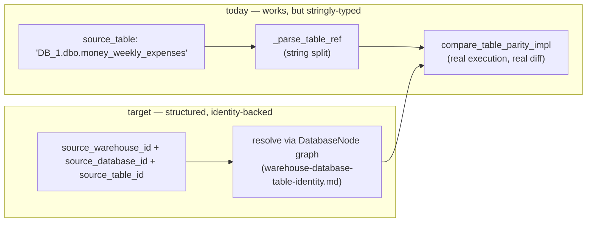

# Table Parity — structured multi-warehouse, multi-database targeting

> Full contract: `~/.claude/rules/spec-driven.md`. This spec extends an
> already-live, already-executing tool — it is a hardening + upgrade spec, not
> a greenfield build. Every gap below was verified by reading the current
> implementation, not inferred from the tool's name.

## 1. Context

`compare_table_parity` (brightbot) already does real cross-warehouse,
cross-database table comparison — schema diff, row counts, and a dialect-aware
sampled value diff — and is live on both the chat-agent and MCP surfaces
today. It is the natural home for "compare `money_weekly_expenses` in `DB_1`
vs `DB_2`, same or different warehouse" once a caller can express the target
precisely. Two things stand between "mechanically possible" and "reliably
correct": database targeting is smuggled through a free-text dotted string
instead of a structured id, and cross-engine type compatibility is validated
for exactly one warehouse-type pair. Both gaps get worse, not better, once
`warehouse-database-table-identity.md` ships the real `DatabaseNode` — this
spec is the on-ramp that lets table parity consume that model directly instead
of continuing to hand-parse strings.



### Use Case / Goal

An operator can ask "does `money_weekly_expenses` in `DB_1` match the one in
`DB_2`" — same warehouse or different, same table name or different — and get
a reliable schema/row/value diff without needing to know or type a dotted
string correctly, and without the check silently degrading to a weaker
comparator because the two sides are different warehouse types.

### How It Works Today

Verified directly against
`brightbot/brightbot/agents/dbt_agent/tools/table_parity_tool.py` (659 lines)
and its MCP wrapper `brightbot/brightbot/mcp/tools/table_parity.py` (103
lines, imports the same `compare_table_parity_impl` per ADR-015 shared-core —
one implementation, two registrations).

- **Entry point**: `compare_table_parity_impl(*, workspace_id,
  source_warehouse_id, source_table, target_warehouse_id, target_table,
  sample_rows=200)` (`table_parity_tool.py:419-559`). Both `source_table` and
  `target_table` accept `"database.schema.table"`, `"schema.table"`, or bare
  `"table"` — parsed by `_parse_table_ref` (`:243`). If no database is
  embedded in the string, it falls back to the warehouse config's own single
  `database` key (`:452-453`).
- **Warehouse resolution**: `resolve_named_warehouses(*, workspace_id,
  warehouse_ids)` (`:211-237`) looks up each `warehouse_id` explicitly in the
  workspace secret's `warehouses` dict and raises `ValueError` on any missing
  id — this is the one resolver in the codebase that does NOT collapse to
  `next(iter(...))`, exactly because table parity needs two independently
  named warehouses.
- **Execution is real**: every query (`_row_count_sql`, `_ordered_sample_sql`)
  passes through `assert_read_only_sql` before `conn.execute_query(sql)` runs
  it against the live warehouse (`:563`, `:580`). Row counts, schema
  introspection, and an ordered/capped value sample are genuinely pulled from
  both sides, not mocked or estimated.
- **Dialect handling is real, per side, independently**: `_quote_ident`
  (`:267-271`) brackets identifiers for `AZURE_SYNAPSE`, double-quotes
  otherwise; `_ordered_sample_sql` (`:285-298`) emits `SELECT TOP N ...` for
  Synapse/T-SQL vs `... LIMIT N` elsewhere; `_ne` (`:392-400`) tolerates
  numeric-formatting drift (`12.50` vs `12.5000`) when diffing sampled values.
- **Same-name collision is already solved**: every result field is namespaced
  under `source`/`target` (`TableRef`, `RowCountParity.source_rows`/
  `target_rows`, `ValueSampleParity.examples = {"source": ..., "target":
  ...}` at `:383`). Two tables named identically on both sides never collide
  in the output — this was the exact caveat raised and it is already handled.
- **Type compatibility**: `TYPE_COMPAT_ADAPTERS` registry (`:195-199`)
  currently has entries only for `(SQL_SERVER, AZURE_SYNAPSE)`,
  `(AZURE_SYNAPSE, AZURE_SYNAPSE)`, `(SQL_SERVER, SQL_SERVER)`. Any other pair
  (Snowflake↔SQL Server, Snowflake↔Snowflake, Redshift↔anything) falls through
  to `_EquivalenceClassTypeCompat`'s default (`:202-205`) — exact base-type
  equality via `_TYPE_CLASS_BY_BASE` (`:131-170`), which covers common types
  but has no adapter entry proving it was validated for those pairs.
- **Live on both surfaces**: registered in `deep_agent.py:47,318` (chat/agent
  tool list) and `mcp/server.py:45,66` (`_CORE_TOOL_MODULES`, always-on, not
  feature-flagged); listed in `mcp/capabilities.py:627-632` as `status:
  "live"`.

### Hard Limitations

- The tool **cannot** be pointed at a database by id — only by hoping the
  caller (human or LLM) correctly dot-qualifies the table string, or by
  falling back to the warehouse's single default `database` key. There is no
  validation step that confirms the parsed database actually exists before
  a connection is opened against it.
- Cross-engine type compatibility is **unvalidated** outside the SQL
  Server/Synapse pair — a Snowflake vs. SQL Server comparison will run and
  produce a verdict, but that verdict's schema-parity claim has no adapter
  entry backing its correctness for that specific type-system pair.
- Because database targeting rides on a free-text string, it inherits none of
  the structural guarantees (`warehouse-database-table-identity.md`
  Invariant 2/8/9) that would make an ambiguous or incoherent request fail
  loudly instead of silently parsing to the wrong database.

### Gaps

- No structured `source_database_id`/`target_database_id` parameter —
  database identity is smuggled through a string or a warehouse-level
  default.
- No pre-flight validation that a parsed/defaulted database actually exists
  and actually contains the named table before opening a live connection —
  today a typo in the dotted string just becomes a confusing downstream SQL
  error instead of a typed `database_not_found`/`table_not_in_database` error.
- No `TYPE_COMPAT_ADAPTERS` entries for Snowflake pairs (Snowflake↔Snowflake,
  Snowflake↔SQL Server/Synapse, Snowflake↔Redshift) — silently falls back to
  the generic comparator with no signal to the caller that the pair is
  unvalidated.
- No integration with `resolveTable`'s ambiguity ladder (from
  `warehouse-database-table-identity.md` §2c) — if a caller doesn't know which
  database a same-named table lives in, table parity offers no "help me find
  both" path; the caller must already know both sides precisely.

## 2. Interface Contract (MDE)

### 2a. Structured targeting — additive, string form stays supported

```python
def compare_table_parity_impl(
    *,
    workspace_id: str,
    source_warehouse_id: str,
    source_table: str,                      # existing string form — unchanged
    target_warehouse_id: str,
    target_table: str,                      # existing string form — unchanged
    source_database_id: str | None = None,  # NEW — structured override, wins over string-embedded database
    target_database_id: str | None = None,  # NEW
    sample_rows: int = 200,
) -> TableParityReport: ...
```

`source_database_id`/`target_database_id` are optional additive parameters.
WHEN present, they resolve via the `DatabaseNode` graph
(`warehouse-database-table-identity.md` §2c `tablesInDatabase`) and take
precedence over any database parsed out of the table string; WHEN absent,
today's string-parsing/warehouse-default behavior is unchanged — no existing
caller breaks.

### 2b. Pre-flight validation

```
resolveTable(workspaceId, tableName, warehouseId, databaseId) -> TableResolution
  # reused verbatim from warehouse-database-table-identity.md §2c

compare_table_parity_impl now calls resolveTable for EACH side before opening
any connection:
  RESOLVED    -> proceed to compare
  AMBIGUOUS   -> raise typed error listing all candidates (never guess which)
  error       -> surface the typed error (table_not_in_database, etc.) verbatim
```

### 2c. Type-compat registry extension

```python
TYPE_COMPAT_ADAPTERS: dict[tuple[str, str], TypeCompatAdapter] = {
    (SQL_SERVER, AZURE_SYNAPSE): ...,      # existing
    (AZURE_SYNAPSE, AZURE_SYNAPSE): ...,   # existing
    (SQL_SERVER, SQL_SERVER): ...,         # existing
    (SNOWFLAKE, SNOWFLAKE): SnowflakeTypeCompatAdapter(),         # NEW
    (SNOWFLAKE, SQL_SERVER): SnowflakeSqlServerTypeCompatAdapter(), # NEW
    (SNOWFLAKE, AZURE_SYNAPSE): SnowflakeSqlServerTypeCompatAdapter(), # NEW (T-SQL family)
}
# Any pair still missing an adapter entry gets an explicit warning field in
# the report (see 2d) rather than a silent generic fallback.
```

### 2d. Report shape addition

```python
class TableParityReport(BaseModel):
    # ...existing fields unchanged...
    type_compat_validated: bool  # NEW — True only if (source.warehouse_type, target.warehouse_type)
                                  # has a TYPE_COMPAT_ADAPTERS entry; False triggers a caller-visible caveat
```

## 3. Invariants (DbC)

1. `compare_table_parity_impl` SHALL NOT open a connection to either side
   before both `resolveTable` calls return `RESOLVED` — an `AMBIGUOUS` or
   error result on either side aborts the comparison entirely (no partial
   connect, no guessing one side while erroring the other).
2. IF `source_database_id`/`target_database_id` is provided, THEN it SHALL
   take precedence over any database embedded in the table string — the
   structured id never loses to the string form.
3. IF neither a structured database id nor a string-embedded database is
   resolvable to exactly one candidate, THEN THE System SHALL return the same
   typed `AMBIGUOUS`/`table_not_in_database` errors defined in
   `warehouse-database-table-identity.md` §3 — table parity introduces no new
   error vocabulary.
4. `type_compat_validated` SHALL be `False` whenever the
   `(source.warehouse_type, target.warehouse_type)` pair has no
   `TYPE_COMPAT_ADAPTERS` entry — this field SHALL NEVER be `True` by default;
   it is earned only by an explicit adapter registration.
5. Source and target results SHALL remain independently namespaced in every
   output field (already true today — this invariant formalizes the existing
   behavior so a future refactor cannot regress it).

## 4. Acceptance Criteria (BDD — Gherkin)

```gherkin
Feature: Structured database targeting for table parity

  Scenario: Explicit database id wins over string-embedded database
    Given warehouse A has databases DB_1 and DB_2, both containing table "money_weekly_expenses"
    When compare_table_parity is called with source_table="DB_1.dbo.money_weekly_expenses"
      and source_database_id pointing at DB_2
    Then the comparison runs against DB_2, not DB_1

  Scenario: Ambiguous side aborts before any connection opens
    Given warehouse A has databases DB_1 and DB_2, both containing table "money_weekly_expenses"
    When compare_table_parity is called with a bare table name "money_weekly_expenses" and no database pin on the source side
    Then the call returns AMBIGUOUS listing both DB_1 and DB_2 candidates
    And no connection is opened to either warehouse

  Scenario: Same-named tables on both sides never collide in the report
    Given source is warehouse A / DB_1 / "money_weekly_expenses"
    And target is warehouse A / DB_2 / "money_weekly_expenses"
    When compare_table_parity runs
    Then the report's source and target sections are independently populated
    And no field mixes values from the wrong side

Feature: Cross-engine type compatibility transparency

  Scenario: Validated pair reports type_compat_validated=true
    Given source is a SQL Server table and target is an Azure Synapse table
    When compare_table_parity runs
    Then type_compat_validated is true

  Scenario: Unvalidated pair reports type_compat_validated=false, not a silent pass
    Given source is a Snowflake table and target is a Redshift table with no registered adapter
    When compare_table_parity runs
    Then the schema/row/value comparison still executes and returns a verdict
    And type_compat_validated is false
    And the caller-facing response states the type compatibility for this pair is unvalidated
```

## 5. Out of Scope

- Building a UI for table parity — this spec covers the tool's contract only;
  a "compare these two tables" webapp surface is a separate follow-on if
  demand shows up.
- Full `TYPE_COMPAT_ADAPTERS` coverage for every warehouse-type pair
  (Databricks, BigQuery, Postgres combinations) — only the three Snowflake
  pairs named in §2c ship now, per the "rule of two": Snowflake is the next
  real pair in active use (Loop Capital + OneTen), the rest wait for demand.
- Changing `compare_table_parity`'s sampling strategy, row cap, or diff
  algorithm — only targeting precision and type-compat transparency are in
  scope.
- Retrofitting the `resolveTable` ambiguity ladder itself — that's built once
  in `warehouse-database-table-identity.md`; this spec only wires table
  parity to call it.

## 6. Dependencies

| Dependency | Type | Status |
|------------|------|--------|
| `resolveTable` query + `AMBIGUOUS`/error response shapes (`warehouse-database-table-identity.md` §2c) | Blocking | Draft — table parity's §2b cannot ship until this query exists |
| `DatabaseNode` entity + `tablesInDatabase` query (`warehouse-database-table-identity.md` §2b) | Blocking | Draft — `source_database_id`/`target_database_id` resolve against this |
| Existing `compare_table_parity_impl` / `resolve_named_warehouses` | Non-blocking | Live today — this spec extends it additively, no breaking change |

**Sequencing note**: this spec's §2a/§2b tickets should NOT start before
`warehouse-database-table-identity.md`'s rollout steps 1-4 land (DatabaseNode
+ backfill + constraint + isDefault/mutations) — otherwise `source_database_id`
has no real graph to resolve against. §2c (type-compat adapters) has no such
dependency and can ship independently, immediately.

## 7. Correctness Properties

### Property 1: No partial connection on ambiguity

*For any* `compare_table_parity` call where either side's `resolveTable`
result is not `RESOLVED`, no connection is opened to either warehouse.

**Validates: §3 Invariant 1, §4 Scenario "Ambiguous side aborts before any connection opens"**

### Property 2: Structured id always wins

*For any* call where `source_database_id` (or `target_database_id`) is
provided alongside a string-embedded database that differs, the structured id
is the one used to resolve the connection.

**Validates: §3 Invariant 2, §4 Scenario "Explicit database id wins over string-embedded database"**

### Property 3: Type-compat transparency is never silently assumed

*For any* comparison between warehouse types with no `TYPE_COMPAT_ADAPTERS`
entry, `type_compat_validated` is `false` and the caller-facing response
states the caveat — never a silent `true` or an omitted field.

**Validates: §3 Invariant 4, §4 Scenario "Unvalidated pair reports type_compat_validated=false, not a silent pass"**

## 8. Eval Criteria

| Evaluator | Node | Mode | Threshold | Method |
|---|---|---|---|---|
| TypeCompatDisclosureEvaluator | `compare_table_parity` tool node | GATE | 100% of reports with an unvalidated type pair include the caveat in the LLM-facing summary | deterministic (field + string check) |
| AmbiguityAbortEvaluator | `compare_table_parity` tool node | GATE | 0 connections opened when either side's `resolveTable` call is non-RESOLVED (score == 1.0) | deterministic |

## 9. Observability Contract

- **Span**: `gen_ai.tool.execute` with `gen_ai.tool.name=compare_table_parity`
- **Attributes**: `workspace.id`, `source.warehouse_id`, `source.database_id`
  (nullable), `target.warehouse_id`, `target.database_id` (nullable),
  `type_compat_validated`, `verdict`
- **Log events**: `table_parity.resolved`, `table_parity.aborted_ambiguous`,
  `table_parity.aborted_error`, `table_parity.type_compat_unvalidated`
- **Metrics**: `table_parity_type_compat_unvalidated_total` (counter, tagged
  `source_warehouse_type`, `target_warehouse_type`) — surfaces which engine
  pairs most need a real adapter next.

## 10. Test Coverage Update

| Repo | Suite | What to add |
|---|---|---|
| `brightbot` | `brightbot/tests/` + `brightbot/brightbot/evals/` (L0/L1/L2) | L0: one case per §2a/§2c contract entry (new params accepted, new report field present). L1: one case per §4 routing scenario (structured id wins, ambiguous aborts). L2: one case per §3 invariant (1, 2, 4, 5) + the 2 §8 evaluators, run against a real staging secret with 2 databases on one warehouse AND a real Snowflake+SQL-Server pair (not mocked) |
| `brighthive-e2e` | `brighthive-e2e/e2e/` | One feature test: compare two same-named tables in two databases on the same Loop-Capital-shaped warehouse end-to-end, confirms correct namespacing. One error-path test: ambiguous request against the real backend aborts before any connection, confirmed via span/log assertion, not just return value |

**Real-behavior requirement**: at least one L2 case MUST run against a real
Snowflake warehouse and a real SQL-Server/Synapse warehouse in the same test,
exercising an actually-unvalidated type pair — a mocked single-engine fixture
cannot exercise Invariant 4, which is exactly the transparency gap this spec
closes.

Before opening the implementation PR: run every suite above, confirm each new
§2/§3/§4/§8 entry has a corresponding new test case, and confirm all suites
are green.

## Areas Involved

| Area | Repo | Impact |
|------|------|--------|
| BrightBot | `brightbot` | `compare_table_parity_impl` gains structured `*_database_id` params, calls `resolveTable` pre-flight, gains `type_compat_validated` field, new Snowflake `TYPE_COMPAT_ADAPTERS` entries |
| Platform Core | `brighthive-platform-core` | No direct change in this spec — consumes `resolveTable`/`tablesInDatabase` built by the identity epic |

## Ticket Breakdown

Generated via `/create-jira-ticket` from this spec. Every row is an
`issueType: "Task"` under the epic in frontmatter — never `"Story"`.

| Ticket | Summary | Points | Epic |
|--------|---------|--------|------|
| — | Add Snowflake `TYPE_COMPAT_ADAPTERS` entries (Snowflake↔Snowflake, Snowflake↔SQL Server, Snowflake↔Synapse) | 3 | BH-172 |
| — | Add `type_compat_validated` field to `TableParityReport`; surface caveat in LLM-facing summary when false | 2 | BH-172 |
| — | Add `source_database_id`/`target_database_id` structured params to `compare_table_parity_impl` (depends on identity epic step 4) | 3 | BH-172 |
| — | Wire `resolveTable` pre-flight call for both sides; abort on non-RESOLVED before opening connections (depends on identity epic step 4) | 3 | BH-172 |
| — | Update `compare_table_parity` LLM-facing docstring/tool schema for new params + ambiguity-abort behavior | 1 | BH-172 |

**Total: 12 points across 5 tickets**

## Related

- **Spec**: `warehouse-database-table-identity.md` — the identity model this
  spec's structured targeting and ambiguity handling depend on
- **Spec**: `warehouse-agnostic-architecture.md` — registry/adapter precedent
  followed by §2c's `TYPE_COMPAT_ADAPTERS` extension
- **Feature doc**: `docs/features/table-parity-cross-warehouse-database.md`
  (create after shipping)
