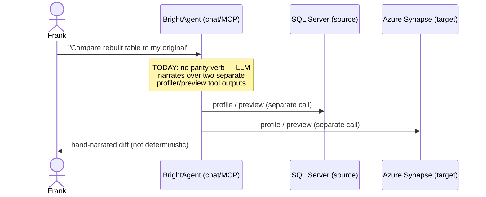

# Deterministic table-parity verb — 1:1 source↔target comparison

> Full contract: `~/.claude/rules/spec-driven.md`. This spec produces a production surface
> (a new agent tool on chat + MCP) that touches LLM narration, so §7, §8, §9 all apply.

## 1. Context

The Loop Capital demo (epic BH-1036, champion Frank Sung, VP Data Management) attaches BrightHive to
a legacy SQL Server via BYOW, rebuilds its pipelines as version-controlled dbt models, and
materializes rebuilt tables into Azure Synapse via dbt Cloud
(`clients/trials/loopcapital/DEMO_RUNBOOK_BEFORE_AFTER.md`, Acts 1–3, verified live 2026-07-17). The
runbook's "after" proves monitor/detect/resolve, disk watchdog, and surfaced fixes — but it stops
short of the one thing a data VP most needs before trusting a rebuild: a **1:1 comparison of the
rebuilt Synapse table against Frank's original live SQL Server table** — schema match? row-count
match? and *why is the rebuilt one better?* Today that step rides on LLM narration over two separate
profiler/preview outputs; there is no deterministic verb. This spec adds that verb — the trust
proof-point that makes the rebuild faithful, not just plausible.

> **Runbook note:** the before/after story lives in `DEMO_RUNBOOK_BEFORE_AFTER.md`; `demo.md` is the
> GC-14→17 proactive-loop demo. Neither yet pins a deterministic 1:1-compare step — this spec
> introduces it. A follow-up doc edit should add the compare step to the runbook once the verb ships.

### Use Case / Goal

Frank asks in chat: *"Compare the rebuilt `recon_staging` in Synapse to my original
`TradeDW.dbo.ReconStaging` on SQL Server. Schema? Row counts? Why is the rebuilt one better?"*
BrightAgent returns a **deterministic parity report** — column-by-column schema alignment
(cross-dialect type-aware), row-count delta, and a sampled-value diff — and the LLM narrates the
"why better" rationale *on top of* those hard facts. Success = a data VP can read the report and
trust the rebuild without opening a SQL client.

### How It Works Today



Every *other* lifecycle stage is built: `.xsd` intake (`read_project_schema_file`), source read
(`introspect_warehouse_schema` + `run_warehouse_query`), dbt rebuild + commit, materialize
(`run_models_to_stage`), govern (`register_transformation` + quality tools). Stage 7's comparison
today rides on **LLM narration over two independent tool outputs** ("profiler + preview both sides").
There is no verb that takes two table references and emits a structured, deterministic diff.

### Hard Limitations

- **No deterministic comparison exists.** Nearest primitives (recon-confirmed) compare the wrong
  things: `qc_semantic_view_pipeline` (`agents/dbt_agent/tools/sv_qc_tools.py:276`) compares one SV's
  base tables against its data product **on the same warehouse** (row counts + per-column null rate +
  freshness); `_compare_table_columns` (`tools/redshiftTableCreation.py:698`) and
  `_compare_table_row_count` (`:739`) compare a **pandas DataFrame** against an existing Redshift
  load, returning a bool — DataFrame-vs-table, single-side. None does two-warehouse
  TDS-source-vs-TDS-target schema+rowcount+value diff. `SPEC-QUALITY-RULE-FULL-TABLE-PARITY`
  (BH-1168) is full-table-vs-50-row-sample *execution* parity for GX rules — unrelated.
- **Single-connection resolution.** `get_warehouse_config_from_secrets(workspace_id)` resolves
  exactly ONE warehouse: the underlying secret holds `warehouses` as a **dict keyed by
  warehouseId**, but every resolver collapses it with `next(iter(warehouses.values()))`. A parity
  verb needs TWO named connections (source SQL Server + target Synapse) from that same dict.
- **Cross-dialect by design.** SQL Server is not a dbt Cloud target — the rebuilt table lands in
  Synapse, not back in SQL Server (`DEMO_RUNBOOK_BEFORE_AFTER.md` §3.4). So the comparison is
  inherently cross-warehouse: `money` (SQL Server) vs `decimal(19,4)` (Synapse), `nvarchar` vs
  `varchar`. A
  naïve string-equality type check would report false mismatches.

### Gaps

- No `_impl` verb, no chat registration, no MCP registration for source↔target parity.
- No two-named-connection resolver over the `warehouses` dict.
- No cross-dialect type-compatibility table (money/decimal, nvarchar/varchar, int families).

## 2. Interface Contract (MDE)

**Port-first (per `docs/CLAUDE.md` engine-agnostic rule).** The comparison reads both tables through
the **existing** warehouse connection port — no new vendor coupling. What's new is (a) a
two-named-connection resolver and (b) the parity core impl + a cross-dialect type-compat map behind
a small `TypeCompatibility` port so a third engine is a registry entry, not a code change.

**Real seams (recon-confirmed file:line, all under `brightbot/brightbot/`):**
- `WarehouseConnectionFactory.create_connection(params, warehouse_type)` — `tools/warehouse_connections.py:658`;
  registry `CONNECTION_CLASSES` at `:646`.
- `WarehouseConnection.execute_query(query) -> list[dict]` — `tools/warehouse_base.py:510`;
  `list_tables(*, database, schema) -> tuple[IntrospectedTable, ...]` — `:538` (schema introspection).
- `assert_read_only_sql(query, allowed_starts) -> str` (raises `ValueError`) — `tools/warehouse_base.py:213`.
- `get_warehouse_config(workspace_id)` — `tools/aws/secrets_manager.py:287`; the bottleneck:
  `warehouses = secret_data.get("warehouses", {})` (`:294`, a **dict**) collapsed by
  `next(iter(warehouses.values()), None)` (`:302`). The new resolver reads the workspace secret
  directly and indexes `warehouses` by warehouseId instead of collapsing.
- chat `base_tools` list — `agents/super_agent/deep_agent.py:291-312` (tools dropped in by reference,
  e.g. `read_project_schema_file` at `:310`).
- MCP shared-impl + thin wrapper — `mcp/tools/fleet_health.py:107` (`_impl`) / `:140` (`register`);
  `_CORE_TOOL_MODULES` at `mcp/server.py:54`; catalog `_t(...)` + `ToolPermission` at
  `mcp/capabilities.py:65`, WAREHOUSE_READ-scoped perm.

**Dialect nuance (recon-confirmed):** SQL Server is **not** a `WarehouseType` literal —
`WarehouseType` is `redshift|snowflake|azure_synapse|postgres|databricks` (`utils/warehouse_types.py:20`).
SQL Server exists only as a **secret-type string** `"SQL_SERVER"` (`SQL_SERVER_SECRET_TYPE`, `:34`) and
rides `SynapseConnection` via the shared TDS chain (`TDS_SECRET_TYPES`, `:46`). Both source and target
therefore build with `warehouse_type=AZURE_SYNAPSE`; the `TypeCompatibility` adapter keys on the
**secret-type pair** (`SQL_SERVER`, `AZURE_SYNAPSE`), not on `WarehouseType`. The existing
`DATA_TYPE_NORMALIZER` (`agents/dbt_agent/tools/atlas_semantic_view/constants.py:182`, has
`MONEY→DECIMAL`, `NVARCHAR→TEXT`) normalizes *to* the semantic-view type system — it is **not** a
SQL-Server↔Synapse equivalence map, so it is adjacent-but-not-reusable; the adapter is fresh.

```python
# ── Domain types (Pydantic) ─────────────────────────────────────────────────
class ColumnParity(BaseModel):
    name: str
    source_type: str                 # raw dialect type, e.g. "money"
    target_type: str                 # raw dialect type, e.g. "decimal(19,4)"
    type_compatible: bool            # cross-dialect semantic equality, NOT string ==
    present_in_source: bool
    present_in_target: bool

class SchemaParity(BaseModel):
    columns: list[ColumnParity]
    fully_aligned: bool              # all columns present both sides AND type_compatible
    source_only: list[str]
    target_only: list[str]

class RowCountParity(BaseModel):
    source_rows: int
    target_rows: int
    delta: int                       # target - source
    match: bool

class ValueSampleParity(BaseModel):
    sample_size: int                 # capped at _MAX_SAMPLE_ROWS
    ordered_by: list[str]            # deterministic ordering key (PK/first col)
    mismatched_rows: int
    examples: list[dict]             # up to N example diffs, source vs target row

class TableParityReport(BaseModel):
    source: TableRef                 # {warehouse_id, database, schema, table, secret_type}
    target: TableRef                 # secret_type ∈ {"SQL_SERVER","AZURE_SYNAPSE",...}; both build via warehouse_type=AZURE_SYNAPSE
    schema_parity: SchemaParity
    row_count_parity: RowCountParity
    value_sample_parity: ValueSampleParity | None   # None if schema not aligned
    verdict: Literal["parity", "schema_drift", "row_drift", "value_drift"]

# ── Core impl (the ONE definition; both surfaces call this) ──────────────────
def compare_table_parity_impl(
    *,
    workspace_id: str,
    source_warehouse_id: str,
    source_table: str,               # "database.schema.table" or dialect-qualified
    target_warehouse_id: str,
    target_table: str,
    sample_rows: int = 200,
) -> TableParityReport:
    """Read both tables SELECT-only, emit deterministic schema/row/value parity."""

# ── Two-named-connection resolver (new seam over the warehouses dict) ────────
def resolve_named_warehouses(
    *, workspace_id: str, warehouse_ids: Sequence[str]
) -> dict[str, WarehouseConfig]:
    """Resolve N named connections from the workspace `warehouses` secret dict."""

# ── TypeCompatibility port (engine-agnostic; registry keyed by warehouse_type pair) ──
class TypeCompatibility(Protocol):
    def compatible(self, *, source_type: str, target_type: str) -> bool: ...

# Keyed on the SECRET-TYPE pair (not WarehouseType — SQL Server has no WarehouseType literal).
TYPE_COMPAT_ADAPTERS: Final[dict[tuple[str, str], TypeCompatibility]]
# first adapter key: ("SQL_SERVER", "AZURE_SYNAPSE") — the demo pair. NOT the design; the first adapter.
```

**Chat surface** (registered in `base_tools`, `deep_agent.py`): tool `compare_table_parity` with the
same args → returns the `TableParityReport` serialized for the LLM to narrate.

**MCP surface** (thin `@mcp.tool` wrapper over `compare_table_parity_impl`, registered via
`_CORE_TOOL_MODULES` in `mcp/server.py` + a `ToolPermission` cell in `capabilities.py`).

**Slack: N/A** — Slack is workspace-scoped with no project/table-selection surface; the parity verb
is a chat + MCP capability (per ADR-015 shared-core, Slack registration deferred with reason).

## 3. Invariants (DbC)

1. `WHEN` the verb reads either table, `THE System SHALL` issue SELECT-only SQL — every generated
   query passes `assert_read_only_sql` before execution. No write path exists.
2. `THE System SHALL` resolve source and target from the workspace `warehouses` secret dict by
   **warehouseId key**, never by `next(iter(...))` positional pick.
3. `THE System SHALL` compare column types via the `TypeCompatibility` adapter for the
   (source_type, target_type) warehouse pair — never by raw string equality.
4. `IF` the two schemas are not fully aligned (`fully_aligned == False`), `THEN THE System SHALL`
   set `value_sample_parity = None` and `verdict = "schema_drift"` (value diff is meaningless without
   aligned columns).
5. `THE System SHALL` cap the value sample at `_MAX_SAMPLE_ROWS` and order it deterministically
   (stable ordering key) so repeated runs return identical `mismatched_rows`.
6. `THE System SHALL` never mutate either warehouse — no `CREATE`/`INSERT`/`UPDATE`/`DELETE`/`MERGE`.
7. `verdict` is derived deterministically from the three parity blocks, not from the LLM:
   `parity` iff schema aligned ∧ row match ∧ zero value mismatches; else the most severe drift.
8. `THE System SHALL` expose exactly ONE core impl (`compare_table_parity_impl`); chat and MCP
   registrations call it and add only auth + scope + response shaping (ADR-015 INV-9).

Budget: 8 invariants (≤15). ✔

## 4. Acceptance Criteria (BDD — Gherkin)

```gherkin
Feature: Deterministic source↔target table parity

  Scenario: Faithful rebuild reports full parity
    Given a source table TradeDW.dbo.ReconStaging on SQL Server
      And a rebuilt target table recon_staging on Azure Synapse with matching columns and rows
    When Frank asks the agent to compare them
    Then the report verdict is "parity"
      And schema_parity.fully_aligned is true
      And row_count_parity.match is true
      And value_sample_parity.mismatched_rows is 0

  Scenario: money↔decimal is reported type-compatible, not a mismatch
    Given source column LastPx is money and target column LastPx is decimal(19,4)
    When the parity verb compares schemas
    Then the LastPx ColumnParity.type_compatible is true
      And it does not appear in source_only or target_only

  Scenario: Row-count drift is caught deterministically
    Given the target has 3 fewer rows than the source
    When the verb compares them
    Then row_count_parity.delta is -3
      And row_count_parity.match is false
      And the verdict is "row_drift"

  Scenario: Schema drift suppresses the value diff
    Given the target is missing a column the source has
    When the verb compares them
    Then value_sample_parity is null
      And the verdict is "schema_drift"
      And schema_parity.source_only contains the missing column

  Scenario: Two named connections resolve from one workspace secret
    Given the workspace warehouses secret holds both a SQL Server and a Synapse entry keyed by id
    When the verb resolves source_warehouse_id and target_warehouse_id
    Then it returns two distinct WarehouseConfig objects, not the same first entry twice

  Scenario: The verb never writes to a warehouse (read-only guard)
    Given any comparison request
    When the verb builds its queries
    Then every query passes assert_read_only_sql
      And no CREATE/INSERT/UPDATE/DELETE is ever issued

  Scenario: One impl, two surfaces
    Given the chat tool and the MCP tool for parity
    When grepped for compare_table_parity_impl
    Then exactly one definition exists and both surfaces call it
```

Budget: 7 scenarios (≤20). ✔

## 5. Out of Scope

- BrightAgent writing to any warehouse — the rebuild write happens through **dbt Cloud**, never the
  agent's connection. This verb is read-only on both sides.
- SQL Server as a dbt Cloud materialization target — the target is Synapse; comparison is
  cross-warehouse by design.
- Full-table value reconciliation with checksums/hash-diff — the demo bar is a *sampled* value diff;
  full-table checksum parity is a follow-on ticket.
- A generic "why better" scoring model — the LLM narrates the rationale; the verb only supplies facts.
- Slack registration — deferred (no project/table-selection surface on Slack).

## 6. Dependencies

| Dependency | Type | Status |
|------------|------|--------|
| Warehouse connection factory (`WarehouseConnectionFactory.create_connection`) | Blocking | Ready |
| `warehouses` secret dict (`secrets_manager.get_warehouse_config`) | Blocking | Ready (needs two-key resolver) |
| `assert_read_only_sql` read-only guard | Blocking | Ready |
| `base_tools` chat registry (`deep_agent.py`) | Blocking | Ready |
| MCP `_CORE_TOOL_MODULES` + `ToolPermission` (`mcp/server.py`, `capabilities.py`) | Blocking | Ready |
| AZURE_SYNAPSE + SQL_SERVER warehouse adapters (BH-1107 TDS chain) | Blocking | Ready |
| ADR-015 shared-core pattern | Non-blocking | Accepted (platform-saas-ai-context PR #46) |

## 7. Correctness Properties

### Property 1: Read-only safety

*For any* comparison request against *any* pair of warehouses, every SQL statement the verb issues
is SELECT-only and passes `assert_read_only_sql`; neither warehouse is ever mutated.

**Validates: §3 Invariant 1, 6; §4 Scenario "The verb never writes to a warehouse"**

### Property 2: Deterministic verdict

*For any* fixed pair of table states, repeated runs return an identical `verdict` and identical
`mismatched_rows` — the verdict is a pure function of the three parity blocks, not of LLM output or
sample ordering.

**Validates: §3 Invariant 5, 7; §4 Scenario "Row-count drift", "Schema drift suppresses the value diff"**

### Property 3: Cross-dialect type fidelity

*For any* semantically-equal column pair across the (SQL_SERVER, AZURE_SYNAPSE) dialect boundary
(e.g. money ↔ decimal(19,4)), `type_compatible` is true; *for any* genuinely incompatible pair it is
false — never decided by raw string equality.

**Validates: §3 Invariant 3; §4 Scenario "money↔decimal is reported type-compatible"**

### Property 4: Named-connection isolation

*For any* workspace whose `warehouses` secret holds ≥2 entries, resolving source and target by their
warehouseId keys yields two distinct configs — the positional `next(iter(...))` collapse can never
alias them to the same connection.

**Validates: §3 Invariant 2; §4 Scenario "Two named connections resolve from one workspace secret"**

## 8. Eval Criteria

| Evaluator | Node | Mode | Threshold | Method |
|---|---|---|---|---|
| ParityVerdictAccuracy | compare_table_parity | GATE | verdict == deterministic expected on fixture pairs | deterministic |
| WhyBetterGrounding | LLM narration over report | OBSERVE | rationale cites only fields present in the report (no hallucinated numbers) | LLM judge |
| TypeCompatCoverage | TypeCompatibility adapter | GATE | 100% of the demo column types (money, int, nvarchar) mapped | deterministic |

## 9. Observability Contract

- **Span**: `gen_ai.tool.execute` with `gen_ai.tool.name=compare_table_parity` (OTel GenAI convention)
- **Attributes**: `workspace.id`, `parity.source_warehouse_type`, `parity.target_warehouse_type`,
  `parity.verdict`, `parity.row_delta`, `parity.schema_aligned`, `parity.sample_rows`
- **Log events**: `table_parity.started`, `table_parity.schema_compared`, `table_parity.success`,
  `table_parity.not_select_only` (guard tripped), `table_parity.connection_resolve_failed`
- **Metrics**: none

## 10. Test Coverage Update

| Repo | Suite | What to add |
|---|---|---|
| `brightbot` | `brightbot/tests/` + `brightbot/brightbot/evals/` (L0/L1/L2 per `brightbot/CLAUDE.md`) | **L0**: one surface case per §2 entry — chat tool schema + MCP tool schema assert the `TableParityReport` shape and args. **L1**: one routing case — a parity request reaches `compare_table_parity_impl` (not the profiler/preview path). **L2**: one behavior case per §3 invariant observable externally (read-only guard trips on injected write; named-connection resolver returns two distinct configs; verdict determinism on fixture pairs; money↔decimal compatible) + one per §8 evaluator. |
| `brighthive-e2e` | `brighthive-e2e/e2e/` (cross-repo, real backend) | One feature test: the §4 happy path — compare a real Synapse target against a real SQL Server source **against staging's data plane** for the Loop Capital workspace, assert `verdict == "parity"`. One error-path test: schema-drift case returns null value diff. |

**Real-behavior requirement** (`~/.claude/rules/test-behavior-real.md`): the L2 determinism +
named-connection cases and the e2e feature test MUST hit real warehouse connections (SQL Server +
Synapse via the real factory) or a captured two-table replay — not a mock. Fixtures mirror a real
captured `ReconStaging` sample, not a hand-typed shape.

Before opening the implementation PR: run `brightbot` unit + evals and `brighthive-e2e` against
staging, confirm each new §2/§3/§4/§8 entry has a corresponding new test case, and confirm all
suites are green.

## Areas Involved

| Area | Repo | Impact |
|------|------|--------|
| BrightBot | `brightbot` | New `compare_table_parity_impl` core, two-named-connection resolver, `TypeCompatibility` port + first adapter, chat `base_tools` registration, MCP registration |
| Web App | `brighthive-webapp` | None (chat renders the report; no new page this ticket) |
| Platform Core | `brighthive-platform-core` | None |

## Ticket Breakdown

Generated from this spec. Every row is `issueType: "Task"` under BH-1036 — never `"Story"`.

| Ticket | Summary | Points | Epic |
|--------|---------|--------|------|
| BH-1351 | Deterministic table-parity verb: core impl + two-named-connection resolver + TypeCompatibility port | 5 | BH-1036 |
| — | Chat `base_tools` + MCP registration of `compare_table_parity` (shared-core, ADR-015) | 2 | BH-1036 |
| — | L0/L1/L2 + real-behavior e2e tests against staging (SQL Server ↔ Synapse) | 3 | BH-1036 |

## Related

- **Demo runbook**: `clients/trials/loopcapital/DEMO_RUNBOOK_BEFORE_AFTER.md` (the before/after
  rebuild story; the compare step is added by this spec)
- **Shared-core pattern**: ADR-015 (`platform-saas-ai-context/docs/decisions/decisions.md`)
- **Cross-dialect facts**: `docs/specs/azure-synapse-full-integration.md`, BH-1107 (TDS chain)
