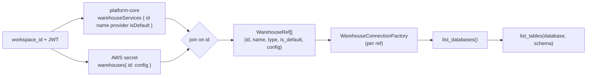

# Spec: Warehouse catalog — enumerate a workspace's warehouses and walk the addressing ladder

## 1. Context

Before a user can pick a default warehouse, scope a conversation to one, or ask an
agent to monitor "the databases on `@ec2_mssql`", the platform has to be able to do
one plain thing first: **connect to every warehouse a workspace has, and fetch what
is inside each — its databases, their schemas, their tables.** That is the
`WORKSPACE → WAREHOUSE → DATABASE → TABLE` ladder (BH-1370) made real as data, not
just as a parseable chat grammar.

Two gaps block this today:

1. **No warehouse enumeration.** `get_warehouse_config` returns *one* warehouse
   config, chosen by `next(iter(warehouses.values()))` — an arbitrary coin-flip when
   a workspace holds more than one. Nothing lists all of a workspace's warehouses
   with their identity (id, name, type) and which one is the default.
2. **Name↔id mismatch — a live correctness bug.** The AWS secret's `warehouses{}`
   map is keyed by the platform-core `WarehouseServiceNode.id` (a ULID). But a chat
   `@ec2_mssql` mention yields the human **name**. The BH-1371 pin passes that name
   straight into `warehouses.get(name)`, which misses on any real workspace — the
   pin tests pass only because their fixtures use id-shaped keys. The shipped spec's
   §7 Property 1 ("never a coin-flip") is therefore aspirational, not honored.
   This spec closes the drift with the missing join: GraphQL gives `{id, name}`, the
   secret is keyed by `id`, so a name→id map resolves the mention to the real key.

There is also no `list_databases` rung: the connection contract can list *tables*
under a given database, but cannot enumerate the databases themselves — so the UI /
agent has no way to offer "which database on this warehouse?" without one already
being named.



**Scope of this spec:** the read-only **data layer** — the functions that enumerate
and connect. The chat grammar (BH-1371), the default selector + EXTEND/SCOPE UI, and
per-level health/profiler actions are separate consumers of this layer, specced
elsewhere.

## 2. Interface Contract (MDE)

Port and adapters already exist (`WarehouseConnection` ABC + concrete adapters +
`WarehouseConnectionFactory`). This spec adds one rung to that port and one new
enumeration function above it — no vendor SDK leaks into either.

### 2a. New rung on the existing warehouse port (`brightbot/tools/warehouse_base.py`)

```python
class WarehouseConnection(ABC):
    # ... existing: connect, execute_query, list_tables, list_stages, list_semantic_views ...

    @abstractmethod
    def list_databases(self) -> tuple[str, ...]:
        """Return the database names visible to this connection's credentials."""
        ...
```

Every adapter (Redshift, Snowflake, Synapse/SQL Server, Postgres) implements it with
its own catalog read — no dialect branch in the caller:

| Adapter | Catalog read |
|---|---|
| Redshift | `SELECT datname FROM pg_database WHERE datistemplate = false` |
| Postgres | `SELECT datname FROM pg_database WHERE datistemplate = false` |
| Snowflake | `SHOW DATABASES` (name column) |
| Synapse / SQL Server | `SELECT name FROM sys.databases WHERE database_id > 4` (skip system DBs) |

### 2b. New enumeration data layer (`brightbot/tools/warehouse_catalog.py`)

```python
@dataclass(frozen=True)
class WarehouseRef:
    """One warehouse a workspace owns — identity joined to its secret config."""
    id: str            # platform-core WarehouseServiceNode.id — the secret key
    name: str          # human name shown in chat / UI (the @mention text)
    warehouse_type: str        # resolved engine: snowflake | redshift | azure_synapse | postgres
    is_default: bool           # platform-core isDefault (exactly one true per workspace)
    config: dict[str, Any] | None  # secret config for this id, or None if unconfigured

def list_workspace_warehouses(
    *, workspace_id: str, client: PlatformClient
) -> tuple[WarehouseRef, ...]:
    """Every warehouse the workspace owns, id-joined GraphQL identity + secret config.

    Reads warehouseServices { id name provider isDefault } from platform-core and
    the id-keyed warehouses{} secret, joins on id. Never raises for a partially
    configured workspace: a service with no secret entry returns config=None.
    """

def resolve_warehouse_id(
    *, workspace_id: str, client: PlatformClient, mention: str | None
) -> str | None:
    """Map a chat @mention (a NAME) to the secret key (an id).

    Resolution order: exact id match → exact name match (case-insensitive) →
    the workspace default's id → None. This is the name→id join the BH-1371 pin
    was missing.
    """
```

`get_warehouse_config` (`brightbot/tools/aws/secrets_manager.py`) changes its
**unpinned** branch only — resolution order becomes:

```
explicit warehouse_id (already an id)  →  workspace default id  →  first-configured (last resort)
```

replacing the bare `next(iter(warehouses.values()))`. The pinned branch is unchanged
in shape but now receives a real id (callers translate name→id via
`resolve_warehouse_id` before calling).

### 2c. GraphQL selection-set delta (`brightbot/tools/platform_queries.py`)

`get_warehouse_connection_info` adds `isDefault` to the `warehouseServices`
selection set. No schema change — `isDefault` already ships on the node (BH-1362).

## 3. Invariants (DbC)

- **I-1** THE `warehouses{}` secret map SHALL be keyed by `WarehouseServiceNode.id`;
  every resolver that indexes it SHALL use an id, never a display name.
- **I-2** `list_workspace_warehouses` SHALL return exactly one `WarehouseRef` per
  `warehouseService` the workspace owns, whether or not it has a secret entry
  (unconfigured → `config=None`, never dropped, never raised).
- **I-3** WHERE a workspace has exactly one warehouse, `resolve_warehouse_id` and the
  unpinned `get_warehouse_config` SHALL resolve identically with or without a default
  set (no behavior change for the common case) — mirrors chat-addressing I-6.
- **I-4** `resolve_warehouse_id(mention=None)` SHALL return the workspace default's id
  WHEN a default exists, else the first-configured id, else None — never a coin-flip
  that ignores the default.
- **I-5** `list_databases` SHALL issue only a catalog read (no arbitrary SQL) and
  SHALL be engine-agnostic at the call site — the caller never branches on
  warehouse_type; the adapter owns the dialect.
- **I-6** Enumeration and connection SHALL be READ-ONLY: no function in this layer
  writes to platform-core, the secret, or the warehouse.
- **I-7** Exactly one `WarehouseRef.is_default` SHALL be true per workspace WHEN the
  workspace has ≥1 configured warehouse (platform-core enforces the source
  invariant; this layer SHALL NOT invent a second default).

## 4. Acceptance Criteria (BDD)

```gherkin
Feature: enumerate a workspace's warehouses and walk databases → tables

  Scenario: two warehouses both enumerated with identity + default
    Given a workspace with two warehouseServices, one marked isDefault
    When list_workspace_warehouses is called
    Then two WarehouseRefs are returned
    And exactly one has is_default true
    And each ref.config is the secret entry keyed by its id

  Scenario: a chat @mention name resolves to the id-keyed secret entry
    Given a warehouse named "ec2_mssql" with id "wh-01H..."
    When resolve_warehouse_id(mention="ec2_mssql") is called
    Then it returns "wh-01H..."
    And get_warehouse_config(warehouse_id="wh-01H...") returns that warehouse's config

  Scenario: no mention resolves to the workspace default, not a coin-flip
    Given a workspace with two warehouses, the second marked isDefault
    When resolve_warehouse_id(mention=None) is called
    Then it returns the second warehouse's id

  Scenario: an unconfigured service is enumerated, not dropped
    Given a warehouseService with no secret entry
    When list_workspace_warehouses is called
    Then a WarehouseRef for it is returned with config None

  Scenario: databases enumerated engine-agnostically
    Given a connection to any supported warehouse
    When list_databases is called
    Then the database names are returned without the caller naming the engine

  Scenario: single-warehouse workspace is unchanged
    Given a workspace with exactly one warehouse and no default set
    When get_warehouse_config is called with no warehouse_id
    Then that one warehouse's config is returned
```

## 5. Out of Scope

- **Chat grammar / fan-out.** Parsing `@`-mentions and `/verbs` is BH-1371.
- **Default selector + EXTEND/SCOPE UI.** The webapp surface that sets `isDefault`
  and the conversation mode is a separate consumer.
- **Per-level health / profiler actions.** Reuse BH-1341 health +
  `data_profiler`; wiring them to the ladder is a follow-on.
- **Writing `isDefault`.** `setDefaultWarehouse` already ships (BH-1362); this layer
  only reads it.

## 6. Dependencies

- **BH-1362** `isDefault` field + `setDefaultWarehouse` (platform-core, shipped).
- **BH-590** `WarehouseConnection` introspection port + adapters + factory.
- `PlatformClient` protocol + `PlatformAPISession` (the injectable GraphQL client).
- `get_warehouse_config` / `get_workspace_secret` (the id-keyed secret readers).

## 7. Correctness Properties

### Property 1: The secret is always indexed by id, never by name

*For any* warehouse resolution, the value passed to `warehouses.get(...)` is a
`WarehouseServiceNode.id`. A chat `@name` mention is translated through
`resolve_warehouse_id` before it reaches the secret.

**Validates: §3 I-1, §4 Scenario "a chat @mention name resolves to the id-keyed secret entry"**

### Property 2: The unpinned default is the user's default, not a coin-flip

*For any* workspace with a default set, `resolve_warehouse_id(mention=None)` and the
unpinned `get_warehouse_config` return the default warehouse's id/config — the
`next(iter(...))` fallback fires only when no default exists.

**Validates: §3 I-4, §4 Scenario "no mention resolves to the workspace default, not a coin-flip"**

### Property 3: Enumeration never drops or invents a warehouse

*For any* workspace, `len(list_workspace_warehouses(...))` equals the number of
`warehouseServices` platform-core returns — configured and unconfigured alike — and
exactly one ref is default when ≥1 is configured.

**Validates: §3 I-2, §3 I-7, §4 Scenario "an unconfigured service is enumerated, not dropped"**

## 9. Observability Contract

- **Log events**: `warehouse_catalog.enumerated` (count, default_id),
  `warehouse_catalog.name_resolved` (mention, resolved_id),
  `warehouse_catalog.name_unresolved` (mention), `warehouse_catalog.list_databases`
  (warehouse_type, db_count).
- **Attributes**: `workspace.id`, `warehouse.id`, `warehouse.type`.
- **Metrics**: none.

## 10. Test Coverage Update

### a. In-repo layered evals (brightbot/tests/)

- **L0 (surface)** — `list_workspace_warehouses` returns `WarehouseRef` shape per §2b;
  `resolve_warehouse_id` return type contract; `get_warehouse_connection_info` query
  string contains `isDefault`.
- **L1 (join/resolution)** — one case per §4 resolution scenario: name→id,
  mention=None→default, unconfigured-service-kept, single-warehouse-unchanged. Stub
  only the two I/O boundaries (`PlatformClient.query` with a real two-service
  response shape captured from staging; the id-keyed secret) — the join + resolution
  order run for real.
- **L2 (behavior, real client)** — `list_databases` against a real connection
  (per `test-behavior-real.md`): a real-behavior test constructing the concrete
  adapter and asserting the returned database names, for at least one engine; a
  captured-shape fixture for the others. Real-behavior guard on the name→id join:
  a mention that matches a name returns the id whose secret entry is non-empty.

### b. Cross-repo e2e (brighthive-e2e/)

- One feature test: link a workspace with a warehouse, enumerate it, list its
  databases live against the staging warehouse (read-only).

#### Fixtures mirror reality

The two-service GraphQL response and the id-keyed secret fixtures MUST be captured
from a real staging workspace (a warehouse whose secret key is a real ULID and whose
`name` differs from that ULID), so the name↔id join is exercised against the real
shape — not a fixture where name and key happen to coincide (the exact blind spot
that let the BH-1371 pin ship broken).
