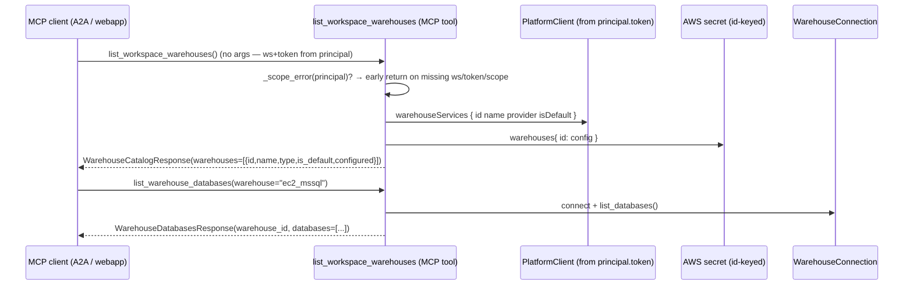

# Spec: Warehouse catalog — surface the WORKSPACE→WAREHOUSE→DATABASE ladder over MCP

## 1. Context

The warehouse catalog data layer (BH-1370, [`warehouse-catalog-enumeration.md`](./warehouse-catalog-enumeration.md)) can
already, in-process, do the one thing the whole addressing story rests on: enumerate
every warehouse a workspace owns (`list_workspace_warehouses`) and walk down to the
databases on any one of them (`WarehouseConnection.list_databases`). But that layer
has **no reachable surface** — it is pure Python, callable only from inside the
agent process. So:

- an external A2A (agent-to-agent) caller or the webapp cannot ask "what warehouses
  does this workspace have, and what databases are on each?" without booting a full
  deep_agent run;
- the enumeration spec's §10b cross-repo e2e ("link a workspace, enumerate it, list
  its databases live against staging") has **nothing to hit** — no verb, no route —
  so the contract that proves the foundation works end-to-end cannot be written.

This spec closes both gaps with **one read-only MCP verb** that exposes the ladder's
first two rungs — warehouses, then databases — mirroring the shipped
`get_warehouse_connection_health` tool (BH-1341) exactly: `workspace_id` + `token`
come from the authenticated principal (never a caller arg), the scope gate runs
before any I/O, and the response is a typed Pydantic model. It adds no new data-layer
logic — it is a thin, honest surface over functions that already ship and are already
covered by real-behavior tests.



**Scope of this spec:** the read-only **MCP surface** — two tools over the existing
catalog data layer. The data layer itself (BH-1370, `warehouse-catalog-enumeration.md`)
is the dependency, already built and tested. The chat grammar (BH-1371), the default
selector + EXTEND/SCOPE UI, and per-level profiler actions are other consumers,
specced elsewhere.

## 2. Interface Contract (MDE)

Two MCP tools in a new core module `brightbot/mcp/tools/warehouse_catalog.py`,
registered like `connection_health` (a core, always-on read tool). Both take **no
caller arguments that carry identity** — `workspace_id` and `token` are read from
`get_current_principal()`. `list_warehouse_databases` takes one optional
`warehouse` selector (a name or id; `None` → the workspace default), resolved through
the data layer's `resolve_warehouse_id` (never indexed raw).

```python
class WarehouseSummary(BaseModel):
    """One warehouse a workspace owns — identity + whether it has a secret config."""
    id: str                # WarehouseServiceNode.id (the secret key)
    name: str              # human name (the @mention text)
    warehouse_type: str    # snowflake | redshift | azure_synapse | postgres
    is_default: bool
    configured: bool       # True when a secret entry exists (config is not None)

class WarehouseCatalogResponse(BaseModel):
    status: str                        # "ok" | error code from the scope gate
    workspace_id: str | None
    count: int
    warehouses: list[WarehouseSummary]
    detail: str | None = None          # human line on the empty / error case
    error: str | None = None

class WarehouseDatabasesResponse(BaseModel):
    status: str                        # "ok" | "unresolved_warehouse" | scope error
    workspace_id: str | None
    warehouse_id: str | None           # the resolved id (None when unresolved)
    warehouse_name: str | None
    warehouse_type: str | None
    count: int
    databases: list[str]
    detail: str | None = None
    error: str | None = None

# MCP tools (registered via register(mcp); workspace_id + token from principal)
async def list_workspace_warehouses() -> WarehouseCatalogResponse: ...
async def list_warehouse_databases(warehouse: str | None = None) -> WarehouseDatabasesResponse: ...
```

Both cap their list payloads at the module's `_MAX_ITEMS` (mirroring `discovery.py`)
and never surface secret values — `configured` is a boolean, config bodies never
cross the wire.

### 2a. Registration + capability catalog

- Module added to `_CORE_TOOL_MODULES` in `brightbot/mcp/server.py`, beside
  `connection_health` — a read-only catalog verb is always-on, same class as
  connection health.
- Two `_t(...)` rows added to the `governance` (longitudinal read) group in
  `brightbot/mcp/capabilities.py`, `exposure="live"`, permission
  `_PERM_LONGITUDINAL_READ` (`scope=mcp:read`, no flag — same cell
  `get_warehouse_connection_health` uses).

## 3. Invariants (DbC)

- **I-1** `workspace_id` and `token` SHALL be read from the authenticated principal,
  never from a tool argument. A caller cannot address another workspace.
- **I-2** The scope gate (`_scope_error(principal)`) SHALL run before any GraphQL,
  secret, or warehouse I/O; on failure the tool SHALL return a typed error response,
  never raise.
- **I-3** Both tools SHALL be READ-ONLY — they call only the enumeration data layer's
  read functions and `list_databases` (a catalog read); no write to platform-core,
  the secret, or the warehouse.
- **I-4** `list_warehouse_databases(warehouse=<name>)` SHALL resolve the name→id via
  `resolve_warehouse_id` before opening a connection; an unmatched selector SHALL
  return `status="unresolved_warehouse"` with `databases=[]`, never a coin-flip
  connection to the wrong warehouse.
- **I-5** Secret config bodies SHALL NOT cross the MCP boundary — only the derived
  `configured: bool` and identity fields (id, name, type, is_default).
- **I-6** A warehouse connection failure SHALL be reported as a typed error response
  (`status`/`error`/`detail`), mirroring `connection_health`'s failed-probe verdict —
  never an unhandled raise.

## 4. Acceptance Criteria (BDD)

```gherkin
Feature: surface the warehouse catalog ladder over MCP

  Scenario: list a workspace's warehouses from the principal
    Given an authenticated principal on a workspace with two warehouses
    When list_workspace_warehouses is called with no arguments
    Then status is "ok"
    And two WarehouseSummary entries are returned
    And exactly one has is_default true
    And no secret config body appears in the response

  Scenario: list databases on a named warehouse
    Given an authenticated principal and a warehouse named "ec2_mssql"
    When list_warehouse_databases(warehouse="ec2_mssql") is called
    Then the name is resolved to its id
    And the databases visible to that connection are returned

  Scenario: no selector uses the workspace default
    Given a workspace with a default warehouse set
    When list_warehouse_databases is called with no warehouse
    Then the default warehouse's databases are returned

  Scenario: an unmatched selector does not connect to the wrong warehouse
    Given a workspace with warehouses none named "typo_wh"
    When list_warehouse_databases(warehouse="typo_wh") is called
    Then status is "unresolved_warehouse"
    And databases is empty

  Scenario: missing scope returns a typed error, not a crash
    Given a principal missing the workspace binding
    When list_workspace_warehouses is called
    Then a typed error response is returned with no warehouses
    And no GraphQL or secret read was attempted

  Scenario: a dead warehouse connection is reported, not raised
    Given a warehouse whose credentials fail to connect
    When list_warehouse_databases is called for it
    Then a typed error response with status/error/detail is returned
```

## 5. Out of Scope

- **The data layer itself.** `list_workspace_warehouses` / `resolve_warehouse_id` /
  `list_databases` are BH-1370 (`warehouse-catalog-enumeration.md`), already built.
- **Schemas + tables rungs.** This verb surfaces WAREHOUSE + DATABASE; the
  schema/table rungs (`list_tables`) are a follow-on tool once the UI needs them.
- **Chat grammar.** `@warehouse` mention parsing is BH-1371.
- **Write verbs.** Setting the default (`setDefaultWarehouse`) is BH-1362; no write
  surface is added here.
- **UI.** The Databases tab + default selector are separate webapp consumers.

## 6. Dependencies

- **BH-1370** `warehouse-catalog-enumeration.md` — the data layer (shipped, tested).
- **BH-1341** `warehouse-health-snapshot.md` — the MCP-tool pattern this mirrors
  (`connection_health.py`, principal-scoped, typed response, `register(mcp)`).
- `MCPPrincipal` / `get_current_principal` / `require_scope` (`brightbot/mcp/auth.py`).
- `make_platform_client(token=...)` (`brightbot/tools/platform_client.py`).
- `WarehouseConnectionFactory` + adapters (BH-590).

## 7. Correctness Properties

### Property 1: A caller can only ever address its own workspace

*For any* invocation of either tool, the `workspace_id` used for GraphQL, secret, and
warehouse I/O is `principal.workspace_id` — there is no tool parameter that overrides
it.

**Validates: §3 I-1, §4 Scenario "missing scope returns a typed error"**

### Property 2: The database selector never connects to the wrong warehouse

*For any* `warehouse` selector that matches no warehouse name or id,
`list_warehouse_databases` returns `unresolved_warehouse` with no connection opened —
it never falls through to the default or a coin-flip.

**Validates: §3 I-4, §4 Scenario "an unmatched selector does not connect to the wrong warehouse"**

### Property 3: No secret material crosses the MCP boundary

*For any* `list_workspace_warehouses` response, each entry carries only id, name,
type, is_default, and a derived `configured` boolean — never the secret config dict.

**Validates: §3 I-5, §4 Scenario "no secret config body appears in the response"**

## 8. Eval Criteria

Not applicable — these are deterministic read tools over a typed data layer, no LLM
output. §3 invariants + §10 real-behavior tests cover behavior.

## 9. Observability Contract

- **Span**: `gen_ai.tool.execute` with `gen_ai.tool.name=list_workspace_warehouses`
  / `list_warehouse_databases`.
- **Attributes**: `workspace.id`, `warehouse.id` (databases tool),
  `warehouse.type` (databases tool), `brightagent.tool.output_size_bytes`.
- **Log events**: `warehouse_catalog.mcp.listed` (count),
  `warehouse_catalog.mcp.databases` (warehouse_id, db_count),
  `warehouse_catalog.mcp.unresolved` (selector),
  `warehouse_catalog.mcp.scope_denied` (error_code),
  `warehouse_catalog.mcp.connect_failed` (warehouse_id).
- **Metrics**: none.

## 10. Test Coverage Update

### a. In-repo layered evals (brightbot/tests/)

- **L0 (surface)** — one case per §2 tool: assert the `_impl` returns the declared
  Pydantic shape (`WarehouseCatalogResponse` / `WarehouseDatabasesResponse`) with the
  documented fields and `status="ok"` on the happy path; assert the scope-gate branch
  returns a typed error response (not a raise) when the principal lacks
  workspace/token.
- **L1 (routing/selection)** — one case per §4 selector scenario observable at the
  tool: name→id resolution reaches the resolved id; `warehouse=None`→default;
  unmatched selector→`unresolved_warehouse` with no connection. Stub only the two I/O
  boundaries (`PlatformClient.query` with a real captured two-service shape; the
  id-keyed secret) — the tool logic + data-layer join run for real.
- **L2 (behavior, real principal + real data layer)** — drive the real `_impl` with a
  real `MCPPrincipal` set in the contextvar and the real `list_workspace_warehouses` /
  `resolve_warehouse_id` (only the GraphQL client + secret stubbed at their boundary):
  assert `is_default` count == 1, `configured` reflects secret presence, and no config
  body appears. Real-behavior `list_databases` reuses the BH-1370 recording-cursor
  seam for at least one engine. Observability: assert the §9 log events fire on the
  happy path and the unresolved path.

### b. Cross-repo e2e (brighthive-e2e/)

- **One feature test** (the enumeration spec's §10b, now unblocked): against staging,
  read-only, boot the MCP server, connect a real client with a real staging JWT,
  call `list_workspace_warehouses`, assert ≥1 warehouse with identity, then call
  `list_warehouse_databases` for one and assert the database list returns live —
  proving the WORKSPACE→WAREHOUSE→DATABASE ladder reachable end-to-end.
- **One surface test** asserting the §2 response shapes hold when the real backend is
  hit (not unit-mocked).
- **Error-path**: `list_warehouse_databases(warehouse="<typo>")` against staging
  returns `unresolved_warehouse` with an empty list.

#### Fixtures mirror reality

The two-service GraphQL response + id-keyed secret fixtures are the same
staging-captured shapes BH-1370 mandates (a real ULID key whose `name` differs from
it) — reused here, not re-invented, so the name↔id join is exercised against the real
shape at the surface layer too.
