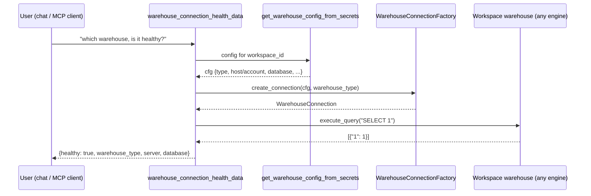

# SPEC: Warehouse connection health

> Scope: one new read-only verb on the **existing** `WarehouseConnectionFactory`. No new
> Port, no new adapter, no vendor branch in the domain path. It answers the first thing a
> customer asks in a live session — *"which warehouse are you connected to, and is the
> connection healthy?"* — a question no current tool answers (`get_database_size` /
> `introspect_warehouse_schema` prove connectivity and name the engine *type*, but never
> the connected **server host + database**, and there is no `SELECT 1` liveness verb
> anywhere in the codebase).

## 1. Context

The Loop Capital demo runbook (`clients/trials/loopcapital/demo.md`, step 1) opens with:
*"Which SQL Server are you connected to, and can you confirm the connection is healthy?"*
GTM runs this against a **lab or customer SQL Server** — it is the first 30 seconds of every
demo, and the same connect path Loop Capital trial criterion 1 (BH-1246) later verifies against
their real Azure VM. Today the agent has no clean answer: it can call `get_database_size`
(returns MB + `warehouse_type`) or `introspect_warehouse_schema` (returns tables), and *infer*
health from success — but neither names the connected server host + database, and neither is a
purpose-built liveness probe. The model is left to compose SQL or narrate an inference, which is
exactly the unreliable path `database_size_tool.py` was built to remove for size.

This spec adds one deterministic verb — `warehouse_connection_health` — reusing the existing
connection factory. It opens the workspace warehouse connection, runs a trivial `SELECT 1`
liveness probe, and returns a structured identity + health verdict. Engine-agnostic by
construction: the same code path serves SQL Server (Loop Capital, now), Snowflake (the 2-week
trial), Redshift, and Postgres, with each engine's identity fields read from its own config
shape. No `warehouse_type` branch lives in the verb — only in the identity-field extraction,
which is a per-adapter concern that already exists.



## 2. Interface Contract (MDE)

**No new Port.** Reuses `get_warehouse_config_from_secrets` (`brightbot/tools/platform_queries.py:460`),
`WarehouseConnectionFactory` (`brightbot/tools/warehouse_connections.py:655`), and each adapter's
existing `execute_query` / `close_connection`. Mirrors `database_size_data`
(`brightbot/agents/dbt_agent/tools/database_size_tool.py:84`) — the proven deterministic-read shape.

### 2.1 Data layer (new)

```python
# brightbot/agents/dbt_agent/tools/connection_health_tool.py

def warehouse_connection_health_data(*, workspace_id: str) -> dict[str, Any]:
    """Probe the workspace warehouse connection; return identity + a health verdict.

    Deterministic, read-only: opens the connection via the factory, runs SELECT 1,
    reports which engine + server + database it reached. Raises ValueError if no
    warehouse is configured. A failed connection/probe is NOT raised — it is
    returned as healthy=False with the reason, so 'the warehouse is down' is a
    first-class answer, not an exception the surface has to interpret.
    """
```

Returned dict:

```
{
  "healthy": bool,                 # did SELECT 1 return a row?
  "warehouse_type": str,           # "azure_synapse" | "snowflake" | "redshift" | "postgres" | ...
  "server": str | None,            # host (SQL Server/Redshift/Postgres) OR account (Snowflake)
  "database": str | None,          # connected database/catalog
  "detail": str | None,            # human reason when healthy=False (probe error, unreachable)
}
```

**Identity-field extraction** is the ONLY per-engine seam, and it reads config that already
exists — no live branch in the probe itself:

| warehouse_type | `server` from cfg key | `database` from cfg key |
|---|---|---|
| `azure_synapse` (SQL Server family) | `host` | `database` |
| `redshift` | `host` | `database` |
| `postgres` | `host` | `database` |
| `snowflake` | `account` | `database` |
| `databricks` | `host` | `catalog` |

Secrets are never echoed — `user`/`password`/`token` are read to connect but NEVER returned.

### 2.2 Agent tool (new) — chat plane

```python
# same module, LangGraph @tool
@tool
def warehouse_connection_health(runtime: ToolRuntime) -> Command:
    """Report which warehouse this workspace is connected to and whether it's live."""
```

Registered in `brightbot/agents/dbt_agent/tools/__init__.py` alongside `get_database_size`, and
reachable from the deep-agent path exactly as `get_database_size` is.

### 2.3 MCP tool (new) — MCP plane

```python
# brightbot/mcp/tools/connection_health.py — mirrors database_size.py exactly
class ConnectionHealthResponse(BaseModel):
    status: Literal["ok", "error"]
    workspace_id: str | None = None
    healthy: bool | None = None
    warehouse_type: str | None = None
    server: str | None = None
    database: str | None = None
    detail: str | None = None
    error: str | None = None

async def get_warehouse_connection_health_impl() -> ConnectionHealthResponse: ...

def register(mcp) -> None:
    @mcp.tool()
    async def get_warehouse_connection_health() -> ConnectionHealthResponse: ...
```

Added to `_CORE_TOOL_MODULES` (`brightbot/mcp/server.py:53`); `workspace_id` comes from the
validated MCP principal, never a caller argument.

## 3. Invariants (DbC)

- **INV-1** The verb runs exactly one probe query, `SELECT 1` (or the engine's trivial
  equivalent), and NEVER a caller-supplied string. It is structurally read-only.
- **INV-2** `warehouse_type` in the response comes from `warehouse_type_from_secret(cfg["type"])`
  — the single source of truth — never a literal in this module.
- **INV-3** No secret material (`password`, `token`, `user`) appears in the returned dict or in
  any log line the verb emits.
- **INV-4** A connection or probe failure returns `healthy=False` with a `detail` reason — it is
  NOT raised as an exception. Only a *missing warehouse config* raises (`ValueError`), matching
  `database_size_data`.
- **INV-5** The verb contains no `if warehouse_type == ...` branch except the identity-field
  extraction table (§2.1), and that table's keys are the shared `warehouse_types` constants.
  WHERE a new engine is added to `CONNECTION_CLASSES`, THE System SHALL require only a new row in
  the identity-field table — never a change to the probe logic.
- **INV-6** MCP `workspace_id` is sourced from the principal; the impl signature accepts no
  `workspace_id` / `token` / `user_id` argument.

## 4. Acceptance Criteria (BDD — Gherkin)

```gherkin
Feature: Warehouse connection health — identity + liveness on any engine

  Scenario: SQL Server connection is healthy (Loop Capital demo, step 1)
    Given a workspace configured with an azure_synapse (SQL Server) warehouse
    When warehouse_connection_health runs
    Then it returns healthy=true, warehouse_type="azure_synapse"
    And server is the configured host and database is the configured database
    And no password or user appears in the response

  Scenario: Snowflake connection is healthy (2-week trial engine)
    Given a workspace configured with a snowflake warehouse
    When warehouse_connection_health runs
    Then it returns healthy=true, warehouse_type="snowflake"
    And server is the configured account and database is the configured database

  Scenario: Warehouse unreachable is answered, not thrown
    Given a workspace whose warehouse rejects the connection
    When warehouse_connection_health runs
    Then it returns healthy=false with a plain-language detail
    And it does not raise

  Scenario: No warehouse configured
    Given a workspace with no warehouse secret
    When warehouse_connection_health runs
    Then the surface reports status="error" / error="no_warehouse" (MCP)
    Or the tool returns a clear "no warehouse configured" message (chat)

  Scenario: MCP scope + principal binding
    Given an MCP principal with no workspace_id
    When get_warehouse_connection_health is called
    Then it returns status="error", error="no_workspace"
    And the impl never accepted workspace_id as an argument
```

## 5. Out of Scope

- Surfacing the connected server host on the *webapp* — this spec covers chat + MCP verbs only
  (demo step 1 is driven in chat). A webapp badge is a later, separate concern.
- Connecting to Loop Capital's **real** Azure VM — gated by `SECURITY_REVIEW_GATE.md` and the 5
  blocking access items (`loopcapital-trial-readiness.md` §6). This verb is proven against a
  lab/sandbox SQL Server + a Snowflake sandbox; the real-server run is BH-1246.
- A `list_databases` verb — the demo lists tables per database via existing `introspect_warehouse_schema`.
- Any write, provisioning, or config-mutation capability.

## 6. Dependencies

| Dependency | Type | Status |
|---|---|---|
| `WarehouseConnectionFactory` + adapters (Synapse/Snowflake/Redshift/Postgres) | Reuse | Exists (`warehouse_connections.py`) |
| `get_warehouse_config_from_secrets` | Reuse | Exists (`platform_queries.py:460`) |
| `warehouse_type_from_secret` + `warehouse_types` constants | Reuse | Exists (`utils/warehouse.py`, `utils/warehouse_types.py`) |
| A lab SQL Server + a Snowflake sandbox to run the real-behavior test against | Test env | Sandbox EC2 + staging Snowflake exist |

## 7. Correctness Properties

### Property 1: Engine-agnostic probe

*For any* `warehouse_type` present in `CONNECTION_CLASSES`, `warehouse_connection_health_data`
opens the connection and runs the identical `SELECT 1` probe — the only per-engine variation is
which config key names the `server`. Adding an engine adds one identity-field row, not a code path.

**Validates: §3 INV-1, INV-5, §4 Scenario "SQL Server ... healthy", "Snowflake ... healthy"**

### Property 2: Failure is data, not an exception

*For any* connection that cannot be opened or whose probe fails, the verb returns
`healthy=False` with a `detail`, never propagating the driver exception to the caller — so
"the warehouse is down" is an answerable state on every surface.

**Validates: §3 INV-4, §4 Scenario "Warehouse unreachable is answered, not thrown"**

### Property 3: No secret leakage

*For any* workspace config, the returned dict and every log line contain no `password`,
`token`, or `user` value.

**Validates: §3 INV-3**

## 9. Observability Contract

- **Log events**: `connection_health.probe_start`, `connection_health.healthy`,
  `connection_health.unhealthy` (with sanitized reason — no secrets), `connection_health.no_warehouse`.
- **Attributes**: `workspace.id`, `warehouse.type`. NEVER `server` host as a logged attribute if
  it is a customer hostname beyond what audit already captures; `warehouse.type` is sufficient.
- **Metrics**: none new.

## 10. Test Coverage Update

Extends the existing brightbot suites — no greenfield sibling files.

| Repo | Suite | What to add |
|---|---|---|
| `brightbot` | `tests/unit/dbt_agent/tools/test_connection_health_tool.py` (extend the dbt-agent tools test dir) | **L0/L2**: identity-field extraction per engine (§2.1 table) from real captured cfg shapes; `healthy=False` on a connection that raises; `ValueError` on missing config; INV-3 no-secret-leak assertion on the returned dict. |
| `brightbot` | `tests/unit/mcp_server/test_connection_health_mcp.py` (sibling of `test_fleet_health_mcp.py`) | **L0/L1**: principal binding (no_workspace error), impl rejects `workspace_id` kwarg (INV-6), scope guard, healthy pass-through, registered in `_CORE_TOOL_MODULES`. |
| `brightbot` | `brightbot/brightbot/evals/` (real-behavior, per `test-behavior-real.md`) | **L2 real-behavior (≥1, mandatory)**: run `warehouse_connection_health_data` against a **real** lab SQL Server (`azure_synapse`) connection AND a **real** Snowflake sandbox — assert `healthy=True` and the right `warehouse_type`/`server`/`database` come back from the actual driver, not a mock. This is the test that proves demo step 1 works on both demo engines. |

**Real-behavior forcing question**: if the pymssql / snowflake driver behaved differently
tomorrow, the eval-suite L2 case fails — satisfying `test-behavior-real.md`.

## Areas Involved

| Area | Repo | Impact |
|---|---|---|
| Warehouse read verb | `brightbot` | New `connection_health_tool.py` (data + chat tool); new `mcp/tools/connection_health.py`; one line in `dbt_agent/tools/__init__.py` and one in `mcp/server.py:_CORE_TOOL_MODULES`. |
| Demo runbook | `agentic-project-mgmt` | `demo.md` step 1 success criterion references the new verb's structured answer. |

## Ticket Breakdown

`issueType: "Task"` under epic `BH-1245` — never `"Story"`.

| Ticket | Summary | Epic |
|---|---|---|
| BH-1341 | feat(warehouse): connection-health read verb (identity + liveness) on chat + MCP, engine-agnostic | BH-1245 |

## Related

- **Epic**: `BH-1245` — Loop Capital Trial Execution
- **Verifies later against real server**: `BH-1246` (criterion 1), gated by `SECURITY_REVIEW_GATE.md`
- **Demo runbook**: `clients/trials/loopcapital/demo.md` step 1
- **Pattern reused**: `database_size_tool.py` / `mcp/tools/database_size.py` (BH-1120)
