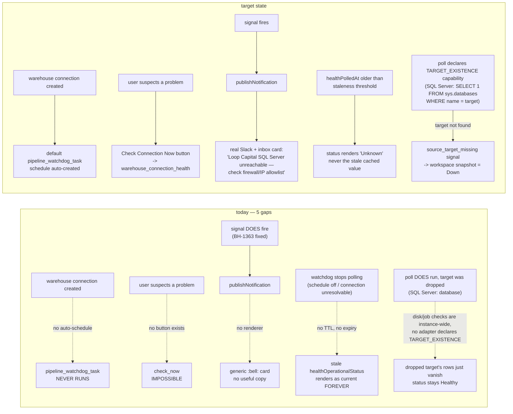
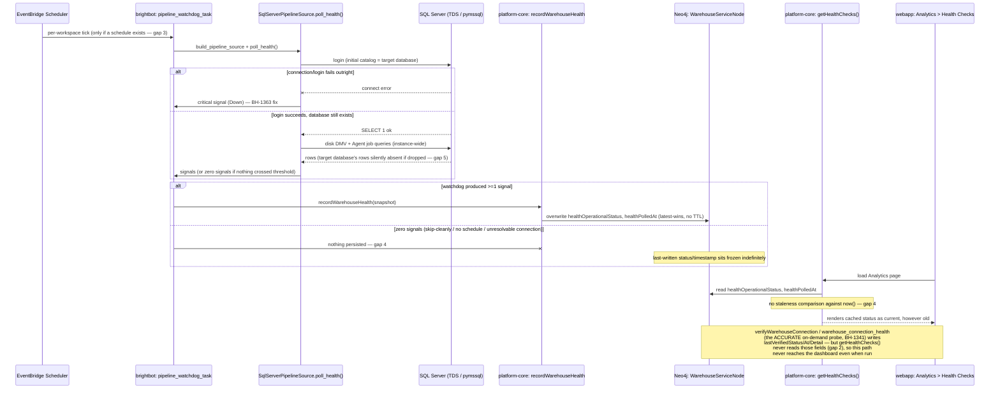

# Warehouse Connectivity — default monitoring, real alerts, on-demand check, staleness, and target existence

> Full contract: `~/.claude/rules/spec-driven.md`. Direct follow-on to BH-1363
> (`drchinca/BH-1363/watchdog-connection-failure-health-status`, unmerged) —
> that fix makes a hard connection failure correctly produce a "Down"
> workspace-health snapshot instead of a stale "Healthy" one, verified live
> against real staging Neo4j. This spec covers five gaps found while
> auditing what surrounds that fix: the snapshot can flip to "Down" and still
> (a) nobody gets told anything useful, (b) nobody can check right now instead
> of waiting for the next scheduled tick, (c) most warehouses have no
> scheduled tick to begin with, (d) a cached "Healthy" never expires even
> when no poll has run in weeks, and (e) a poll that does run never confirms
> the *named target* — a database, schema, or catalog, depending on the
> engine — still exists, only that the server instance responds. Gap (e) is
> engine-agnostic by construction: the `PipelineSource` port already
> registers Snowflake, Databricks, and SQL Server adapters side by side
> (`brightbot/agents/governance_agent/tools/pipeline_health.py:111-126`), so
> this spec adds a new capability to that port rather than a SQL-Server-only
> check — SQL Server is the *first adapter*, not the design (same posture
> `sqlserver-health-watch.md` already takes for disk/job signals).
> Gaps (d) and (e) are confirmed live, and simultaneously, on Impact Capital's
> "SQLTest2019" connection (BH-1457, 2026-08-18): the on-demand
> `get_warehouse_connection_health` probe this spec's §2c already wires up
> returned `healthy:false` (DNS/connect timeout to the Azure host), while the
> Analytics dashboard still rendered "Healthy" at a stale 2026-08-05
> timestamp. Related: BH-1368 (the Data Estate badge doesn't name which
> service caused a "Degraded" rollup, and separately maps the neutral
> `UNKNOWN` transformation state to "Degraded" — this spec reuses "Unknown"
> as the correct label for a stale reading, so the vocabulary should land
> consistently across both).

## 1. Context

`warehouse-health-snapshot.md` (BH-1255, shipped) built the mechanism that
turns a watchdog signal into a workspace-level `Down`/`Degraded`/`Healthy`
snapshot. BH-1363 (unmerged) is the first bug fix riding on top of it — it
makes a genuine network/firewall failure actually produce that signal instead
of silently producing nothing. Both are real and both were just verified.

But auditing the full path from "connection breaks" to "someone who can fix
it finds out, or checks it themselves" found three gaps neither of those specs
covers — confirmed by direct code read, not inferred:

1. **No real alert copy.** When `source_connection_unreachable` (or any of the
   BH-1110-era stages before it) publishes, it reaches Slack and the in-app
   inbox, but both fall through to a generic `:bell:` card — `source_
   connection_unreachable` is absent from `NotificationStage` (`brightbot-
   slack-server/src/notifications/types.ts:2-69`), `classify.ts`'s switch
   (`:157-190`, falls to `classifyGeneric`), `formatter.ts`'s detail-render
   switch (`:144-190`, falls to `default: return []`), `signal-catalog.json`,
   and the webapp inbox's `sources[]` registry (`brighthive-platform-core/
   src/graphql/models/notifications.ts:414-427`, falls to
   `formatGenericDisplay`). Exactly the BH-1110 gap pattern (SSIS/Snowflake/
   Databricks stages had the identical hole before that ticket closed it),
   now repeating for the new stage.
2. **No on-demand check.** `connection_health_tool.py`'s `warehouse_
   connection_health` MCP tool (BH-1341, already built, already working — the
   same tool this session used indirectly to verify BH-1363) has zero UI
   callers anywhere in `brighthive-webapp`. The one "Test Connection" button
   that exists, `AddTransformation.tsx:527-552`, is a literal placeholder —
   its `onClick` shows `toast.info("Test connection will be available after
   backend integration.")` (`:537`) and calls nothing. There is no way for a
   user to check right now; every health signal comes only from the scheduled
   watchdog tick.
3. **No default monitoring.** The `pipeline_watchdog_task` schedule is
   opt-in-only, created by a direct `POST /manage/scheduled-agents` call
   (`brightbot/routes/scheduled_action_catalog.py:26`). No code path anywhere
   — checked workspace-creation, warehouse-creation, and the scheduled-agents
   routes — auto-creates this schedule when a warehouse connection is first
   configured. Worse: `pipeline_watchdog_task` isn't even **selectable** in
   the webapp's own schedule UI — `AddScheduleDialog.tsx`'s `TASKS` array
   (`:56-80`) lists only `quality_check_task`, `profiler_task`,
   `execute_workflow`. This is almost certainly *why* Loop Capital's SQLTest
   connection had no watchdog catching its outage in the first place — the
   monitoring this whole chain depends on was never turned on for that
   workspace, because there was no way to turn it on from the product.
4. **No staleness detection.** `getHealthChecks()` computes `lastChecked` as
   `wh.healthPolledAt || wh.modifiedAt || now` (`brighthive-platform-core/src/
   graphql/resolvers/analytics-resolver.ts:123`) but never compares it to the
   current time — it is display-only text, never a gate on the rendered
   status. `recordWarehouseHealth` writes `healthOperationalStatus`/
   `healthPolledAt` as a pure latest-wins overwrite with no history and no
   expiry (`warehouse-service.ts:181-216`). If the watchdog's schedule stops
   firing, or the connection can no longer be resolved in the workspace's
   secret store, `SqlServerPipelineSource.poll_health()` "skips cleanly" with
   zero signals (`sql_server_pipeline_source.py:281-291`), and
   `_persist_warehouse_health` explicitly no-ops when there are no snapshots
   to persist (`pipeline_watchdog_task.py:607-608`). Nothing ever overwrites
   the frozen last-good value — a "Healthy" from weeks ago renders exactly
   like a "Healthy" from one second ago.
5. **No target-existence check, on any adapter.** The `PipelineSource`
   Protocol already negotiates capabilities
   (`pipeline_health.py:86-95`, `Capability = Literal["JOB_STATUS",
   "DISK_METRICS"]` at `:29`) and already has three registered adapters
   beyond SQL Server — `SnowflakePipelineSource`, `DatabricksPipelineSource`,
   `CustomSqlPipelineSource` (`pipeline_health.py:111-126`) — but none
   declares a capability for "does the configured target still exist."
   Concretely, for the one adapter this spec audits in depth,
   `SqlServerPipelineSource`: a poll that *does* run only proves the SQL
   Server instance responds — `_check_disk`/`_check_jobs`
   (`sql_server_pipeline_source.py:126-180`) query instance-wide DMVs
   (`sys.master_files`, `sys.dm_os_volume_stats`) and job tables
   (`msdb.dbo.sysjobs`), never the configured database's existence. A dropped
   database's rows simply disappear from those result sets — no failure, no
   downgrade. Only a full login failure (the `SELECT 1` liveness probe, and
   only when the watchdog is actively polling that connection at all) would
   catch it. `listWarehouseDatabases()`'s catalog query
   (`warehouse-databases.ts:35-41`, used by `verifyWarehouseConnection`) is
   similarly instance-wide, and — per gap 2 above — has no UI caller and is
   never read by `getHealthChecks()` regardless. Whether `Snowflake`/
   `Databricks`/`CustomSql` already cover their own equivalent of "target
   still exists" is unaudited — not assumed either way; see §5 Out of Scope.



The flowchart above shows the gaps; the sequence below shows the actual
end-to-end mechanics of the monitoring agent itself — who calls whom, over
what transport, and exactly where each gap sits in that chain:



### Use Case / Goal

A workspace admin connects a warehouse and, without configuring anything
extra, that connection is being watched. If it goes down, they (and everyone
in the workspace) get a real, specific alert — not a generic bell — in both
Slack and the in-app inbox. If they suspect a problem right now, they click
one button and get an immediate answer instead of waiting for the next
scheduled tick.

### Hard Limitations

- The watchdog's per-workspace schedule granularity is per-workspace, not
  per-connection (confirmed: `POST /manage/scheduled-agents` payload only
  requires `workspace_id`, `scheduled_action_catalog.py:47-48`) — a workspace
  with 2 warehouses gets one schedule covering both via `_poll_all_adapters`'s
  loop over `PIPELINE_SOURCE_ADAPTERS`, not two independent schedules. This
  spec does not change that granularity.
- `connection_health_tool.py`'s probe is a single trivial `SELECT 1` — it
  proves reachability, not the richer disk/job signals the scheduled watchdog
  produces. The on-demand button in this spec surfaces reachability only; a
  "run the full watchdog poll now" capability is a different, larger tool and
  is out of scope.

### Gaps

- No `NotificationStage`/`classify.ts`/`formatter.ts`/`signal-catalog.json`
  entries in `brightbot-slack-server` for `source_connection_unreachable`.
- No `sources[]` entry in platform-core's `notifications.ts` for the same
  stage — inbox card is generic.
- No GraphQL mutation or webapp UI wired to `warehouse_connection_health`.
- No auto-schedule-creation on warehouse connection create.
- No `pipeline_watchdog_task` entry in `AddScheduleDialog.tsx`'s `TASKS`.

## 2. Interface Contract (MDE)

### 2a. Slack renderer — new stage, following the BH-1110 pattern exactly

```typescript
// brightbot-slack-server/src/notifications/types.ts — NotificationStage union + NOTIFICATION_STAGES array
| 'source_connection_unreachable'

// classify.ts — severity/tier/emoji/headline (mirrors ssis_package_unreachable's tier)
case "source_connection_unreachable":
  return { severity: "critical", tier: "critical", emoji: ":x:", headline: "Warehouse connection unreachable" };

// formatter.ts — detail render (mirrors renderSsisSharedShapeDetails' metadata-driven pattern)
case "source_connection_unreachable": return renderConnectionUnreachableDetails(event);

function renderConnectionUnreachableDetails(event: NotificationEvent): string[] {
  const meta = event.metadata;
  const connectionKey = metaStringEscaped(meta, "connection_key");
  return [
    connectionKey
      ? `*Connection:* \`${connectionKey}\` — could not connect. Check network reachability (firewall/IP allowlist), credentials, and that the server is running.`
      : "Could not connect to this warehouse. Check network reachability (firewall/IP allowlist), credentials, and that the server is running.",
  ];
}
```

```json
// signal-catalog.json — new entry
{
  "stage": "source_connection_unreachable",
  "label": "Warehouse connection unreachable",
  "category": "pipeline",
  "hasLiveProducer": true,
  "severityRule": { "kind": "static", "severity": "critical" }
}
```

### 2b. Webapp inbox renderer — new `sources[]` entry

```typescript
// brighthive-platform-core/src/graphql/models/notifications.ts — mirrors formatSourceDiskLowDisplay
function formatConnectionUnreachableDisplay(signal: RawSignal): NotificationDisplay {
  const m = signal.metadata ?? {};
  const connectionKey = (m.connection_key as string) ?? "warehouse connection";
  return {
    type: "source_connection_unreachable",
    title: `Warehouse connection unreachable — ${connectionKey}`,
    subtitle: "Check firewall/IP allowlist and credentials",
    url: null,
    assetName: connectionKey,
  };
}
// registered in sources[] alongside source_disk_low, etl_job_failure, etc.
```

### 2c. On-demand check — new mutation wrapping the existing MCP tool

```graphql
# brightbot MCP surface already has warehouse_connection_health (BH-1341).
# NEW: a thin GraphQL passthrough so webapp can call it without an MCP client,
# mirroring how other brightbot capabilities are exposed to webapp today.
mutation checkWarehouseConnectionNow(warehouseServiceId: ID!): WarehouseConnectionCheckResult!
  Response 200: { healthy: Boolean!, warehouseType: String, server: String, database: String, detail: String, checkedAt: String! }
  Response 4xx: { error: "warehouse_not_found" | "forbidden_not_workspace_member" }
```

```tsx
// brighthive-webapp — new "Check Connection Now" button, one per warehouse row
// in Settings > Warehouses (mirrors MCPConnectivityCard.tsx's live-check pattern:
// loading spinner while in flight, CheckCircleOutlineIcon/ErrorOutlineIcon on result)
<CheckConnectionButton warehouseServiceId={wh.id} />
```

### 2d. Default scheduling — auto-create on warehouse connection creation

```typescript
// brighthive-platform-core — createWarehouseService / upsertWarehouseConfig
// resolver (src/graphql/models/warehouse-service.ts), on FIRST successful
// connection creation for a workspace: call brightbot's
// POST /manage/scheduled-agents with action_type="pipeline_watchdog_task"
// and a sensible default cadence (e.g. every 15 minutes), service-key authed,
// same pattern as other brightbot->platform-core / platform-core->brightbot
# machine calls in this codebase.
```

```tsx
// brighthive-webapp/src/Schedules/components/AddScheduleDialog.tsx — TASKS array
{
  value: "pipeline_watchdog_task",
  label: "Warehouse Connectivity Watchdog",
  requiresAssets: false,
  requiresProject: false,
}
```

### 2e. Staleness — a cached status must expire

```graphql
# getHealthChecks response — NEW field, additive
type ServiceHealthCheck {
  id: ID!
  service: String!
  type: String!
  status: String!       # now includes "Unknown" as a valid value
  provider: String
  lastChecked: String!
  isStale: Boolean!      # NEW
}
```

```typescript
// analytics-resolver.ts getHealthChecks() — NEW staleness gate. Applied to
// every row backed by an actual poll timestamp (today: warehouse rows via
// healthPolledAt). Rows with no polling mechanism at all (Transformation's
// hardcoded status, the hardcoded "Platform Core API" row) are unaffected —
// that gap is separate, see §5 Out of Scope. Default threshold: 3x the
// default watchdog cadence set in §2d (15 min -> 45 min); a per-workspace
// override UI is a follow-on, not required here.
const STALENESS_THRESHOLD_MINUTES = 45;

function withStaleness(row: ServiceHealthCheck): ServiceHealthCheck {
  const ageMinutes = minutesSince(row.lastChecked);
  const isStale = ageMinutes > STALENESS_THRESHOLD_MINUTES;
  return { ...row, isStale, status: isStale ? "Unknown" : row.status };
}
```

### 2f. Target existence — a new port capability, engine-agnostic by construction

The `PipelineSource` port already negotiates capabilities
(`pipeline_health.py:86-95`; `Capability = Literal["JOB_STATUS",
"DISK_METRICS"]` at `:29`). This spec adds a third capability,
`"TARGET_EXISTENCE"`, and implements it for **one adapter only** —
`SqlServerPipelineSource` — the same "first adapter, not the design" posture
`sqlserver-health-watch.md` already takes. `SnowflakePipelineSource`,
`DatabricksPipelineSource`, and `CustomSqlPipelineSource` do not implement
this capability in this spec; whether they need to, and what their own
"target" means (a Snowflake database/schema, a Databricks catalog, a generic
SQL connection's database), is a per-adapter follow-on, not invented here.
No adapter exists yet for Redshift, BigQuery, or Oracle — adding one is a
separate, larger change (new adapter + registry entry, per
`~/.claude/rules/pluggable-scalable.md`), not required by this spec.

```python
# pipeline_health.py:29 — add the new capability, engine-neutral
Capability = Literal["JOB_STATUS", "DISK_METRICS", "TARGET_EXISTENCE"]
```

```sql
-- sql_server_pipeline_source.py — NEW query, run every poll alongside
-- _DISK_CHECK_SQL / _JOB_STATUS_SQL, scoped via a bound parameter, never
-- string-interpolated. "Target" resolves to "database" for this adapter —
-- other adapters implementing TARGET_EXISTENCE define their own query.
SELECT 1 FROM sys.databases WHERE name = %(database)s AND state = 0
```

```python
# sql_server_pipeline_source.py — NEW failure_type, using the REAL
# PipelineHealthSignal shape (pipeline_health.py:60-79): connection_key and
# a human-readable message live in metadata/diagnosis, not invented
# top-level fields, and source_type stays "etl" — the same category this
# adapter's existing disk/job signals already use.
if not target_exists:
    yield PipelineHealthSignal(
        workspace_id=ctx.workspace_id,
        source_type="etl",
        job_id=connection_key,
        failure_type="source_target_missing",
        severity="critical",
        root_cause_class=RootCauseClass.JOB_RUNTIME,
        detected_at=now,
        diagnosis=f"Database '{database_name}' no longer exists on this server",
        metadata={
            "connection_key": connection_key,
            "target_kind": "database",
            "target_name": database_name,
        },
    )
```

## 3. Invariants (DbC)

1. WHEN a workspace's first warehouse connection is successfully created,
   THE System SHALL create a default `pipeline_watchdog_task` schedule for
   that workspace if one does not already exist — never duplicate an
   existing schedule.
2. THE System SHALL NOT auto-create a second `pipeline_watchdog_task`
   schedule for a workspace that already has one (idempotent on
   workspace_id, mirrors the existing per-workspace, not per-connection,
   granularity in §1 Hard Limitations).
3. WHEN `checkWarehouseConnectionNow` runs, THE System SHALL NOT block on or
   interfere with the scheduled watchdog's own poll cycle — the on-demand
   check and the scheduled poll are independent, concurrent-safe callers of
   the same underlying connection-open logic.
4. THE System SHALL require the caller to be an authenticated member of the
   warehouse's workspace for `checkWarehouseConnectionNow` — never a
   service-key-only call (this is a user-triggered action, unlike
   `recordWarehouseHealth`).
5. WHEN `source_connection_unreachable` (or any currently-generic-rendered
   stage) publishes, THE System SHALL render a stage-specific Slack card and
   a stage-specific inbox card — a generic `:bell:`/`formatGenericDisplay`
   render for an already-registered stage is a regression, not acceptable
   degraded behavior.
6. THE on-demand check SHALL NOT write to `WarehouseServiceNode.
   healthOperationalStatus` — it is a read-only, user-facing probe, distinct
   from the scheduled watchdog's workspace-level snapshot (Invariant 3
   applies: the two paths stay independent, so a user's manual check never
   masks or overwrites the workspace-level truth other teammates see).
7. WHEN a service row's `lastChecked` age exceeds the staleness threshold,
   THE System SHALL render that row's `status` as `"Unknown"` — NEVER echo
   the last cached operational value as if it were current.
8. THE staleness check SHALL apply to every `getHealthChecks()` row that is
   backed by an actual poll timestamp (today: warehouse rows via
   `healthPolledAt`) — it SHALL NOT be invented for rows with no polling
   mechanism at all (Transformation's hardcoded connection-state derivation,
   the hardcoded-always-Healthy "Platform Core API" row), which remain the
   separate, unaddressed gap named in §5.
9. WHEN the `SqlServerPipelineSource` adapter's poll detects that its
   configured database no longer exists on an otherwise-reachable server,
   THE System SHALL emit a critical `source_target_missing` signal distinct
   from `source_connection_unreachable` — a dropped target and an
   unreachable server are different failures with different remediation, and
   must not collapse into one generic signal. Any future adapter that
   declares the `TARGET_EXISTENCE` capability (§2f) SHALL follow the
   identical contract for its own notion of "target."

## 4. Acceptance Criteria (BDD — Gherkin)

```gherkin
Feature: Default warehouse connectivity monitoring

  Scenario: First warehouse connection gets a default schedule
    Given a workspace with no warehouse connections and no watchdog schedule
    When the first warehouse connection is successfully created
    Then a pipeline_watchdog_task schedule exists for that workspace

  Scenario: Second warehouse connection does not duplicate the schedule
    Given a workspace with one warehouse connection and an existing watchdog schedule
    When a second warehouse connection is created
    Then exactly one pipeline_watchdog_task schedule still exists for that workspace

Feature: On-demand connection check

  Scenario: User checks a healthy connection right now
    Given a warehouse connection that is currently reachable
    When the user clicks "Check Connection Now"
    Then the button shows healthy=true within a few seconds
    And no workspace-level health snapshot is modified

  Scenario: User checks an unreachable connection right now
    Given a warehouse connection that is currently unreachable
    When the user clicks "Check Connection Now"
    Then the button shows healthy=false with a diagnosis
    And no workspace-level health snapshot is modified

Feature: Real alert copy for connection-unreachable

  Scenario: Slack card is stage-specific, not generic
    Given a source_connection_unreachable signal publishes
    When the Slack notification renders
    Then the card headline is "Warehouse connection unreachable"
    And the detail line names the connection, not a generic bell message

  Scenario: In-app inbox card is stage-specific, not generic
    Given a source_connection_unreachable signal publishes
    When the NotificationInbox resolves the signal
    Then the display title names the specific warehouse connection
    And the display does not fall through to formatGenericDisplay

Feature: Stale health status never renders as a cached truth

  Scenario: No poll has run past the staleness threshold
    Given a warehouse's healthPolledAt is older than the staleness threshold
    When the Analytics page requests health checks
    Then the service renders as "Unknown"
    And the service does not render as its last cached status

  Scenario: A fresh poll clears staleness
    Given a warehouse was rendering "Unknown" due to staleness
    When the watchdog successfully polls that connection again
    Then the service renders the new poll's real status, not "Unknown"

Feature: A dropped target is detected, not silently ignored

  Scenario: Target database no longer exists on an otherwise-reachable SQL Server
    Given a SQL Server instance is reachable but the configured database has been dropped
    When the watchdog polls that connection
    Then a source_target_missing signal is emitted with critical severity
    And the workspace health snapshot downgrades to "Down"

  Scenario: Target database exists and is healthy
    Given a SQL Server instance is reachable and the configured database exists
    When the watchdog polls that connection
    Then no source_target_missing signal is emitted
```

## 5. Out of Scope

- **dbt/Transformation health staleness** and the hardcoded-always-`Healthy`
  "Platform Core API" row (`analytics-resolver.ts:198-205`) — confirmed via
  direct audit to be a different, unaddressed mechanism entirely
  (`TransformationServiceNode.status` has no poll/snapshot path at all, unlike
  the warehouse fold this spec and BH-1363 build on). Tracked separately, not
  bundled here to keep this spec's blast radius to warehouse connectivity.
- **Per-connection schedule granularity** — the default schedule this spec
  creates is per-workspace, matching the watchdog's existing loop-over-every-
  adapter design (§1 Hard Limitations). Splitting to per-connection schedules
  is a separate, larger change.
- **Running the full disk/job watchdog poll on demand** — the on-demand
  button in §2c is a reachability probe only (`SELECT 1`), not a trigger for
  the richer scheduled poll.
- **Configurable default cadence per workspace** — the auto-created schedule
  uses one sensible default interval; a UI to tune that interval per
  workspace is a follow-on, not required for this spec's Gherkin scenarios.
- **Renderer coverage for other still-generic stages** beyond `source_
  connection_unreachable` — this spec closes the gap for the one stage BH-1363
  introduces; a full audit/fix of every other under-rendered stage is
  tracked as its own cleanup, not bundled here.
- **Per-workspace-configurable staleness threshold.** This spec fixes one
  default (45 minutes, §2e) uniformly; a UI to tune it per workspace is a
  follow-on, matching the same simplification already made for schedule
  cadence in §5 above.
- **`TARGET_EXISTENCE` capability for other adapters.** This spec implements
  the capability for `SqlServerPipelineSource` only. `SnowflakePipelineSource`
  and `DatabricksPipelineSource` already exist in the registry
  (`pipeline_health.py:111-126`) but this spec does not audit or extend them
  — whether they already cover their own notion of "target still exists" is
  unknown, not assumed absent. `CustomSqlPipelineSource` also exists and may
  already cover part of this for generic SQL targets. No adapter exists yet
  for Redshift, BigQuery, or Oracle; adding one is a separate, larger change
  (new adapter + registry entry) and out of scope here.

## 6. Dependencies

| Dependency | Type | Status |
|------------|------|--------|
| BH-1363 (watchdog connection-failure fix) | Blocking | Unmerged, verified locally — `source_connection_unreachable` must exist as a real signal before its renderer/schedule work makes sense |
| `warehouse-health-snapshot.md` mechanism (BH-1255) | Blocking | Shipped |
| `connection_health_tool.py` / `warehouse_connection_health` MCP tool (BH-1341) | Blocking | Shipped, already verified working — this spec only adds a GraphQL passthrough + UI, no new probe logic |
| `POST /manage/scheduled-agents` scheduling API | Blocking | Shipped — this spec adds an auto-caller, not new scheduling infra |
| BH-1110 Slack/inbox renderer pattern (precedent) | Non-blocking | Shipped — this spec's §2a/§2b are additive entries following that exact pattern |
| BH-1457 (Impact Capital SQLTest2019 incident) | Non-blocking | Live, 2026-08-18 confirmation that gaps 2 and 4 co-occur in production — not a code dependency, but the evidence this spec's §2e is scoped against |
| BH-1368 (Data Estate badge — service attribution + UNKNOWN mislabel) | Non-blocking | Shares this spec's `"Unknown"` status vocabulary (§2e) — should land using consistent wording, not a separate label for the same concept |
| `pipeline-connectivity-watchdog.md` (BH-1255/BH-1457) | Sequencing | Makes `SqlServerPipelineSource.poll_health()` "go implicit" (probes injected `self._config`, stops self-resolving via `_get_warehouse_connection_key`). This spec's §2f target-existence query lands *inside that same method* — implement §2f against the post-refactor implicit-adapter shape, not the current self-resolving one, or it needs rework. Also fixes the root cause of *why* BH-1457's on-demand tool probed the wrong warehouse (no `is_default` honoring, one-connection-per-workspace fan-out) — a different bug from this spec's staleness/target-existence gaps, not a duplicate of them |

## 7. Correctness Properties

### Property 1: Default schedule is idempotent per workspace

*For any* workspace, at most one `pipeline_watchdog_task` schedule exists
regardless of how many warehouse connections are created over time.

**Validates: §3 Invariants 1-2, §4 Scenarios "First warehouse connection gets a default schedule", "Second warehouse connection does not duplicate the schedule"**

### Property 2: On-demand check never mutates workspace-level truth

*For any* call to `checkWarehouseConnectionNow`, `WarehouseServiceNode.
healthOperationalStatus`/`healthPolledAt`/`healthDiskFreePct`/
`healthFailedJobCount` are unchanged before and after the call.

**Validates: §3 Invariants 3, 6, §4 Scenarios "User checks a healthy/unreachable connection right now"**

### Property 3: No registered stage renders generically

*For any* `NotificationEvent` whose `stage` has a `NOTIFICATION_STAGES` /
`sources[]` registration, the rendered card is never the generic fallback
(`classifyGeneric` / `formatGenericDisplay`).

**Validates: §3 Invariant 5, §4 Scenarios "Slack card is stage-specific, not generic", "In-app inbox card is stage-specific, not generic"**

### Property 4: Staleness always dominates a cached status

*For any* `getHealthChecks()` row backed by a poll timestamp, if
`now - lastChecked` exceeds the staleness threshold, the rendered `status`
is never the last cached operational value — it is `"Unknown"`.

**Validates: §3 Invariants 7-8, §4 Scenarios "No poll has run past the staleness threshold", "A fresh poll clears staleness"**

### Property 5: A missing target always produces a distinguishable signal

*For any* poll cycle against a resolvable `SqlServerPipelineSource`
connection whose configured database no longer exists, exactly one
`source_target_missing` signal is emitted, and the workspace health snapshot
is never left at `"Healthy"` as a result of that poll. Any future adapter
implementing the `TARGET_EXISTENCE` capability (§2f) inherits this property
by construction, for its own notion of "target."

**Validates: §3 Invariant 9, §4 Scenarios "Target database no longer exists...", "Target database exists and is healthy"**

## 8. Eval Criteria

N/A — no LLM anywhere in this spec's path. The schedule-creation,
on-demand-check, and renderer lookups are deterministic (create-if-absent,
pass-through liveness probe, stage-keyed static registry lookup), and so are
the two new checks: the staleness gate (§2e) is a threshold comparison, and
the target-existence check (§2f) is a bound SQL predicate behind a port
capability flag. §3 invariants + §4 scenarios fully cover correctness.

## 9. Observability Contract

- **Span**: `gen_ai.tool.execute` with `gen_ai.tool.name=check_warehouse_connection_now` for the on-demand check (reuses `connection_health_tool.py`'s existing span shape).
- **Attributes**: `workspace.id`, `warehouse.id`, `check.healthy`, `check.triggered_by` (`"scheduled"` | `"on_demand"` — lets §7 Property 2's independence claim be verified from real trace data, not just code review).
- **Log events**: `warehouse_schedule.auto_created`, `warehouse_schedule.already_exists` (Invariant 1-2), `connection_check.on_demand_healthy`, `connection_check.on_demand_unhealthy`, `notification.stage_specific_rendered`, `notification.generic_fallback_used` (the last one is the regression detector for Invariant 5 — if this fires for `source_connection_unreachable` after this ships, the renderer wiring broke), `health_check.stale_detected`, `health_check.target_missing_detected`.
- **Metrics**: `notification_generic_fallback_total` (counter, tagged `stage`) — surfaces any stage that should have a real renderer but doesn't, catching future BH-1110-class gaps before they're discovered by an incident. `warehouse_health_stale_total` (counter, tagged `service_type`) — surfaces the true blast radius of gap 4 across the fleet; would have caught SQLTest2019's actual staleness window on staging before a user did.

## 10. Test Coverage Update

| Repo | Suite | What to add |
|---|---|---|
| `brightbot-slack-server` | existing `classify`/`formatter` test files | One test per §2a entry: `classify("source_connection_unreachable")` returns the critical tier; `formatter` renders the connection-key detail line, never `default: return []` |
| `brighthive-platform-core` | `notifications.ts` test suite | One test: `resolveSignal` for `source_connection_unreachable` returns `formatConnectionUnreachableDisplay`'s output, never `formatGenericDisplay`. One test: warehouse-connection-creation resolver auto-creates exactly one schedule per workspace across 2 sequential connection creates (Property 1) |
| `brightbot` | `tests/unit/agents/governance_agent/` | Reuse/extend BH-1363's real-behavior harness pattern: `checkWarehouseConnectionNow`'s underlying probe against a real unreachable host returns `healthy=false` with a diagnosis, and does NOT call `recordWarehouseHealth` (Property 2) |
| `brighthive-webapp` | `Schedules`/`WorkspaceSettings` test files | `AddScheduleDialog` renders `pipeline_watchdog_task` as a selectable option. `CheckConnectionButton` shows the correct icon/state for healthy vs unhealthy results from a real captured `checkWarehouseConnectionNow` response shape |
| `brighthive-e2e` | `e2e/` | One feature test: create a warehouse connection end-to-end, confirm a watchdog schedule now exists via the scheduling API. One feature test: trigger `checkWarehouseConnectionNow` against a real unreachable sandbox host, confirm the UI shows unhealthy and no workspace snapshot changed. One feature test: a connection with a `healthPolledAt` older than the staleness threshold renders "Unknown" on the real Analytics page, not a cached "Healthy" |
| `brighthive-platform-core` | `analytics-resolver` test suite | One test: a row with `lastChecked` older than 45 min renders `status: "Unknown"`, `isStale: true` (Property 4). One test: a fresh row within threshold is unaffected |
| `brightbot` | `tests/unit/agents/governance_agent/` (SQL Server poll tests) | Real-behavior test: create a scratch database on a real SQL Server test instance, poll it (passes), drop it, poll again — confirm `source_target_missing` fires with critical severity and there is no false positive on a healthy database (Property 5) |

**Real-behavior requirement**: the brightbot on-demand-check test MUST run
against a real unreachable host (per BH-1363's verified pattern — `192.0.2.1`,
RFC 5737 TEST-NET-1), not a mocked driver — a mock cannot prove the probe
correctly distinguishes "reachable" from "unreachable" the way this session's
own local verification did for the underlying watchdog fix.

Before opening the implementation PR: run every suite above, confirm each new
§2/§3/§4 entry has a corresponding new test case, and confirm all suites are
green.

## Areas Involved

| Area | Repo | Impact |
|------|------|--------|
| Slack Server | `brightbot-slack-server` | New `source_connection_unreachable` entries in `types.ts`/`classify.ts`/`formatter.ts`/`signal-catalog.json` |
| Platform Core | `brighthive-platform-core` | New `sources[]` renderer entry; new `checkWarehouseConnectionNow` mutation; auto-schedule-creation call on warehouse connection create |
| BrightBot | `brightbot` | Expose `warehouse_connection_health`'s probe to the new GraphQL passthrough (no change to the probe itself — BH-1341 already built it) |
| Web App | `brighthive-webapp` | New `pipeline_watchdog_task` entry in `AddScheduleDialog.tsx`; new "Check Connection Now" button in Settings > Warehouses |

## Ticket Breakdown

Generated via `/create-jira-ticket` from this spec. Every row is an
`issueType: "Task"` under the epic in frontmatter — never `"Story"`.

| Ticket | Summary | Points | Epic |
|--------|---------|--------|------|
| — | `brightbot-slack-server`: add `source_connection_unreachable` stage — types/classify/formatter/signal-catalog | 2 | BH-1036 |
| — | `platform-core`: add `sources[]` inbox renderer entry for `source_connection_unreachable` | 1 | BH-1036 |
| — | `platform-core`: `checkWarehouseConnectionNow` mutation (workspace-member-authed passthrough to BH-1341's probe) | 3 | BH-1036 |
| — | `platform-core`: auto-create default `pipeline_watchdog_task` schedule on first warehouse connection creation (idempotent) | 3 | BH-1036 |
| — | `webapp`: "Check Connection Now" button in Settings > Warehouses (mirrors `MCPConnectivityCard.tsx` pattern) | 3 | BH-1036 |
| — | `webapp`: add `pipeline_watchdog_task` to `AddScheduleDialog.tsx`'s `TASKS` | 1 | BH-1036 |
| — | `e2e`: warehouse-create auto-schedule + on-demand-check-against-real-unreachable-host feature tests | 2 | BH-1036 |
| — | `platform-core`: staleness gate on `getHealthChecks()` — `isStale` field + `"Unknown"` status override, applied to every row backed by a poll timestamp | 3 | BH-1036 |
| — | `brightbot`: add `TARGET_EXISTENCE` capability to the `PipelineSource` Protocol + implement for `SqlServerPipelineSource` (bound-parameter existence query + `source_target_missing` signal) | 3 | BH-1036 |
| — | `brightbot`: audit `SnowflakePipelineSource`/`DatabricksPipelineSource`/`CustomSqlPipelineSource` for existing target-existence coverage; file per-adapter follow-on tickets (or a new-adapter ticket for Redshift/BigQuery/Oracle) based on findings | 2 | BH-1036 |
| — | `e2e`: stale-status-renders-Unknown + dropped-target-detected feature tests | 2 | BH-1036 |

**Total: 25 points across 11 tickets**

## Related

- **Spec**: `warehouse-health-snapshot.md` (BH-1255) — the snapshot mechanism this spec's alerts/schedule surround
- **Spec**: `sqlserver-health-watch.md` (BH-1255) — the first signal producer
- **Fix (unmerged)**: BH-1363, `drchinca/BH-1363/watchdog-connection-failure-health-status` — the connection-failure signal this spec's renderer work is for
- **Ticket**: BH-1368 — Data Estate badge service-attribution + `UNKNOWN`-mislabel fix; shares this spec's new `"Unknown"` status vocabulary
- **Incident**: BH-1457 — Impact Capital "SQLTest2019", live confirmation of gaps 2 and 4 co-occurring in production (2026-08-18)
- **Spec**: `pipeline-connectivity-watchdog.md` (BH-1255/BH-1457) — the enumeration/dispatch fix (probe every configured warehouse, honor `is_default`, never blanket-unreachable) that this spec's staleness/target-existence work sits downstream of; see §6 Dependencies for the shared-file sequencing note
- **Precedent**: BH-1110 (SSIS/Snowflake/Databricks renderer gap closure) — the exact pattern §2a/§2b follow
- **Precedent**: `MCPConnectivityCard.tsx` — the live-check UI pattern §2c's button follows
- **Feature doc**: `docs/features/warehouse-connectivity-monitoring-alerts.md` (create after shipping)
