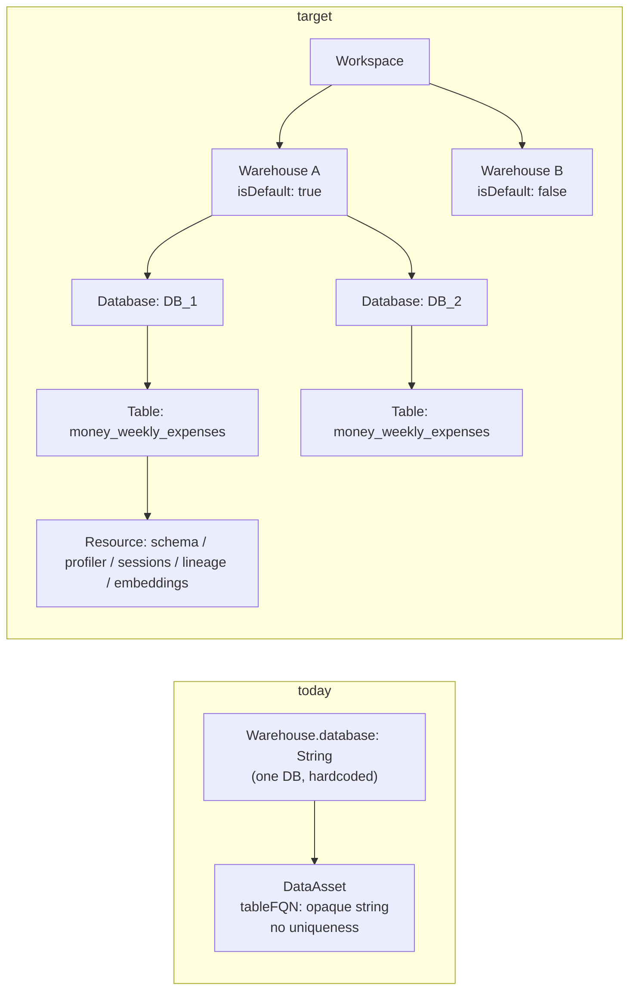

> **Fast-tracked slice**: BH-1362 ("Show default-warehouse indicator on
> warehouse listing UI") pulls the minimum viable piece of §2b/§2c/§4 out of
> this spec — `isDefault` field, `setDefaultWarehouse` mutation, auto-default
> on first warehouse, and a `<Default>` badge on the warehouse listing — and
> ships it ahead of the rest. Everything else in this epic (DatabaseNode,
> uniqueness, ambiguity ladder, cascading rename/delete, brightbot cutover)
> follows once BH-1362 lands. Full epic not yet filed in Jira; ticket
> breakdown below stays as the source of truth for the remaining scope.

> **Functional requirements this epic must satisfy** (added 2026-08-05, after
> a live incident chain confirmed every gap below is real, not hypothetical):
> - **Scale**: N-warehouses, N-databases per warehouse, N-tables — the core
>   ask this spec's §2b DatabaseNode/HAS_DATABASE/HAS_TABLE structure exists
>   to satisfy. Verified live tonight that the CURRENT single-database-per-
>   warehouse model breaks even at N=2 (Loop Capital: two SQL Server
>   warehouses sharing one OpenMetadata service identity, `<workspaceId>_
>   <provider>_ingestion` — keyed by workspace+type, not per-warehouse — so
>   registering warehouse B's connection silently overwrites warehouse A's in
>   a THIRD system beyond Neo4j/brightbot. See "OM service identity collision"
>   in Gaps below — this is now confirmed to reach into OpenMetadata's own
>   service-naming scheme, not just Neo4j/brightbot's resolvers.
> - **Asset Management**: every N-table resource (schema, description,
>   profiler, quality, files assigned, ingestion metadata, project/pipeline
>   context) needs a stable address to attach to. §2a's `TableResourceReader`
>   already scopes schema/profiler/sessions/lineage/embeddings — this pass
>   adds **quality, files, ingestion metadata, and project/transformation-
>   pipeline context** to that resource list (see §2a below).
> - **Organization**: grouping by tag/type/access/custom filters — tag-based
>   grouping already works today (Loop Capital's Gold/Silver/Bronze medallion
>   tiers, verified live) but is entirely disconnected from warehouse/database
>   identity — a tag has no path back to "which warehouse.database this table
>   lives in," which is exactly why a phantom `DataAssetNode` (`stg_holdings`,
>   tagged SILVER, verified tonight to no longer exist on the real SQL Server)
>   can sit in the catalog indefinitely with no automated way to detect the
>   drift. Organization requires the identity model in §2b to be real first.
> - **Automation**: proactive background jobs assignable to assets, tables,
>   databases, and pipelines — the profiler pipeline IS exactly this kind of
>   job, and tonight proved it can silently no-op for months (Tier1/Tier2
>   filter matching zero tables platform-wide, BH-1369) with zero visibility
>   that it wasn't doing what it claimed. Any automation layer this epic
>   enables must report real success/failure at the resource level (see
>   Property 6 below), not job-level "the DAG completed."
>
> These four requirements are the reason this spec generates an **epic**, not
> a single ticket — see Ticket Breakdown for the full decomposition.

# Warehouse → Database → Table hierarchical identity

> Full contract: `~/.claude/rules/spec-driven.md`.

## 1. Context

Loop Capital staging has two warehouses configured, and either warehouse can hold
more than one database with a same-named table (e.g. `money_weekly_expenses` in
both `DB_1` and `DB_2`). Today the platform has no way to represent this: a
warehouse can carry only one `database` string, a table's identity is an opaque,
non-unique `tableFQN` string, and runtime selection of "which warehouse" is a
first-entry heuristic with no way to declare a default. The result is silent,
non-deterministic behavior — a second database on the same warehouse is
literally unreachable, and two same-named tables in different databases are
indistinguishable.



### Use Case / Goal

An operator (or the agent acting for them) can point at exactly the data they
mean — a warehouse, a database within it, a table within that database — and
get either a confident answer or an honest ambiguity prompt, never a silent
wrong guess. A workspace admin can see, at a glance, which warehouse is the
default and change it. Anyone browsing Data Assets can see the database layer
that exists today only as an unmodeled string.

### How It Works Today

**Platform Core** (`brighthive-platform-core`):
- `WarehouseServiceNode` (`src/graphql/ogm/typedefs.ts:457-482`) carries
  `database: String` and `schema: String` — one scalar pair per warehouse node.
  There is no `DatabaseNode`. The `(Workspace)-[:USES]->(WarehouseServiceNode)`
  relationship (`typedefs.ts:293-294`) is an unordered list with no edge
  property, flag, or ordering.
- `DataAssetNode` (`typedefs.ts:506-601`) has no relationship to
  `WarehouseServiceNode` at all. Its only naming fields are `tableName`,
  `redshiftTableName`, `snowflakeTableName`, and `tableFQN: String` — a single
  opaque string. The only uniqueness constraint on the node is on the synthetic
  `id` (`:507`, `@unique`); `name`/`tableFQN` carry no constraint.
- Warehouse selection when a caller needs "the" warehouse for a workspace is
  `findMatchingWarehouseService` (`src/graphql/models/warehouse-provider-mapping.ts:37-50`):
  match by provider type, else `services[0]` — an explicit "no confident match"
  fallback. Several call sites skip even that and just index `[0]`
  (`src/repository/neo4j/warehouse-service.ts:41`,
  `src/graphql/service/workflow/runtime-adapters.ts:439`).
- Credentials live in AWS Secrets Manager at
  `workspace_secret_store/{workspaceId}`, with warehouses keyed by
  `warehouseServiceId` in most readers but by `workspaceId` itself in the SQL
  workflow adapter (`runtime-adapters.ts:211`) — an already-inconsistent keying
  scheme this spec must not add a third variant to.
- No GraphQL mutation exists to mark a warehouse as default/active
  (`setActiveWarehouse` does not exist), and no query lists databases, because
  databases are not entities.

**BrightBot** (`brightbot`):
- `get_warehouse_config` (`brightbot/tools/aws/secrets_manager.py:287-342`)
  resolves the runtime warehouse via `next(iter(warehouses.values()), None)` —
  first entry of the secret's dict, by insertion order. The docstring comment
  literally asserts "one per workspace."
- Every query/introspection/preview/lineage tool that opens a connection
  (`warehouse_query_tool.py:108-113`, `introspection_tools.py:68-73`,
  `database_size_tool.py:92`, `connection_health_tool.py:85`,
  `sv_qc_tools.py:226`, `preview_tools.py:99`,
  `metadata_retrieval.py:42`, `retrieval_descriptions.py:297`,
  `semantic_yaml_retrieval.py:134`) resolves only `workspace_id` from state —
  no `warehouse_id`, no `database` ever flows through the agent request or
  `RequestContext`.
- The database is bound once, at connect time, as a single connection default
  (`warehouse_connections.py:86-94` Redshift, `:503` Postgres, `:593`/`:626`
  Databricks catalog; `warehouse_snowflake.py:314-325` Snowflake). Introspection
  (`warehouse_snowflake.py:431-475`, `warehouse_connections.py:201-223`,
  `:436-458`, `:541-551`) is single-database-scoped and raises if no database is
  present — there is no "list databases" or "switch database" operation.
  Generated SQL qualifies `schema.table`, never `database.schema.table`.
- Table selection happens purely by name/`tableFQN` string
  (`deep_agent_metadata_tool.py:46-174`, `metadata_retrieval.py:55-56`), pulled
  from Platform Core's `DataAssetNode` fields (`ogm_queries.py:11-34` requests
  `redshiftTableName`, `snowflakeTableName`, `tableFQN` — never a database
  field, because none exists).
- The only disambiguation mechanism in the design docs is at the *warehouse*
  granularity — `session_info.warehouse_id` (`docs/specs/SPEC-SNOWFLAKE-E2E.md:313-322`)
  — and even that is documented as not yet auto-populated from supervisor
  context; `from_workspace(warehouse_id=None)` still falls back to "first
  Snowflake entry" (`warehouse_snowflake.py:70-106`).
- Type-filtered variants exist for governance/lineage tools
  (`snowflake_pipeline_source.py:104-112`, `lineage_fetchers.py:82-90`,
  `sql_server_pipeline_source.py:206-220`) but they still collapse to "first
  matching entry" when nothing disambiguates further, and their own docstrings
  flag this as a known limitation.

### Hard Limitations

- A warehouse **cannot** hold more than one database today — `database` is a
  scalar field, not a relationship. Adding a second database to a warehouse has
  no graph representation to attach to.
- A table's identity **cannot** be resolved uniquely by name within a warehouse
  that has 2+ databases — there is no field recording which database a
  `DataAssetNode` belongs to, and no constraint preventing/reconciling
  same-named collisions.
- The runtime **cannot** state which warehouse it used, because "which
  warehouse" is never captured as a decision — it's an accidental byproduct of
  dict iteration order.
- There is **no default-warehouse concept** to override, inspect, or display —
  not in the schema, not in the API, not in the UI.
- Lineage/cascade logic that depends on structural edges (rename/delete
  propagation) has nothing to cascade through below the warehouse, because
  `DataAssetNode` has no edge to hang off of.

### Gaps

- No `DatabaseNode` entity, no `Warehouse -[:HAS_DATABASE]-> Database` edge, no
  `Database -[:HAS_TABLE]-> DataAsset` edge.
- No `isDefault` field on `WarehouseServiceNode`, no mutation to set it, no
  invariant enforcing exactly one default per workspace.
- No structured FQN — `tableFQN` is hand-parsed/opaque; nothing derives it from
  the warehouse/database/table graph path.
- No uniqueness constraint scoped to `(warehouse_id, database_id, table_name)`.
- No ambiguity-resolution contract in brightbot — today an ambiguous table
  silently resolves to whatever the connection's default database contains;
  the second database is invisible, not merely unresolved.
- No UI surface shows which warehouse is default, and no UI surface shows the
  database layer at all (Data Assets currently has no "Databases" page).
- No per-table resource addressing (`warehouse.database.table.<resource>`) —
  schema/profiler/sessions/lineage/embeddings live in disconnected tools with no
  shared addressable path.
- **OM service identity collision** (confirmed live, Loop Capital, 2026-08-04):
  OpenMetadata's `DatabaseService` is named `<workspaceId>_<provider>_ingestion`
  — keyed by workspace + provider TYPE, not by warehouse connection. A
  workspace with two SQL Server warehouses gets ONE OM service identity, so
  registering warehouse B's connection overwrites warehouse A's in OM — a
  THIRD system (beyond Neo4j/brightbot) that silently collapses N warehouses
  into 1. This must be fixed as part of §2b, or the DatabaseNode model is
  structurally correct in Neo4j while still broken in the system that actually
  runs profiling/classification/lineage jobs.
- **No tag→identity path** (confirmed live, Loop Capital): tag-based grouping
  (medallion tiers — Gold/Silver/Bronze) works today, but a tag has no
  structural path back to "which warehouse.database this table lives in."
  A `DataAssetNode` can carry a tier tag and sit in the catalog indefinitely
  after the real table is dropped from the source warehouse, with no automated
  drift check — Organization requires §2b's identity model to exist before
  "group by tag" can also mean "and tell me if that group is stale."
- **No automation-job resource kind**: OM's profiler pipeline is itself a
  proactive background job scoped to a warehouse/database, and it silently
  no-op'd platform-wide for months (BH-1369 — a default Tier1/Tier2
  classification filter matched zero tables on every tenant checked) while
  reporting `pipelineState: success`. There is no resource kind today that
  represents "a job assigned to this asset/table/database" with an honest
  success/failure signal at the resource level — job-level "the DAG completed"
  is not the same claim as "the job did what it claims for this asset."
- **No write/DDL capability anywhere in brightbot** (confirmed live, Loop
  Capital iDeal POC, 2026-08-06): every existing warehouse tool
  (`SynapseConnection.execute_query`, `run_warehouse_query_data` /
  `assert_read_only_sql`) is SELECT-only by deliberate design — there is no
  path for brightbot to create a database, create a table, create a stored
  procedure, or run an upsert. Provisioning a new database/table (the N in
  N-databases/N-tables) today means a human runs a static `.sql` file by hand
  outside the platform. The identity model in §2b makes N databases/tables
  addressable once they exist; it does nothing to let the agent bring a new
  one into existence. This is the capacity gap, not a modeling gap — closing
  it needs a genuinely new port (§2f), reviewed and gated separately from the
  read-only tools because it is a different security posture, not an
  extension of the existing ones.

## 2. Interface Contract (MDE)

### 2a. Resource addressing — port + registry, first (per docs/CLAUDE.md engine-agnostic rule)

The per-table resource path (`warehouse.database.table.<resource>`) is designed
as a registry seam now; **only the port and the 9 concrete adapters below ship
in this epic** — the registry itself is documented, not built (see §5 Out of
Scope).

```python
# brightbot/ports/table_resource.py — THE PORT (documented now, registry deferred)
class TableResourceReader(Protocol):
    async def fetch(self, *, warehouse_id: str, database_id: str, table_name: str,
                     ctx: RequestContext) -> TableResource: ...

# Concrete resource kinds shipped in this epic — NOT yet registry-driven:
#   schema | profiler | sessions | lineage | embeddings
#   quality | files | ingestion_metadata | pipeline_context
# Each is its own existing tool wired to the new (warehouse_id, database_id,
# table_name) triple; no ResourceType enum/registry class is introduced yet.
# The last 4 (quality/files/ingestion_metadata/pipeline_context) are additions
# from the 2026-08-05 functional-requirements pass — Asset Management requires
# every resource a table can carry to have the SAME stable address, not just
# the original 5. Concretely, per resource:
#   quality             — existing quality-check tool output (score/rule results),
#                          keyed the same way size/profiler already should be —
#                          not a fresh table-level cache (see Property 6).
#   files               — files attached to a table (uploaded docs, sample
#                          extracts) via the existing static-asset S3 path,
#                          re-scoped to (warehouse_id, database_id, table_name).
#   ingestion_metadata   — which ingestion pipeline (OM DatabaseService +
#                          IngestionPipelineRef, see Gaps: "OM service identity
#                          collision") last touched this table, and when.
#   pipeline_context     — which dbt/transformation-pipeline jobs read or write
#                          this table (Project/Transformation edges already in
#                          Neo4j — this resource kind is the read path scoped to
#                          one table, not a new write path).
```

### 2b. Neo4j schema (Platform Core)

```graphql
type WarehouseServiceNode {
  id: ID! @id
  # ...existing fields unchanged...
  isDefault: Boolean!                      # NEW — exactly one true per workspace
  databases: [DatabaseNode!]!
    @relationship(type: "HAS_DATABASE", direction: OUT)   # NEW
}

type DatabaseNode {                        # NEW entity
  id: ID! @id @unique(constraintName: "unique_database_id")
  name: String!
  isDefault: Boolean!                      # NEW — exactly one true per warehouse (mirrors
                                            # WarehouseServiceNode.isDefault one level down)
  warehouse: WarehouseServiceNode!
    @relationship(type: "HAS_DATABASE", direction: IN)
  tables: [DataAssetNode!]!
    @relationship(type: "HAS_TABLE", direction: OUT)
}

type DataAssetNode {
  id: ID! @id @unique(constraintName: "unique_data_asset_id")
  # ...existing fields unchanged...
  database: DatabaseNode
    @relationship(type: "HAS_TABLE", direction: IN)       # NEW
  tableFQN: String   # NEW: derived/computed as `${warehouse.name}.${database.name}.${tableName}`,
                      # never hand-parsed after this spec ships
  resources: [ResourceNode!]!
    @relationship(type: "HAS_RESOURCE", direction: OUT)   # NEW — closes the lineage gap below
}

type ResourceNode {                        # NEW entity — level 4, was code-only (§2a), now graph-real
  id: ID! @id @unique(constraintName: "unique_resource_id")
  kind: String!                            # one of the 9 §2a kinds: schema|profiler|sessions|
                                            # lineage|embeddings|quality|files|ingestion_metadata|
                                            # pipeline_context — @nodejs-enum once ResourceType lands (§5)
  table: DataAssetNode!
    @relationship(type: "HAS_RESOURCE", direction: IN)
  jobs: [JobNode!]!
    @relationship(type: "HAS_JOB", direction: OUT)        # NEW
  lastVerifiedAt: DateTime                 # NEW — when a job last actually confirmed this resource
                                            # (not merely "last touched" — see Property 6)
}

type JobNode {                             # NEW entity — level 5, was code-only (§2f), now graph-real
  id: ID! @id @unique(constraintName: "unique_job_id")
  kind: String!                            # e.g. profiler_run | ingestion_run | quality_check_run
  resource: ResourceNode!
    @relationship(type: "HAS_JOB", direction: IN)
  status: String!                          # Unknown | Healthy | Failed — the BH-1368 3-state model,
                                            # applied at JOB granularity, not warehouse/workspace rollup
  lastRunAt: DateTime
  lastRunDetail: String                    # plain-English reason, mirrors ServiceHealthCheck.reason
}
```

**Why this closes the actual gap**: before this pass, the graph had real nodes/edges only through
`WarehouseServiceNode -[:HAS_DATABASE]-> DatabaseNode -[:HAS_TABLE]-> DataAssetNode` (levels 1-3).
Levels 4 (resource) and 5 (job) existed only as Python-side port contracts (§2a `TableResourceReader`,
§2f `WarehouseBuilder`) with no Neo4j representation — so a query like "show every resource and
job under this table" was structurally impossible; the chain broke at level 3. `ResourceNode` and
`JobNode` make levels 4-5 real graph citizens with the same cascading-delete/rename discipline as
levels 1-3 (Invariants 4-5 extend to `HAS_RESOURCE`/`HAS_JOB` — see §3 Invariant 11 below), and
`resolve_resource`/`resolve_job`/`resolve_monitoring` (§2e) become genuine Cypher traversals instead
of ad hoc lookups against systems the graph doesn't know about (OM, S3, the quality-check tool).

### 2c. GraphQL API (Platform Core)

```
mutation setDefaultWarehouse(workspaceId: ID!, warehouseId: ID!): WarehouseServiceOutput!
  # Caller must hold WorkspaceAdmin (or SystemAdmin) on workspaceId — same authz
  # tier as other workspace-config mutations (upsertWarehouseConfig).
  Response 200: { id, isDefault: true, ... }
  Response 4xx: { error: "warehouse_not_found" | "workspace_mismatch" | "forbidden_not_workspace_admin" }

mutation renameDatabase(databaseId: ID!, newName: String!): DatabaseOutput!
  # Cascades: recomputes tableFQN for every DataAssetNode under this database.
  Response 200: { id, name, warehouseId }
  Response 4xx: { error: "database_not_found" | "forbidden_not_workspace_admin" }

query databases(workspaceId: ID!, warehouseId: ID!): [DatabaseOutput!]!
  Response 200: [{ id, name, warehouseId }]

query tablesInDatabase(databaseId: ID!): [DataAssetOutput!]!
  Response 200: [{ id, name, tableFQN, databaseId }]

query resolveTable(workspaceId: ID!, tableName: String!, warehouseId: ID, databaseId: ID): TableResolution!
  Response 200 (unique match): { status: "RESOLVED", table: DataAssetOutput! }
  Response 200 (ambiguous):    { status: "AMBIGUOUS", matches: [DataAssetOutput!]! }   # ≥2 candidates
  Response 4xx (incoherent):   { error: "table_not_in_database" | "warehouse_database_table_mismatch" }

query defaultLookupPath(workspaceId: ID!): DefaultLookupPathOutput
  # COMPUTED, not stored — there is no DefaultLookupPathNode and no
  # setDefaultLookupPath mutation. This resolver walks the existing isDefault
  # flags: find the workspace's isDefault=true WarehouseServiceNode (§3
  # Invariant 1), then within it find the isDefault=true DatabaseNode (§3
  # Invariant 1a, new below) — the lookup path IS the composition of two
  # already-authoritative defaults, one level apart. Configuring "the"
  # default at either level (setDefaultWarehouse §2c above, and the
  # database-level equivalent setDefaultDatabase below) changes what this
  # query returns; there is nothing else to configure or store.
  # databaseId is null when the default warehouse has no databases yet, or
  # none of its databases has isDefault=true (should not happen once
  # Invariant 1a's auto-default-on-first-database mirrors Invariant 1).
  # Cacheable — freely, at any TTL a caller likes — because it is a pure
  # function of two isDefault flags with no independent write path. It is
  # STALE only across the two writes that can move it: setDefaultWarehouse
  # and setDefaultDatabase. Both MUST invalidate this specific cache key
  # (workspaceId-scoped) synchronously in the same request, not on a timer —
  # every other mutation in this spec (renames, table CRUD, resource/job
  # writes) is irrelevant to this value and must NOT trigger invalidation.
  Response 200: { warehouseId, databaseId } | null   # null only if the workspace has zero warehouses

mutation setDefaultDatabase(warehouseId: ID!, databaseId: ID!): DatabaseOutput!
  # Caller must hold WorkspaceAdmin (or SystemAdmin) — same authz tier as
  # setDefaultWarehouse. Exactly-one-default-per-warehouse (Invariant 1a),
  # same mechanics as setDefaultWarehouse one level up. This is the ONLY
  # write surface for "default" at the database level — defaultLookupPath
  # above is a pure read composing this + setDefaultWarehouse, never itself
  # a write target.
  Response 200: { id, isDefault: true, warehouseId }
  Response 4xx: { error: "database_not_found" | "database_not_in_warehouse" | "forbidden_not_workspace_admin" }
```

### 2d. BrightBot resolver signatures

```python
def resolve_warehouse(*, workspace_id: str, requested_warehouse_id: str | None) -> ResolvedWarehouse:
    """requested_warehouse_id wins if given; else the isDefault=true warehouse. Never `[0]`/`next(iter(...))`."""

def resolve_database(*, warehouse_id: str, requested_database_id: str | None) -> ResolvedDatabase | None:
    """None means 'not pinned' — caller must run the ambiguity ladder before executing SQL."""

def resolve_table(*, workspace_id: str, table_name: str,
                   warehouse_id: str | None, database_id: str | None) -> TableResolution:
    """Returns RESOLVED | AMBIGUOUS(matches) | error. Never silently picks one on AMBIGUOUS."""

def resolve_table_across_warehouses(*, workspace_id: str, table_name: str,
                                     warehouse_id: str | None, database_id: str | None) -> TableResolution:
    """Same contract as resolve_table, but scans EVERY warehouse in the workspace
    when warehouse_id is not pinned — the N-warehouse extension of Invariant 8.
    A same-named table in warehouse_a.database_1 AND warehouse_b.database_1 is
    exactly as ambiguous as two same-named tables in one warehouse's two
    databases (Invariant 2) — this closes that case at the warehouse level,
    not just the database level. Uses defaultLookupPath (§2c) to decide search
    ORDER only (try the pinned warehouse.database first), never to narrow the
    candidate set silently — a hit outside the default path is still surfaced
    as AMBIGUOUS if a hit inside it also exists, never silently preferred."""
```

### 2e. Lookup priority ladder (added 2026-08-05)

Every lookup this epic introduces — human query, agent tool call, or
background job — resolves the SAME six-level address in the SAME fixed
order: **warehouse → database → table → resource → job → monitoring**. Each
level only resolves once its parent is RESOLVED (never AMBIGUOUS/incoherent);
an ambiguity at level N blocks resolution at levels N+1..6 rather than
resolving them against a guessed parent. This is the general form of §2d's
`resolve_warehouse` → `resolve_database` → `resolve_table` chain, extended two
levels further to cover the new resource kinds (§2a) and the automation-job
resource kind (Gaps: "No automation-job resource kind"):

```python
def resolve_resource(*, table: ResolvedTable, resource_kind: ResourceKind,
                      ctx: RequestContext) -> ResolvedResource:
    """Requires an already-RESOLVED table. No resource lookup runs against an
    AMBIGUOUS or unresolved table — this is what makes level 4 dependent on
    level 3, not parallel to it."""

def resolve_job(*, resource: ResolvedResource, job_kind: JobKind,
                 ctx: RequestContext) -> ResolvedJob | None:
    """Which proactive background job (if any) is assigned to this resource.
    None is a valid answer — not every resource has an automation job — but
    it is never conflated with 'job ran and succeeded.'"""

def resolve_monitoring(*, job: ResolvedJob, ctx: RequestContext) -> HealthSignal:
    """The honest 3-state signal (Unknown | Healthy | Failed, see BH-1368) for
    this specific job at this specific resource — never a warehouse-level or
    workspace-level rollup standing in for a resource-level answer."""
```

Why fixed order, not independent/parallel lookups: every live incident this
spec cites was a level jumping ahead of its parent — the profiler job (level
5) ran against a resource (level 4) that was never resolved against a correct
database (level 2, the OM connection-mismatch bug); a tag (Organization,
Gaps) grouped a table (level 3) whose warehouse/database identity had already
gone stale. The ladder is the enforcement mechanism for Property 3
("Ambiguity is never silently resolved") applied uniformly to all six levels,
not just the original three.

### 2f. WarehouseBuilder — the write/DDL capability (NEW, closes the Gaps entry above)

A second, distinct port from `TableResourceReader` (§2a) — administrative
provisioning, not resource reads. Deliberately narrow: 4 operations, no
arbitrary-SQL escape hatch, every call scoped to an already-`resolve_warehouse`d
target so this port cannot be used to sidestep §2e's ladder.

```python
# brightbot/ports/warehouse_admin.py — THE PORT
class WarehouseBuilder(Protocol):
    async def create_database(self, *, warehouse: ResolvedWarehouse, database_name: str,
                               ctx: RequestContext) -> ProvisionResult: ...
    async def create_table(self, *, database: ResolvedDatabase, table_name: str,
                            columns: list[ColumnDef], ctx: RequestContext) -> ProvisionResult: ...
    async def create_procedure(self, *, database: ResolvedDatabase, procedure_name: str,
                                body_sql: str, ctx: RequestContext) -> ProvisionResult: ...
    async def upsert_rows(self, *, table: ResolvedTable, rows: list[dict],
                           key_columns: list[str], ctx: RequestContext) -> UpsertResult: ...

# First adapter: SynapseAdminAdapter (raw pymssql cursor beneath the existing
# SynapseConnection — SELECT-only execute_query() is untouched; this is a
# SEPARATE code path, never a bypass flag on the read tool).
WAREHOUSE_ADMIN_ADAPTERS: Final[dict[WarehouseType, AdapterFactory]] = {
    SQL_SERVER: SynapseAdminAdapter,
    AZURE_SYNAPSE: SynapseAdminAdapter,
}
```

**Why this is a new port, not an extension of `TableResourceReader` or a flag on
`execute_query`**: read and write are different security postures (PS-1,
`pluggable-scalable.md`) — a SELECT-only tool call site should never become
write-capable via a parameter. Every `WarehouseBuilder` call requires an
explicit `ctx.principal` with a provisioning capability the read tools don't
check, and is logged/audited distinctly (§9). Confirmed necessary tonight: the
Loop Capital iDeal POC could only produce static `.sql` files for a human to
run by hand — with this port, the same CREATE DATABASE / CREATE TABLE / CREATE
PROCEDURE / upsert sequence becomes one `resolve_warehouse` → `WarehouseBuilder`
call chain, auditable and repeatable for the next N databases.

**Out of scope for the first cut** (see §5): arbitrary DDL/ALTER, DROP of
anything with existing rows (only `cascade`-gated per Invariant 4/5), and any
operation not in the 4 above. This is provisioning, not a general SQL console.

### 2g. Read/write actor boundary — BrightAgent reads, the engineering agent writes (NEW, 2026-08-06)

Confirmed by reading the current code (`brightbot/tools/warehouse_writers.py`,
`brightbot/agents/workflow_agent/tools.py`): the read/write split Kuri stated
("BrightAgent itself only reads; the engineering agent is the one that
writes") already exists **as a matter of which module imports what** —
`WarehouseBuilder`'s only caller today is `workflow_agent` (the engineering
agent). Reads (`WarehouseConnectionFactory`/`CONNECTION_CLASSES`) fan out
across `dbt_agent`, `governance_agent`, `analyst_agent`, and `retrieval_agent`
by design — that breadth is correct and should stay. **What does not exist is
enforcement**: any agent module can `import build_writer` today and nothing
stops it — the boundary is a convention, not a gate.

```python
# brightbot/agents/shared_middleware/warehouse_write_gate.py — NEW
def require_engineering_agent(*, ctx: RequestContext) -> None:
    """Raise WriteNotAuthorizedError unless ctx.agent_name == ENGINEERING_AGENT.
    Called at the top of every WarehouseBuilder adapter method (§2f) — the
    gate lives in the adapter base, not per call site, so a new agent cannot
    accidentally gain write access by importing the port without also
    importing this check."""
```

This is Invariant 13 below. Read tools are explicitly NOT gated by this
check — `TableResourceReader` (§2a) and every existing read tool keep their
current multi-agent access; only `WarehouseBuilder` (§2f) calls require it.

## 3. Invariants (DbC)

1. Exactly one `WarehouseServiceNode` per workspace has `isDefault: true` at all
   times (workspaces with ≥1 warehouse). Creating a workspace's first warehouse
   sets it default automatically; deleting the default warehouse promotes
   another (deterministic: earliest-created remaining warehouse) or leaves zero
   only if zero warehouses remain.
1a. Exactly one `DatabaseNode` per `WarehouseServiceNode` has `isDefault: true`
   at all times (warehouses with ≥1 database) — the same rule as Invariant 1,
   one level down. Creating a warehouse's first database sets it default
   automatically; deleting the default database promotes another
   (earliest-created remaining) or leaves zero only if zero databases remain.
   `defaultLookupPath` (§2c) is the READ composition of Invariant 1 + 1a; it
   has no independent state and enforces nothing of its own.
2. `DataAssetNode` identity is unique on `(warehouse_id, database_id, name)` —
   NOT on `name` alone. Two tables with the same `name` in different
   `database_id`s are distinct, valid, and both independently addressable.
3. `tableFQN` is a **derived** value (`warehouse.name + "." + database.name +
   "." + table.name`), never independently hand-set after creation — it cannot
   drift from the structural graph.
4. WHEN a database with ≥1 `DataAssetNode` is deleted, THE System SHALL reject
   the deletion with a typed `database_has_tables` error UNLESS the caller
   passes `cascade: true`, in which case THE System SHALL cascade-delete every
   `DataAssetNode` under it in the same transaction — never leave an orphaned
   table pointing at a deleted database, and never delete tables the caller
   didn't explicitly opt into losing.
5. WHEN a warehouse is deleted, THE System SHALL apply Invariant 4 to every
   database underneath it (same `cascade` flag, same transaction) — deletion is
   transitive down the full hierarchy, never partial.
5a. WHEN a warehouse or database is renamed, THE System SHALL recompute
   `tableFQN` for every `DataAssetNode` transitively underneath it in the same
   transaction — a rename is a cascade, not just a delete (this is the
   "cascading lineage" requirement: identity changes propagate down, not just
   destructive ones).
6. IF a `resolveTable` call has zero matches, THEN THE System SHALL return a
   typed `not_found` error — never a default/first-match fallback.
7. IF a `resolveTable` call has exactly one match after applying any
   warehouse/database pin, THEN THE System SHALL resolve without prompting.
8. IF a `resolveTable` call has 2+ matches and no pin narrows it to one, THEN
   THE System SHALL return `AMBIGUOUS` with all matches — never silently pick
   one (this replaces every `next(iter(...))` / `[0]` fallback named in §1).
9. WHILE a `warehouse_id`/`database_id` pin is present but inconsistent with
   the resolved table (e.g. pinned database doesn't contain the named table),
   THE System SHALL return a typed `incoherent` error — never fall back to an
   unpinned resolution.
10. brightbot SHALL state the resolved `warehouse.name` (and `database.name`
    when a database was resolved, pinned or not) in every user-facing response
    that executed a query — never silent, including when the default was used.
11. WHEN a `DataAssetNode` with ≥1 `ResourceNode` is deleted (via cascade,
    Invariant 4/5), THE System SHALL cascade-delete every `ResourceNode` under
    it and every `JobNode` under those `ResourceNode`s in the same transaction
    — the cascade contract established for levels 1-3 extends unbroken to
    levels 4-5; no orphaned resource/job node can outlive its table.
12. `ResourceNode.kind` and `JobNode.kind` are each scoped to their parent —
    two `ResourceNode`s of the same `kind` under the same `DataAssetNode` are
    a data error (one resource per kind per table), enforced the same way
    Invariant 2 scopes table identity to `(warehouse_id, database_id, name)`.
13. WHEN any caller invokes a `WarehouseBuilder` (§2f) method, THE System SHALL
    reject the call with a typed `write_not_authorized` error UNLESS
    `ctx.agent_name` is the engineering agent (`workflow_agent`) — enforced in
    the adapter base (§2g), not per call site. Read tools (`TableResourceReader`,
    §2a) are explicitly exempt — this invariant governs writes only.
14. A workspace's `defaultLookupPath` (§2b/§2c) affects search ORDER only,
    never the candidate SET. `resolve_table_across_warehouses` (§2d) always
    scans every warehouse+database the workspace has; a match inside the
    default path is tried first and returned alone only if it is the SOLE
    match overall — a second match anywhere else in the workspace still
    yields AMBIGUOUS (Invariant 8), even if one candidate sits inside the
    configured default. Configuring a default is a lookup-order UX
    convenience, never a scope-narrowing or safety mechanism.

## 4. Acceptance Criteria (BDD — Gherkin)

```gherkin
Feature: Default warehouse selection

  Scenario: Workspace with one warehouse
    Given a workspace with exactly one warehouse
    When that warehouse is created
    Then it is automatically marked isDefault=true

  Scenario: Admin changes the default
    Given a workspace with warehouses A (default) and B
    When the admin calls setDefaultWarehouse(workspaceId, B)
    Then B.isDefault is true and A.isDefault is false

  Scenario: Agent uses the default silently unless overridden
    Given a workspace with warehouses A (default) and B
    When the user asks a question without naming a warehouse
    Then brightbot queries warehouse A
    And the response states "using warehouse A"

  Scenario: Agent honors an explicit override
    Given a workspace with warehouses A (default) and B
    When the user asks a question naming warehouse B
    Then brightbot queries warehouse B
    And the response states "using warehouse B"

Feature: Multi-database targeting and ambiguity ladder

  Scenario: Unique table, no pin needed
    Given warehouse A has databases DB_1 and DB_2
    And only DB_1 contains table "revenue_summary"
    When the user asks about "revenue_summary" without pinning a database
    Then the table resolves to DB_1.revenue_summary
    And the response states "found in DB_1"

  Scenario: Ambiguous table across two databases, confirm both
    Given warehouse A has databases DB_1 and DB_2
    And both contain a table named "money_weekly_expenses"
    When the user asks about "money_weekly_expenses" without pinning a database
    Then the agent surfaces both DB_1.money_weekly_expenses and DB_2.money_weekly_expenses
    And asks the user to confirm which one

  Scenario: Pinned database resolves ambiguity without prompting
    Given warehouse A has databases DB_1 and DB_2
    And both contain a table named "money_weekly_expenses"
    When the user asks about "money_weekly_expenses" and pins database DB_2
    Then the table resolves to DB_2.money_weekly_expenses without prompting

  Scenario: Incoherent pin errors instead of guessing
    Given warehouse A has database DB_1 which does NOT contain table "revenue_summary"
    When the user pins database DB_1 and asks about "revenue_summary"
    Then the system returns a typed "table_not_in_database" error
    And does not fall back to any other database

Feature: Structural uniqueness

  Scenario: Same table name, different databases, both valid
    Given database DB_1 and database DB_2 in the same warehouse
    When a table named "money_weekly_expenses" is registered in both
    Then both DataAssetNode records exist independently
    And each has a distinct tableFQN reflecting its own database

  Scenario: Database deletion without cascade flag is rejected
    Given database DB_2 contains table "money_weekly_expenses"
    When DB_2 is deleted without cascade: true
    Then the system returns a typed "database_has_tables" error
    And DB_2 and its tables still exist

  Scenario: Database deletion with cascade flag removes descendants
    Given database DB_2 contains table "money_weekly_expenses"
    When DB_2 is deleted with cascade: true
    Then the DataAssetNode for DB_2.money_weekly_expenses is also deleted
    And DB_1.money_weekly_expenses is unaffected

  Scenario: Renaming a database cascades to every table's FQN
    Given database DB_2 is renamed to "DB_2_ARCHIVE"
    And DB_2 contains table "money_weekly_expenses"
    Then the DataAssetNode's tableFQN reflects "DB_2_ARCHIVE.money_weekly_expenses"
    And no manual edit to tableFQN was required
```

## 5. Out of Scope

- **Implementing the extensible `ResourceType` registry** for
  `warehouse.database.table.<resource>` — the port (§2a) and the 5 concrete
  resource kinds (schema, profiler, sessions, lineage, embeddings) ship; the
  registry/dict-driven dispatch layer that lets new resource types be added as
  config is designed and documented only, per `~/.claude/rules/pluggable-scalable.md`
  "rule of two" — a second resource-type addition is not yet on the roadmap.
- The migration's **ordering** (§6 Rollout ordering) is in scope and mandatory;
  the migration **script's** internal rollback/retry mechanics are not
  designed here — that's an implementation detail of the ticket, constrained
  only by the "100% coverage before constraint" gate in §6.
- Cross-warehouse table joins/queries (explicitly out of scope per
  `SPEC-GENERATE-MART-MODEL.md:197`, unchanged by this spec).
- Re-keying the AWS Secrets Manager `workspace_secret_store` inconsistency
  (`workspaceId`-keyed vs `warehouseServiceId`-keyed entries, §1) — tracked as a
  known pre-existing issue, not fixed here to keep blast radius scoped.
- New warehouse *types* (BigQuery, Databricks, etc.) — unrelated axis, covered
  by `warehouse-extensibility-pattern.md`.

## 6. Dependencies

| Dependency | Type | Status |
|------------|------|--------|
| Neo4j OGM schema migration tooling (platform-core) | Blocking | Ready — existing migration pattern used for prior node additions |
| `warehouse-agnostic-architecture.md` (BH-172 registry pattern) | Non-blocking | Approved — this spec follows the same registry-at-every-layer discipline |
| AWS Secrets Manager warehouse secret shape | Blocking | Ready, but keying inconsistency (§1) must not be made worse — new database-scoped reads must tolerate both existing keying styles |
| `brighthive-webapp` Data Assets page (for new Databases sub-page) | Blocking | Ready — existing page to extend |

### Rollout ordering (hard sequencing, not parallelizable)

The uniqueness constraint (Invariant 2) and `isDefault`-based resolution
(Invariant 1) cannot go live before every existing `DataAssetNode` has a
`DatabaseNode` to point at — otherwise brightbot's new resolvers have nothing
to resolve against for pre-existing tables and every query on an
un-migrated workspace breaks. Order is:

1. Ship `DatabaseNode` entity + relationships (schema only, no constraint yet).
2. Run the backfill migration (one `DatabaseNode` per existing warehouse,
   built from its current `database` string) — verified 100% of existing
   `DataAssetNode`s have a `database` edge before proceeding.
3. Add the `(warehouse_id, database_id, name)` uniqueness constraint.
4. Ship `isDefault` + auto-default-on-first-warehouse + `setDefaultWarehouse`.
5. Cut brightbot over from `next(iter(...))`/`[0]` resolution to the new
   `isDefault`-aware + ambiguity-ladder resolvers — only after step 3 lands,
   or brightbot will hit tables with no `database_id` and nothing to
   disambiguate against.

Ticket Breakdown below is ordered to match; no ticket in step N should merge
ahead of step N-1's migration ticket in the same environment.

## 7. Correctness Properties

### Property 1: Exactly-one-default is never violated

*For any* workspace with N ≥ 1 warehouses, at all times exactly one
`WarehouseServiceNode.isDefault` is `true`.

**Validates: §3 Invariant 1, §4 Scenarios "Workspace with one warehouse", "Admin changes the default"**

### Property 2: Table identity is scoped, never global

*For any* two `DataAssetNode`s N1, N2 with the same `name`, if
`N1.database_id != N2.database_id` then N1 and N2 both persist independently
and are both resolvable.

**Validates: §3 Invariant 2, §4 Scenario "Same table name, different databases, both valid"**

### Property 3: Ambiguity is never silently resolved

*For any* `resolveTable` call, if the candidate set after applying pins has
size ≥ 2, the response is `AMBIGUOUS` with all candidates — never a single
selected match.

**Validates: §3 Invariant 8, §4 Scenario "Ambiguous table across two databases, confirm both"**

### Property 4: Cascading deletion has no orphans, and is never accidental

*For any* deleted `DatabaseNode` or `WarehouseServiceNode` with ≥1 descendant
`DataAssetNode`, the deletion either (a) fails with `database_has_tables`
because `cascade` was not set, or (b) removes every descendant in the same
transaction. No intermediate state where a table survives its parent, and no
deletion of tables the caller didn't explicitly request via `cascade: true`.

**Validates: §3 Invariants 4-5, §4 Scenarios "Database deletion without cascade flag is rejected", "Database deletion with cascade flag removes descendants"**

### Property 5: Rename cascades to every derived identity

*For any* warehouse or database rename, every `DataAssetNode.tableFQN`
transitively underneath it reflects the new name in the same transaction that
performed the rename — no stale FQN survives a rename, and no separate
"resync" step is required.

**Validates: §3 Invariant 5a, §4 Scenario "Renaming a database cascades to every table's FQN"**

## 8. Eval Criteria

| Evaluator | Node | Mode | Threshold | Method |
|---|---|---|---|---|
| WarehouseDisclosureEvaluator | brightbot query-execution nodes (all tools in §1 that open a connection) | GATE | 100% of responses that executed SQL name the warehouse used | deterministic (regex/string check on response for warehouse name) |
| AmbiguityLadderEvaluator | `resolve_table` call sites in brightbot | GATE | 0 silent-fallback resolutions on ≥2-candidate inputs (score == 1.0) | deterministic |

## 9. Observability Contract

- **Span**: `gen_ai.tool.execute` with `gen_ai.tool.name=resolve_table_target`
- **Attributes**: `workspace.id`, `warehouse.id`, `warehouse.is_default`,
  `database.id` (nullable), `table.resolution_status`
  (`RESOLVED`|`AMBIGUOUS`|`INCOHERENT`), `table.candidate_count`
- **Log events**: `table_resolution.resolved`, `table_resolution.ambiguous`,
  `table_resolution.incoherent`, `warehouse_default.changed`
- **Metrics**: `table_resolution_ambiguous_total` (counter, tagged
  `workspace_id`) — surfaces workspaces that would most benefit from tighter
  naming conventions or explicit pinning in the UI.

## 10. Test Coverage Update

| Repo | Suite | What to add |
|---|---|---|
| `brightbot` | `brightbot/tests/` (unit/integration) + `brightbot/brightbot/evals/` (L0/L1/L2) | L0: one case per §2d resolver signature (shape/error-code match). L1: one case per §4 routing-observable scenario (override vs default warehouse routing). L2: one case per §3 invariant (6, 7, 8, 9, 10) + the 2 §8 evaluators, run against a real staging secret with 2 warehouses / 2 databases (not mocked) |
| `brighthive-platform-core` | `brighthive-platform-core/tests/` | One test per §2b/§2c contract entry (schema shape, mutation/query response codes); one test per §3 invariant 1-5 observable via the API (real Neo4j test instance, not fixture-only) |
| `brighthive-webapp` | `brighthive-webapp/tests/e2e` (Playwright) + `cypress/` | Playwright: default-warehouse toggle in Settings (happy path from §4 "Admin changes the default"); new Databases page renders warehouse→database→table tree against real staging data. Cypress: component test for the isDefault badge/toggle control |
| `brighthive-e2e` | `brighthive-e2e/e2e/` | One feature test: user asks an ambiguous question against a real 2-database Loop-Capital-shaped staging fixture, confirms the AMBIGUOUS prompt end-to-end. One error-path test: incoherent pin against the real backend returns the typed error, not a 500 |

**Real-behavior requirement**: the brightbot L2 case and the platform-core
invariant tests MUST run against a real Neo4j instance / real staging secret
with genuinely 2 warehouses and 2 databases configured — a mocked
single-warehouse fixture cannot exercise Invariant 2/8/9, which is exactly the
bug class this spec exists to close.

Before opening the implementation PR: run every suite above, confirm each new
§2/§3/§4/§8 entry has a corresponding new test case, and confirm all suites are
green.

## Areas Involved

| Area | Repo | Impact |
|------|------|--------|
| Platform Core | `brighthive-platform-core` | New `DatabaseNode`, `ResourceNode`, `JobNode` + `HAS_DATABASE`/`HAS_TABLE`/`HAS_RESOURCE`/`HAS_JOB` relationships (full 5-level graph, §2b), `isDefault` field + constraint, WorkspaceAdmin-gated mutations/queries, derived + rename-cascaded `tableFQN`, cascade-flag-gated delete extended to levels 4-5 (Invariant 11), ordered data migration for existing warehouses; OM `DatabaseService` naming fix (one identity per warehouse connection, not per workspace+provider-type) |
| BrightBot | `brightbot` | Replace `next(iter(...))`/`[0]` warehouse+table resolution with `isDefault`-aware + ambiguity-ladder resolvers; always disclose warehouse/database used; multi-database connection/introspection support; §2a resource port for the 9 concrete resource kinds; `resolve_resource`/`resolve_job`/`resolve_monitoring` ladder extension (§2e) |
| Web App | `brighthive-webapp` | Settings → Warehouses: default badge + toggle. New Data Assets → Databases page (warehouse → database → table browser). Tag/type/access filter UI on that page (Organization requirement) |

## Ticket Breakdown

Generated via `/create-jira-ticket` from this spec. Every row is an
`issueType: "Task"` under the epic in frontmatter — never `"Story"`.

Ordered per §6 Rollout ordering — step number in parens.

| Ticket | Summary | Points | Epic |
|--------|---------|--------|------|
| — | (1) New `DatabaseNode` entity + `HAS_DATABASE`/`HAS_TABLE` relationships in OGM schema (no constraint yet) | 3 | BH-NEW |
| — | (1, added 2026-08-06) New `ResourceNode` + `JobNode` entities + `HAS_RESOURCE`/`HAS_JOB` relationships in OGM schema — closes the level-4/5 lineage gap: without these, `resolve_resource`/`resolve_job`/`resolve_monitoring` (§2e) have no graph to traverse and stay code-only lookups against disconnected systems (OM/S3/quality-tool) | 5 | BH-NEW |
| — | (3, added 2026-08-06) Extend cascade-delete (Invariants 4/5) to `ResourceNode`/`JobNode` per Invariant 11; enforce per-parent `kind` uniqueness (Invariant 12) | 3 | BH-NEW |
| — | (2) Data migration: backfill `DatabaseNode` for every existing warehouse's single `database` string + verify 100% `DataAssetNode` coverage before proceeding | 5 | BH-NEW |
| — | (3) `(warehouse_id, database_id, name)` uniqueness constraint on `DataAssetNode` | 2 | BH-NEW |
| — | (3) Derive `tableFQN` from graph path; remove hand-parsed FQN logic | 3 | BH-NEW |
| BH-1362 | (4, fast-tracked) `isDefault` field + exactly-one-default constraint + auto-default-on-first-warehouse + `setDefaultWarehouse` mutation + `<Default>` badge on warehouse listing UI | 5 | BH-172 |
| — | (4) `renameDatabase`/`renameWarehouse` mutations, WorkspaceAdmin-gated (remainder not covered by BH-1362) | 2 | BH-NEW |
| — | (4) GraphQL queries: `databases`, `tablesInDatabase`, `resolveTable` (with AMBIGUOUS/incoherent response shapes) | 3 | BH-NEW |
| — | (4) Cascade delete with `cascade: true` flag: warehouse → database → table, reject without flag (Invariants 4-5) | 3 | BH-NEW |
| — | (4) Rename cascade: recompute `tableFQN` for every descendant on warehouse/database rename (Invariant 5a) | 3 | BH-NEW |
| — | (5) brightbot: `resolve_warehouse` — replace `next(iter(...))` with `isDefault`-aware resolution + override support | 3 | BH-NEW |
| — | (5) brightbot: `resolve_database` + `resolve_table` — implement 3-step ambiguity ladder (pinned / ambiguous-confirm / incoherent-error) | 5 | BH-NEW |
| — | (5) brightbot: multi-database connection/introspection support (replace single-default-database binding) | 5 | BH-NEW |
| — | (5) brightbot: warehouse/database disclosure in every query-executing response (Invariant 10, WarehouseDisclosureEvaluator) | 2 | BH-NEW |
| — | brightbot: document (not implement) `TableResourceReader` registry seam for schema/profiler/sessions/lineage/embeddings | 2 | BH-NEW |
| — | webapp: Settings → Warehouses default badge + toggle | 3 | BH-NEW |
| — | webapp: new Data Assets → Databases page (warehouse → database → table tree) | 5 | BH-NEW |
| — | (6, added 2026-08-05) platform-core: fix OM `DatabaseService` naming collision — one identity per warehouse connection (not per workspace+provider-type); backfill re-registers any workspace with 2+ same-provider warehouses | 5 | BH-NEW |
| — | (6) brightbot: `resolve_resource` — extend the ladder (§2e) to the 9 resource kinds in §2a, blocked on level-3 RESOLVED | 3 | BH-NEW |
| — | (6) brightbot: `resolve_job` + `resolve_monitoring` — automation-job resource kind with resource-level (not job-level) success/failure signal, reusing the BH-1368 3-state model | 5 | BH-NEW |
| — | (6) platform-core + webapp: tag → identity path — every tag-grouped table carries a live link back to its `(warehouse_id, database_id)`; staleness check flags tags on tables no longer present at the source (Organization requirement) | 5 | BH-NEW |
| — | (6, added 2026-08-06) brightbot: `WarehouseBuilder` (§2f) — `create_database`/`create_table`/`create_procedure`/`upsert_rows`, first adapter `SynapseAdminAdapter`; every call writes a `JobNode` row (status + reason) so provisioning itself is lineage-visible, not a side-channel script | 8 | BH-NEW |
| — | (6, added 2026-08-06) brightbot: `require_engineering_agent` write-gate (§2g, Invariant 13) in the `WarehouseBuilder` adapter base — closes the confirmed-unenforced read/write actor boundary; read tools unaffected | 3 | BH-NEW |
| — | (7, added 2026-08-06, revised 2026-08-06) platform-core: `DatabaseNode.isDefault` field + exactly-one-default-per-warehouse constraint (Invariant 1a) + `setDefaultDatabase` mutation + auto-default-on-first-database — mirrors BH-1362's warehouse-level mechanism one level down. `defaultLookupPath` (§2c) is a COMPUTED query composing Invariant 1 + 1a, cache-invalidated only on `setDefaultWarehouse`/`setDefaultDatabase` — no new node, no new write surface | 5 | BH-NEW |
| — | (7) brightbot: `resolve_table_across_warehouses` (§2d) — extends the ambiguity ladder to same-named tables across DIFFERENT warehouses, not just different databases in one warehouse; uses `defaultLookupPath` for search order only (Invariant 14), never to narrow the candidate set | 5 | BH-NEW |
| — | (7) webapp: Settings → Warehouses — "Default lookup path" control (pick warehouse, optionally a database within it) alongside the existing isDefault toggle; empty state when never configured | 3 | BH-NEW |

**Total: 109 points across 26 tickets**

## Related

- **Spec**: `warehouse-agnostic-architecture.md` — registry/adapter pattern this spec follows for the new resource port
- **Spec**: `warehouse-extensibility-pattern.md` — layer-by-layer checklist precedent
- **Spec**: `engineering-agent-warehouse-agnostic.md` — companion engine-agnostic read/write work at the connection layer
- **Epic**: BH-1273 (Data Lineage) — cascade/lineage invariants in §3 should stay consistent with that epic's lineage model
- **Spec**: `table-parity-cross-warehouse-database.md` — the flagship consumer of `resolveTable`/`tablesInDatabase`; its structured-targeting tickets are blocked on this epic's rollout steps 1-4
- **Feature doc**: `docs/features/warehouse-database-table-identity.md` (create after shipping)
