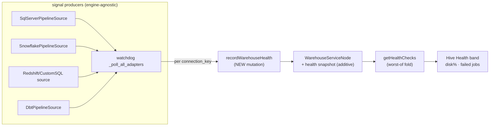

# Warehouse Health Snapshot

> **Engine-agnostic surfacing layer.** This spec owns *how a warehouse's latest
> operational-health result is persisted and surfaced to the data leader* —
> independent of which engine produced it. SQL Server disk-low / failed-Agent-job
> detection (`sqlserver-health-watch.md`) is the **first signal producer**, not the
> design. Snowflake, Redshift, Databricks, and dbt producers ride the same path with
> zero changes here. Every existing type carries a real `file:line`; the two new
> platform-core surfaces (`recordWarehouseHealth`, additive `ServiceHealthCheck`
> fields) are marked **NEW** — they do not exist today.

## 1. Context

`hive-health-landing-indicator.md` (BH-1036) put a Hive Health band on the workspace
landing, but it derives a warehouse's status from **connection state only** —
`WarehouseServiceNode.status == "active" → Healthy, else Degraded`
(`analytics-resolver.ts:55-68`). A warehouse whose connection is fine but whose
**data volume is below the free-disk threshold, or whose nightly job just failed**,
still shows green. Operational health never reaches the band.

Meanwhile the pipeline watchdog already *detects* that operational health for every
registered engine — `_poll_all_adapters` (`pipeline_watchdog_task.py:125`) calls
`poll_health()` on **every** adapter in `PIPELINE_SOURCE_ADAPTERS` and collects
`PipelineHealthSignal`s. Today those signals go only to the **per-user**
`NotificationInbox` (PK `USER#<uid>`). That is the right home for an *alert* but the
wrong source for *workspace health*: a teammate who never received the alert sees a
green warehouse while disk sits below threshold. **Workspace health must be
workspace-level truth.**

This spec closes that gap with a small, engine-neutral surfacing path:

1. **NEW** `recordWarehouseHealth` service-key-authed mutation persists the latest
   poll result onto the `WarehouseServiceNode` (mirrors the BH-1110
   `updateTransformationRunStatus` persist pattern).
2. The watchdog calls it after each poll — for **any** producer, keyed off the
   signal's `connection_key`, not off `source_type` (so SQL Server, Snowflake,
   Redshift all persist identically).
3. `getHealthChecks` folds the persisted snapshot into the warehouse row with a
   **worst-of** rule (a snapshot never upgrades an inactive connection to Healthy).
4. The Hive Health band renders the extra operational fields (disk-free %,
   failed-job count) on the warehouse row.



### Use Case / Goal

Frank's data leader — and every teammate in the workspace, not just whoever got the
alert — sees on the landing band that the warehouse volume is below threshold or a
named job failed, as workspace-level truth, before a downstream extract silently
fails. Works the same whether the warehouse is SQL Server, Snowflake, or Redshift.

## 2. Interface Contract (MDE)

**Engine-agnostic first: the snapshot is keyed by `connectionKey` + `workspaceId`,
never by engine. No `source_type` / vendor discriminator appears in this contract.**

### The signal the watchdog already produces (UNCHANGED — cite, do not redefine)

```python
# brightbot/agents/governance_agent/tools/pipeline_health.py:60-83  (frozen dataclass)
@dataclass(frozen=True)
class PipelineHealthSignal:
    workspace_id: str
    source_type: Literal["dbt", "databricks", "etl"]   # :72 — NOT read by this layer
    job_id: str                                          # "{connection_key}[:{job_name}]"
    failure_type: str                                    # "source_disk_low" | "etl_job_failure" | ...
    severity: Literal["info", "warning", "critical"]     # :75
    ...
    metadata: dict[str, Any]                             # carries connection_key, percent_free, job_name
```

`connection_key` lives in `metadata` for every producer (disk signal
`sql_server_pipeline_source.py:323`; job signal `:411`). The surfacing layer keys on
that — it is engine-neutral, present on any producer's signal.

### NEW — `recordWarehouseHealth` mutation (does not exist today)

```graphql
# brighthive-platform-core — NEW service-key-authed mutation.
# Mirrors updateTransformationRunStatus (transformation.ts:452-484): x-service-key
# header + SCHEDULER_SERVICE_API_KEY, NOT @authorized. Called by the watchdog after
# each poll; non-blocking (a persist failure logs and continues, never crashes poll).
input RecordWarehouseHealthInput {
  workspaceId: ID!
  warehouseServiceId: ID          # null on empty-config callers → match by connectionKey
  connectionKey: String!          # stable per-connection id from signal metadata
  operationalStatus: String!      # "Healthy" | "Degraded" | "Down" (worst of this poll)
  diskFreePct: Float               # lowest percent_free seen this poll; null if not checked
  failedJobCount: Int              # count of jobs in Failed state this poll
  detail: JSON                     # { databaseName, largestFileName, jobName, failedStepName, ... }
  polledAt: String!                # ISO-8601
}
type RecordWarehouseHealthOutput { ok: Boolean! }
```

### NEW — additive fields on `ServiceHealthCheck` (existing type gains fields)

```graphql
# EXISTING type — schema.graphql:626-633 (+ local TS interface analytics-resolver.ts:40-47,
# + typedefs.ts:630, + generated gql-types.ts:4774). Additive: existing consumers ignore new fields.
type ServiceHealthCheck {
  id: ID!  service: String!  type: String!  status: String!  provider: String  lastChecked: String!
  diskFreePct: Float          # NEW — null when no snapshot for this warehouse
  failedJobCount: Int         # NEW
  detail: JSON                # NEW — enrichment (largest file, failed step)
}
```

### NEW — snapshot properties on `WarehouseServiceNode` (additive)

```graphql
# EXISTING OGM node — ogm/typedefs.ts:457-474. Today it has ONLY `status` as health-ish.
# Add (all optional so existing nodes stay valid):
#   healthOperationalStatus: String   healthDiskFreePct: Float
#   healthFailedJobCount: Int          healthDetail: String (JSON-encoded)   healthPolledAt: DateTime
```

### Read fold (`getHealthChecks`, `analytics-resolver.ts:49`, warehouse loop `:55-68`)

The warehouse row keeps its connection-state derivation, then — if a health snapshot
exists on the node — takes the **worse** of connection-state and `operationalStatus`
(a snapshot never upgrades an inactive connection to Healthy). `diskFreePct` /
`failedJobCount` / `detail` ride along for the band's detail line.

## 3. Invariants (DbC)

1. `THE System SHALL` key every persisted snapshot by (`workspaceId`, `connectionKey`) — never by `source_type` or engine name; a Snowflake and a SQL Server warehouse persist through the identical mutation.
2. `WHEN` `recordWarehouseHealth` fails (network, auth, GraphQL error), `THE System SHALL` log a warning and continue the poll — a persist failure `SHALL NOT` crash the watchdog run (mirrors `_persist_run_status`, `pipeline_watchdog_task.py:477-482`).
3. `WHEN` a health snapshot exists for a warehouse, `getHealthChecks` `SHALL` set the row status to the **worse** of connection-state and `operationalStatus` — a snapshot `SHALL NOT` upgrade an inactive connection to Healthy (worst-of, never best-of; mirrors landing-indicator I-1).
4. `THE System SHALL` scope every persisted snapshot to its `workspaceId`; `getHealthChecks` `SHALL NOT` read a snapshot across workspaces (multi-tenant isolation, PS-13).
5. `THE System SHALL` authenticate `recordWarehouseHealth` by service key (`x-service-key` + `SCHEDULER_SERVICE_API_KEY`, `transformation.ts:466-469`) — never `@authorized`; it is a machine-to-machine call from the watchdog.
6. `WHEN` no snapshot exists for a warehouse, `getHealthChecks` `SHALL` return the row unchanged with the three new fields `null` — the additive fields `SHALL NOT` break existing consumers.
7. `THE System SHALL` compute `operationalStatus` for a poll as the worst severity across that poll's signals for the connection: any `critical` → `"Down"`, any `warning` → `"Degraded"`, else `"Healthy"`.
8. `THE System SHALL` treat the snapshot as **latest-wins** per (`workspaceId`, `connectionKey`) — each poll overwrites; no unbounded history on the node (time series is out of scope, §5).
9. `THE System SHALL NOT` place any secret or raw customer error text un-scrubbed into `detail`; `detail` is built from already-scrubbed signal metadata (`scrub_text` runs before signals leave the watchdog, `pipeline_watchdog_task.py:163`).

## 4. Acceptance Criteria (BDD — Gherkin)

```gherkin
Feature: Engine-agnostic warehouse health snapshot

  Scenario: A critical signal downgrades the landing band (any engine)
    Given a workspace warehouse whose connection is active
    And the latest poll emitted a critical signal for that connection
    When getHealthChecks runs
    Then the warehouse row status is "Down"
    And diskFreePct / failedJobCount reflect the poll

  Scenario: Snapshot never upgrades an inactive connection
    Given a warehouse whose connection state is Degraded
    And a health snapshot reports operationalStatus "Healthy"
    When getHealthChecks folds the snapshot
    Then the row status stays "Degraded" (worst-of, never best-of)

  Scenario: No snapshot yet — additive fields are null, nothing breaks
    Given a warehouse with no recorded health snapshot
    When getHealthChecks runs
    Then the row renders from connection-state alone
    And diskFreePct, failedJobCount, detail are null

  Scenario: Persist failure does not crash the poll
    Given recordWarehouseHealth returns a GraphQL error
    When the watchdog persists after a poll
    Then a warning is logged and the poll cycle completes normally

  Scenario: Same path for a non-SQL-Server producer
    Given a Snowflake pipeline source emits a warning signal
    When the watchdog persists warehouse health
    Then it calls recordWarehouseHealth with the Snowflake connection_key
    And no SQL-Server-specific branch is taken

  Scenario: Cross-workspace isolation
    Given workspace A and workspace B each have a warehouse snapshot
    When getHealthChecks runs for workspace A
    Then it reads only workspace A's snapshot
```

## 5. Out of Scope

- **Detection** of disk-low / failed jobs — owned by `sqlserver-health-watch.md` and each engine's `PipelineSource` adapter. This spec surfaces whatever they emit.
- Per-user alerting via `NotificationInbox` — already ships; this spec adds workspace-level truth alongside it, does not replace it.
- Historical health / trend sparklines (needs a time series; snapshot is latest-wins per Invariant 8).
- Fixing `analytics-resolver.ts` `getOverview` `totalDataAssets: 0` bug (separate PR, noted in `hive-health-landing-indicator.md` §5).
- Any new `source_type` literal — the layer is keyed by `connectionKey`, never engine.
- Remediation / self-healing (routed by `pipeline-self-healing-fleet.md`).

## 6. Dependencies

| Dependency | Type | Status |
|---|---|---|
| Watchdog `_poll_all_adapters` (engine-agnostic loop) | Blocking | Ready (`pipeline_watchdog_task.py:125`) |
| `_persist_run_status` service-key persist pattern | Blocking | Ready (`:414`) — template for new persist call |
| `WarehouseServiceNode` OGM node | Blocking | Ready (`ogm/typedefs.ts:457`) — gains additive props |
| `getHealthChecks` resolver + warehouse loop | Blocking | Ready (`analytics-resolver.ts:49`, `:55-68`) — gains fold |
| Hive Health band + `useHiveHealth` hook | Blocking | Ready (`HiveHealthBand/index.tsx:65`, `useHiveHealth.ts:228`) |
| `recordWarehouseHealth` mutation | Blocking | **Not started (NEW)** |
| At least one signal producer emitting `connection_key` | Non-blocking | Ready (SQL Server; Snowflake/Redshift follow) |

## 7. Correctness Properties

### Property 1: Worst-of fold — a snapshot can only downgrade

*For any* warehouse with connection-state status `C` and snapshot status `S`, the
folded row status is `max_severity(C, S)` (Down > Degraded > Healthy). A snapshot
never produces a status less severe than connection state alone.

**Validates: §3 Invariant 3, Invariant 7, §4 Scenario "Snapshot never upgrades an inactive connection".**

### Property 2: Engine independence

*For any* two producers emitting a signal for the same connection, the persisted
snapshot and folded row are identical functions of (`operationalStatus`,
`diskFreePct`, `failedJobCount`) — no code path branches on `source_type` or engine
identity between signal and band.

**Validates: §3 Invariant 1, §4 Scenario "Same path for a non-SQL-Server producer".**

### Property 3: Non-blocking persist

*For any* failure of `recordWarehouseHealth`, the watchdog poll cycle still returns
normally and every other adapter still polls.

**Validates: §3 Invariant 2, §4 Scenario "Persist failure does not crash the poll".**

## 8. Eval Criteria

N/A — no LLM in the persist / fold / render path. `operationalStatus` is a
deterministic worst-severity reduce; the fold is a deterministic worst-of compare;
the band render is pure. §3 invariants + §4 scenarios fully cover correctness.

## 9. Observability Contract

- **Span**: the persist call inherits the watchdog's existing tool span; add
  `brightagent.warehouse.connection_key` and `brightagent.warehouse.operational_status`
  attributes on the persist step.
- **Log events**:
  - `warehouse_health.persisted` — one per successful `recordWarehouseHealth` (carries `connection_key`, `operational_status`, `disk_free_pct`).
  - `warehouse_health.persist_failed` — persist error (maps to the non-blocking warning, Invariant 2).
  - `warehouse_health.snapshot_folded` — `getHealthChecks` applied a snapshot (carries `workspace_id`, whether it downgraded the row).
- **Metrics**: none.

## 10. Test Coverage Update

Mandatory. **Extend the REAL existing suites — do not create sibling files.**

| Repo | Suite (existing file) | What to add |
|---|---|---|
| `brighthive-platform-core` | `tests/` analytics-resolver suite | L2: `getHealthChecks` worst-of fold (Invariant 3) over a captured node+snapshot sample; no-snapshot null-fields case (Invariant 6); cross-workspace isolation (Invariant 4). Real-behavior: `recordWarehouseHealth` round-trip against a test Neo4j — write snapshot, read it back through `getHealthChecks`. |
| `brighthive-platform-core` | mutation auth suite | L0: `recordWarehouseHealth` rejects a missing/invalid `x-service-key` (Invariant 5); accepts a valid one. |
| `brightbot` | `tests/unit/agents/governance_agent/` watchdog suite | L2: watchdog calls the persist for a non-SQL-Server producer with its `connection_key` (Property 2); a persist error logs-and-continues (Invariant 2). Reuse existing watchdog fixtures — no new file. |
| `brighthive-webapp` | `useHiveHealth` + `HiveHealthBand` tests | L0: band renders `diskFreePct` / `failedJobCount` on the warehouse row from a **real captured** `healthChecks` sample carrying the new fields; L1: worst-of already covered by landing-indicator I-1 tests — extend, don't duplicate. |
| `brighthive-e2e` | `e2e/` cross-repo | One feature test: watchdog poll → `recordWarehouseHealth` → `getHealthChecks` → band shows the downgraded row, end-to-end against real surfaces. One error-path: persist failure leaves the poll green. |

**Real-behavior requirement** (`~/.claude/rules/test-behavior-real.md`): the
platform-core round-trip hits a **real Neo4j** (write via mutation, read via
resolver) — never a mocked OGM. The webapp fixture is a captured `getHealthChecks`
sample carrying the new fields, not a hand-typed shape.

Before opening each implementation PR: run that repo's suites, confirm each new
§2/§3/§4 entry has a corresponding case, and confirm all suites green.

## Areas Involved

| Area | Repo | Impact |
|---|---|---|
| Platform Core | `brighthive-platform-core` | **NEW** `recordWarehouseHealth` mutation + input/output types; additive `ServiceHealthCheck` fields; additive `WarehouseServiceNode` props; worst-of fold in `getHealthChecks` |
| BrightBot | `brightbot` | Call `recordWarehouseHealth` after each poll for **every** producer (non-blocking, mirrors `_persist_run_status`); §9 spans/log events |
| Web App | `brighthive-webapp` | Plumb new fields onto `RawHealthCheck`/`HiveService`; render disk-free % + failed-job count on the Hive Health band warehouse row (mobile-responsive) |

## Ticket Breakdown

Every row is `issueType: "Task"` under epic **BH-1255** — never `"Story"`. BH numbers
are placeholders until created via `/create-jira-ticket`.

| Ticket | Summary | Points | Epic |
|---|---|---|---|
| BH-13xx | `feat(platform-core): recordWarehouseHealth mutation + WarehouseServiceNode snapshot + getHealthChecks worst-of fold (additive ServiceHealthCheck fields)` | 5 | BH-1255 |
| BH-13xx | `feat(brightbot): persist warehouse health after each watchdog poll for every producer (non-blocking, mirrors _persist_run_status)` | 3 | BH-1255 |
| BH-13xx | `feat(webapp): render disk-free % + failed-job count on the Hive Health band warehouse row` | 3 | BH-1255 |
| BH-13xx | `test(e2e): watchdog → recordWarehouseHealth → getHealthChecks → band downgrade, cross-repo` | 2 | BH-1255 |

## Related

- **Detection (first producer)**: `docs/specs/sqlserver-health-watch.md` (BH-1255)
- **Landing band (read surface)**: `docs/specs/hive-health-landing-indicator.md` (BH-1036)
- **Persist pattern mirrored**: `brightbot/agents/governance_agent/sub_agents/pipeline_watchdog_task.py:414` (`_persist_run_status`, BH-1110)
- **Auth pattern mirrored**: `brighthive-platform-core/src/graphql/models/transformation.ts:452-484` (`updateTransformationRunStatus`)
- **Self-healing routing**: `docs/specs/pipeline-self-healing-fleet.md`
