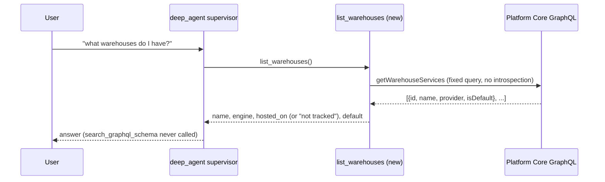

# Spec: Give the supervisor a warehouse-listing tool (BH-1454)

## 1. Context

A user chatting directly with the deep_agent supervisor (webapp path) who asks "what
warehouses do I have" or "where is my data hosted" gets: *"The GraphQL schema index is
unavailable right now..."* This is not a bug in that message — `search_graphql_schema`
is correctly refusing to guess field names when Platform Core's GraphQL introspection
is disabled (BH-771), which is the case on staging today. The bug is that the
supervisor has no *other* way to answer the question: `list_workspace_warehouses`, the
introspection-free data layer built under BH-1395 (`brightbot/tools/warehouse_catalog.py`),
is already wired onto the external MCP surface (`brightbot/mcp/tools/warehouse_catalog.py`)
but was never added to `deep_agent`'s own `base_tools` — the two surfaces diverged, and
only one of them can answer this question.

Because the workspace's Platform Core `warehouseServices` list is a fixed, already-known
GraphQL shape (BH-1370), listing it never requires introspection. Every workspace with
one or more configured warehouses can be answered with zero risk of this error, on any
environment, introspection-enabled or not.

Separately: "where is it hosted" is currently an LLM guess from the engine name. Correct
by luck for Azure Synapse (Azure-only) and Redshift (AWS-only); a fabrication for
Snowflake and Databricks, which run on whichever cloud the customer's account was
created on — brightbot has no data on that and must say so, not guess. SQL Server shares
the TDS adapter with Azure Synapse but may be on-prem — hosting must derive from the raw
`provider` / secret `type`, not the normalized adapter type.



## 2. Interface Contract

```python
# brightbot/utils/warehouse.py — hosting keyed on the RAW provider, never the aliased type
def hosting_cloud_for_secret_type(secret_type: str | None) -> str | None: ...

# brightbot/tools/warehouse_catalog.py — data layer (BH-1395), extended
@dataclass(frozen=True)
class WarehouseRef:
    id: str
    name: str
    warehouse_type: str    # normalized engine: snowflake | redshift | azure_synapse | ...
    provider_type: str     # RAW secret `type` / GraphQL `provider` before adapter aliasing
    is_default: bool
    config: dict[str, Any] | None

@dataclass(frozen=True)
class DatabaseListing:
    status: Literal["ok", "connect_failed", "list_failed"]
    warehouse_type: str
    databases: tuple[str, ...] = ()
    detail: str | None = None

def list_databases_on_warehouse(
    *, cfg: dict[str, Any], warehouse_type: str,
    factory: WarehouseConnectionFactory | None = None,
) -> DatabaseListing: ...   # the single connect→list→close flow both surfaces delegate to

# brightbot/tools/warehouse_catalog_tools.py — NEW, LangChain tools for deep_agent
@tool
def list_warehouses(runtime: ToolRuntime) -> str: ...

@tool
def list_warehouse_databases_for_chat(runtime: ToolRuntime, warehouse: str | None = None) -> str: ...

# brightbot/mcp/tools/warehouse_catalog.py — MODIFIED
class WarehouseSummary(BaseModel):
    ...
    hosted_on: str | None  # NEW — from hosting_cloud_for_secret_type(), never a guess
```

## 3. Invariants

- `list_warehouses` and `list_warehouse_databases_for_chat` never call `search_graphql_schema`,
  `execute_graphql_query`, or anything gated by `schema_index_available()` — the whole point
  is a path that survives introspection being disabled.
- `hosting_cloud_for_secret_type` returns a value only for raw `REDSHIFT` and `AZURE_SYNAPSE`
  provider/secret types; `SQL_SERVER`, Snowflake, Databricks, Postgres, and every other type
  return `None` (honest "not tracked"), never a guess from adapter aliasing.
- `WarehouseRef.provider_type` carries the raw provider/secret type before adapter aliasing;
  hosting derives from it, so a TDS-shaped `SQL_SERVER` (which normalizes to the shared
  `azure_synapse` engine) never inherits "Microsoft Azure".
- The supervisor tool and the MCP surface both delegate the connect → list → close flow to the
  single `list_databases_on_warehouse`; a failed connect or catalog read is a typed
  `DatabaseListing` outcome (`connect_failed` / `list_failed`), never a raised exception. The
  connection factory is injectable so every surface (and its tests) can supply a recording
  connection.
- GraphQL errors from the fixed warehouseServices query surface as typed tool errors, never
  as an empty workspace.
- A workspace with zero warehouse connections gets a plain answer from `list_warehouses`, never
  an exception and never the introspection-unavailable message.
- `list_warehouses` output never includes secret config bodies — identity fields only (id,
  name, engine, hosted_on, configured status, is_default), matching the MCP `WarehouseSummary`
  contract.

## 4. Acceptance Criteria

```gherkin
Feature: Supervisor warehouse listing without GraphQL introspection

  Scenario: Listing warehouses never touches GraphQL schema search
    Given a workspace with two configured warehouses (Redshift, Snowflake)
    And GraphQL introspection is disabled (schema_index_available() is False)
    When the user asks the supervisor "what warehouses do I have?"
    Then the supervisor calls list_warehouses
    And search_graphql_schema is never called
    And the reply names both warehouses without the "schema index is unavailable" message

  Scenario: Single-cloud engine hosting is a fact, not a guess
    Given a workspace's warehouse provider is "AZURE_SYNAPSE"
    When the user asks where it is hosted
    Then the answer states "Microsoft Azure", sourced from hosting_cloud_for_secret_type

  Scenario: SQL Server does not inherit Azure hosting
    Given a workspace warehouse provider is "SQL_SERVER"
    When the user asks where it is hosted
    Then the answer states hosting is not tracked, not "Microsoft Azure"

  Scenario: Multi-cloud engine hosting is reported honestly
    Given a workspace's warehouse type is "snowflake"
    When the user asks where it is hosted
    Then the answer states hosting isn't tracked for that engine, not a fabricated cloud

  Scenario: No warehouses configured
    Given a workspace with zero warehouse connections
    When the user asks the supervisor "what warehouses do I have?"
    Then list_warehouses returns a clear empty-workspace result, not an error
```

## 5. Out of Scope

- Changing the MCP surface's response shape beyond adding `hosted_on`.
- Any change to `@warehouse.database` chat-mention pinning (BH-1446/BH-1447) — this is
  read/list-only.
- Detecting a Snowflake/Databricks account's actual cloud/region — out of scope; we report
  "not tracked" honestly instead.

## 6. Dependencies

- BH-1395 — warehouse-catalog data layer + MCP surface (shipped; reused, not reimplemented).
- BH-1370 — `WarehouseType` / `warehouse_type_from_secret` (shipped).

## 8. Eval Criteria

| Evaluator | Node | Mode | Threshold | Method |
|---|---|---|---|---|
| WarehouseListingRoutingEval | deep_agent supervisor tool selection | OBSERVE | 0/N calls to `search_graphql_schema` for a warehouse-listing prompt | deterministic (tool-call log assertion in the integration test, not an LLM judge) |

## 10. Test Coverage Update

- **L0 (surface)**: unit tests on `hosting_cloud_for_secret_type`, keyed on the raw provider
  (`tests/unit/utils/test_warehouse_hosting.py`).
- **L1 (routing)**: unit test that `list_warehouses` / `list_warehouse_databases_for_chat`
  are present in `deep_agent`'s `base_tools`.
- **L2 (behavior)**: unit tests on the new tools using a stub `PlatformClient` covering
  multi-warehouse reply, zero-warehouse reply, GraphQL error propagation, SQL Server hosting,
  unconfigured services, ids in output, and `hosted_on` on MCP `WarehouseSummary`. Plus
  data-layer tests on `list_databases_on_warehouse` (ok drives the real Redshift adapter via a
  recording cursor; connect-failed and read-failed return typed outcomes and still close the
  connection) in `tests/unit/tools/test_warehouse_catalog.py`.
