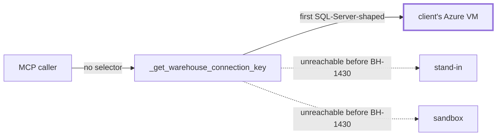

# Warehouse selection on MCP tools

> **Spec-after-code disclosure.** The implementation landed first (PR
> [brightbot#1029](https://github.com/brighthive/brightbot/pull/1029)) while diagnosing a live
> staging problem. `spec-driven.md` calls that an anti-pattern and it is — this spec is written
> against the shipped behaviour and the PR is still a draft, so §3 and §7 can still drive changes
> rather than merely describe them. §10 was genuinely missing and is the reason this spec exists.

## 1. Context

A Brighthive workspace can hold several warehouse connections. Loop Capital's staging workspace
(`e3fc0917-03a6-4ac6-aad4-ac265329bfb9`) holds three:

| # | Host | Database | Login | What it is |
|---|---|---|---|---|
| 0 | `sqltest2019.northcentralus.cloudapp.azure.com` | `BH_TestDB` | `BHAgent` | **The client's own Azure VM** |
| 1 | `54.197.188.168` | `LoopCapitalAM` | `sa` | Brighthive EC2 stand-in |
| 2 | `bore.pub:<port>` | `LoopCapitalAM` | `brightagent_reader` | Developer sandbox over a tunnel |

`_get_warehouse_connection_key` resolves the **first** SQL-Server-shaped entry when given no
selector. So before this change, every unqualified `get_database_size` call on that workspace
queried **the client's production-facing server** — and the response contained nothing naming
which host had answered.

That is two defects, and the second is the dangerous one. Being unable to target a sandbox is an
inconvenience. Being unable to tell, from the response, whether a number came from the client's
box or a stand-in is a silent correctness failure: the answer looks identical either way.



The plumbing to fix it already existed and was merely unreachable:
`get_warehouse_config_from_secrets(workspace_id, warehouse_id)` has honoured a `warehouse_id`
since BH-1371's `@<warehouse>` chat pin, and `warehouse_catalog` already maps a mention to an id
via `resolve_warehouse_id`. Only `database_size` never threaded it.

## 2. Interface Contract (MDE)

```
get_database_size(warehouse: str | None = None) -> DatabaseSizeResponse

DatabaseSizeResponse:
  status:          "ok" | "error"
  workspace_id:    str | None       # from the validated principal, never a caller arg
  warehouse_id:    str | None       # the resolved id; None when the default was used
  host:            str | None       # WHICH SERVER ANSWERED
  database:        str | None
  warehouse_type:  str | None
  allocated_mb / used_mb / free_mb: float | None
  error:           "no_workspace" | "unknown_warehouse" | "internal_error" | None
  detail:          str | None
```

```
database_size_data(*, workspace_id: str, warehouse_id: str | None = None) -> dict
  # payload gains "host" and "database"; raises ValueError when unconfigured
```

`warehouse` accepts a warehouse **name or id**, resolved by `resolve_warehouse_id`, matching the
convention `warehouse_catalog` established.

## 3. Invariants (DbC)

| # | Invariant |
|---|---|
| INV-1 | `IF a selector is supplied AND it resolves to no warehouse, THEN THE System SHALL return error="unknown_warehouse" and SHALL NOT query any warehouse.` |
| INV-2 | `WHEN a response has status="ok", THE System SHALL name the host that answered.` |
| INV-3 | `workspace_id comes from the validated MCP principal and is never a caller argument.` (Pre-existing; pinned by `test_no_principal_fields_in_tool_args`.) |
| INV-4 | `WHEN no selector is supplied, THE System SHALL preserve the historical default-warehouse behaviour` — this change is additive, not a migration. |
| INV-5 | A response SHALL NOT carry a credential. `host` and `database` identify the source; `username` and `password` never leave the config. |

## 4. Acceptance Criteria (BDD)

```gherkin
Feature: Answering from the warehouse the caller asked about

  Scenario: A named warehouse is targeted
    Given a workspace holding more than one warehouse
    When get_database_size is called naming the sandbox
    Then the numbers come from the sandbox
    And the response names the sandbox's host

  Scenario: An unknown name is refused, not guessed
    Given a workspace holding more than one warehouse
    When get_database_size is called with a name that matches nothing
    Then the response is an unknown_warehouse error
    And no warehouse is queried at all

  Scenario: Omitting the selector keeps the old behaviour
    Given a workspace holding more than one warehouse
    When get_database_size is called with no selector
    Then the default warehouse answers
    And the response still names the host that answered

  Scenario: A caller can discover what is selectable
    Given a workspace holding more than one warehouse
    When list_workspace_warehouses is called
    Then every warehouse is listed with its id, name and engine
    And no credential appears in the listing
```

## 5. Out of Scope

- **`get_pipeline_health` and `get_connection_health`** carry the same blindness and are *not*
  fixed here. `pipeline_health` routes through the pipeline-source adapter registry rather than
  `get_warehouse_config_from_secrets`, so it is a different shape of change. Tracked as follow-up.
- **Context Anchors (BH-1353)** — the product-level `@` affordance. This spec is the plumbing an
  anchor resolves *through*; the anchor UX is a separate epic.
- **Registering a `WarehouseServiceNode`** for a secret-only connection. See §6 — this is the
  known gap that keeps name-based selection from reaching the sandbox entry.

## 6. Dependencies

- `resolve_warehouse_id` + `make_platform_client` (`brightbot/mcp/tools/warehouse_catalog.py`).
- BH-1371's `warehouse_id` parameter on `get_warehouse_config_from_secrets`.
- **Known gap**: `resolve_warehouse_id` lists warehouses from the **platform**
  (`WarehouseServiceNode`), while connection credentials live in the **workspace secret**. A
  connection added only to the secret is reachable by explicit id through `database_size_data`,
  but a *name* lookup returns `None` → `unknown_warehouse`. That is INV-1 behaving correctly, but
  it means secret-only connections are not addressable by name until a platform node exists.

## 7. Correctness Properties

### Property 1: A question about one warehouse is never answered by another

*For any* selector S that does not resolve, the System returns an error and performs **zero**
warehouse queries. There is no code path from an unresolved selector to a result.

This is the security-shaped property. The alternative — falling back to the default — produces a
response that is indistinguishable from a correct one while describing a different server. On a
workspace holding a client's own box, that means reporting the client's production figures in
answer to a question about a sandbox.

**Validates: §3 INV-1, §4 Scenario "An unknown name is refused, not guessed"**

### Property 2: Every successful answer is attributable

*For any* response with `status="ok"`, the `host` field identifies the server that produced the
numbers. A reader never has to infer the source from workspace configuration.

**Validates: §3 INV-2, §4 Scenarios "A named warehouse is targeted" / "Omitting the selector keeps the old behaviour"**

### Property 3: Attribution never leaks credentials

*For any* response, the fields identifying the source are limited to `host`, `database`,
`warehouse_id` and `warehouse_type`. No username or password is reachable through this surface.

**Validates: §3 INV-5**

## 8. Eval Criteria

Not applicable — no LLM behaviour. Selection is deterministic and enforced by typed code paths.

## 9. Observability Contract

- **Log events**: `[DB_SIZE_MCP] warehouse resolve failed` (resolution error, `exc_info=True`);
  `[DB_SIZE_MCP] database-size query failed` (query error, `exc_info=True`).
- **Attributes**: `workspace_id`, `warehouse_id` — never credentials.
- **Gap**: an `unknown_warehouse` refusal currently returns without logging. A caller repeatedly
  naming a warehouse that does not resolve is a signal worth seeing — a misconfigured client, or a
  name that used to exist. Adding it is a §10 follow-up, not a blocker.

## 10. Test Coverage

| Layer | Coverage | State |
|---|---|---|
| L0 surface | Response shape and error codes match §2; tool registered in `_CORE_TOOL_MODULES` | ✅ `test_database_size_mcp.py` |
| L1 routing | Selector reaches the data layer; unresolved selector short-circuits before any query | ✅ `test_unknown_warehouse_refuses_instead_of_using_the_default`, `test_named_warehouse_is_threaded_to_the_data_layer` |
| L2 behavior | **Real** resolution against the staging secret and a **real** TDS query to the selected server | ✅ `test_warehouse_selection_real.py` (this spec's addition) |
| e2e | Same tool through the deployed MCP endpoint | ⬜ Open — needs the platform node from §6 |

**Why L2 could not be a mock.** Per `test-behavior-real.md`, the property under test is "the
selector reaches a *different physical server*". A fake resolver returning a fake config proves
only that the fake agrees with the test. The L2 case therefore resolves a real workspace secret
and opens a real connection, asserting the server's own `SUSER_NAME()` and `DB_NAME()` match the
selected connection rather than the default.

**The forcing question**: if warehouse resolution silently reverted to always-first tomorrow,
`test_warehouse_selection_real.py` goes red because the login and host it asserts belong to a
different connection than the default. The unit tests would still pass.
