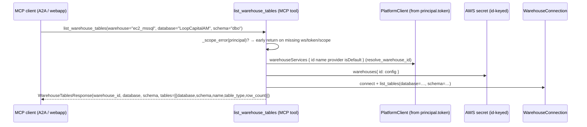

# Spec: Warehouse catalog — surface the SCHEMA + TABLE rungs over MCP

## 1. Context

BH-1395 ([`warehouse-catalog-mcp-surface.md`](./warehouse-catalog-mcp-surface.md)) gave the addressing ladder its first two
reachable rungs over MCP: `list_workspace_warehouses` (WORKSPACE→WAREHOUSE) and
`list_warehouse_databases` (WAREHOUSE→DATABASE). Its §5 deferred the **SCHEMA + TABLE
rungs** to a follow-on tool "once the UI needs them." The UI needs them now (the
Databases tab drills into tables; the anchor grammar addresses `warehouse:db:table`),
and the epic's whole promise — WAREHOUSE→DATABASE→SCHEMA→TABLE hierarchical identity —
is only half-reachable until a caller can walk the last rung.

The data layer already ships it: every `WarehouseConnection` adapter implements
`list_tables(database=…, schema=…)` returning `IntrospectedTable` tuples
(Redshift/Synapse/Postgres/Databricks in `warehouse_connections.py`; Snowflake in
`warehouse_snowflake.py`), covered by the BH-1370 recording-cursor real-behavior
tests. This spec adds **one read-only MCP verb** over that function — no new data-layer
logic — mirroring the two BH-1395 tools exactly: `workspace_id` + `token` from the
authenticated principal (never a caller arg), the scope gate before any I/O, a typed
Pydantic reply, an unmatched selector resolved to `unresolved_warehouse` (never a
coin-flip connection), and a dead connection reported as a typed `connect_failed`.



**Scope of this spec:** the read-only **MCP surface** for the SCHEMA + TABLE rungs —
one tool over the existing `list_tables` data layer. The data layer, the
WAREHOUSE+DATABASE rungs (BH-1395), the chat grammar (BH-1353 anchors), and the UI
Tables tab are dependencies or separate consumers, specced elsewhere.

## 2. Interface Contract (MDE)

One MCP tool added to the existing core module
`brightbot/mcp/tools/warehouse_catalog.py` (same module as the BH-1395 verbs),
registered as a core, always-on read tool. It takes **no caller argument that carries
identity** — `workspace_id` and `token` are read from `get_current_principal()`. It
takes three optional narrowing selectors: `warehouse` (a name or id; `None` → the
workspace default, resolved through `resolve_warehouse_id`, never indexed raw),
`database` (`None` → the connection's default database), and `schema` (`None` → all
non-system schemas, bounded by `_MAX_ITEMS`).

```python
class TableSummary(BaseModel):
    """One table's identity — no columns, no row data."""
    database: str
    schema: str
    name: str
    table_type: str            # BASE TABLE | VIEW | EXTERNAL | … (dialect string)
    row_count: int | None      # when the catalog reports it; None when the dialect has no portable source

class WarehouseTablesResponse(BaseModel):
    status: str                # "ok" | "unresolved_warehouse" | scope / connect error
    workspace_id: str | None
    warehouse_id: str | None   # the resolved id (None when unresolved)
    warehouse_name: str | None
    warehouse_type: str | None
    database: str | None       # the database actually introspected
    schema: str | None         # the schema filter applied (None = all)
    count: int
    tables: list[TableSummary]
    detail: str | None = None
    error: str | None = None

# MCP tool (registered via register(mcp); workspace_id + token from principal)
async def list_warehouse_tables(
    warehouse: str | None = None,
    database: str | None = None,
    schema: str | None = None,
) -> WarehouseTablesResponse: ...
```

The response caps its `tables` payload at the module's `_MAX_ITEMS` and carries only
identity — never column dictionaries, row data, or secret values.

### 2a. Registration + capability catalog

- The tool is added to the already-registered `warehouse_catalog` module — no change to
  `_CORE_TOOL_MODULES` in `brightbot/mcp/server.py` (the module is already there).
- One `_t(...)` row added to the `governance` (longitudinal read) group in
  `brightbot/mcp/capabilities.py`, `exposure="live"`, permission
  `_PERM_LONGITUDINAL_READ` (`scope=mcp:read`, no flag — same cell the other two
  catalog verbs use).

## 3. Invariants (DbC)

- **I-1** `workspace_id` and `token` SHALL be read from the authenticated principal,
  never from a tool argument. A caller cannot address another workspace.
- **I-2** The scope gate (`_scope_error(principal)`) SHALL run before any GraphQL,
  secret, or warehouse I/O; on failure the tool SHALL return a typed error response,
  never raise.
- **I-3** The tool SHALL be READ-ONLY — it calls only `list_workspace_warehouses` /
  `resolve_warehouse_id` (reads) and `WarehouseConnection.list_tables` (a catalog
  read); no write to platform-core, the secret, or the warehouse.
- **I-4** `list_warehouse_tables(warehouse=<name>)` SHALL resolve the name→id via
  `resolve_warehouse_id` before opening a connection; an unmatched selector SHALL
  return `status="unresolved_warehouse"` with `tables=[]`, never a coin-flip
  connection to the wrong warehouse.
- **I-5** Secret config bodies SHALL NOT cross the MCP boundary; column data SHALL NOT
  cross it either — each `TableSummary` carries only database, schema, name,
  table_type, and an optional row_count.
- **I-6** A warehouse connection failure OR a catalog-read failure SHALL be reported as
  a typed error response (`status`/`error`/`detail`), mirroring
  `list_warehouse_databases` — never an unhandled raise.

## 4. Acceptance Criteria (BDD)

```gherkin
Feature: surface the warehouse SCHEMA + TABLE rungs over MCP

  Scenario: list tables on a named warehouse + database
    Given an authenticated principal and a warehouse named "ec2_mssql"
    When list_warehouse_tables(warehouse="ec2_mssql", database="LoopCapitalAM") is called
    Then the name is resolved to its id
    And the tables in that database are returned with database, schema, name, table_type
    And no column data or secret config body appears in the response

  Scenario: a schema filter narrows the table list
    Given a database with tables across schemas "dbo" and "staging"
    When list_warehouse_tables(schema="dbo") is called
    Then only tables in the "dbo" schema are returned

  Scenario: no selectors use the default warehouse and default database
    Given a workspace with a default warehouse and a connection default database
    When list_warehouse_tables is called with no arguments
    Then the default warehouse's default database tables are returned

  Scenario: an unmatched selector does not connect to the wrong warehouse
    Given a workspace with warehouses none named "typo_wh"
    When list_warehouse_tables(warehouse="typo_wh") is called
    Then status is "unresolved_warehouse"
    And tables is empty

  Scenario: missing scope returns a typed error, not a crash
    Given a principal missing the workspace binding
    When list_warehouse_tables is called
    Then a typed error response is returned with no tables
    And no GraphQL or secret read was attempted

  Scenario: a dead warehouse connection is reported, not raised
    Given a warehouse whose credentials fail to connect
    When list_warehouse_tables is called for it
    Then a typed error response with status/error/detail is returned
```

## 5. Out of Scope

- **The data layer itself.** `list_tables` on every adapter is BH-1370, already built
  and covered by recording-cursor real-behavior tests.
- **The WAREHOUSE + DATABASE rungs.** BH-1395 (`warehouse-catalog-mcp-surface.md`).
- **Column-level introspection.** `IntrospectedColumn` (data types, nullability, keys)
  is a further rung if the UI needs it — this verb stops at table identity.
- **Chat grammar.** `warehouse:db:table` anchor parsing is BH-1353.
- **Write verbs.** No DDL/DML surface is added here.
- **UI.** The Tables tab is a separate webapp consumer.

## 6. Dependencies

- **BH-1395** `warehouse-catalog-mcp-surface.md` — the sibling verbs + module + pattern
  this extends (`warehouse_catalog.py`, `_scope_error`, `resolve_warehouse_id`,
  `WarehouseConnectionFactory`).
- **BH-1370** `warehouse-catalog-enumeration.md` — `list_tables` on each adapter.
- `MCPPrincipal` / `get_current_principal` / `require_scope` (`brightbot/mcp/auth.py`).
- `make_platform_client(token=...)` (`brightbot/tools/platform_client.py`).

## 7. Correctness Properties

### Property 1: A caller can only ever address its own workspace

*For any* invocation, the `workspace_id` used for GraphQL, secret, and warehouse I/O is
`principal.workspace_id` — there is no tool parameter that overrides it.

**Validates: §3 I-1, §4 Scenario "missing scope returns a typed error"**

### Property 2: The selector never connects to the wrong warehouse

*For any* `warehouse` selector that matches no warehouse name or id,
`list_warehouse_tables` returns `unresolved_warehouse` with no connection opened — it
never falls through to the default or a coin-flip.

**Validates: §3 I-4, §4 Scenario "an unmatched selector does not connect to the wrong warehouse"**

### Property 3: No secret material or column data crosses the MCP boundary

*For any* response, each `TableSummary` carries only database, schema, name,
table_type, and an optional row_count — never the secret config dict and never the
`columns` tuple.

**Validates: §3 I-5, §4 Scenario "no column data or secret config body appears"**

## 8. Eval Criteria

Not applicable — a deterministic read tool over a typed data layer, no LLM output. §3
invariants + §10 real-behavior tests cover behavior.

## 9. Observability Contract

- **Span**: `gen_ai.tool.execute` with `gen_ai.tool.name=list_warehouse_tables`.
- **Attributes**: `workspace.id`, `warehouse.id`, `warehouse.type`, `warehouse.database`,
  `brightagent.tool.output_size_bytes`.
- **Log events**: `warehouse_catalog.mcp.tables` (warehouse_id, database, table_count),
  `warehouse_catalog.mcp.unresolved` (selector),
  `warehouse_catalog.mcp.scope_denied` (error_code),
  `warehouse_catalog.mcp.connect_failed` (warehouse_id).
- **Metrics**: none.

## 10. Test Coverage Update

### a. In-repo layered evals (brightbot/tests/)

Extend the existing `tests/unit/mcp_server/test_warehouse_catalog_mcp.py` (the BH-1395
suite) — do not open a sibling file.

- **L0 (surface)** — one case: assert `list_warehouse_tables_impl` returns the declared
  `WarehouseTablesResponse` shape with the documented fields and `status="ok"` on the
  happy path; assert the scope-gate branch returns a typed error response (not a raise)
  when the principal lacks workspace/token.
- **L1 (routing/selection)** — one case per §4 selector scenario observable at the tool:
  name→id resolution reaches the resolved id; `warehouse=None`→default; `database=None`
  → connection default; `schema=…` narrows; unmatched selector→`unresolved_warehouse`
  with no connection opened. Stub only the two I/O boundaries (`PlatformClient.query`
  with the real captured two-service shape; the id-keyed secret) — the tool logic +
  data-layer join run for real.
- **L2 (behavior, real principal + real data layer)** — drive the real `_impl` with a
  real `MCPPrincipal` in the contextvar and the real `resolve_warehouse_id`; the
  `list_tables` path reuses the BH-1370 recording-cursor seam for at least one engine.
  Assert the returned `TableSummary` fields match the introspected rows, no `columns`
  and no config body appear, and the §9 log events fire on the happy + unresolved paths.

### b. Cross-repo e2e (brighthive-e2e/)

Extend `e2e/features/mcp/test_warehouse_catalog.py` (the BH-1395 file) — add the
TABLE-rung ACs beside the existing four.

- **One feature test**: against staging, read-only, enumerate warehouses, resolve one,
  list its databases, then call `list_warehouse_tables` for the resolved
  warehouse+database and assert the table list returns live — proving
  WAREHOUSE→DATABASE→SCHEMA→TABLE reachable end-to-end.
- **One surface test** asserting the §2 `WarehouseTablesResponse`/`TableSummary` shapes
  hold when the real backend is hit (not unit-mocked); no `columns` key crosses the wire.
- **Error-path**: `list_warehouse_tables(warehouse="<typo>")` against staging returns
  `unresolved_warehouse` with an empty list.

#### Fixtures mirror reality

Reuse the same staging-captured two-service GraphQL response + id-keyed secret shapes
BH-1370/BH-1395 mandate (a real ULID key whose `name` differs from it), plus the
recording-cursor's `list_tables` rows — not re-invented, so the name↔id join and the
introspection SQL are exercised against the real shape at the surface layer too.
