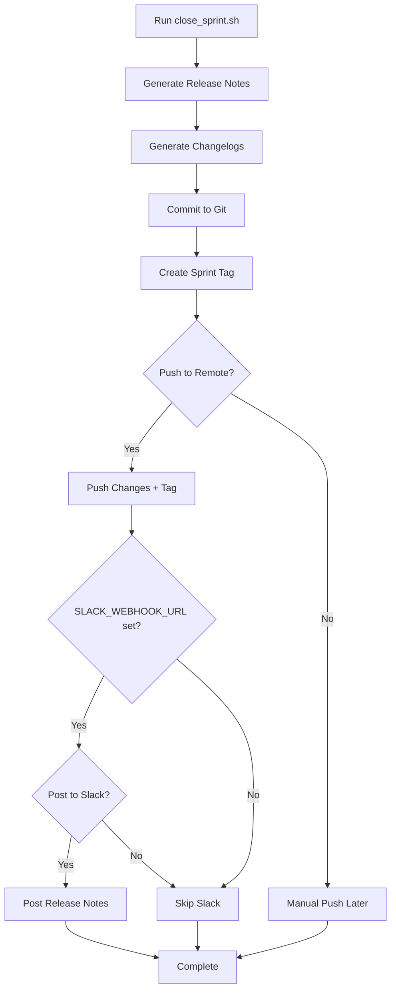
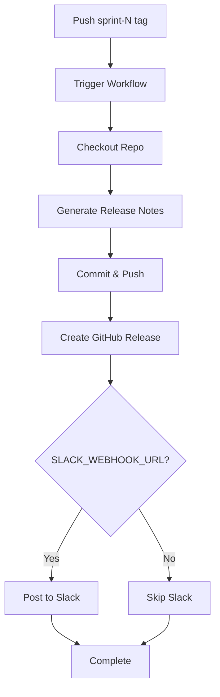

# Sprint Release Automation

Complete automation for sprint closure, release notes generation, and distribution.

---

## Quick Start

### One-Command Sprint Closure

```bash
cd project/sprint/scripts
./close_sprint.sh 1
```

That's it! This will:
1. ✅ Generate release notes from git commits
2. ✅ Generate per-repo changelogs
3. ✅ Commit changes to git
4. ✅ Create sprint tag
5. ✅ Push to GitHub (triggers automation)
6. ✅ Post to Slack (optional)

---

## Automation Options

### Option 1: Local Script (Recommended for Testing)

**When to use:** Testing, local development, manual sprint closure

```bash
# Basic usage
./close_sprint.sh <sprint_number>

# With custom dates
./close_sprint.sh 2 2026-01-20 2026-01-27

# Examples
./close_sprint.sh 1                          # Sprint 1, auto-detect dates
./close_sprint.sh 2 2026-01-20 2026-01-27   # Sprint 2, explicit dates
```

**What it does:**
- Generates release notes from git commits across all repos
- Creates per-repo changelogs
- Commits changes to git
- Creates sprint tag (e.g., `sprint-1`)
- Optionally pushes to GitHub
- Optionally posts to Slack

---

### Option 2: GitHub Actions (Automated)

**When to use:** Production sprint releases

#### Trigger by Git Tag

```bash
# Create and push sprint tag
git tag -a sprint-1 -m "Sprint 1 Release"
git push origin sprint-1
```

**What happens:**
1. GitHub Actions workflow triggers automatically
2. Generates release notes from git history
3. Commits release notes to repository
4. Creates GitHub Release with marketing notes
5. Posts to Slack (if `SLACK_WEBHOOK_URL` configured)

#### Trigger Manually

```bash
# Using GitHub CLI
gh workflow run sprint-release.yml \
  -f sprint_number=1 \
  -f since_date=2026-01-13 \
  -f until_date=2026-01-20 \
  -f post_to_slack=true

# Or via GitHub UI
# Actions → Sprint Release Automation → Run workflow
```

---

### Option 3: Python Script (Direct)

**When to use:** Integration with other scripts, custom automation

```bash
cd project/sprint/scripts

python generate_release_notes.py \
  --sprint 1 \
  --since 2026-01-13 \
  --until 2026-01-20 \
  --output-dir ../sprint-1
```

**Parameters:**
- `--sprint` (required): Sprint number
- `--since` (optional): Start date (YYYY-MM-DD), defaults to first of current month
- `--until` (optional): End date (YYYY-MM-DD), defaults to today
- `--output-dir` (optional): Output directory, defaults to `../sprint-{number}`
- `--repo-root` (optional): Root directory with all repos, defaults to auto-detect

---

## Configuration

### Required Setup

#### 1. Repository Structure

Ensure this structure exists:
```
brighthive/
├── brighthive-platform-core/     # Each repo is a sibling
├── brighthive-webapp/
├── brightbot/
├── brighthive-data-organization-cdk/
├── brighthive-data-workspace-cdk/
├── brightbot-slack-server/
└── project/
    └── sprint/
        ├── scripts/
        │   ├── generate_release_notes.py
        │   ├── post_to_slack.py
        │   └── close_sprint.sh
        └── sprint-1/
            └── jira/
                └── sprint_1_snapshot.json  # Optional
```

#### 2. Git Configuration

Repos must use **conventional commits**:
```bash
feat: add new feature
fix: resolve bug
docs: update documentation
chore: routine maintenance
security: security improvements
```

#### 3. GitHub Secrets (for automation)

Add to repository settings:

| Secret | Required | Description |
|--------|----------|-------------|
| `SLACK_WEBHOOK_URL` | Optional | Slack webhook for release posting |
| `GITHUB_TOKEN` | Auto | Automatically provided by GitHub |

**Set webhook:**
```bash
# Via GitHub CLI
gh secret set SLACK_WEBHOOK_URL --body "https://hooks.slack.com/services/..."

# Or via GitHub UI
# Settings → Secrets and variables → Actions → New repository secret
```

---

## Generated Artifacts

### File Structure

After running automation, you'll get:

```
project/sprint/sprint-1/
├── SPRINT_1_RELEASE_NOTES.md              # Technical release notes
├── SPRINT_1_MARKETING_RELEASE_NOTES.md    # Marketing release notes
└── changelogs/
    ├── README.md                          # Changelog index
    ├── brighthive-platform-core.md        # Per-repo changelog
    ├── brighthive-webapp.md
    ├── brightbot.md
    ├── brighthive-data-organization-cdk.md
    ├── brighthive-data-workspace-cdk.md
    └── brightbot-slack-server.md
```

### Technical Release Notes

**File:** `SPRINT_{N}_RELEASE_NOTES.md`
**Audience:** Engineering team
**Content:**
- Executive summary with Jira metrics
- Changes by repository
- Commit breakdown by type (features, fixes, etc.)
- Team statistics

### Marketing Release Notes

**File:** `SPRINT_{N}_MARKETING_RELEASE_NOTES.md`
**Audience:** Customers, stakeholders, marketing
**Content:**
- Customer-facing feature highlights
- Security improvements
- Bug fix summaries
- What's next preview

### Per-Repository Changelogs

**Files:** `changelogs/{repo}.md`
**Content:**
- Organized by commit type (feat, fix, docs, etc.)
- Breaking changes highlighted
- Commit hashes for traceability
- Total commit count

---

## Workflow Details

### Local Script Flow



### GitHub Actions Flow



---

## Advanced Usage

### Custom Date Ranges

```bash
# Sprint didn't start on first of month
./close_sprint.sh 1 2026-01-13 2026-01-20

# Only last week's commits
./close_sprint.sh 1 2026-01-14 2026-01-20
```

### Test Without Pushing

```bash
# Generate locally, review, then push manually
./close_sprint.sh 1
# Review generated files
# Then: git push origin main && git push origin sprint-1
```

### Regenerate Without Committing

```bash
# Use Python script directly
cd project/sprint/scripts
python generate_release_notes.py --sprint 1 --since 2026-01-13
# Files generated but not committed
```

### Post to Slack Only

```bash
cd project/sprint/sprint-1/scripts
export SLACK_WEBHOOK_URL="https://hooks.slack.com/services/..."
python post_to_slack.py
```

---

## Troubleshooting

### "No changes to commit"

**Cause:** Release notes already generated
**Solution:** Delete existing release notes or use `--force` flag (add if needed)

### "Git command failed"

**Cause:** Repository not found or not a git repo
**Solution:**
- Check repository structure matches expected layout
- Ensure all repos are siblings under same parent directory
- Verify `--repo-root` parameter if using custom location

### "Slack posting failed"

**Cause:** Webhook URL not set or invalid
**Solution:**
```bash
# Verify webhook URL is set
echo $SLACK_WEBHOOK_URL

# Test webhook
curl -X POST $SLACK_WEBHOOK_URL \
  -H 'Content-Type: application/json' \
  -d '{"text":"Test"}'
```

### "GitHub Actions not triggering"

**Cause:** Tag not pushed or workflow file not in main branch
**Solution:**
- Ensure `.github/workflows/sprint-release.yml` exists in main branch
- Push tag: `git push origin sprint-1`
- Check Actions tab in GitHub UI for errors

---

## Best Practices

### 1. Use Conventional Commits

Always use conventional commit format:
```bash
git commit -m "feat(auth): add SSO login"
git commit -m "fix(api): resolve token expiry bug"
git commit -m "docs(readme): update installation steps"
```

### 2. Test Locally First

Before pushing tags, test locally:
```bash
./close_sprint.sh 1
# Review generated files
# If good, push: git push origin sprint-1
```

### 3. Review Before Distribution

1. Generate release notes
2. Review technical and marketing notes
3. Edit if needed (manual edits preserved)
4. Then push tag to trigger automation

### 4. Sprint Snapshot Timing

Capture Jira snapshot at sprint end:
```bash
cd project/sprint/sprint-1/jira/scripts
python fetch_sprint_data.py
# Commit snapshot before closing sprint
```

---

## Integration with Existing Workflows

### Jira Sprint Closure

1. Close sprint in Jira
2. Run Jira snapshot script
3. Run sprint closure automation
4. Review and distribute release notes

### GitHub Release Process

1. Sprint closure automation creates tag
2. Tag push triggers GitHub Actions
3. GitHub Release created automatically
4. Slack notified automatically

### Team Communication

1. Automation posts to Slack
2. Review Notion page (manual update)
3. Sprint retrospective meeting
4. Archive sprint artifacts

---

## Maintenance

### Adding New Repositories

Edit `project/sprint/scripts/generate_release_notes.py`:

```python
REPOS = [
    "brighthive-platform-core",
    "brighthive-webapp",
    "brightbot",
    # ... existing repos
    "your-new-repo",  # Add here
]
```

### Customizing Release Notes Format

Edit templates in `generate_release_notes.py`:
- `generate_technical_release_notes()` - Technical format
- `generate_marketing_release_notes()` - Marketing format
- `generate_repo_changelog()` - Per-repo format

### Changing Commit Type Categories

Edit `COMMIT_TYPES` dict in `generate_release_notes.py`:

```python
COMMIT_TYPES = {
    "feat": ("Features", "🚀"),
    "fix": ("Bug Fixes", "🐛"),
    # Add custom types here
}
```

---

## Migration from Manual Process

### Before (Manual)
1. Manually read git logs for each repo
2. Manually write release notes
3. Manually create changelogs
4. Manually post to Slack
5. Manually update Notion
6. 2-3 hours of work

### After (Automated)
1. Run `./close_sprint.sh 1`
2. Review and push
3. 5 minutes of work

**Time saved:** ~90% reduction in sprint closure time

---

## Examples

### Example 1: Standard Sprint Closure

```bash
# Sprint 1 just ended
cd project/sprint/scripts
./close_sprint.sh 1

# Follow prompts:
# - Push to remote? y
# - Post to Slack? y

# Done! Release notes generated, committed, tagged, and distributed.
```

### Example 2: Custom Date Range

```bash
# Sprint had unusual dates
./close_sprint.sh 2 2026-01-20 2026-02-03
```

### Example 3: Manual Review Before Push

```bash
# Generate locally first
./close_sprint.sh 1
# Answer "n" to push prompt

# Review files in project/sprint/sprint-1/
# Edit if needed

# Then push manually when ready
git push origin main
git push origin sprint-1
```

---

## Future Enhancements

- [ ] Auto-update Notion via MCP/API
- [ ] Generate changelog comparison between sprints
- [ ] Integrate with Jira API for automatic ticket updates
- [ ] Generate sprint metrics dashboards
- [ ] Email distribution list integration
- [ ] LinkedIn/Twitter post generation

---

## Support

### Questions?
- Check troubleshooting section above
- Review `generate_release_notes.py` source code
- Ask in #engineering Slack channel

### Issues?
- Create GitHub issue with `automation` label
- Include error messages and logs
- Tag @platform-team

---

**Last Updated:** 2026-01-21
**Maintained By:** Platform Team
**Version:** 1.0.0
